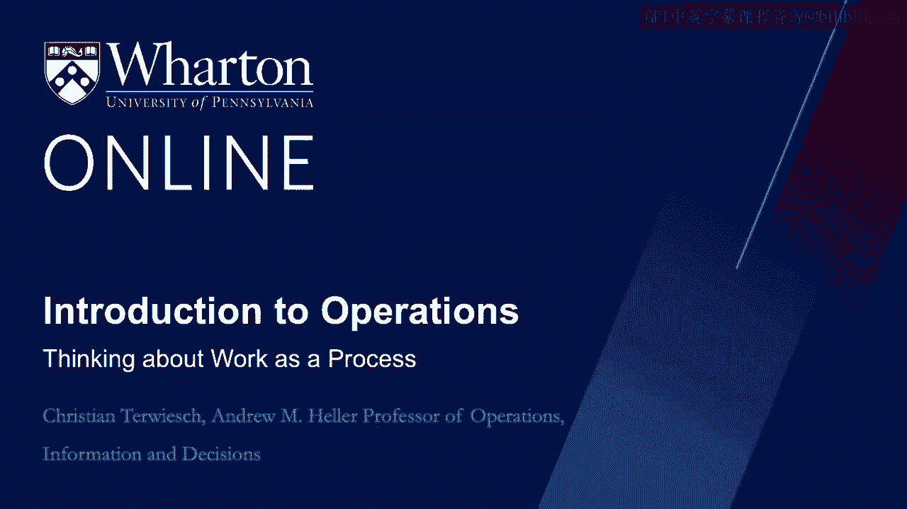
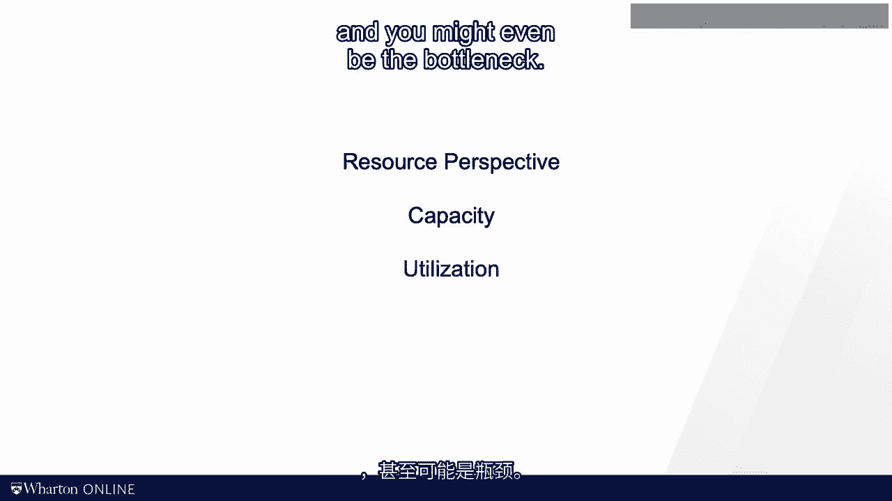
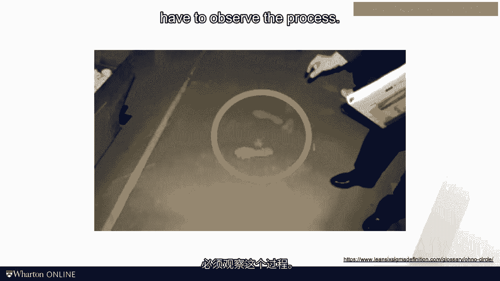
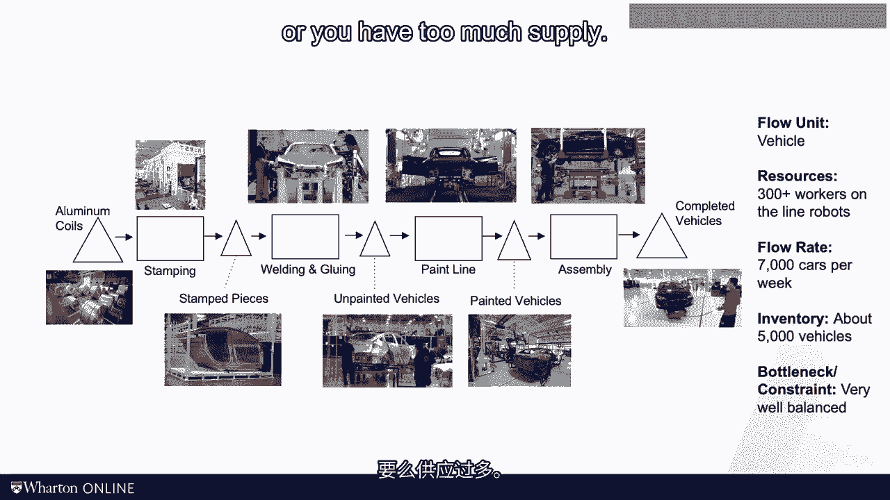
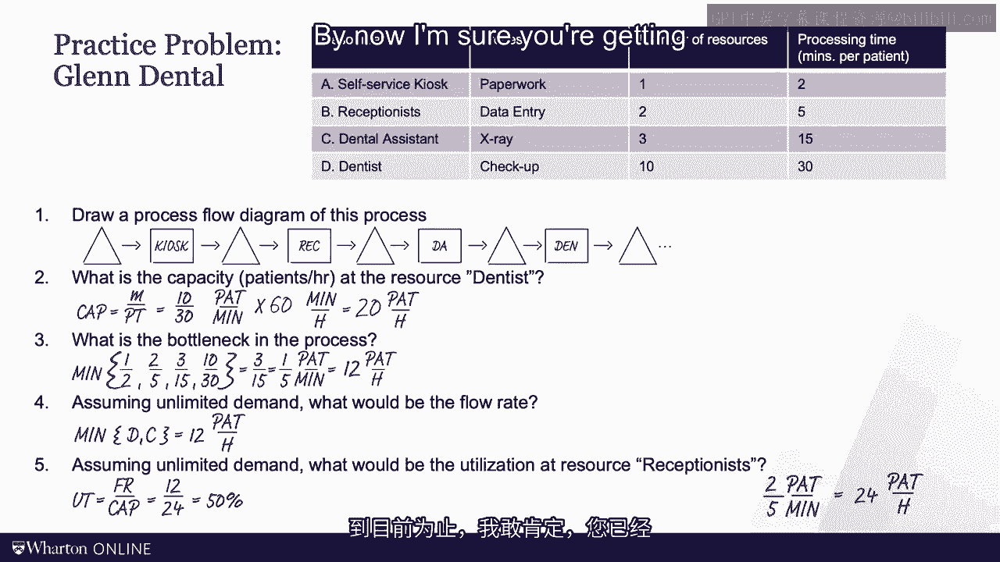

# 沃顿商学院《商务基础》｜Business Foundations Specialization｜（中英字幕） - P121：5_把工作看作是一个过程.zh_en - GPT中英字幕课程资源 - BV1R34y1c74c

 In this video， I want to tie up a couple of loose things related to process analysis。

 I first want to explain how process analysis and the process flow diagram help us reconcile。

 two perspectives through an operation。 The perspective of the flow unit， which likely。

 will be handled by multiple research as it's journeying through the process。

 And the perspective of a resource， which likely will see many flow units over time。

 And I want to give you the opportunity to practice the definition we introduced so far。

 with a little practice problem。 Okay， here we go。 First imagine you work in an auto plant。

 and you're the person who puts in the seat into the car。 Really every minute or two。

 a new car arrives on the assembly line and you repeat your operation。 You put in that seat。

 You do this over and over and over again。 Similarly。

 you might be working in the radiology department。 Every 15 minutes or so。

 an image of a buddy part comes in。 You diagnose， you read the image， you put together a report。

 and then the next patient comes。 This is a view of a resource in a process。

 So that's simply called it the resources perspective。 As a resource， you have a capacity。

 you have a utilization， and you might even be the bottleneck。

 Diageoño is known as the father of the Toyota production system。

 and is really one of the most influential thinkers in operations management。

 He would famously draw a chalk circle on a piece of the factory floor。

 and his students would have to stand in this chalk circle。

 and they will have to observe the process。 Ono would check in on them and ask them to report their observations。

 If they are not seen the waste and the inefficiencies that all wanted them to see。

 they will just keep on standing in that chalk circle。

 I hope you very much appreciate that in my course， all you have to do is watch some videos。

 rather than spending your day in a chalk circle。 Contrast the resources perspective with the floor units perspective。

 As a patient， you very likely have experienced the floor unit perspective。

 when you went through an episode of care， such as an radiology appointment。

 To show you the example of the floor units perspective and in order more of assembly process。

 take a look at the video from Tesla that I found on YouTube。

 Really what you're doing is you're attaching yourself to the floor unit， and then you flow along。

 you flow through the process。 You see one resource after the other。

 and by making your journey through the assembly line。

 you start really in this case as a piece of metal， and then you go through the process。

 and step by step the floor goes on。 You spend your floor time and the amount of time it takes you to go through the process here。

 with the resources and at the end of the process you complete the process。

 and you have turned into a wonderful car。 There you go。

 Now the beauty of process analysis is that it combines both the perspective of the floor unit。

 and the perspective of the resource， all in one diagram。

 Here's a simplified process flow diagram from a Tesla plant。

 You can read that process flow diagram with the eyes on the floor units。

 and on floor time the journey through the plant， or you can take the perspective of a particular resource。

 like the paint shop， and you just focus on that capacity。 Whatever perspective you're taking。

 you will have to deal with inventory。 Remember from before。

 inventory is a number of floor units in the system。

 Inventory pass up whenever demand and supply don't match。 Since demand is moving quickly。

 or a supplier is simply slow to adjust， you either have too much demand or you have too much supply。

 Now as a risk of creating some confusion， inventory in the car example can be a pile of cars。

 waiting for demand， and historically for most car companies that has been the default。

 most car companies carry about 60 to 80 days of inventory in their lot。

 But in my framework it can also be a number of customers waiting for a car。

 Tesla for example had hundreds of thousands of customers waiting for the Model 3， I was one of them。

 and later on they had hundreds of thousands of people waiting for the Cybertron。

 If we define the customer as a floor unit， the number of customers waiting for their cars is simply inventory。

 Again， I know it's a little bit confusing because it's different from accounting。

 Not that operations is right and accounting is wrong。

 it's a different way of looking at the world including inventory。

 In making physical stuff you can have inventory reflecting waiting stuff， widgets， cars， iPhones。

 whatever you're producing， or you can have waiting customers。

 When you're dealing with service operations however， you can only have one scenario。

 For all practical purposes it's impossible to produce a hard surgery into inventory。

 You also cannot have an investment discussion with your clients before the client actually shows up。

 So in a service operation inventory always really relates to waiting customers。

 Given that we are at the end of a module， it's a good time to review what we have done so far in this module。

 We work through a ton of definitions from floor unit over processing times to capacity。

 all the way to my favorite three， floor rate， flow time， and inventory。 More importantly。

 I want you to at this point be capable， competent and confident to do the following。

 You should be able to map out an operation as a process flow。

 find the capacity of an individual resource， and then find the bottleneck in a process。

 You should also be able to compute the flow rate as a minimum of demand and capacity。

 and find the utilization of a resource。 For that these three definitions and equations at the bottom of the slide will come in handy。

 as we are going to see in the first practice problem that we are about to tackle together in a couple of seconds。

 Okay， for this module I've done enough of the talking。 It is your time to do some work。

 What I want you to do is I'm going to show you a practice problem and I give you a time to wrestle with it。

 You simply read the problem， stop the video， see if you can find the solutions to the questions。

 And then you press play again to see me solve the problem。

 This practice problem here describes the patient flow in a dental practice in Philadelphia。

 See if you can answer the following questions。 Put me on pause now。

 So let's take a look at this together。 Let's do the process flow diagram first。

 We start out by drawing a little triangle。 That's inventory of patients who need to self-check in at the kiosk。

 From there we have a bunch of other steps， versus another triangle。

 where the patients are waiting for the receptionist。

 Right now we have no clue where the bottleneck might be。 So let's put a buffer here just in case。

 Then a box， another triangle just before the dental assistant。 I hope you get the basic idea。

 Last triangle before the dentist， then comes the dentist。

 And I don't know what you do after seeing the dentist， but I typically go home。

 So no triangle of completed patients。 But if for whatever reason we want to have people still recovering from their pain。

 we could have another triangle or box as a recovery area。

 That's the end of the process flow diagram。 Okay， next is what is the capacity of the dentist？

 The dentist is a resource， and the capacity of the resource is M， the number of dentists。

 divided by the processing time。 So we have 10 dentists。

 and each of them takes 30 minutes to see one patient。 So just 10 divided by 30。

 and that is expressed in patients per minute， one third of a patient per minute。

 Or if you want to translate this into hours， you multiply this by 60 minutes in an hour。

 the minutes cancel out， and we add 20 patients per hour in terms of the capacity。 All right。

 what's the bottleneck in the process？ The bottleneck is the resource with the lowest capacity。

 And so we have to look at the minimum of these capacities。 The first capacity is one half。

 one over two at the kiosk。 One resource M equals one divided by two minutes。 And it's two over five。

 And then we get three over 15。 And then finally， as we just computed， 10 over 30 for the dentist。

 And the lowest one of those will point us to the location of the bottleneck。

 And that is three over 15。 Right？ Three over 15 is one over five。 Again。

 this is expressed in patients per minute。 So this corresponds to 12 patients per hour as a bottleneck capacity。

 And that means that's the capacity of the entire process。 Flow rate， remember。

 is the minimum of demand and capacity。 So minimum of demand and capacity here。

 meaning there are plenty of patients who want our service。 If demand is unlimited， of course。

 unlimited is a really big number。 And then the minimum， thereby， is 12 patients per hour。

 which was our process capacity。 Finally， what's the utilization at the resource of the receptionist？

 Remember， in general， when we think about utilization。

 we think about the ratio between the flow rate， how much is the process producing。

 and the capacity of how much could the process be computing， if it went all out。

 So the utilization is flow rate divided by capacity。 And in this case。

 you see that it's 12 patients per hour， which was our flow rate determined by the bottleneck。

 divided by the capacity of the receptionist， which is 2/5 patients per minute。

 or 24 patients per hour。 That's the utilization of the receptionist。 It's 50%。 By now。

 I'm sure you're getting comfortable with the idea of capacities。

 utilization， bottlenecks， and my three favorite measures， inventory， flow rate， and flow time。

 This is really the foundation for any good process analysis。 In the next set of videos。

 I will start building on this foundation。 We will add a number of diagnostic performance measures。

 and from there， we'll start thinking about the first set of operational improvements。

 See you in the next module。 [BLANK_AUDIO]。