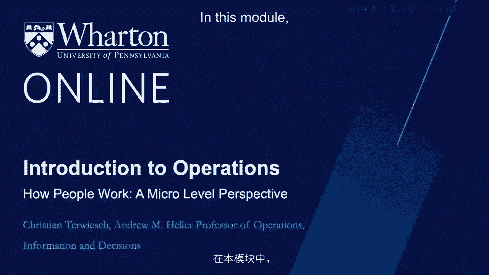
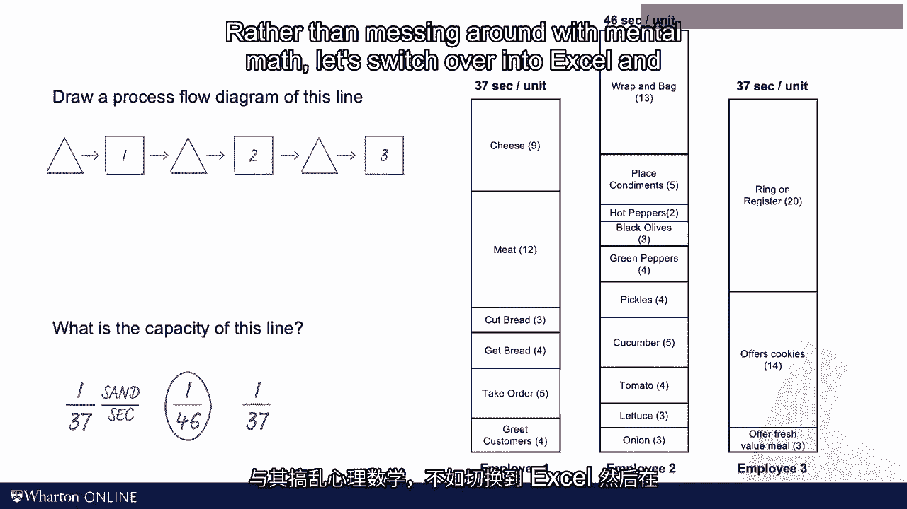
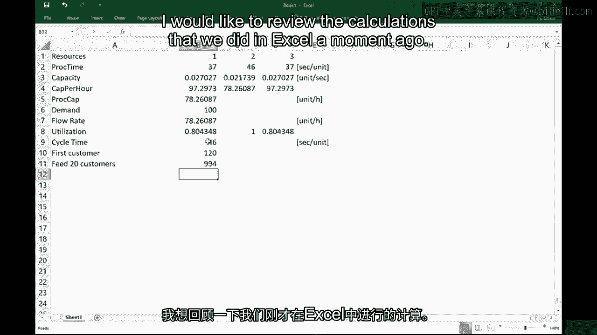
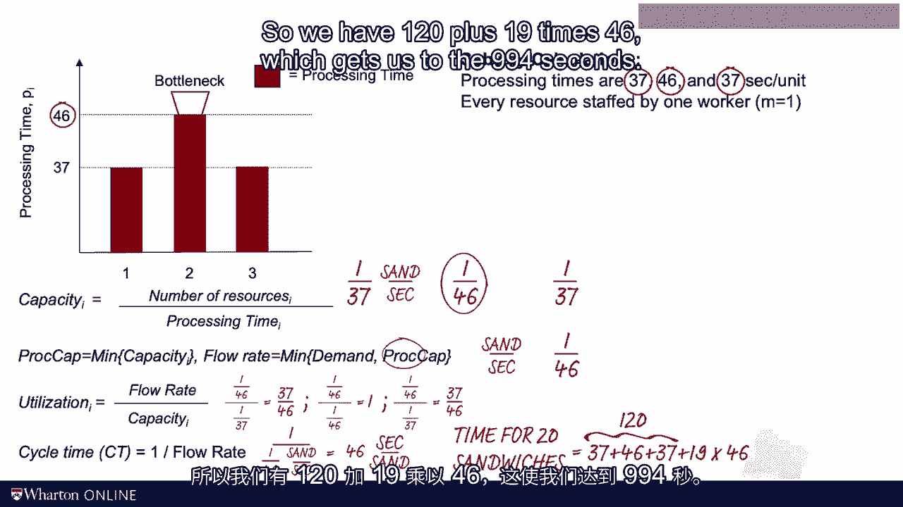

# 沃顿商学院《商务基础》｜Business Foundations Specialization｜（中英字幕） - P122：6_如何以微观角度看待工作.zh_en - GPT中英字幕课程资源 - BV1R34y1c74c

 In this module， we will look at the operations of a process at the very micro level。

 We get our stopwatch and look second by second on how people work。

 The case study I have picked for this module is Subway Restaurants。

 I somewhat assume that all of you have eaten in a Subway restaurant or similar venues。

 so it should make for a good case study。 I also assume that every one of us has made a sandwich for ourselves。

 Now unless you are a professional cook or have a big family。

 your experience is all about making one sandwich at a time。 How long does it take you？

 What is your processing time？ How long does it take you to slice the bread？

 Here's some official Subway information of how long it takes to make a sandwich。

 This will vary a bit by sandwich and employee， but， let's just take these numbers as given for now。

 We see that we have a grand total of 120 seconds of work per sandwich。 That is two minutes。

 In other words， one employee could make a sandwich every two minutes。

 which is equal to 30 sandwiches an hour。 That's the employee's capacity。

 But what would Subway do when demand is higher than this？ Maybe 80 or even 100 sandwiches per hour。

 which are common numbers during busy lunch times。 Well。

 they certainly need more employees to do this， but， how should we organize the workflow？

 Save me higher two more employees， so they now have three。

 One thing that they could do is that each of the three employees serves。

 the customer from beginning to end， from grading the customer all the way to checkout。

 Each employee would then take 120 seconds to serve a customer。 Interestingly。

 that is not the process that they use。 And we later on would understand the logic behind this。

 For now， here's what they're actually doing。 Take a look。 What Subway does is here。

 rather than having one person， doing the whole thing， making the whole sandwich。

 there are three people involved in the job。 They're really setting up a mini assembly line of sandwiches consisting of employee one。

 two， and three。 Each of them has their hands in our sandwich， yummy。

 So the first employee is greeting the customer， and then employee one does all。

 the things after putting the cheese on the sandwich。 Then the second employee takes over， and。

 that person starts with putting on the onions and goes all the way up to wrapping。

 up and begging the sandwich。 And then the third employee is gonna offer the fresh value meal and。

 then rings out the cash register。 That completes one customer。 So for now。

 let's see the numbers here， these processing times I exact。

 I know this is a very mechanical view to the world， but as you will see， it is a good start。

 It takes exactly these 12 seconds to put on the meat。

 It takes 37 seconds per sandwich per unit per guest at employee number one。

 The processing time is 46 seconds per unit for the employee number two and。

 37 seconds per unit at employee number three。 So these are the processing times。

 Here's what I want you to do。 I want you to draw me a process flow diagram of this subreassembly line for。

 sandwiches。 And then I want you to think about the capacity of this process。 As usual。

 put me on hold， pause me， and then see how far you can get this done by， yourself。 All right。

 here we go。 Let's look at this together。 Let's start by drawing the process flow diagram。

 For the process flow diagram， we start out with a triangle of waiting customers。

 So that's a triangle。 Then comes the first box， the first resource。

 That's going to be employee number one。 There could be a buffer then。

 We have employee number two afterwards。 So that's the second resource， the second box。

 And after that， there's another buffer。 And that is the other employee number three。

 And that completes the process flow diagram。 So we have three resources。 Next up。

 I want you to think about the capacity of this process。 For the capacity of the process。

 I have to find the bottleneck。 There's going to be one of these three workers。

 Each of them has a capacity。 We're going to find it by taking one over the processing time。

 So one over 37 is a capacity of the first worker。 And that is in sandwiches per second。

 One over 46 sandwiches per second is a capacity of the second yield。 And one over 37 is the third。

 So we see here that the lowest number is one over 46。 And so that is by definition our bottleneck。

 Rather than messing around with mental maps。

 let's switch over into Excel and do this on a spreadsheet。 We have the three workers。

 That's three resources here。 And each of them has a processing time。 And remember those were 37， 46。

 37 seconds per unit。 Let's make sure we keep track of the units here。

 These are all in seconds per unit。 Now the capacity we set is simply one over the processing time。

 So one over 37。 And that is 0。02727。 That's a really hard to interpret number。

 This is expressed now in units per second。 And to make it easier to interpret， I would suggest。

 we just convert it to units per hour。 We do this by simply multiplying this number by 3600， right？

 3600 seconds in an hour。 And 97 sandwiches per hour is a number that， is much easier to interpret。

 So remember then the process capacity reset， the process capacity is simply the minimum。

 of these individual capacity levels。 That was the whole idea of the bottleneck。 The bottleneck。

 not surprisingly， is at station number two。 And the process capacity is 78 units per hour。

 From there， the next thing that we， want to think about is flow rate。 Flow rate， we said。

 was the minimum of demand and capacity。 So we need to make an assumption about the demand rate。

 Let's see for now， the demand is 100 sandwiches per hour。

 And so that means our flow rate is the law of these two， numbers。

 But the minimum between demand and capacity and the flow rate。

 now is this going to be 78 units per hour。 We also talked about the idea of utilization。

 So for utilization， I'm taking my flow rate。 So I'm fixing the 78， and I fix them in Excel。

 by pressing the dollar sign。 And I'm dividing it by the capacity。

 So that means my first resource has a utilization of about 80%。

 And then the other resources have a utilization of 100%， and 80% respectively。

 Now just for intuition building， imagine my demand rate， would go down。

 Say we have a demand of 50 customers per hour。 Then my utilization， even at the bottleneck。

 would decrease to a value that is less than 1。 In fact， with the demand of 50， it。

 would do down as you see here to about 63%。 But for now， let's not worry about that。

 Let's go back to the base case of demand being 100。

 So we have a utilization of 100% at the bottleneck， and about 80% at the other two resources。

 Next up， I want to define a new measure。 I will define the new measure as the cycle time。

 Let me define cycle time as 1 over the flow rate。 Let's be very careful with the units here。

 I've been a little sloppy in the last row， skipping track of the units。

 Flow rate is measured in units per hour。 And so my cycle time since it's 1 over the flow rate。

 is now hours per unit。 Now 0。012778 hours go by between two sandwiches。

 It's a little hard to interpret。 So I suggest we just convert this back into seconds。

 and we divide the 3，600 seconds of the hour by 78 sandwiches。

 Now we see something that I hope is intuitive， as we are now back to our seconds per unit。

 our cycle time is 46 seconds per unit。 And that means we're making a sandwich every 46 seconds。

 So work repeats itself。 We are cycling through every 46 seconds， to make a new sandwich。

 Now that we have the cycle time， I want， to ask you another question。

 Imagine we have a school bus with 20 hungry kids， arrive at a subway restaurant。

 Every kid wants one sandwich， and right now the restaurant， is still really empty。

 How long will it take to please the crowd？ How long will it take to make 20 sandwiches starting。

 with an empty process？ This is harder than it sounds。

 So let's think about this systematically。 How long will it take to feed the first kid？ Well。

 the first kid， the first customer in order to be served。

 we need to basically go through all three steps--， 37 seconds at station one， 46 at station two。

 and 37 at station three。 Now how much later will we please the second customer？ Think about that。

 The second customer will come out 46 seconds later。

 And another 46 seconds later comes out the third customer。 So from then onwards。

 we are completing a customer order， every 46 seconds。 That is exactly the idea of cycle time。

 So to please the crowd of 20 customers， to feed 20 customers， we're going。

 to have to feed the first one。 And then 19 times more， we're going。

 to go through the cycle time to have completed， the total order of 20 units。

 That will be after 994 seconds。 Before advancing further， I would。

 like to review the calculations that we did in Excel。

 a moment ago。 Remember， we have these three resources， with processing times 37， 46。

 and 37 seconds per unit。 I try to visualize this here in this graph with 37， 46， and 37 SEs bars。

 We can imagine already that station two， is going to be the bottleneck， but that。

 would be jumping ahead。 The bottleneck is defined based on capacity， not based on processing time。

 So to find the capacity of a resource， we look at the number of parallel servers at that resource。

 M divided by the processing time。 Now here， each resource， each station。

 is really stuffed by one employee。 And so my capacity level is 1/37。

 and that is expressed in sandwiches per second， 1/46， and 1/37。

 That makes this step here the lowest number， and so employee 2 is going to be the bottleneck。

 So my process capacity is 10， 1/46， and it's 10， which is 10， which is 10， which is 10。 For now。

 I want to leave it in seconds， as opposed to converting it to hours。

 as I did in the excess spreadsheet， and you will see why in just a moment。

 That gives me my process capacity， and we assume there's plenty of demand。 So my flow rate is。

 as usual， minimum between demand， and process capacity。

 And this is going to be driven by the capacity， of the bottleneck。 Next up。

 I'm going to look at the utilization， and the utilization is the flow rate， which。

 is going to be 1/46， divided by the capacity levels。 And so for the first resource， that's。

 going to be 1/46， divided by 1/37， and that means 37 divided by 46。 For the second resource。

 it is 1/46， again， flow rate， divided by capacity， which is also 1/46。

 So the utilization there is 1。 And then for the third employee， it's again 1/46， divided by 1/37。

 and that gives me again， 37 divided by 46， which we said is around 80%。 Next。

 let's look at the cycle time， which is what we said， was 1 over the flow rate。

 And here's why I didn't convert it into hours。 If you write it this way， it's quite simple。

 The cycle time is simply 1 over the flow rate， and the flow rate was 1 over 46。

 So all that combined gives us the cycle time of 46 seconds， per sandwich。 Every 46 seconds。

 life repeats itself。 And then finally， to make 20 units starting， with an empty process。

 we have to first produce the first， sandwich。 And for the first sandwich。

 it's going to take us 37 plus 46， plus 37， which together gets us 120 seconds。 So after 120 seconds。

 we have one sandwich。 So now we need 19 times an additional sandwich。 And guess what？

 We're making those on a 46 second cycle。 So we have 120 plus 19 times 46， which。

 gets us to the 994 seconds。

 So far， with the sub-week， it's remaining repeated， our capacity calculation。

 I also introduced the concept of cycle time。 Please be careful with the word cycle time。

 I've seen it used very differently across the industry。 Most importantly。

 I've come across some companies， that use the word cycle time for what we call flow time。 Now。

 not surprisingly， I think my definition is the right one。 The word cycle time， in my view。

 captures the idea of a cycle。 Every 46 seconds， a process in our sub-week case， repeats itself。

 Every 46 seconds， a new cycle begins。 The cycle time is particularly useful for processes。

 with discrete flow units。 I wouldn't use a concept in an oil refinery or brewery。

 It just works better when you're dealing with customers， or widgets or sandwiches。

 The cycle time helps us find how long it would take， to produce a certain number of units starting。

 with an empty system。 As we will see， the cycle time also。

 will be at the heart of some further productivity calculations。 Speaking of further calculations。

 in the next video， we'll talk more about the importance of a labor productivity。

 I will introduce two new measures， and then we will link those to financial performance。

 See you then。

 [BLANK_AUDIO]。