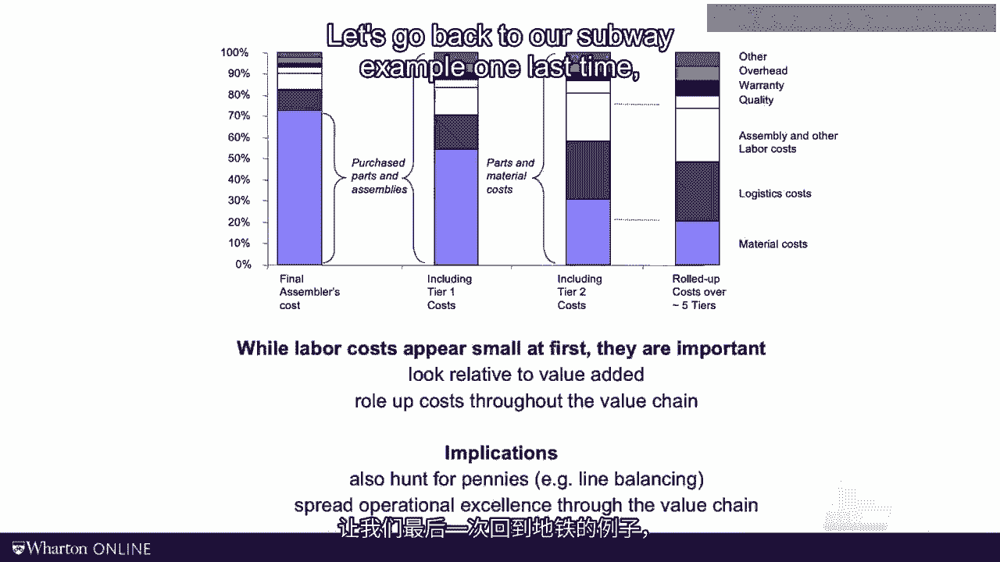
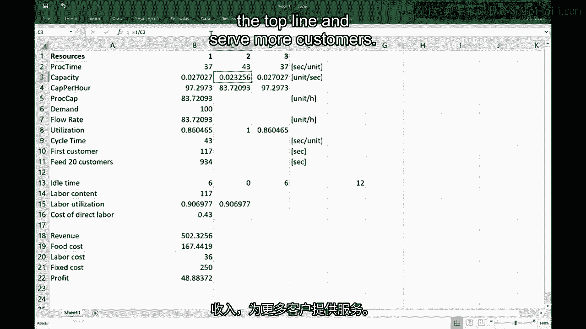

# 沃顿商学院《商务基础》｜Business Foundations Specialization｜（中英字幕） - P123：7_劳动生产率.zh_en - GPT中英字幕课程资源 - BV1R34y1c74c

 Today I want to talk about labor productivity。

 I will introduce two measures of labor productivity， the average labor utilization and the cost。

 of direct labor。 I then want to spend some time with you reflecting upon the financial importance of labor productivity。

 Let's go back to the Excel model that we had started in the last video。

 So we have the three resources here。 Remember we had the processing times， the capacity。

 all the way down to the cycle time。 Now imagine you and I would run the separate restaurant。

 We are the owners。 We pay the workers。 What would make us really angry？ Exactly。

 We have a worker that sits or stands there and is not working。 We say the person is idle。

 How much idle time do we observe in this picture here right now？ Again。

 it's for the moment assume that we have unlimited demand or a really big number。

 of customers asking for our sandwiches。 Where are you going to go see the idle time？

 Who is sent around doing nothing？ Well worker number two， the bottleneck is never idle。 In contrast。

 the other two workers have some slack relative to the longer processing time， of worker number two。

 And that number is simply the cycle time minus the processing time of that station。

 So the first person has an idle time of nine seconds。

 Again the bottom of the neck will not have any idle time and the third one has again。

 nine seconds of an idle time。 The total idle time we get by summing up all the idle times for the individual stations。

 and voila that gives us a grand total of 18 seconds。

 Now 18 seconds are large number or is it a small number？ That's really hard to interpret。

 In absolute terms it's really hard to judge。 So we need to take this number relative to something else。

 Let me introduce another measure。 I will refer to this number as the labor content。

 The labor content is simply the sum of all the processing times that involve labor。

 In our case here we get a labor content of 120 seconds per sandwich。

 So these 18 seconds of idle time should be compared to the 120 seconds of making a， sandwich。

 In contrast in an autoplanet 18 seconds of total idle time relative to maybe， 10。

000 seconds of labor content for a car would be far less significant。

 This is the intuition behind of what I now will really find as the labor utilization。

 Labor utilization looks at the labor content。 For every sandwich I'm going to get 120 seconds of labor but I need to pay the workers for。

 the 120 seconds at their work plus the 18 seconds they are idle。

 It ratios called again the labor utilization。 Don't worry for now about the details we're going to go and review all the definitions。

 later on in this video。 So the labor utilization looks at the labor content relative to the idle time。

 I can write this slightly differently。 Again， I will summarize this on a PowerPoint slide later on。

 For now I look at the labor content and rather than dividing it by the labor content by the。

 idle time I can divide it by three times the cycle time。 It shouldn't surprise us。

 This gets us the same utilization from a moment ago。

 Now let me emphasize what labor utilization measures。 Labor utilization measures balance。

 Balance is good but it's not the only thing that matters。 Just as a thought experiment。

 imagine I have three very lazy but really smart employees。 What are they going to do？

 So they tell each other， "Look， Christian is a kind of stupid manager。

 He's going to look at the labor utilization to judge our performance。"。

 So why don't we all slow down and everybody has a processing time of 60 seconds？

 While what happens to the labor utilization with this evil plan， if all the workers have。

 a processing time of 60 seconds there will be no idle time。

 The process is perfectly balanced and the labor utilization goes to 100 percent。

 Has this process become more efficient？ Clearly not。

 So we need another measure here for labor productivity。

 Let me propose another measure which I'll refer to as the costs of direct labor。

 What's the cost of direct labor？ What we're doing with this measure is we look at the wages per unit of time。

 It's assumed for now we have three people here and we pay each of them 12 bucks per。

 hour and over that hour we've created ourselves a flow rate of what we said was 78 sandwiches。

 So the cost per sandwich in terms of direct labor is 46 cents。

 Think about this the next time you're going to a subway restaurant。

 You typically tend to pay around 5 to 6 bucks for a footlong sandwich and in there there。

 are about 46 cents of labor。 Just as before we have the three resources。

 The processing time is about 37， 46 and 37。 So those are the workers， one， two and three。

 We found that the cycle time is driven by the second resource 46 seconds per sandwich。

 That means the other two resources one and three have some slack relative to the cycle。

 time and that slack is going to be their idle time。

 So they have 46 minus 37 which is 9 seconds of idle time each and we're going to get a。

 grand total of 18 seconds of idle time。 But how do we interpret that number？ Is it big？ Is it small？

 We have to take it relative to something and that something we said is going to be the。

 labor content。 Labor content， this is some of the processing times， 37 plus 46 plus 37。

 the 120 seconds。 So when we're going to judge whether the 18 seconds are larger or small。

 we're going to， take them relative to those 120 seconds。 That gives us the labor utilization。

 And so one way of computing labor utilization is taking the labor content of 120 seconds。

 It is really the green here in my three bars， 120 seconds。

 And taking it relative to the total which is a green plus a red。

 That measures balance and we found the number to be 86。9%。

 So that's one way of computing that number。 There's another way you can do this。

 For reasons I don't want to tell you right now， I would prefer you use this other way。

 And that is by involving the cycle time。 You see the definition here to the left。

 With this definition you're going to go and look at again the labor content， so it's 120， seconds。

 And dividing it now by three times the cycle time。

 As you see just as before we get 120 divided by 138 and surprise the price， we get the same， 86。9%。

 So that's the average labor utilization as a measure of balance。

 And finally we talked about the cost of direct labor。

 For that you just look at the wages per unit of time， three workers for $12 per hour divided。

 by the flow rate which we found to be 78。something which is expressed in sandwiches per hour。

 So the per hour cancels out and we're left with the 46 cents per unit。

 That gives us the cost of direct labor。 Before we talk more about labor productivity。

 let me address a question that I oftentimes， get asked。 Does labor productivity really matter？

 So here's some cost data from the order industry compiled by a gentleman， Dan Woodney， at MIT。

 and what Dan looked at is the total cost for an OEM in the order industry。

 In this case the data was from Daimler。 The total cost you can basically find in the profit and loss statement in the accounting。

 of Daimler and from the total cost for Daimler you notice that the vast majority of costs。

 sit in purchasing。 About 70% of the total cost is going to be in purchasing and only a relatively small piece。

 of the total cost is going to be labor costs。 Most of the costs are coming through our purchasing department。

 Daimler pays relatively little money in labor。 So why care about labor productivity？

 I would agree that this view is a little bit misleading because keep in mind that the。

 70% of costs that Daimler spend from those 70%， those are the total costs that go to their。

 suppliers and these suppliers in turn also incur labor costs。

 If you factor in the labor that the suppliers like Bosch or Continental spend， if you factor。

 those in as well， the total percentage of costs making a vehicle is getting much larger。

 They're not on Daimler's book but they're real costs。 Now the suppliers again have their suppliers。

 we call those as second tier suppliers， and， those have suppliers of their own。

 If we roll this up off of the value chain， you do see that they are a fair bit of costs。

 sitting around in labor。 The raw material costs are much smaller than you think。

 That has a couple of important implications。 First and foremost pennies matter in a product but oftentimes these pennies will not be on。

 your book。 You really have to go out and work through the supply chain and find these costs somewhere。

 upstream。 By the way， the same is true for improving your carbon footprint。

 With globalization and global trade， suppliers carry more and more responsibility and so tapping。

 into their cost base is central。 Even if this is not visible in the P&L statement of the manufacturing company。

 those costs matter。 Let's go back to our sub-way example one last time。

 This time was an iron profits。 Profit is simply revenue minus cost。

 So let's start understanding what the revenues here look like。

 Revenue is simply the number of sandwiches that we were making per hour， flow rate， times。

 the average price per sandwich。 Let's just assume we're selling these sandwiches for $6 per unit。

 Say it takes us $2 in food costs to make a sandwich。

 So the first item here that we have on the cost is we're spending the same 78 units per。

 hour times $2 per item in material costs。 We also have a labor cost。 We agreed on the labor costs。

 We assume that we're paying these workers $12 per hour for all three workers。

 We also have some other forms of fixed costs。 And fixes are a whole topic in itself。

 We could talk about cost allocation and what drives these costs for long sessions by itself。

 whether it's rent， the insurance， the marketing， the overhead and what have you。

 Let's just say for now with some plausible cost allocation， we have $250 of fixed costs， per hour。

 Remember， most of the business will be over the lunch hour and that is why I allocate so。

 much of the fixed costs to that one hour。 This allows us now to compute the profit。

 So we have the revenue minus the food cost minus the labor cost minus the fixed cost。

 which gets us a profit of about $27 per hour。 So we're making about $27 per hour。

 I don't want to comment whether there is a lot or a little。 For now， let's do something else。

 Let's think about some improvement strategies， which is something that we'll talk about in。

 the next video。 And let's just for the sake of argument imagine we could shave off some seconds of the bottleneck。

 This could either be done by automating or by having a more skilled worker or by taking。

 some of the 46 seconds and move them to the left and to the right。

 Again more on how to find these improvements in the next videos。 For now。

 assume this number would go down to 43 seconds。 What's going to happen to profit？

 Clearly profit is going to go up。 The question is by how much？ Let's take a look。

 We have $27 in the baseline scenario。 Three seconds faster at the bottleneck corresponds to an improvement of about 7% of the processing。

 time at the bottleneck and about 2% to 3% in labor content。

 Three seconds faster at the bottleneck is translating into a profit increase from $27。

 per hour to $48 per hour。 We almost doubled our profitability。 Wow。

 Almost doubling profits just because of shaving of a couple of three seconds at the bottleneck。

 That is the key insight here to the value of improving productivity。

 It's not just about cutting the cost of labor。 Poor productivity creates a real opportunity cost of not selling more sandwiches。

 More productivity helps us to increase the top line and serve more customers。

 In today's video， we saw that the labor productivity is important for two reasons。

 First little things add up。 The example from the auto industry has reminded us is not just about the labor that happens。

 in our process。 Our suppliers use labor to generate our inputs。

 Our supplier has its own suppliers who also use labor。

 When you add up the labor costs to the value chain， the cost numbers become quite sizable。

 And second， we learned how labor can act as a constraint on the process that gets us back。

 to the bottleneck。 The reason why we want to shave off a second or two at the bottleneck is not to save ourselves。

 the associated labor costs。 Rather， we want to do this with the aim of generating some additional capacity。

 If we are capacity constrained， more bottleneck capacity is worth a ton of money as it adds。

 to top line revenues。 And what is not to like about that？ In the coming video。

 we will talk more about process improvement strategies。 Until then。

 grab a sandwich and look for the bottleneck。 [BLANK_AUDIO]。

