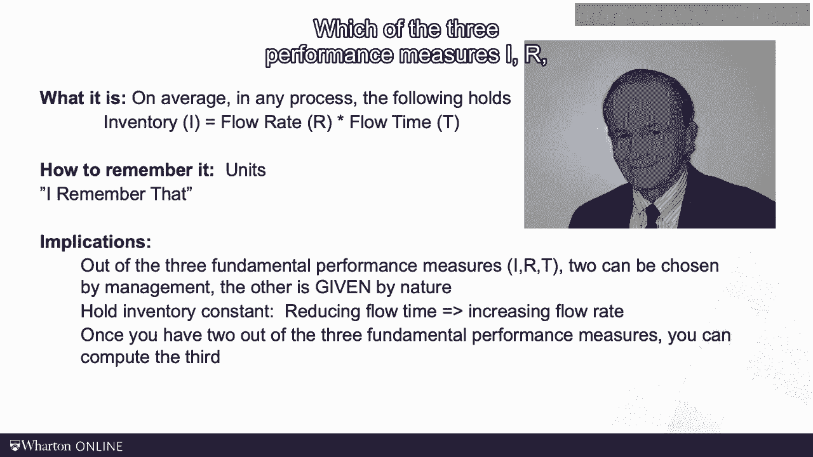

# 沃顿商学院《商务基础》｜Business Foundations Specialization｜（中英字幕） - P132：16_小法则.zh_en - GPT中英字幕课程资源 - BV1R34y1c74c

 We don't have many equations in this course， and so we should create each equation with。

 great joy。 Today I will introduce our first equation， which I will refer to as "Littles Law"。

 To illustrate the equation and to build some intuition， I will use a hospital example。 A while ago。

 one of the interventional radiologists here at Penn had asked me to look at their， patient flow。

 But what do you look for when looking for patient flows？

 Well imagine you and I would take two folding chairs， coffee and donuts， and make ourselves。

 comfortable in front of Penn's department of interventional radiology。

 We also take a notebook along and you would take detailed notes while I munch my donuts。 Ready？

 So here we go。 At 7。35am the first patient shows up。 At patient goes in， doors shut。

 it is always for now。 I ask you to also take a graph tracking the cumulative inflow of patients in blue and。

 the cumulative outflow in red。 10 minutes later， at 7。45am， the next patient shows up。 And at 8。

10am the third patient comes。 Before the fourth patient shows up at 9。30am。

 however the first patient， the guy who came， at 7。35， comes out of the department。

 At 10am I ask you a test question。 How many patients are in the unit right now？ Sharp as you are。

 you will respond three because four went in and one came out。 From that point onwards。

 I stop asking my stupid questions and you just take your notes。

 Only patient five surprises most of us as she got in and out of the department in 15 minutes。

 We later learned that the patient refused to sign the consent form。

 At the end of our day in the hospital， we have built graphs that look something like， this。 Again。

 the blue graph captures the cumulative inflow and the red graph is a cumulative outflow。

 These two graphs meet at the time the last patient has left the unit。

 First observe that we have taken care of 11 patients。

 In prior modules we refer to this number as a flow rate which I am going to now abbreviate。

 with the letter R。 The flow rate measures how many patients we saw in a given period。

 of time in our case one day。 There are a couple of more things this graph teaches us about the patient flow。

 We can also compute the number of patients that are in the department at any given moment， of time。

 This is simply the difference between the inflow curve and the outflow curve。

 The number fluctuates between zero in the morning and four around 3pm。 Remember。

 we defined the number of flow units in the process SE inventory which I will now。

 abbreviate with the letter I。 Finally， you can also see how long a patient spent in the process。

 Some patients spent a long time with patient number nine here。 Others got in and out much faster。

 Recall， patient five was in and out in 15 minutes。 This was our third measure。

 the flow time which I will now abbreviate with the letter T。

 The flow time measures how long it took for the patient to flow through the process from。

 beginning to end。 Now the reason why I'm reviewing these three definitions here is not just because they。

 are important。 If you look at the figure here which summarizes all observations for the day。

 you might see， your relationship。 On average， the inventory in the process is a flow rate in the process times the flow。

 time。 Inventory in this case is measured in patients。

 Flow rate is patients per hour and flow time is measured in hours。

 In any process and at any time the average inventory is equal to the average flow rate。

 times the average flow time or I equals R times T for short。

 We will refer to this relationship as Little's Law。 You see a picture of Mr。 John Little here。 Dr。

 Little was born in 1928 but more importantly， his law says on average in any process inventory。

 is equal to flow rate times flow time。 I've been teaching this for many， many years。

 In one of my classes a student had a great idea how to remember the equation。

 He just stared at my slide and shouted out， "I R T。 I remember that。 I can't beat that。"。

 More importantly， let's talk about the implications。

 Little's law reminds us that from the three most important performance measure in any， process。

 two you can potentially mess around with and adjust but once you have done this。

 the third one is really given by nature。 Well， there's an easy way to get to zero inventory。

 You just stop producing。 You said R equals zero and you get I equals zero。

 But obviously that's a really bad idea。 So if you want to get rid of some working capital。

 get rid of some inventory， the only， way you can do this is to move the flow units faster through the process。

 You have to remember that flow time and inventory holding flow rate constant move proportional。

 to each other。 This is also practically very helpful。 Oftentimes when you do a process analysis。

 say you visit a plant， you might only be able， to see to observe two of the three performance measures。

 Using little's law， you can just compute yourself the third one。

 Which of the three performance measures， IR and T， do you think is the hardest one to。

 compute and practice？ Well， let's think about that。 Does a company know its flow rate？

 How many tables it has made？ How many loans it has under it？ Or how many patients it has seen？ Yes。

 Even fairly incompetent companies measure their flow rate。 After all。

 flow rate times price equal to revenue。 Do they know their inventory？ Well。

 this oftentimes is tracked less carefully in the services world in manufacturing and。

 retailing where you typically are dealing with physical products as flow units。

 You need to track your inventory for accounting purposes。

 In servers that is oftentimes not done as carefully but still hospitals tend to know how many。

 patients they have。 This number is oftentimes called the census。

 Banks or insurance sometimes track the customers that are waiting for a loan as well。

 It is a flow time that is oftentimes forgotten or hard to measure。

 How long did I have to wait in line？ How long has this customer waited for her request？

 To say it with Benjamin Franklin's words， lost time is never found again。 Wise words。

 so I doubt that good old band have the ideal flow time in mind。 Anyway， the good news is this。

 You can always find the average flow time as long as you have the average inventory and。

 the average flow rate。 In the next videos， we will put little law to work。 [BLANK_AUDIO]。

