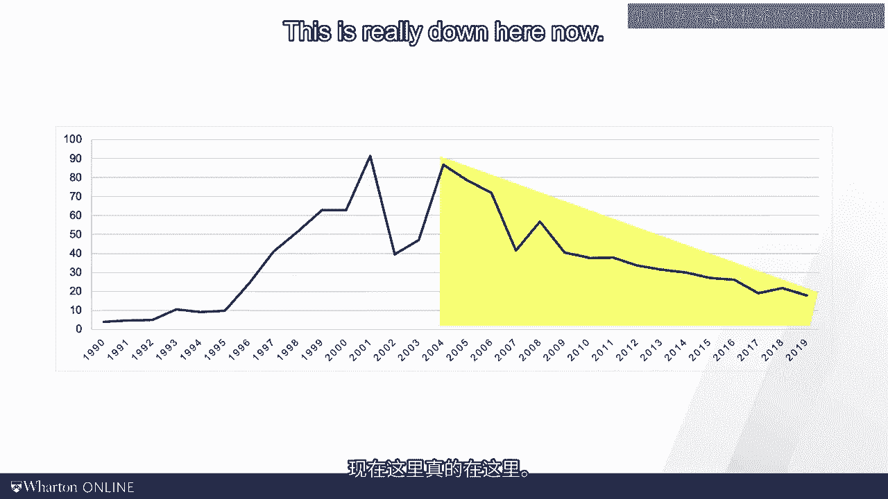

# 沃顿商学院《商务基础》｜Business Foundations Specialization｜（中英字幕） - P133：17_使用小法则确定库存周转率.zh_en - GPT中英字幕课程资源 - BV1R34y1c74c

 In the last video， I introduce our first equation in this course， which we refer to as little。

 slow。 We learned that on average， in every process， the average inventory is equal to。

 the average flow rate times the average flow time。 Today， we will apply little slow to。

 the world of physical inventories。 For that， we will do something that first might appear。

 really weird。 We will pick an individual dollar bill as our flow unit。 We will then think of。

 a firm as a big black box in which dollar bills flow in on the one side and the dollar。

 bills flows out on the other side。 We can then ask ourselves a simple question。 How long。

 does the average dollar bill spend inside the company？ Well， clearly， we cannot ask the。

 dollar bill， "Hey， dollar bill， how long did you spend in the company？" But we don't， have to。

 We can use little slow。 More specifically， we think of the number of dollar bills flowing。

 through the organization as a cost of goods sold or cogs， for sure。 The number of dollar。

 bills inside the organization is the inventory。 If you have taken accounting courses， you might。

 ask about life or or FIFO。 For the purpose of what we are doing， it doesn't matter。

 Note further that we're using cogs as our flow rate。 I see folks in corporate finance。

 sometimes use revenues， since inventory is valued in cogs' dollar， I prefer to use cogs。

 to be consistent。 So let's visualize this。 We have our individual dollar bill that goes。

 into the organization， the inflow， and then we have all the dollar bills coming out。 The。

 dollar bill in the organization as the inventory。 And the flow of dollar bills through the organization。

 is really our cogs。 And when we want to know how long does the individual dollar bill spend。

 inside the organization？ There would be the flow time。 Cogs and inventory， we can get that。

 from accounting。 Again， little slow is i equals r times t。 So we're solving this for t the。

 flow time， and that tells us how long the dollar bill spends in the organization。 Sounds。

 to abstract？ Well， let's do a specific exam。 Let's compare two legendary computer makers。

 compact and Dell， of which of course only one exists by now。 And I will give you a reason。

 why you probably are not watching this video on a compact computer。 So we're going to use。

 little slot to find out how long the dollar bill spent in the organization。 i equals r， times t。

 And we're going to solve this for t。 Let's start with Dell's numbers。 So the。

 inventory at Dell in 2000 was about 391 million。 Again， I will start with old data from the。

 time when compact was still around。 And we have $20 billion a year as the flow rate， the， cogs。

 So that is dollars per year times t。 So t is our unknown。 We're going to solve this， for t。

 And so that means 391 divided by 20，000。 And that is expressed now in years。 So the， unit is years。

 If you want to convert the years into days， you have to multiply with， 365 days in the year。

 And that is about seven days。 So Dell keeps their inventory for seven。

 days before spitting it out again。 We refer to this number as days of supply。 So Dell has。

 about seven days worth of supply。 Now this is a lot or not， well， let's compare this with， compact。

 In the same year， compact had an inventory of roughly $2 billion， $2。003 billion， to be exact。

 And cogs at about 25 billion。 Multiply this with a flowtime t。 Again， we're， going to solve for t。

 In this case， it's 2003 divided by 25， 263。 And then again， it's multiplied， by 365 days a year。

 So we see that the average dollar spends 29 days within compact。 That's。

 a very sharp contrast to Dell's number。 Again， we refer to this number as a days of supply。

 We can read this directly as inventory divided by cogs times 365。 Now instead of saying we're。

 going to keep the inventory for seven days， I can see I'm going to turn the inventory。

 every seven days。 That means a Dell I have about 52 inventory turns per year。 So the。

 inventory turns as cogs divided by inventory。 And that tells us how many times I'm turning。

 the inventory。 So it's one over the flowtime t。 Now this was old data。 I picked the date。

 and the year so that compact and Dell were both still around。 To take Dell's numbers。

 into perspective， I showed you the data here from 1990 to the very recent past。 On this。

 side slide here， you see that in the early years， this was really the rise of the Dell， model。

 This was a revolution in the computer industry。 Michael Dell's idea was that you。

 can make your computer to order。 So rather than having the computer wait in inventory for。

 the customer， the customers waited for the computer。 That went super well。 That peaked。

 at around 80 inventory turns per year in the early 2000s。 The burst of the tech bubble。

 then happened around 2001。 Dell did a good job at recovering the inventory turns。 But。

 you notice the decline starts before the financial crisis and that has never stopped。 So this。

 is really down here now。 Note what you see is not the financial crisis。 It's really the。

 end of the Dell model。 And that has a lot to do with the fact that nowadays as customers。

 we don't want to wait for our computers anymore。 And we don't ask for customized computers。

 The variety has gone down in the industry。 And now companies like Apple， it is again。

 computers waiting for customers。 It's an irony of history， if you will。 Okay。

 time for a little game。 I call this game the inventory turn scripts。 I will show。

 you here four retailers， the jewelry maker Tiffany， the supermarket Kroger， the apparel， store。

 Kohl's and Walmart， the world world leading retailer。 Then I give you four levels。

 of inventory turns and your job is to match retailer and inventory turns。 Who is who？

 Put me on pause and give this some thought。 Alright， here we go again。 So here are the。

 solutions to the quiz。 Tiffany is the lowest turns。 They turn the inventory very slowly。

 The reason for that is they have a huge assortment。 They provide you lots of choice。 And that means。

 that each of these products， each of these wedding bands or necklaces， is going to wait。

 a long time for the customer。 Kroger is the other extreme。 Supermarkets turn the inventory。

 very quickly。 A lot of these items are perishable。 Fresh food inventories have to turn almost。

 daily。 Kohl， again fashion wants to turn quickly but not as quickly as milk。 Walmart also somewhere。

 in the middle has a large grocery component to it。 Very well managed and they have pretty。

 decent turns。 Next， think about why do we care about these inventory turns。 Well inventory。

 turns have something to do with inventory costs。 Let me do a thought experiment。 Imagine you。

 have a thousand dollar computer and you keep that computer for an entire year。 How much。

 will that cost you？ Well over a year that computer gets somewhat obsolete。 You have。

 to store that computer and you have to finance that computer with your weighted average cost。

 of capital or WAG for short。 Note that this is not a real out of pocket expense。 Most。

 of that is a ride off and an opportunity cost。 But it's an important number。 A thousand dollar。

 computer I would easily say loses $300 of value in a year。 You might have to pay $100。

 to store it safely and securely and you might have to pay about 10% of the value of the computer。

 in terms of opportunity cost。 So those numbers add up to something pretty big。 But of course。

 you're not holding the computer for an entire year。 As we saw in the case of Dell you're。

 turning it multiple times。 And so let's say for sake of argument if that inventory costs。

 per year number is 30% and you're turning it six times per year that means for every unit。

 for every computer that you're selling you're incurring a cost of 5 percentage points。 That。

 means for a $60 item in terms of cost one item that you source for $60 you would incur。

 $3 per unit cost of inventory。 The final comment on inventory cost。 This graph shows a relationship。

 between profit margins and inventory turns。 Now if you look at this graph you might wonder。

 why I talk so much about inventory turns being good because it seems to be a negative correlation。

 between margins and inventory turns。 You see Tiffany up there was slow turns and they make。

 big margins。 And you see best buy and Walmart down here and they have fast turns and low， margins。

 But that's not the point。 As I said Tiffany holds a very broad product assortment。

 They have a ring or wedding band for every kind of customer who comes in that store。 That。

 means you have to hold the inventory a long time。 That's low turns。 But when somebody。

 then one set rank oh my god will they pay。 Best buy and Walmart are much more in the fast。

 turning business offering customers less choice。 Look at the competition here between the middle。

 Macy's and the gap。 They're both somewhat in the same product category。 Look at the situation。

 here Macy's turns its inventory three times in a year。 Gap turns inventory four times， in a year。

 Let's take a pair of jeans or some other apparel and assume that there are 36%。

 cost of inventory for holding the item for an entire year。 Again that is the cost of storage。

 the cost of capital and the cost of fashion becoming obsolete。 So that means 36% with three。

 turns for Macy that would be 12% unit cost versus at the gap return four times that is。

 a 9% unit cost。 So that little difference in terms of inventory turns is worth 3% points。

 in terms of profit margins。 Thus the gap with the faster turns can achieve a significant。

 financial advantage even though the profit margins on the book might actually slightly。

 look lower。 Today we talked about inventory turns。 This is a key concept in inventory， planning。

 purchasing and supply chain management。 It really captures the costs of inventory。 These。

 costs are a combination of capital holding costs。 That's an opportunity cost of capital。

 cost of storage， shrinkage and theft as well as the cost of markdowns because of value depreciation。

 What I like about little slow is that it reminds us that the only way we can efficiently support。

 a big flow of product in the form of big sales is by turning the inventory quickly。 Some supply。

 chain managers talk about turn and earn。 I like that turn and earn the more you turn。

 your inventory the more efficient of a supply chain you run。 For now turn off the video you。

 earned a break。 See you in the next video。 [BLANK_AUDIO]。

