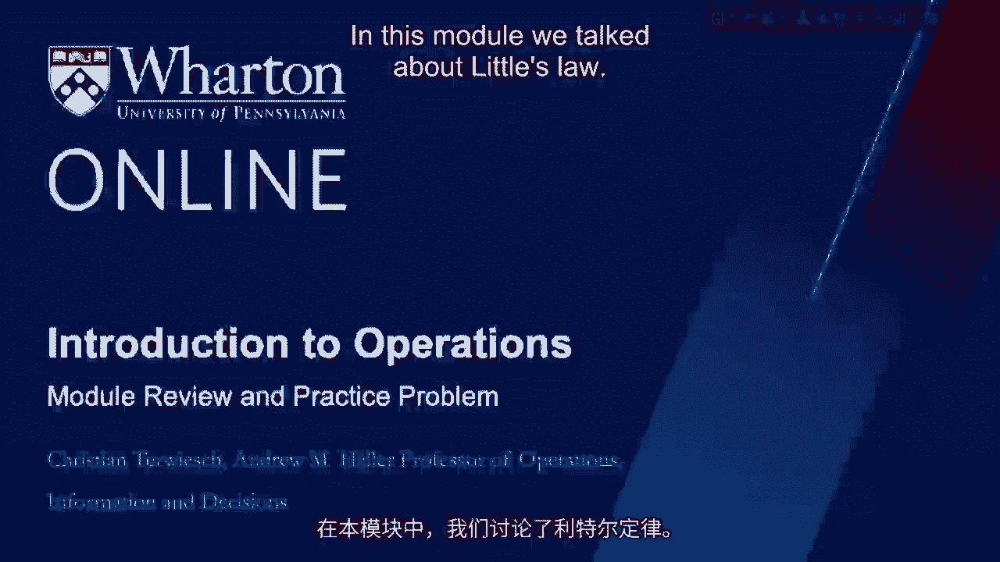
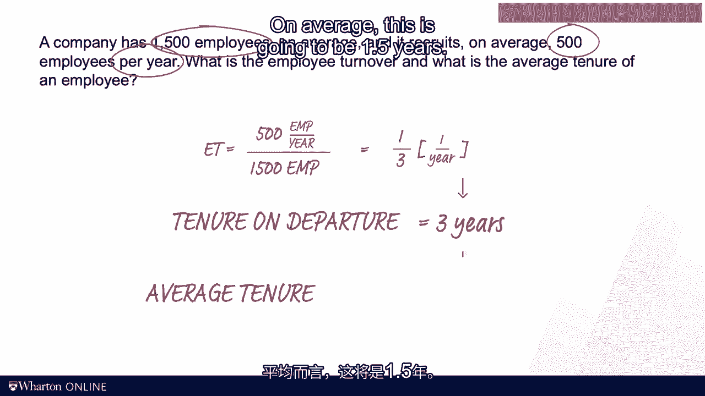
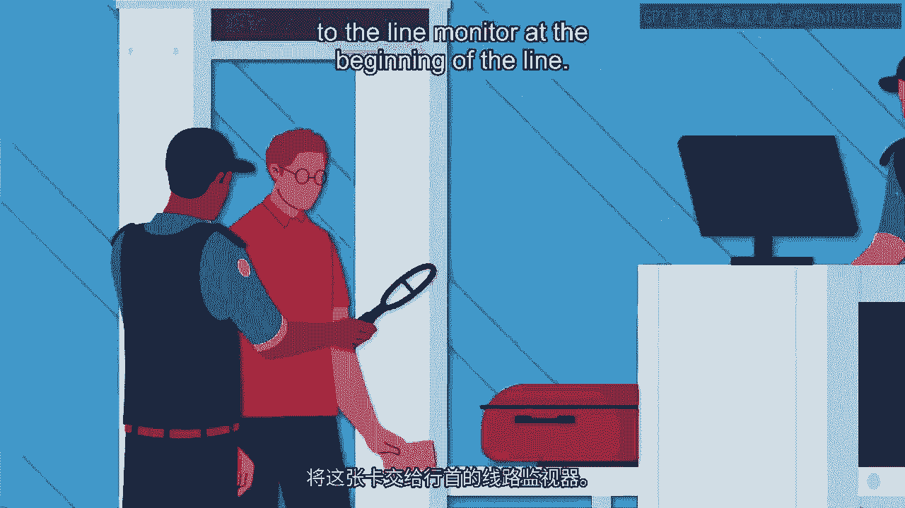

# 沃顿商学院《商务基础》｜Business Foundations Specialization｜（中英字幕） - P135：19_学习回顾和实践问题.zh_en - GPT中英字幕课程资源 - BV1R34y1c74c

 In this module， we talked about little slaw。 We used it to compute flow time given inventory。

 and flow rate。 We computed inventory turns and inventory costs and we looked at the turnover。

 of employees。 In this last video of this module， I want to review the learning objectives。

 the key definitions and the key equations。 I will then give you some opportunities to。

 practice this new knowledge on a set of very specific practice problems。 Let's start with。

 our module review。 So here are the learning objectives I hope I brought across in this， module。

 You should now be comfortable using little slaw to compute one of the three performance， measures I。

 R， and T given the other two。 You should be able to do the inventory turns。

 calculation and the employee turnover calculations。 We have a bunch of new definitions。

 More importantly， we also have a bunch of formulas including little slaw itself。 Alright。

 first practice， problem。 So this is a little slaw question where we have 25 callers coming in per minute。

 And on average， their callers spend one minute on hold and 3。5 minutes talking to a service。

 representative。 Ask yourself how many callers are in the call center either on hold or talking。

 to an agent。 Put me on pause， wrestle with this by yourself， and then we'll do the problem。

 together。 Alright， here we go。 So there are 25 callers arriving per minute on average。

 And so that is our flow rate R。 And the average caller spends one minute on hold and 3。5 minutes。

 talking to the agent。 That's our flow time T。 So I equals R times T。 That's little slaw。

 And so we now have R which is 25 calls per minute。 And we have the flow time of 4。5 minutes。

 If we multiply those two， then the minutes cancel out and it leaves us with an inventory， of 112。

5 callers on average。 Next up we have an inventory turns problem。 You'll see the。

 following financial information here。 And I want you to find out the inventory turns。

 for this company。 Again， put me on pause now。 Alright， here's my shot at doing this。 Drop。

 the revenues。 Focus on the cocks。 The cost of goods sold， right？ The revenues are in。

 the question here to just confuse you。 I'm sorry。 The inventory turns is cocks divided。

 by the inventory。 So that is 1501 dollars per year divided by the inventory which is。

 expressed in dollars。 The inventory reset is 590。 And so this is not getting us 2。54 turns。

 per year。 And the units are 1 over years because it's turns， not years。 It's turns。

 Alright now to get to the inventory cost， we take the annual cost of inventory， the 15。25， percent。

 And that's per year。 Because you would incur if you held the inventory for an， entire year。

 But you're not holding it for an entire year。 You're turning it 2。5 four， times。

 And so divide this by 2。54。 And now you're applying this to the $85 of the item。

 So you multiply this by $85。 And this gives you roughly $5。1 per unit as a per unit inventory， cost。

 Alright， for the third and final practice problem of this module， we have a company with。

 a thousand five hundred employees on average。 And it recruits 500 employees per year。 And。

 I want you to find the employee turnover and the average tenure of the employee。 Clos me， now。

 So what do we do？ There are a thousand five hundred employees on average。 And on。

 average five hundred employees leave the company per year。 So the employee turnover is 500。

 employees per year divided by 1500 employees。 So that is giving us a one over three。 And。

 the units for that are one over years。 Again， it's a turn one over years。 That gives us。

 already a hint on the tenure on when they leave。 That is a tenure on departure。 On average。

 before leaving， they're going to stay for three years。 But that wasn't the question。

 I asked for the average tenure。 For the average tenure， we have to take these three years and。

 divide it by two。 Some will be just starting and some will just be finishing their time。

 with the company。 On average， this is going to be 1。5 years。 Alright， that's all I have。

 to say for now。 If you feel you're done， just get off the video。 If you want to hear another。

 little slow story， hang on for another minute or two。 A couple of years ago， I was at the。

 Philadelphia airport。 Those were the days before we had TSA pre-check-in。 And so all。

 passengers had to go through the same line。 And believe me， it was a long line。 So when。

 one day I arrived at Gate B for my flight to San Francisco， I was greeted by a TSA officer。

 who stood at the end of that long line。 The officer was friendly and professional and handed。

 me a form。 This was a form。 As you can see， the form reads hello。 I'm a representative。

 of the Transportation Security Administration。 TSA is a government agency responsible for。

 making your travel secure。 Please take this time-stand card and help us determine how。

 long it takes you to get through the line。 It was a little time-stand on the back of the， card。 You。

 that would have been me， you have been selected because you're the last person， in the line。

 Thank you。 And then it goes on to say， please give this card again to the。

 line monitor at the beginning of the line。 And that's where we're going to time-stand。

 it again。 And that allows us to compute how long you waited in line。 You get it？ They。

 were measuring how long it takes me to go through security。 In other words， they measured。

 my flow time。 What do you think？ Is this how you would have measured flow time？ Well。

 I didn't like it。 I had put on my professorial voice that I'm sure you now have grown sick。

 and tired of。 And I explained to this officer， "Look， look officer， why don't you simply。

 count the number of passengers that are standing in line that gives you your inventory？ You。

 know the flow rate， which is simply the number of passengers who are boarding the airplane， today。

 And then you use little's law to find the flow time。" Brilliant， isn't it？ Well。

 at least said this is what I thought。 The officer， I'm sure， had his own opinion on， that matter。

 See you in the next module。 [BLANK_AUDIO]。