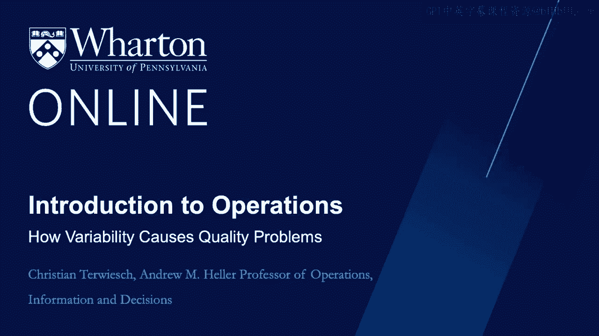
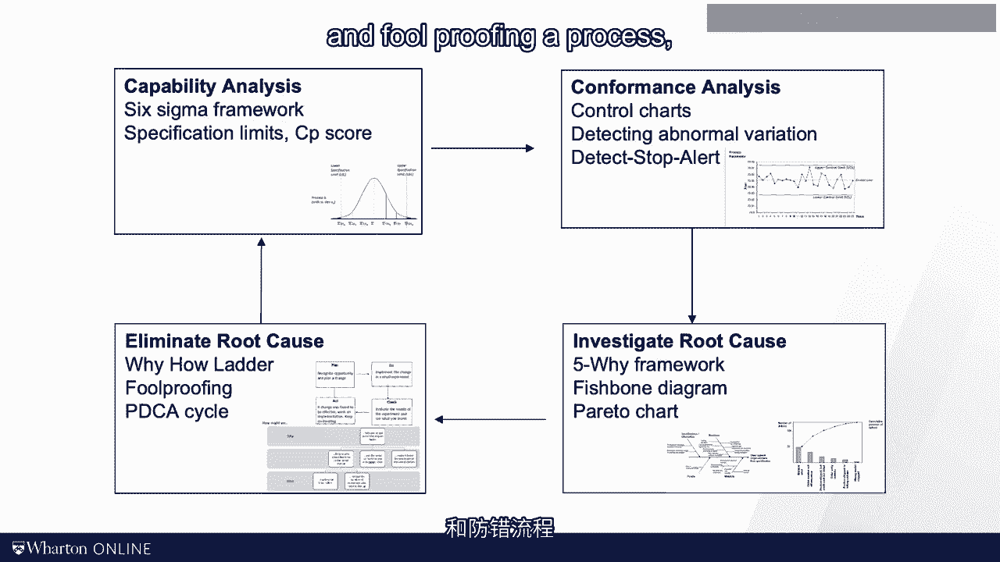

# 沃顿商学院《商务基础》｜Business Foundations Specialization｜（中英字幕） - P136：20_变异如何引起质量问题.zh_en - GPT中英字幕课程资源 - BV1R34y1c74c

 In some of the previous modules， we talked about variation and flow。

 We saw that this variation was a result of variation in demand and variation within our process。

 In this module， we continue our focus on variation。 However。

 we shift from the process flow perspective to looking at the actual work and the quality with which it is performed。

 To motivate some of the challenges associated with consistently obtaining a high quality outcome。

 let us look at the story of my bike crash that I told you at the beginning of this course。

 I want to use this example to illustrate the role of variability in the occurrence of events such as an accident。

 a defect or medical error。 My bike crash happened on a Saturday morning。

 The brake cable turned loose and got stuck between the spinning wheel and the fork。

 which sliced the fork into two pieces， and said， "Me， head first over the handle box。"。

 How could such an accident happen？ And what was the role of variability？ Well。

 like most always in life， lots of factors， lots of variables come together。

 In the case of my bike crash， I was somewhat late for my team ride。

 and so I didn't check my bike as carefully as I usually do。 Also。

 I didn't have the bike with the mechanic for a while， as it was early in the season。

 and the mechanic had a huge backlog。 So it wouldn't have taken much。

 and this whole crash would never have happened。 But it would take much either。

 and the whole crash would have been a lot worse。 I got lucky on multiple fronts。 That morning。

 I had an ambulance picking me up in minutes， my hammer took most of the crash。

 and the pintrauma center had a relatively light morning。 Again， lots of things come together。

 and they could determine the outcome。 Take a look at this figure here。

 Customers and resources influence a number of input variables。

 These are variables describing how the process is operated。

 as well as the variables capturing human or machine behavior。 In the case of my bike ride。

 the input variables are things that I controlled。 Did I leave on time？ Did I check my bike？

 Did I bring the bike to the mechanic as needed？ And most importantly， did I wear a helmet？

 In addition to these input variables， there exists a number of environmental variables that also impact the quality。

 In contrast to input variables， environmental variables are not directly under the control of the operation。

 In the case of my bike ride， the fact that there was an idle ambulance nearby was an environmental variable。

 So was the quality of the road pavement and the weather。

 Input and environmental variables come together， and they could determine the outcome variable of the process。

 In the case of my crash， the outcome that I was discharged from the trauma center the same day。

 was a little permanent damage， other than having no bunch of fake teeth。

 Other outcome measures might be customer satisfaction， net promoter score。

 or a defect on an assembly line。 Again， note that many input and environmental variables together。

 they could determine the outcome。 Since we have variability in input and environmental variables。

 we will have variability in the outcome variables。 Typically， when bad things happen。

 a number of things have to be lined up against us。

 This effect is often called the Swiss cheese model。 I kid you not。

 The Swiss cheese model is really a technical term in the quality management literature。

 The idea here is that a process is like a stack of slices of Swiss cheese。

 Though it is very unlikely that you put 10 random slices of Swiss cheese on top of each other。

 and still be able to see through the stack， it's possible。 Just like Swiss cheese has random holes。

 processes have random variations。 And when there's a bad outcome happening。

 multiple sources of randomness are typically stacked up against you。

 This bad alignment of sources of variation is just like being able to see through the entire stack of Swiss cheese。

 So really bad outcomes don't happen because of one deviation in the process。

 They tend to be the result of many small problems。

 Disaster strike when all the holes in the Swiss cheese line up。 Alright。

 enough of the Swiss cheese stuff。 Let's talk a little bit more about quality。 So now。

 when you're diagnosing a bad outcome， let's call this a defect。

 we need to find the input or the environmental variables that cause the defect。

 Those variables will be called the root cause of the defect。 Now even in the well managed operation。

 input variables and environmental variables will always suffer from some randomness。

 And that will yield variation and the quality of the outcome。

 Not that quality problems are always variability problems。

 Since we never can eliminate all variability in the process。

 we want to build processes in which variability in input and environmental variables do not automatically translate into a bad outcome。

 Such processes are called robust processes。 A process is robust。

 If it still leads to a good outcome， even when there's variability in inputs and environmental variables。

 In the remainder of the module， I want to talk about how to use this framework to improve quality。

 Understanding the source of variation in the process is really the first step。

 So in the next session， I'm going to talk about how to quantify variation in the process。

 In particular， I will introduce the concepts of 6 Sigma and process capability。

 We then move on to discuss how you monitor the current process behavior over time。

 We determine if the variation that you measure in the process at a particular moment in time is just random noise or whether it should be seen as something abnormal。

 We want to find defects as quickly and as early as possible so that we can intervene。

 In that context， we'll talk about control charts， the detect stop alert method and the need for quick feedback。

 Once we know that something bad has happened in our process， we have to take action， right？

 And for this， we have to find the root cause。 To find the root cause。

 we'll discuss the 5Y framework， fishbone diagrams and parabedo charts。 And then finally。

 once you have found your root causes， you have to eliminate them。

 You have to prevent the root causes from needing to bad outcomes again in the future。 For that。

 I'll show you a couple of frameworks including the Y-How letter and food proofing a process， i。e。

 making it more robust。

 Well， that's a roadmap for this quality module。 I have to confess that this narrative is not always the exact way that quality problems are tackled in practice。

 But I wanted to give you a big picture framework on how the set of tools that we will discuss in this module fit together。

 I find all of these tools helpful， otherwise I would not have included them in the scores。

 which ones you will use， the most in your work， will certainly depend on what type of work you're doing。

 In my view， the qualitative non-mathematica tools in many operations courses don't really get the attention that they deserve。

 Framework like the detect stop alert method， root cause problem solving and the Y-How letter。

 none of them might end up on the final exam。 But in my experience。

 all of them have been super useful tools to have in your operations management toolbox。

 I see you in the next video。 [BLANK_AUDIO]。