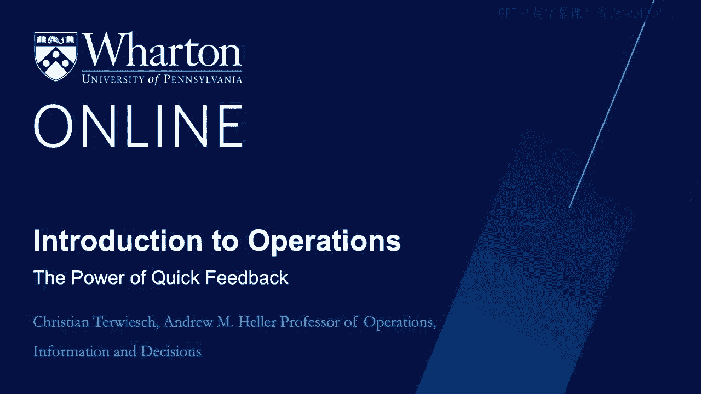
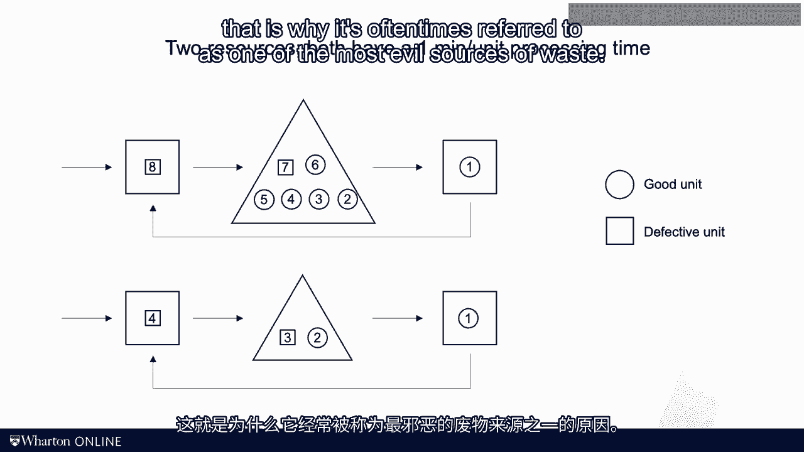
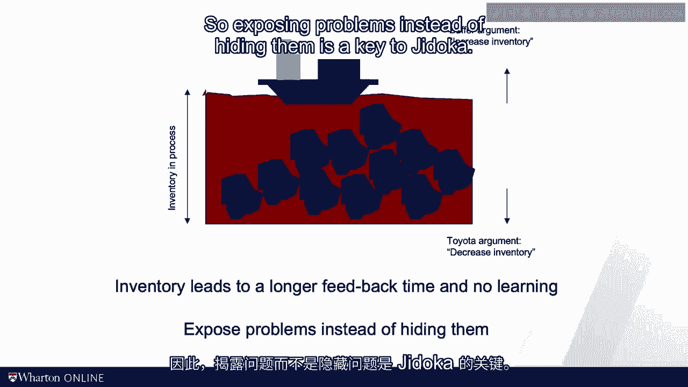
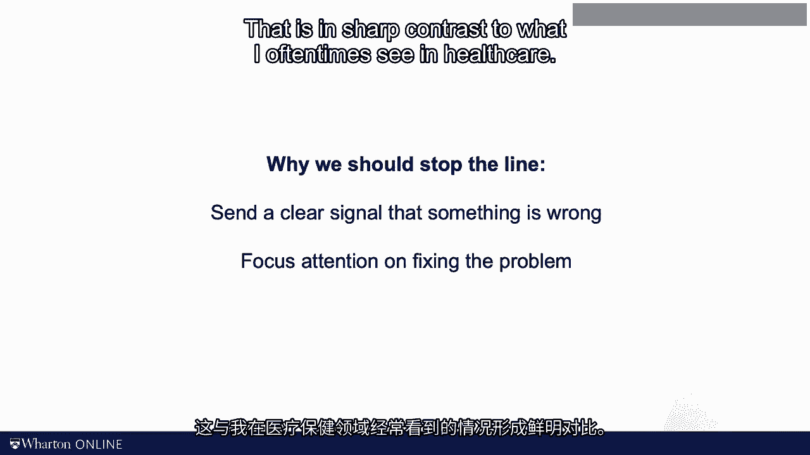

# 沃顿商学院《商务基础》｜Business Foundations Specialization｜（中英字幕） - P138：22_快速反馈的力量.zh_en - GPT中英字幕课程资源 - BV1R34y1c74c

 When I was a student in Business and Computer Science at the University of Manheim， all。

 my grades from my diploma， almost five years of studies， were determined within a couple， of weeks。

 I would take my courses in computer network design， econometrics or production planning。

 but I would basically get no feedback that I completed all courses and it would enroll。

 in the final examination process。 The fact that these were four。

 five hour long exams and followed by oral examinations that。

 were held in public didn't make this any more fun。

 Contrast this with the approach of frequent testing and examination that we now have in。

 most business schools and colleges。 It doesn't matter if you want to improve your tennis serve or your operations management。

 skills。 Learning and improvement is based on feedback and the sooner you can get that feedback。

 the faster world you'll learn。 In today's video I want to talk about quick feedback。 Sakichi Toyota。

 the founder of the Toyota company， had invented the power loom at the， end of the 19th century。

 It was the first automated loom。 Now that the loom was automated， it don't need an operator。

 But then what do you do when things go wrong？ Now in his brilliance Mr。

 Toyota had the idea that the loom itself should detect if it was。

 running out of threat or something else was broken。

 And in that case it should stop and alert an operator to come。 Detect， stop alert。

 Whenever there's a problem in a process it is critical that we quickly recognize there's， a problem。

 We then need to stop what we're doing and we need to alert management or our coworkers。

 to fix the problem and to think about preventing that problem in the future。 Why is it a good idea？

 An analogy from coaching might again be helpful。 If you're coaching somebody how to play tennis。

 how to swim or how to sing， providing feedback， is critical and feedback is the most useful really when it is given quickly。

 So really in the remainder of the video we'll talk about detecting when something abnormal。

 happens after all defects hopefully are something abnormal in the operation。

 And we want to do that detection as quickly as possible。

 Now I'm by no means a school of the Japanese language but the term jidoka is a simple Wikipedia。

 search reveals， stands for automation and some degree of self-consciousness or self-awareness。

 And so the loom in the Toyota plant is realizing by itself that it is broken hence this idea。

 of jidoka， detect， stop alert。 Now when Toyota moved into the assembly line world for the automotive production they basically。

 embodied the principle of jidoka into something that is known as the unknown court。

 The unknown court is a literally a court that runs adjacent to the assembly line， the workers。

 on the line are empowered to pull the court when they detect a problem， when that happens。

 the line is stopped and through the end and board， which is a board that you see here。

 on the picture， the supervisor is alerted of the problem。 Detect， stop alert。

 There's alert then to address some form of problem solving intervention。

 So the end and court supports a quick feedback to the operators and to the foreman。

 A huge hindrance or a huge delay when it comes to feedback has to do with inventory。

 Imagine you have a process flow and you have two consecutive resources with the buffer， in between。

 Safe for sake of argument the processing times at each of the resources are one minute per， unit。

 Now imagine we are making these circuits here one by one but at some point the first。

 resource makes a mistake。 Instead of producing a circuit say it produces a square。

 Ask yourself how long will it take the second resource to find out about the mistake？

 Well if there's a lot of inventory for example if there are six or seven units of inventory。

 in between the stations and the flow is at one minute per flow unit in that case it would。

 take six or seven minutes until the second resource realizes that there's a mistake。

 But what happens in the meantime？ Well chances are that the first resource since it didn't get any feedback keeps on making。

 the same stupid mistake。 Now in contrast imagine we would reduce the inventory level and we would only have one。

 or two units in the buffer between the two resources。

 Again what happens when the first resource makes a mistake？ Now the feedback comes in much quicker。

 We thereby learn faster and avoid that we make further mistakes。

 So you notice that a really inventory is delaying the feedback。 Inventory is covering up defect。

 This is why it's oftentimes referred to as one of the most evil sources of waste。

 And often use visualization of this effect that inventory is covering up defects and problems。

 is in the form of this picture。 A boat on the river。

 Imagine you're operating a canal or lake and in that lake you have a bunch of rocks。

 You're using these boats here with an expensive cargo and so you really want to avoid that。

 the boat hits the rock。 So what do you do？ Well on the one hand it's very tempting to increase the water level。

 That makes it just less likely that the boat ever hits the rock。 What's wrong with that？

 Well now that the water is so high you'll actually don't see the rocks and you'll always。

 have them underneath the surface。 The opposing argument is that rather than increasing the water level you should actually。

 decrease it。 Yes you will face a short term problem in the sense that you might bump into a rock but。

 it's the only way that makes you sure that the rock ultimately is removed。

 And once you've removed the rock what you do instead of comfortably sailing you're then。

 going to reduce the water level again。 You get ready for removing the next rock。

 The same can be said about buffer and inventory。 Rather than buffering every problem， setups。

 transports， pull line balancing or defects， away the idea of the Toyota production system is to reduce your inventory so that those。

 problems get exposed。 Only once the problems are exposed will you see the problem and have the pressure to solve。

 them。 You don't rest on your laurels but you reduce the inventory further。

 And now we talked about command cards in the lean module。

 Command cards come in as a way for management to intentionally to purposefully reduce the。

 inventory level in the process。 Remember from the lean module that you can never have more inventory than you authorize。

 through the command cards。 So exposing problems instead of hiding them is a key to G-doker。

 Another way to provide feedback to those operating the process is to use a statistics。

 This is the idea of statistical process control or control charts。

 What you're doing is you're tracking an outcome variable such as a weight of M&M， such as。

 a curvature of a cucumber or the height of a steersupport column and you're tracking that。

 number over time。 You're mapping that out in a graph that includes two limits known as a control limit。

 So basically the 95th percentile confidence intervals of pass data。

 So when the current observed unit falls out of that interval you know something abnormal。

 most likely something wrong has happened。 Now please don't confuse these control limits which are based on the 95th percentile interval。

 of pass data that you observed in the process。 Please don't confuse those with specification limits that are introduced in the video of。

 Six Sigma。 Specification limits come from the customer。

 Control limits come from pass process performance。

 Again such data provide you feedback to what extent the process is currently deviating from。

 pass performance。 Now from the automated looms of Saki。

 Chitoyoda to monitoring a process continuously using。

 statistics the principle of G-doker is in my view and evergreen。

 And something abnormal happens I want to somehow detect it as quickly as possible and。

 I as a manage of the process want to be alerted sooner rather than later。 Detect stop alert。

 One more thought about the stopping part of Chitoyoda。

 Why do you think it is important to stop the line？

 One reason clearly is that it makes little sense to keep on running a machine that is， broken。

 It's just like trying to run a job through a jam printer。

 But there's another beauty in the stop part of Chitoyoda。

 By stopping normal operation in the case of a plant by stopping the production line we。

 send a very clear signal that something is wrong。 We focus attention on fixing the problem。

 That doesn't sharp contrast to what I oftentimes see in healthcare。

 My former colleague Anita Takah now at Boston University has done a number of studies on。

 what nurses do when they encounter a problem。 What do they do？ They work around the problem。

 They improvise。 They find a solution so that they can go on with their work and help the patient。

 Now notice that such behavior is first and foremost something that we should have brought。

 And maybe this is a good moment for us to say thank you to all the nurses and caregivers。

 for the great work and service they provide to society。

 But even if the nurse files a report about that problem afterwards more often than not。

 nothing happens。 The organization never develops a sense of urgency。

 So all management knows that whenever the next problem pops up the nurse will once again。

 improvise and find a solution。 So stopping the process is a big deal。

 It puts long term quality over short term revenue goals。

 With that being said it is time for me to stop and I see you in the next video。 [BLANK_AUDIO]。

