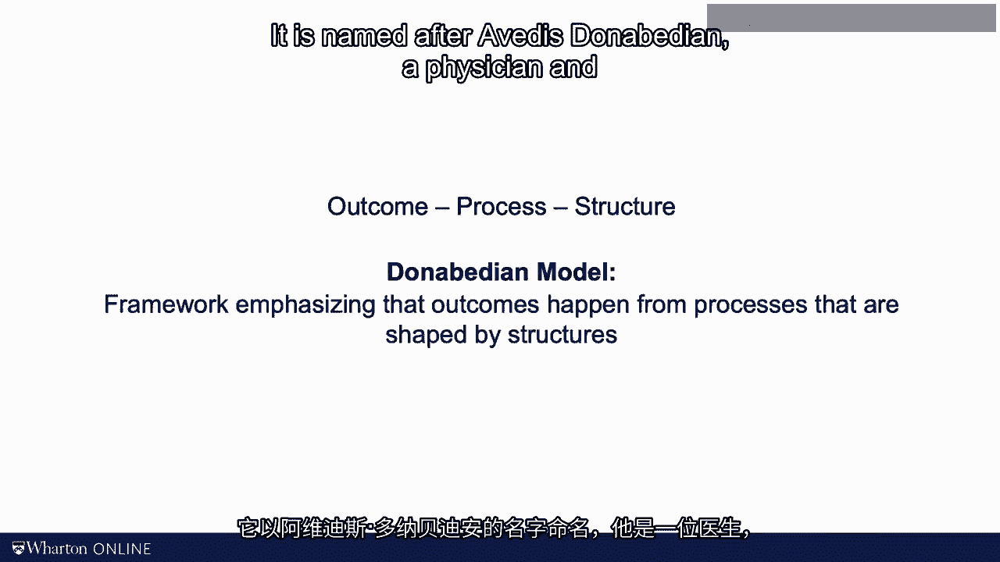

# 沃顿商学院《商务基础》｜Business Foundations Specialization｜（中英字幕） - P140：24_如何使用为什么-如何梯度来定义问题.zh_en - GPT中英字幕课程资源 - BV1R34y1c74c

 In the last video， we talked about the five wire framework。

 We kept on asking why until we got deeper into the problem。 And once we found the root cause。

 we wanted to eliminate it so that future problems don't occur。 You also noticed that by asking why。

 we shifted from looking at the problem as a bad outcome。

 to looking at the problem as a poor process， to ultimately looking at the bigger structure。

 Outcomes are determined by processes and processes are designed in the bigger structure。

 This nesting of structure， process and outcome is pretty common across industries。 In healthcare。

 it is known as a Donabedian model of quality。 It is named after Evades， Donabedian。

 a physician and formerly a professor at the University of Michigan。

 Moving from outcome to process and from process to structure is something I do like about the five wire framework。

 In today's video， I want to talk about some limitations of the tool however。

 I also want to introduce you to a related tool that I found very effective for this type of work。

 So here we go。 Consider the case of the spread of the COVID-19 pandemic and the various measures that a community like our university or a business can take to limit the number of infections。

 As we know from epidemiology， the spread of the virus can be slowed or even entirely stopped by appearing to standards of hygiene and social distancing。

 In the world of operations management we would refer to new infections as bad outcomes and thus defects。

 Every day there are thousands of interactions between members of the community and some of them knowingly or not are infected。

 We have countless opportunities for infection and thus defects。

 Now the vast majority of these interactions cause no infection but take some of them due。

 With that said， again a variation in outcome。 If that variation consisted only of randomness。

 we would refer to this as a common cause variation。 If however。

 as it has been documented in numerous studies， some term missions or submissions occur because of poor adherence to good hygiene standards and social distancing will speak of a signable cause variation。

 Next let's look at the usefulness of the five-wife framework。

 Let's think about a student here at Warden who got infected early on in the pandemic。

 say spring of 2020。 Why did the student get infected？

 Well because he or she interacted with other students not wearing a face mask。

 Well why did the student not wear a face mask？ Well because at least in April of 2020 it was hard to get good face masks here in Philadelphia。

 Well why was it hard to get a face mask in Philadelphia in April 2020？

 Well because the US face a massive shortage of personal protective equipment。

 Why did the US face a massive shortage of personal protective equipment？

 You see where I'm going with this。 We've started out with a very concrete problem of infection control here on campus and before we notice we're not facing a problem that is deeply involved in the world of politics。

 If you're interested in the PPE supply chain topic。

 let me know and I'll share with you an editorial that's the CEO of Penn Medicine。

 a colleague Kevin Wop and I wrote。 I wrote about the limitations of just in time supply chains。

 But to emphasize my point this is not a problem that can be solved next week。

 So let me articulate a different process of defining the problem。

 I would actually allegedly say if I were given one hour to save the planet I would spend 59 minutes defining the problem and one minute to solve it。

 Whether this is true or not can be debated but clearly a good problem definition is critical。

 You begin the process of defining the process by stating the problem。

 I like to state problems setting with the words how might we or in what ways might we。

 Because that language is open ended and really focuses on the problem rather than already baking in a solution。

 For example， we frame a quality project preventing COVID as how might we increase the adherence to facial mask wearing here on campus。

 Write the statement down against that with how might we or in what ways。 Next。

 let's apply the logic of the five y's。 Ask yourself why？ Why would we want to do that？

 What would be good about that？ In our case the answer might be well because it would increase compliance with good hygiene standards。

 Why？ What would be good about that？ Well it would reduce the spread of COVID infections。

 And again ask yourself why？ What would be good about that？

 We might say well that would lead to a healthy and safer campus environment。

 Now nothing wrong with that but do you really want to have your team work on the problem how might we create a healthy and safe campus environment？

 Again I think you get my point。 As we keep on asking why we're at risk of making the problem too broad。

 So how about doing the opposite rather than asking why let's simply ask how。

 One way in which we might be able to address a problem how might we increase the adherence to facial mask wearing on campus is by reminding people to wear a mask。

 Another approach would be to make masks more widely available。

 So we might now think of the problem how might we increase the availability of face masks here on campus。

 But we could focus our problem even further。 For example we might ask how might we conveniently locate face masks。

 At some point however you really run the risk that you make the problem too specific to narrow。

 That creates such a narrow problem definition that you're really ruling out many effective solution approaches that might prevent the spread of the virus with less effort and at lower cost。

 So my point is this。 Quality problems can be stated at various levels of specificity。

 Write them down from the specific to the general。 The Wai-Hau letter is really a very helpful tool that helps you in this exercise。

 Eventually I want you to pick a problem formulation that you feel comfortable with。

 And in case of doubt I suggest you air on the side of making the problem a little broader than you first envisioned it。

 Let me illustrate the power of the Wai-Hau letter as an approach towards defining problems using an example of the rental car company Hertz。

 Hertz a number of years ago oftentimes faces a problem of long lines and has long grading times at the airport rental car stations which is arguably a really bad quality outcome。

 Now a natural way to frame the problem that is to how might we shorten the time in line。

 When you do this you really take the current process as a given and most likely you end up with improvements such as better staffing or faster computers。

 Now don't get me wrong these are exactly the type of solutions we talked about in much of the earlier parts of this course。

 So I really like that。 But how about this？ Let's ask why。

 Why would we want to shorten the line or what would be good about a shorter line by doing so we broaden the problem。

 So why shorten the line？ Well we really want customers to get out on their way to the destinations faster。

 Isn't that interesting？ Now we could tackle the problem how might we get our customer to their way to the destination faster。

 That is a related but it's a different problem。 We just broaden the problem。

 This allows us really to think outside the box。 Maybe we don't need a line at all。

 How about customers go right to the car？ How about the car waits for them at the gate？

 Ultimately the idea of her school was that frequent flyers， frequent customers offer us。

 which is go right to their cars without standing in line at all。

 That however was not a solution that you would have come up with。

 If you only work on the initial problem how might we have shortened the line。

 Alright I think I digress a little bit here。 We're in the quality module and your professor is talking about waiting lines。

 So back to quality。 My idea behind the Y-Haul letter is that you now have a framework that can help you define any type of problem。

 And of course it includes quality problems。 But really quality problems are somewhat special as you relate to deviations from standards and specifications。

 So are there any specific tools， any standard tricks that we can play when dealing with quality problems？

 Thank you for asking。 If you want to avoid bad outcomes you have to reduce variation in the process and we have to avoid that these variations lead to bad outcome。

 That was really the whole idea behind this was cheese model。

 So how can we avoid such deviations and how can we avoid such deviations that still exists don't lead to that bad outcome。

 For that we have to build processes that are fail safe。

 Expert oftentimes talk about foolproofing a process。

 The term might be perceived as somewhat disrespectful and offensive so jumping into the Japanese language once again might be helpful。

 Let me define Polka Yoga as preventing mistakes from happening。

 Now strictly speaking with Polka Yoga mistakes should not happen inadvertently。

 Grows negligence or really evil intent by the operator could still trigger a bad outcome。

 Baka Yoga in contrast means literally foolproofing an operation。

 And Baka Yoga can thus be thought of as really an extreme form of Polka Yoga。

 Now the effort required to make a mistake with Baka Yoga would go up dramatically。

 You really have to try hard to make a defect。 Now these two terms capture the idea of a robust process that I mentioned in the first video of this module。

 A process is robust when random variations in input and environmental variables。

 which includes accidental mistakes are avoided。 And it's really robust when not even a fool can trigger a bad outcome。

 As a difference between these definitions of Baka Yoga and Polka Yoga suggest。

 they are really multiple levels of error prevention。 Take the example of Baka safety。

 a topic that you know by now is really close to my heart。

 The most basic protection comes in the form of traffic law。

 Traffic law in Pennsylvania states that drivers have to pass me a cyclist with a four feet distance。

 Now most drivers don't know that law but it's good to know that the law is on my side when I get hit by the truck。

 The next level more fancy is to put a sign near the road。 I hate those signs。

 They say share the road or watch for cyclists。 The reason why I share those signs is they have little impact on the drivers。

 They have you sharing the road is simply different from mine。

 But at least it's better than doing nothing。 The next level more fancy would be not just to have a sign but clear markings on the road。

 In Philly we fortunately have a number of bike lanes。

 They work pretty well except for more recently they have really turned the bike lanes into a over drop of end pickup lines。

 The fourth level of making a process more robust is often referred to as a multi-sensory。

 Now an undesirable action is really hard on the operator。 Look at these little barriers here。

 If that SUV driver wants to kill me he or she can still do so but now they really need to make an effort。

 Drivers who accidentally drift over into the bike lane they get a very strong feedback in the form of their car starting to rattle。

 The ultimate foolproof way to keep our cyclists safe is to give us our own road network。

 You see this really a lot in Holland and throughout Europe。

 And to be fair Philadelphia really has a great number of such bike paths。

 Now even our stupid and evil driver will not be able to hit the cyclists。

 The five wise and the why how letter are great tools that can help you think about a problem at different levels of analysis。

 These two some provide you with answers but they do steer you towards asking the right questions。

 When it comes to quality problems most of the action is making workers adherent to some standards and some specifications。

 The five levels of prevention and foolproofing are not giving you an easy answer but they force you to think about alternative ways to look for solutions。

 So I hope you found them useful as well。 That's all I got for today。 I'll see you next time。

 [ Silence ]。