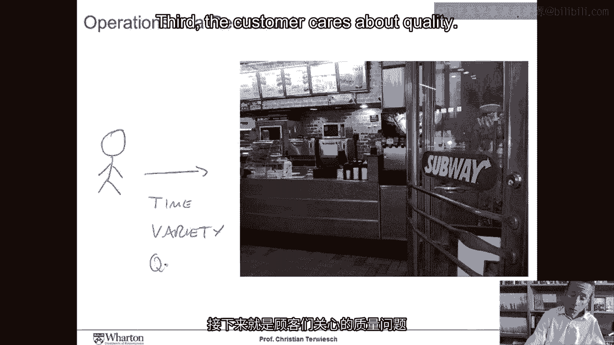
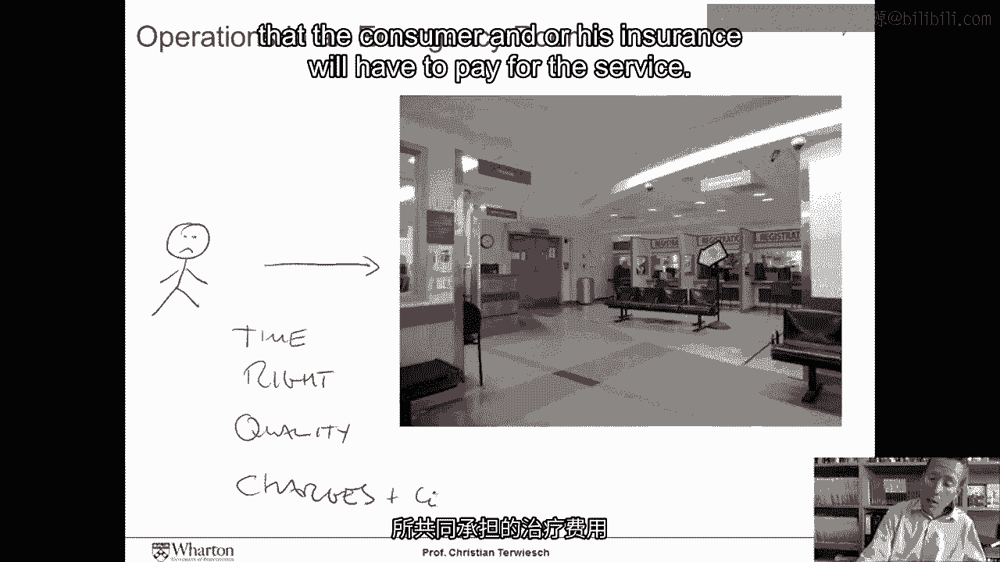
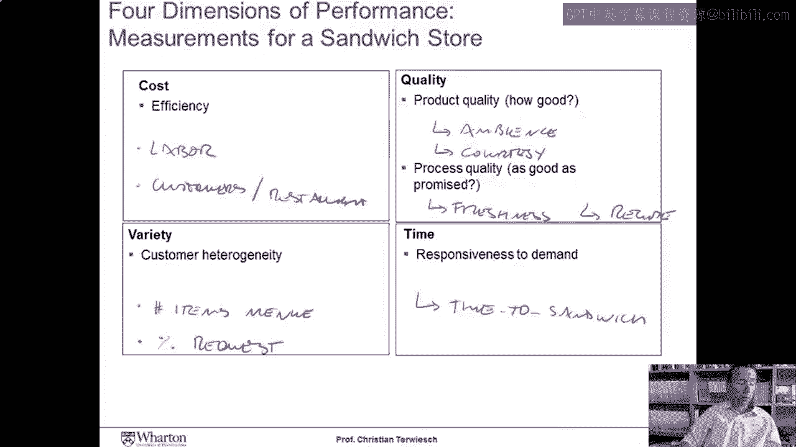

# 沃顿商学院《商务基础》｜Business Foundations Specialization｜（中英字幕） - P143：0_框架简介7 55.zh_en - GPT中英字幕课程资源 - BV1R34y1c74c

 So， welcome to my Coursera course in Introduction to Operations Management。

 This is a six week long course， and today is the first session。

 What I thought we would do in this first session is instead of me bombarding you with the logistics for this course。

 including the homework assignments， the format of the course， the exam， the course book。

 and all these other good things， we just get started。

 I promise I'll make up for the logistics later on。 So， what is Operations Management about？

 The purpose of this first session is to think a little bit about what Operations Management does。

 and how it relates to the business strategy of a firm。

 This will also help us think about what type of goals management might set for in operation。

 and that in turn guides what performance measures that we're going to track。 So， let's get started。

 Let's start with two very specific examples。 It's soon lunchtime。

 and so consumers are thinking about where should we go for lunch today。 So。

 we have our consumer here who is heading to a restaurant， and now ask yourself。

 what does the consumer want out of the operations of this restaurant？ Well， first of all。

 they want to get this language quickly。 Lunch break is short， people are hungry。

 and so the time that they have to wait in order to get this sandwich。

 isn't pretty important variable for the consumer。 Second。

 consumers differ in what type of sandwiches that they like， and so the ability of the restaurant。

 to really make sandwiches that are appealing to customers is important。

 They have to be able to provide a variety of sandwiches， which means either having a big menu。

 or being able to make these sandwiches to very specific customer instructions。 Third。

 the customer cares about quality。

 Now quality， that could be the ambiance of the restaurant， the friendliness of the staff。

 It could be the hygiene of the place， it could be making sure that the cheese weighs exactly what it says on the recipe。

 Quality will have a number of dimensions that we will explore later on in this course。

 And then finally， of course， price matters， and so the consumer doesn't want to spend too much money for his lunch。

 Now， let's go for the restaurant here， and let's look at the operations of a hospital。 Same thing。

 we have a consumer arriving to， for example， the emergency room of a hospital。

 so we have our unhappy consumer here， who is coming to the hospital， and we're now asking ourselves。

 well， what does the consumer want the operations of this hospital to do？ Again， time is critical。

 Wait times in emergency rooms in this country can often take as long as five hours。

 and so the person wants to be seen quickly。 They want to make sure that they get the care that is right for them。

 instead of the care that is right for the person in the bed next to them。

 They want to receive this care in a high quality manner。

 making sure that it is in accordance to the latest evidence-based medicine。

 that the doctors and nurses have washed their hands， that this place is clean and everything else。

 And then finally， they are the chargers and the co-pay that the consumer and/or his insurance will have to pay for the service。

 So sandwich store or emergency room， we see that an operation has to be able to perform well along four dimensions。

 The first one is a cost dimension。 That's probably what most of us associate with operations management is just providing a high efficient operation。

 The second dimension is variety。 Now to be fair， consumers don't care about variety per se。

 they just want something that they like。 So really variety measures the flexibility of an operation to provide goods and services to a heterogeneous customer base。

 The third dimension is quality。 The quality dimension is broken up into two sub dimensions。

 The first one is called performance quality， the second one is called conformance quality。

 Performance quality measures how good of a product or service we provide。

 Most of us would agree that the BMW is a high-performing car。 Not because how it is built。

 but primarily because how it is being designed。 The second dimension then is conformance quality。

 It really captures to what extent we are able to deliver on the promise that we have made to the customer。

 And then finally there is time limits。 Our ability to provide a quick response to demand。

 Those four dimensions are important for two reasons。

 First of all they are the goals that we strive for in an operation and so they will guide what type of performance measures we track。

 And then they are really also at the heart of designing the business strategy。

 These four dimensions give us opportunity to differentiate our operations from other。

 thereby potentially providing us with a competitive advantage。

 Now imagine you get hired as a consultant to Subway and you would be asked to come up with a performance measurement system that tracks these four dimensions that we just discussed。

 What would you measure？ Well on the cost side you would start potentially looking at the labor productivity。

 You could imagine measures such as the sandwiches per employee， the customer served per employee。

 or the minute it takes you to make a sandwich or other measures like that。

 You could also look at the customer's per restaurant to measure to what extent you are going to efficiently use the real estate investment that you have by renting the restaurant。

 Now how about the variety？ On the variety side， again our idea of varieties that we will look at。

 are we able to meet the heterogeneous customer preferences？

 Well a simple measure for that would simply be looking at the number of items that we have on the menu。

 Beyond that if we are making the sandwiches to order。

 we could imagine looking at the percentage of customer requests that we are able to fill。

 So customers come in， they want extra ladders， extra tomato。

 and the percentage of customer requests that we meet would be another good measure of variety。

 How about quality？ Remember on the quality side we had the two dimensions。

 conformance quality and performance quality。 So performance quality we would probably have to do some customer research。

 some survey looking for things about to what extent they like the ambiance of the restaurant。

 to what extent they found the courtesy of the staff in line with their expectations or other things。

 On the conformance side we would probably look， are we really delivering what we promised？

 And so that means we could look at the freshness of the ingredients of the sandwiches。

 We could in the extreme case we could go even as far as putting these sandwiches on the scale and just measure whether we could the exact appropriate amount of grams of cheese on the Subway ham and cheese sandwich。

 And so that would give us a good measure of conformance quality。

 And then timeliness is relatively easy to measure。

 customers care about the time that it will take them to get to the sandwich。

 And so we could go and measure how many minutes a customer has to wait between entering the store and leaving the store with the sandwich in their hand。

 So finally let's talk about strategy。 Strategy guru Michael Porter suggested there are two ways in which an organization can get a competitive advantage。

 Either to cost leadership or through differentiation。 The dimensions that we discussed， variety。

 quality and timeliness are three ways in which your operation can differentiate itself from others。

 They thereby， by coming up with a great operation。

 we're really creating it from competitive advantage。 [BLANK_AUDIO]。

