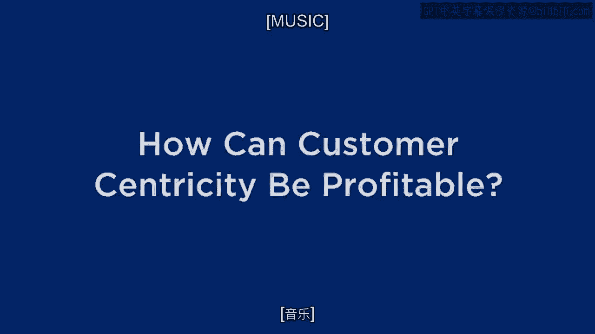
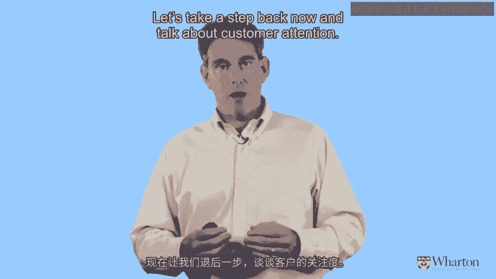

# 沃顿商学院《商务基础》｜Business Foundations Specialization｜（中英字幕） - P146：3_客户本位如何获利19 03.zh_en - GPT中英字幕课程资源 - BV1R34y1c74c

 Well， it's good to see everybody once again。

 Let me remind you of where we've been and then talk about where we're going for the。

 remainder of my portion of the course。 So here's where we've been。

 We've been talking about customer centricity。 We've been motivating it by the fact that the traditional product centric model。

 while， it's still common， still the way the most businesses operate， there are some cracks in。

 product centricity。 Issues like commoditization， well-informed customers， globalization and so on。

 that just， takes some of the edge off of product centricity。 And so customer centricity is emerging。

 It seems to be a promising alternative， but it's not well understood。 So people。

 companies are using a lot of different words for it， whether it's customer intimacy。

 whether it's customer centricity， customer focus， people are using a lot of different。

 words and people are implying a lot of different concepts。 For me。

 I've offered a very clear definition of what customer centricity means and why。

 companies would want to consider it。 And for me， the key to customer centricity is the celebration of customer heterogeneity。

 an acknowledgment that customers are different from each other and instead of viewing that。

 as a nuisance， oh， we have to treat them differently， it's an opportunity。

 It's a terrific opportunity to say， hey， some customers are more valuable than others。

 Let's really focus on them to create and extract some of that value。

 Let's find more customers like them。 And let's find ways to continue to have relationships with the other customers。

 but not necessarily， on the same terms as those really focal customers。

 And at the heart of that argument was the concept of customer lifetime value， the idea。

 that we're going to judge the goodness of a customer， not so much on the amount of money。

 or value that we've already extracted from that customer， but from the amount of money。

 or value that we think we can extract and will extract in the future。

 So it's this future looking idea。 We're going to judge customers based on what we think they will be worth to us。

 And that's just really critical and we're going to continue to really focus on how。

 that forward looking， seal the orientation is going to affect and in some cases radically。

 change the kinds of decisions we make about how we run our business。

 And I mentioned very briefly some of the tactics that we tend to focus on are things。

 like customer acquisition， customer retention， customer development。

 But I haven't given a lot of specifics yet about how we manage those tactics， how we。

 gauge our success at those tactics and how we balance them off against each other in。

 order to really understand our customers and again create and extract all that value。

 That's what we're going to be doing now。 So this module is all about show me the money。

 This module is all about how to really， really understand acquisition， retention and development。

 in a very new way because as I've said before those tactics by themselves aren't new。

 Companies have been acquiring customers。 They've been retaining and increasing the value of customers for a long。

 long time。 But we want to elevate the importance of those ideas。

 We want to develop metrics and managerial guidelines to really understand those tactics。

 better and drive the business using them。 Not just using them at the margin to squeeze a few more dollars。

 So we're really going to dive deep into acquisition， retention and development。

 That's what this module is all about。 Ideally a company aspires to be world class on all three of those dimensions。

 acquisition， retention and development。 But that's tricky。

 In fact it's tough enough to master any one of them， much less two or even three of them。

 So what we're going to do is we're going to examine them one at a time but we do want。

 to understand the interplay among them。 We do want to understand some of the trade-offs that companies face。

 In fact I want to begin by asking you about one of those trade-offs。

 So let's imagine that you're running a company， many of you are or you're involved with a， business。

 And you're out there， you have your marketing budget and you're spending it appropriately。

 on acquisition， retention， development。 But then the CEO comes down and says， "You know what。

 I'm going to give you an extra， dollar or $100，000。 You get the idea。

 I'm going to give you a little bit of extra money。"。

 Which one of those three tactics are you going to spend it on？ No， there's all three are important。

 But at the margin， which one do you think is most deserving of that incremental dollar。

 that you might have？ In fact， I really want you to think about this。

 I want to make this a little quiz question。 So in fact I'll pause for a second and I want you to vote。

 Okay？ So I'm counting。 So I want you to raise your hand。

 So which one is the most important tactic at the margin？

 So how many of you would say it's customer acquisition？ Okay？ How many say customer retention？

 Raise them high so I can see。 Okay。 And how many say customer development？ Okay， got it。 All right。

 So I've tallied up your votes here and it looks like approximately 5% of you voted for。

 customer acquisition。 And of the rest of you， the remaining 95%。

 it looks like it's a pretty even split。 So 47。5% for customer retention， 47。5% for development。

 At least when I ask this question to students， to managers， to senior executives， different。

 companies all around the world， that's the basic split that I get。

 Most of the attention seems to be on retention and development and just a few odd balls who。

 are saying we should spend that extra dollar on acquisition。

 So I'm going to come up with a crisp answer to that question。 Okay？ I don't like it depends。

 I want to say at the margin， which one of those would be most important for our ongoing， activities？

 So here's what I want to do。 Let's dive into each one of these three tactics and understand it really carefully。

 but understand， it in a new way。 Because again， the basic words acquisition retention development aren't new。

 but how do we see them， differently when we look at them through the lens of customer centricity？

 Or more specifically， how do we see them differently in a world where we're celebrating。

 heterogeneity？ Okay？ So that's the theme that's been running through my portion of the course so far and will continue。

 Because now we're going to see the big payoff from that celebration of heterogeneity。

 So here's what I'm going to do。 For each one of those tactics。

 I'm going to lead by asking the same question and then， we're going to dive deeper from there。

 So here's the question。 Let's start with customer acquisition。

 What metric do firms use to gauge and guide their acquisition activities？

 Because there's a lot of different metrics out there that firms use to evaluate how well。

 they're doing different parts of their operations。

 But when we look at customer acquisition in particular， what's the metric that tells us。

 how well we're doing and gives us a forward-looking indication of how well we think we'll be doing？

 Now for some of you， you might need to even have a readily available metric for it。

 But for many of you， especially those of you， or firms that work in the digital world， very。

 often I ask this question and I'll come up with the answer to it right away。

 And it comes in the form of three letters。 CPA。 CPA。

 And I'm sure many of you know what I'm talking about there。 Cost per acquisition。

 Many firms gauge and guide their acquisition activities based on CPA， cost per acquisition。

 One of the reasons why they do it is because it's just so visible， especially in this。

 day and age where it's much easier to track not only the behavior of customers after we。

 acquire them， but the cost of acquiring them in the first place。

 So so many companies out there are constantly looking at their CPA and trying to think about。

 ways to lower it。 How can we get that CPA down？ How can we bring in more customers for the same number of dollars？

 And again， many of you who are out there working， especially focusing on marketing or customer。

 acquisition activities in particular know what I'm talking about。

 But here's the important point that I want to make。

 Focusing your business using CPA to gauge and guide your acquisition activities is a big。

 big mistake。 I'm not just saying that it's an imperfect measure。

 I'm saying that it's actually a grossly misleading measure if you're using that to guide your。

 acquisition activities。 So that's a very radical statement and I want to explain myself how I come up with that logic。

 and what you should do about it。 So let me step back for a second and focus on issues that I've raised previously。

 which， is the idea of thinking about our customers as assets， right？ Our customers are assets。

 In many cases， that's the most important asset that we have。 Now。

 I'm not necessarily saying that we're going to put customers formally on the balance， sheets。

 although there's a lot of discussion about doing just that， taking customer equity。

 and really using it as a formal measure。 I don't necessarily care about the accounting。

 but we all agree that customers are assets。 So to the extent that customers are assets。

 what do you think about using a CPA-type metric， when it comes to acquiring assets？

 Think about other assets that we acquire。 How about employees？ How about technology？

 How about lawyers？ Think about those kinds of assets that firms depend upon。

 You'd never hear a firm say something like， "Well， she was a lousy lawyer， but she was， cheap。"。

 Okay？ When it comes to lawyers， when it comes to employees， what are firms looking for？

 They're looking for the best， not necessarily the cheapest。

 So why is it that we use this cost-oriented mentality when it comes to our customers？

 So my question is， instead of focusing on CPA， what is it that firms should be focusing， on instead？

 Think about that for a second。 Instead of CPA， what should it be？ Say it all together with me。

 Exactly。 VPA， value per acquisition。 We should be focusing on the upside that the customers can provide to us。

 By the way， if you just think about the notion of value per acquisition， what does that sound。

 a lot like？ An idea that we've already discussed。 Of course， that's CLV， customer lifetime value。

 So let's think about the upside potential that customers have， and then use that number。

 to drive the CPA。 Okay？ So we're going to kind of flip the equations around。

 One way of thinking about customer lifetime value， and certainly this is the way a lot。

 of textbooks present it， and the way a lot of companies think about it， is that they。

 say CLV represents the upper bound。 I'm willing to spend up to that amount to acquire a customer。

 Makes sense， right？ I certainly don't want to spend more than that because I'm losing money on the customer。

 But the CLV is basically a ceiling。 I'm willing to spend up to that amount。

 And that's what I want managers and companies to think about。 Here's the ceiling。

 This is what I think the customer will be worth。 How much of that money am I willing to spend to acquire that customer？

 And then how much of that money do I want to keep and give to my shareholders as current。

 and future profits？ So when it comes to thinking about customer acquisition。

 I don't want to focus on floors。 I don't want to focus on how low can we bring it。

 I want to focus on ceilings instead。 Okay？ I want to understand how high we can go。

 And I'm not saying that we should necessarily spend every penny up to CLV， but we're not aspiring。

 to spend more money。 That's ridiculous。 What the point is that if we focus on the ceiling instead of the floor。

 we'll be willing to spend， a little bit more money at the margin and more importantly。

 get better customers in the， process。 So let me give you a very specific example。 So as I said。

 in the digital marketing world， the CPA is so tangible。 It's so observable to us。

 Any company that's working with Google， for instance， is thinking very carefully about。

 what they're spending for every keyword on Google sponsored search。 And they're wondering。

 "Should we be spending $4。50 to get someone through this keyword， or， should we be spending $4。49？"。

 So you'll have all these arguments about pennies， about CPA。

 And so there's a couple of companies that are getting smart about it and saying， "You， know what？

 Instead of focusing exclusively on what we're paying to get those customers， let's look。

 at what we're getting out of those customers after we acquire them。"， In other words。

 let's look at the CLV of customers who we acquire through different kinds of marketing， activities。

 And so over here you can see a screenshot of just one article。 It's just， I think。

 a very nice typical example of an article and you can see just from the， title alone。

 is let's understand the CLV， the lifetime value of the customers whom we've。

 acquired through Google sponsored search。 And let's understand how their CLV is different than customers whom we acquire through other。

 channels。 And so， well， given you all the details of the study， here's the highlight。

 And it tells us that as we sit back and we look at the data that we've collected on customers。

 acquired through different kinds of marketing activities， those who were acquired initially。

 through Google sponsored search are worth， on average， CLV of about $1，000， whereas customers。

 acquired through other channels are worth about $200 less。

 So here we are arguing about pennies or dimes， small amounts of money about how much we should。

 be spending to acquire customers。 But we find out that there are these huge， dramatic differences。

 hundreds of dollars difference， if we use one kind of tactic instead of another。 And CLV is the key。

 CLV shows us that there's so much more value lying in our customers that we don't necessarily。

 appreciate。 And when we have this cost orientation， not only we don't appreciate it。

 but we'll never， realize it。 We'll never actually be able to put it in our pocket。

 So I really like this example。 And I wish that this example were more rural than exception。

 And we said a lot of companies would kind of step back and do this kind of analysis for。

 their existing customers。 And it's not only a matter of doing it for， say。

 Google sponsored search versus everything， else， you can do it any which way。 You can say。

 let's look at customers who we acquired at one time period versus another。

 Let's look at customers who we acquired through one geographic area versus another。

 Let's look at customers whose first product purchased from us was one kind of product。

 versus another。 Let's look at customers who we acquired through one marketing campaign or another。

 So we constantly want to be tagging our customers， understanding different characteristics of。

 how and when and where we acquired them。 And then with the little patience。

 let's match that information up with what these customers， proved to be worth。

 And so we're going to run some CLV models。 We need to wait a little bit of time。

 We need to collect more data on them to understand which customers or which groups of customers。

 are the most valuable ones。 But by doing so， we can really understand those sources of value and get just some great。

 guidance about where we should be spending our next marketing dollars。

 So let me summarize this thinking about customer acquisition。 Most and foremost。

 you want to avoid having a CPA mentality。 And I mean that not only kind of in a jokey way。

 because of course I'm also referring， to CPAs being certified public accountants。

 We don't want to think about being counting。 We don't want to think about pennies when it comes to acquiring customers。

 We want to focus on ceilings instead of floors when it comes to how we're going to spend。

 to acquire customers。 And the celebration of how to rejuvenate is that by understanding the CLV differences。

 across customers， that's going to give us some direct ideas about where we should be。

 spending the money。 And when we understand where the more valuable customers tend to come from。

 let's invest， much more heavily in those search words and those channels and those marketing campaigns。

 There's no guarantee that every customer that we get through those activities are going， to be good。

 In fact， that's not true at all。 We're always going to get a mix of customers。

 The metaphor that I like to use is that we're always fishing for our customers。

 This is going to give us some idea of where we should be throwing the lines。

 And when we throw the lines or when we throw out the nets， we're going to always pull in。

 a heterogeneous mix of customers。 You know what？ Most of them are going to be so-so customers。

 But if we can get really smart about where we throw the nets， we can tend to pull in。

 just a slightly better mix of customers。 And if we do that more often。

 if we do that in a smarter way， those differences can really。

 magnify over time and show us that there's actually tremendous value unlocked by just。

 being a better fisherman when it comes to customer acquisition。 So a couple of other points here。

 Number one， companies need to be a little bit more patient when they're evaluating their。

 customer acquisition activities。 Too often companies are looking for an immediate payoff。 Okay？

 So we spent this money。 What did we get for it？ My point is， if you're forward looking。

 if you're taking the long view as implied by customer， centricity。

 then let's wait a little bit of time until we can get a pretty good sense。

 of what the value is and what the CLV will be。 And that's going to give us not only better guidance。

 but better idea of where to set， that ceiling。 The main point about customer acquisition。

 which I've been implying， but let me say it， very plainly。

 is that firms are under spending on acquisition by focusing so much of their。

 efforts and asking all the time， how little can we spend？ They end up spending very little。

 It becomes a self-fulfilling prophecy。 And by focusing on tactics and methods to just bring in as many customers as possible。

 for the least amount of dollars， they also tend to underachieve。 And that's a problem。

 So by being smart， by being careful， by tagging and tracking on customers， by focusing on。

 CLV instead of CPA， we can get a lot more money。 We might spend more on acquisition。

 but the returns to scale on that are going to be huge。 So that's my piece on customer acquisition。

 Let's take a step back now and talk about customer attention。

 [MUSIC]。

