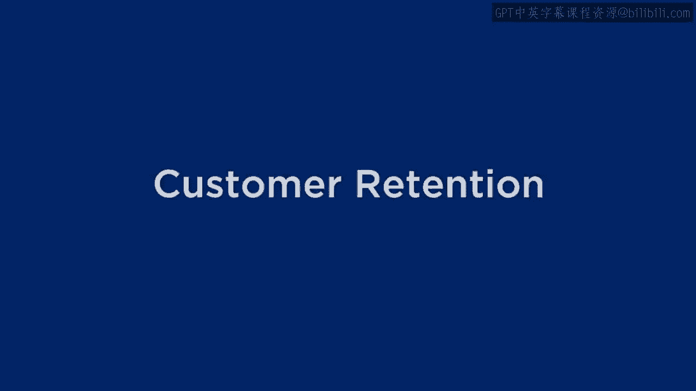
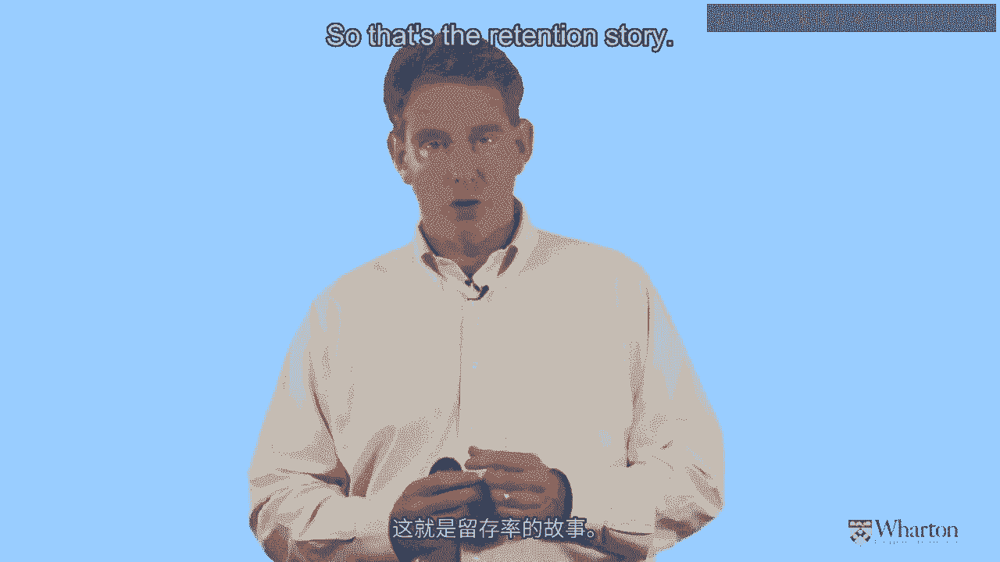
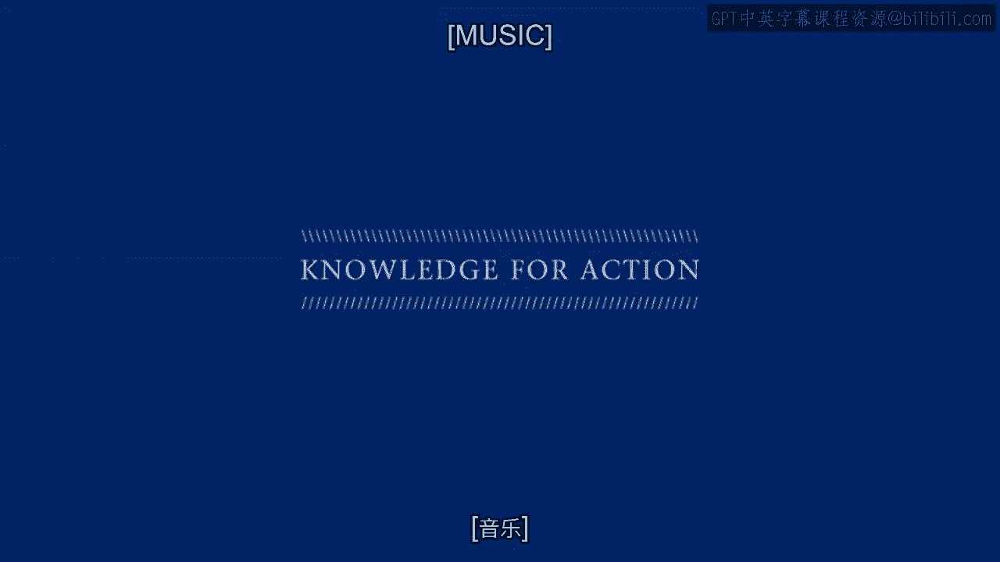

# 沃顿商学院《商务基础》｜Business Foundations Specialization｜（中英字幕） - P147：4_客户保留18 24.zh_en - GPT中英字幕课程资源 - BV1R34y1c74c

 [ Music ]。

 All right， we're back and now we're going to talk about customer retention。

 And I hope you know where I'm going with this。 There's really two themes that we're going to see through all of these discussions。

 I'm going to begin by asking the same exact question that I asked about customer acquisition。

 which is what metric do we use to gauge and guide our retention activities？ And so once again。

 there's a very common metric out there。 In fact， it goes by several different names。

 Some companies call it a retention rate， some call it a churn rate or a attrition rate。

 Let's just explain what it is real quickly， although you probably get the idea if you're not familiar with it already。

 We look at all the customers we had say at the beginning of the period。

 We ask ourselves how many of them stayed with us。 So what percent of that original chunk of customers stayed with us？

 That's the retention rate。 Of course， we can look at what percent of customers left。

 And that goes by different names， as I said， a churn rate or a nutrition rate。 So either way。

 whether you look at the glasses half full or half empty。

 it's that kind of metric that firms use to say， how good a job are we doing at keeping our existing customers。

 So again， very common metric。 And here's my view on it。 Unlike CPA， cost per acquisition。

 which I view as a very bad metric， I see the retention rate or the churn rate as a pretty good metric。

 but you have to be careful about how you look at it， how you use it。

 and how you make decisions based on it。 So I'm going to start with a real world example。

 One of the things that I like to do is I like to look at the information that public companies put out there。

 about their retention rates or their attrition rates。

 What did they say about how many of their customers stick around？

 And what implications does it have？ How do they manage around the attrition rate？

 Instead of viewing it as just a nice to know number。

 Let's understand how we can actually use that information to go all the way to even coming up with the financial value。

 of the entire customer base。 So here's the example that I'd like to work with。

 The example comes from Vodafone， a big cell phone operator。 I'm sure many of you are familiar with。

 And they actually put statements out there to their investors to say， "Here's our attrition rate。

 and here's how it varies over time。"， And so you can see the graphic right here。

 And from a very kind of quick look， it appears that there， a attrition rate on an annualized basis。

 as we look at it from one quarter to another， is around 20%。 A little bit lower， but around 20%。

 So let's think for a second about what that means。

 So if we're losing around 20% of our customers at any given time。

 how long do we expect those customers to stay with us？ Pretty simple math question。

 Let me make it even simpler。 Suppose the attrition rate were 50%。

 because suppose we're losing half our customers every period， God forbid。

 then how long is the typical customer staying with us？ If our attrition rate is 50%。

 then a typical lifetime would be around two years。 So if the attrition rate is around 20%。

 the typical lifetime is around five years。 If it's a little bit less than 20%。

 it'll be a little bit greater than five years。 So if we want to come up with kind of a quick and dirty evaluation。

 not just for a given customer， but for the entire customer base。

 if our attrition rate's a little under 20%， that means a typical customer is with us for a little over five years。

 we can multiply that by the amount of revenue per customer。

 multiply that by the size of the customer base， and boom， that's our customer equity。

 That's the value of the firm， at least again， as a first pass approximation。

 And I don't want to understate that。 There's a lot of companies out there that are doing exactly that kind of calculation。

 to figure out what their customers are worth。 So here's my question。 What's wrong with this picture？

 That sounds like a very nice calculation。 It's great to see their attrition rate。

 but what's wrong with it？ What's missing？ What is it that we really want to see？

 I contend that it's not enough to see the attrition rate for the customer base as a whole。

 but what is it that we celebrate in the customer-centric world？ You got it。

 We celebrate heterogeneity。 We don't want to just see a single number。

 We don't want to say what does the attrition rate look like for an average customer。

 because there is no average customer。 We want to know how that attrition rate。

 how that attrition propensity varies across the customers。 So here's what I want you to think about。

 And this is a very， very important question。 How does the attrition propensity vary across the customers？

 Just imagine if we can reach into the mind of each and every customer。

 and pull out just how churn-prone or not churn-prone they are。

 How likely they are to leave at any given time。 And we look at those numbers across the customer base。

 What will that distribution look like？ Will we tend to have a lot of very churn-prone customers？

 Will we have a lot of customers who tend to stick around for a while？

 Will it be kind of a nice bell-shaped， normal distribution？ Who knows？ Well， I know， and you know。

 and I think it's a very important question。 So let me show you what it looks like for a Vodafone。

 but before I do， I want to emphasize to you that the figure you're about to see is actually very。

 very typical。 This is the basic shape that we see for almost all businesses。

 not just in telecommunications， not just for a phone company that primarily operates in Europe。

 but for pretty much any company that operates on some kind of contractual subscription basis。

 And here's what it looks like。 Here is the celebration of heterogeneity for Vodafone。

 So don't ask me where the numbers come from。 Again。

 it comes through these are numbers that Vodafone calculated on their own， and to their credit。

 shared with their investors， and they broke their customer base into three groups。

 And they found that these three groups vary in terms of their churn or attrition rates。

 They found that there's one real small group that has a very high attrition rate。

 So those are people who are very， very likely to leave， you know， the next possible opportunity。

 and then there's this middle-sized， middle attrition group。

 and then there's this largest group to the left that has a fairly low attrition rate。

 So first thing I want to ask is， is this good news or bad news for Vodafone， for most companies？

 And the answer is， yeah， it's pretty good news。 It suggests that most of their companies。

 most of the customers， tend to stick around for a while。

 and don't have a propensity to leave right away。 Now the next question is， why is that？ I mean。

 again， it's great to know， but what is it about those customers？

 What words would be used to describe the customers with the fairly low attrition rates？

 What most companies， what most managers like to use would be a word like loyal。

 Those customers are really loyal。 They love us。 They'll run through the gates of hell to stay with us。

 Maybe。 That's probably true for some of the customers。

 but what other words could we use to describe them？ How about words like lazy， inertial。

 indifferent？ Maybe they just don't care very much。

 They're not very involved with this particular product or service。

 They're working with the service provider， and it doesn't really matter enough to them to decide。

 whether to stay or whether to go。 They just don't care very much。 Now。

 I don't know what the breakdown is here。 We have this big bar to the left。 Some of them are loyal。

 Some of them are lazy。 I don't know。 And for the purposes of this exercise。

 I don't necessarily care。 But I do want to emphasize that when we see all of those customers who tend to have a low attrition rate。

 it's not necessarily a reflection of great marketing or strong branding on our part。

 Although it might be， it might be that a lot of customers just don't care very much。

 So let's keep that in mind。 So here's my question。 Now that we're celebrating heterogeneity。

 what difference does it make？ How are we going to use the information that you see on this chart in order to make a more informed assessment。

 of what the customer base is worth？ So let me make it a little bit easier for you。

 In addition to the graph， I'm just going to look carefully at the graph and pick off the various numbers。

 And you see this table over here that shows you both the size of each of the three groups。

 what percent of the customer base is associated with each of these three groups。

 and the attrition rate。 Okay， again， as we see， the high， medium， low risk of churning。

 So let's do the math right now。 In fact， take a moment and think about how you would take this information that's in front of you。

 and combine it together in order to come up with an overall value of the customer base。

 What would you do？ Think about that。 Okay， let's talk about the calculation。

 Here's what I suspect most of you did。 You probably took a weighted average。 You said， "Look。

 we understand the breakdown of our customer base， 70%， 20%， 10% into the low， medium。

 and high risk groups， and then they have their associated attrition rates。"。

 And so you took a simple weighted average。 You multiplied 0。7 by 0。06， and so on and so on。

 and so on。 You did the calculation。 And as it says right here。

 the overall average attrition rate would be 17。7%。

 And what does that average attrition rate tell us about the overall length of the customer's life。

 and therefore the overall financial value of the customer base？ Well， once again， 1 over 17。7%。

 do that calculation。 You get 5。6 years。 Well， that sounds kind of familiar， right？

 Isn't that just about the same number that we got when we didn't celebrate heterogeneity？

 So what difference does it make？ Why is taking heterogeneity account going to help us at all here？

 I'll tell you why， because you did the wrong calculation。 You did calculate an overall average。

 but like we've said before， there is no average customer telling me that the average attrition rate is 17。

7% doesn't do me any good， because there is no customer out there。

 at least according to the vote of phone analysis， who has that kind of attrition rate。

 So we've just calculated an expected lifetime， an expected financial value for a customer who does not exist。

 So the question is， what's wrong with this calculation？ How do we do it the right way？

 How do we truly celebrate heterogeneity？ Because what we did here is we eliminated heterogeneity。

 We just squashed it all together and said heterogeneity is gone。

 and that's why we ended up getting the same result that we would have gotten if we didn't look at heterogeneity in the first place。

 So what's wrong with this calculation and what's the right way to do it？

 So think about that for a moment， and then I'll give you a super big hint from one of the world's leading thinkers about customer loyalty and so on。

 So let's turn to the words of Frederick Raikeld， who a number of years ago。

 wrote a book called The Loyalty Effect， and he laid out some many。

 many good ideas about what loyalty is， how we measure it， how we capture it。

 He's a consultant for Bain， so it's not an academic。

 so he's really seen loyalty in action and has helped a lot of companies create and monetize it。

 And here's the quote from Raikeld。 You can see it here， and I hope the logic makes a lot of sense。

 The average makes no sense at all。 We need to do the calculations separately， group by group。 Okay。

 so that's where the celebration of heterogeneity is going to come in。

 Let's understand the separate value for the high， medium， and low。

 and then combine them together instead of combining them together first。 I hope that makes sense。

 Perhaps your inclination is to say， seems kind of similar。 You know。

 let's take an average and then calculate the lifetime。

 or let's calculate the lifetime and then take an average。 Seems kind of similar， but you know what。

 it's not。 So let's revisit this example， but do the lifetime calculation first。 Okay。

 so for our low risk customers， the average attrition rate is 。06。 So what does that mean？

 Just for those customers， how long are they going to stick around on average？ So what's 1 over 。06？

 Well， as you can see here， it's about 16。7 years。 And if we repeat that calculation for the other two groups。

 you can see what their expected lifetime would be。 And here you see the really dramatic differences。

 This is the celebration of heterogeneity。 We see an order of magnitude difference between the best and the worst customers。

 We don't want to ignore that。 We don't want to eliminate that。 We don't want to average over that。

 We want to celebrate that。 Once we see the expected lifetimes for each of these different customer groups。

 then let's take the weighted average。 Then we'll multiply by 70， 20， and 10%。 And when we do that。

 what do we get？ Our overall expected lifetime for this customer base， 12。4 years。

 That's a big difference。 I'm sure you'll agree。 So instead of doing the calculation the wrong way。

 where we weren't celebrating heterogeneity， once we acknowledge and explicitly take into account heterogeneity。

 we have more than doubled the value of our customer base。 Just like that。 Not by doing anything。

 just by doing the correct calculation。 This is the celebration of heterogeneity。

 Now you might be wondering， all right， so this is this Vodafone example。

 How does this work in general？ Answer always works the same way。

 Whenever there's any heterogeneity at all， any spread among the customers in terms of their attrition rates。

 there will always be money left on the table if we ignore heterogeneity。

 We will always understate the value of the customer base by ignoring heterogeneity。

 The only question is how much？ So in this case it's a more than two fold increase。

 And as you might imagine， the magnitude of that increase depends entirely on the magnitude and nature of the heterogeneity。

 So if the customers are more spread out， then ignoring heterogeneity is going to cause us an even steeper understatement of the customer value。

 So again， it's not a question of whether it will occur。

 It's not a question of whether it will be an overstatement or an understatement。

 It always works this way。 It's just a question of how much。

 Now if that's not a celebration of heterogeneity， then I don't know what is。

 But this shows you that by explicitly accounting for heterogeneity。

 by really understanding the differences among our good customers and our not so good customers。

 we have just doubled the value in our company。 Now you might wonder。

 so what are the implications of that for managing our customer base？ And this is really。

 really important， especially for all of you who voted for customer retention as the activity that we should be putting our incremental dollars on。

 So let's summarize our thinking about customer retention。

 And there's two really important points that I want to make over here。 First and foremost。

 there is no average customer。 And you can't do calculations based on an average customer。 Yes。

 it's easy。 Yes， it's convenient， but it's wrong。 You will always understate the value of your customer base。

 and that difference can be huge if you ignore the heterogeneity。 And here's the second point。

 It's much more subtle， and I'll spare you the painful math to get there。

 But if we ever want to calculate an elasticity， if we ever want to find out what's the incremental gain that we get for say a 1% reduction in the attrition rate？

 It turns out we can do that calculation two ways。 If we do it by ignoring heterogeneity。

 as many firms do， or if we do it by taking heterogeneity into account as we just did。

 we get a very different conclusion。 So in some of my research。

 we've actually done that calculation separately， and we show that the retention elasticity。

 the gain that we get by lowering the attrition rate by 1% is much， much less。

 When you account for heterogeneity。 Which means that efforts to boost retention。

 or decrease attrition， or churn， are much more modest than you think they are。

 once you explicitly account for heterogeneity。 Now， I want to be really clear about this。

 I am not saying that you should stop spending on retention。 No， I am not saying that at all。 Okay。

 retention is one of our three major pillars of customer centricity。 It is very， very important。

 You want to figure out who the good customers are。

 and do whatever it takes to keep them around for a long time。 You must do that。 But at the margin。

 companies seem to want to spend more and more and more on retention。

 That seems to be the constraint for them。 I contend that some companies might actually be overspending on retention。

 And taking some of those retention dollars， which are often being allocated to customers who aren't really that great。

 To customers who have a fairly high attrition rate。

 and are always going to have a high attrition rate。

 Even if we kind of bribe them or incent them to stay around for another year or two。

 they are going to leave at the first opportunity after that。

 We are better off taking some of those dollars and spending them where？ On customer acquisition。

 Let's spend some of those dollars finding new customers who might be really good。

 So right away you are starting to see some of the implications。

 some of the trade-offs between acquisition and retention that arise when we have an explicit focus on heterogeneity。

 So that's the retention story。 Let's take a short break and come back and talk about customer development。

 [Music]。

