# 沃顿商学院《商务基础》｜Business Foundations Specialization｜（中英字幕） - P149：6_品牌和数字营销14 01.zh_en - GPT中英字幕课程资源 - BV1R34y1c74c

 [MUSIC]。

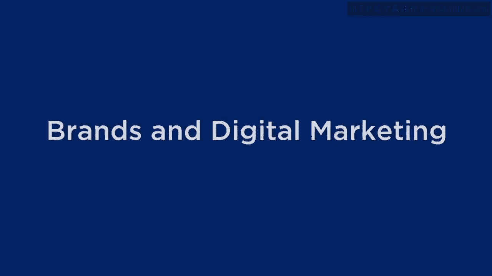

 Okay， so we just finished talking about marketing math 101。

 So hopefully that's a good framework for you guys to think about when you think about what's going to work in terms of execution and what's not。

 One other thing that I want to overlay in the introduction that's going to be very。

 very important in terms of execution is this whole idea of digital marketing。

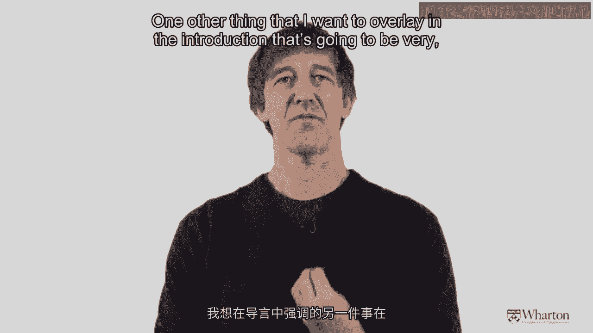

 So using the device is enabled by technology， the internet and mobile phones to make marketing more effective and more efficient。

 So definition of digital marketing， you just look up on Wikipedia。

 is digital marketing is the use of internet connected devices to engage a customer。

 which is all well and good。 But the key thing I want us to remember is it's still marketing。

 So we still have to have the right brand， the right promotional message。

 the right customer strategy and so on。

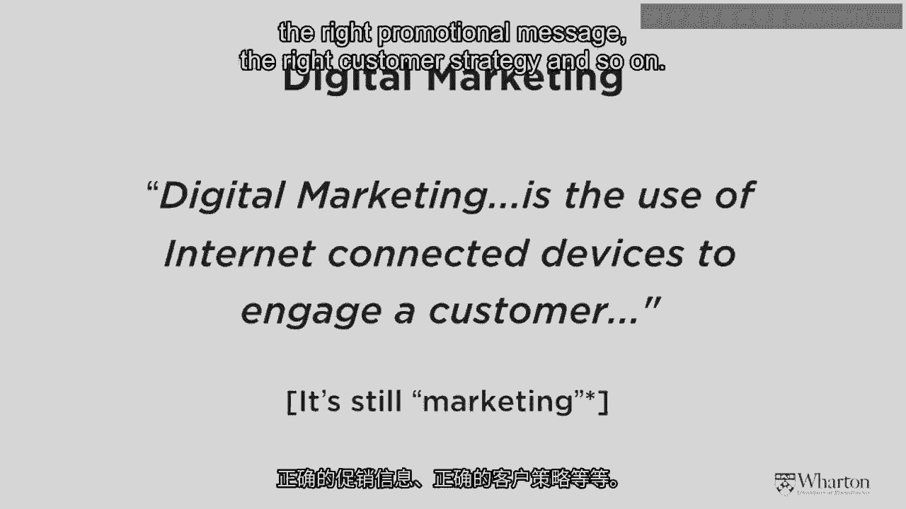

 So marketing in fact is probably more non-negotiable than ever because of digital marketing。

 If we get things wrong， that word is going to get out more quickly。

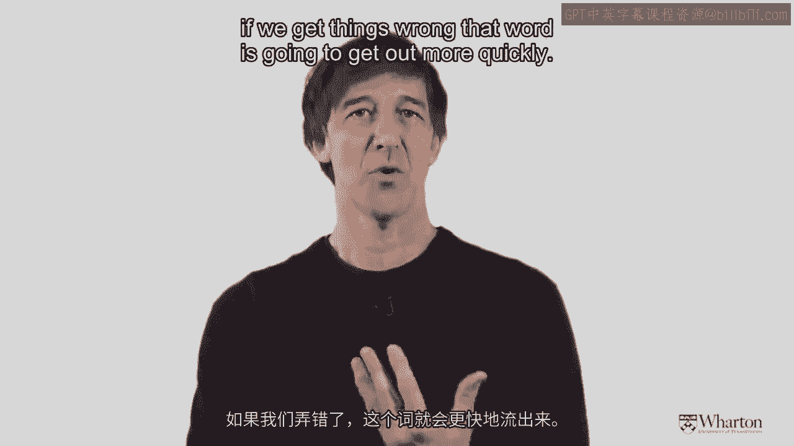

 So just a couple of other examples of why digital marketing though is interesting and why it's going to be important to execution。

 First of all， there's a notion of something called social commerce。

 So commerce has never been more engaged with multiple individuals than it is now。 So most of us。

 certainly in the United States， before we try new products or services。

 look to reviews often by complete strangers。

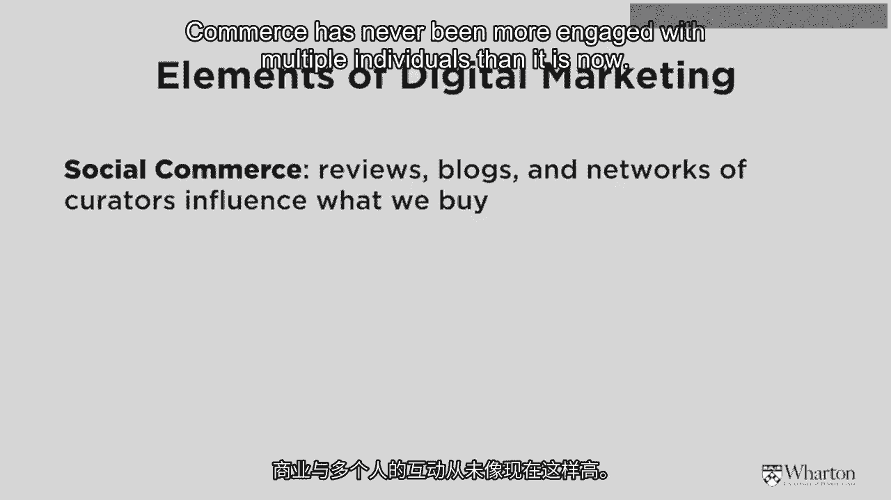

 Could you imagine going into a city and going to try a restaurant without at first checking the reviews on something like Yelp。

com or maybe going to open table or another one of those devices？

 Would you buy a book on Amazon without looking at the reviews first？ So commerce is much。

 much more social。 People taking cues from other people。

 both friends and strangers and we'll be talking about that。 The second thing that's really。

 really interesting with digital marketing is probably more than ever。

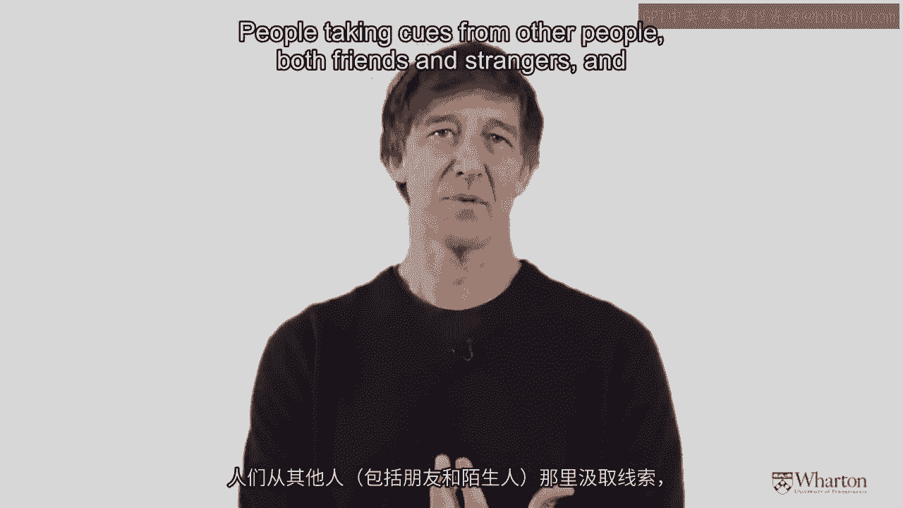

 There's now an ability to really target people at a micro level based on their browsing behavior on the internet based on how they use social media and using things like big data to discover who it is that you are。

 what you're doing and to send your messages that are more and more precise and more and more engaging。

 That's the second important trend and that will be coming through in some of our discussions later on too。

 The third thing about digital marketing that's very。

 very interesting is it's never been easier to experiment。

 So say my friend Chris and I have a new business selling shoes on the internet and we don't know whether we should make the website blue or red。

 well we could just try it out。

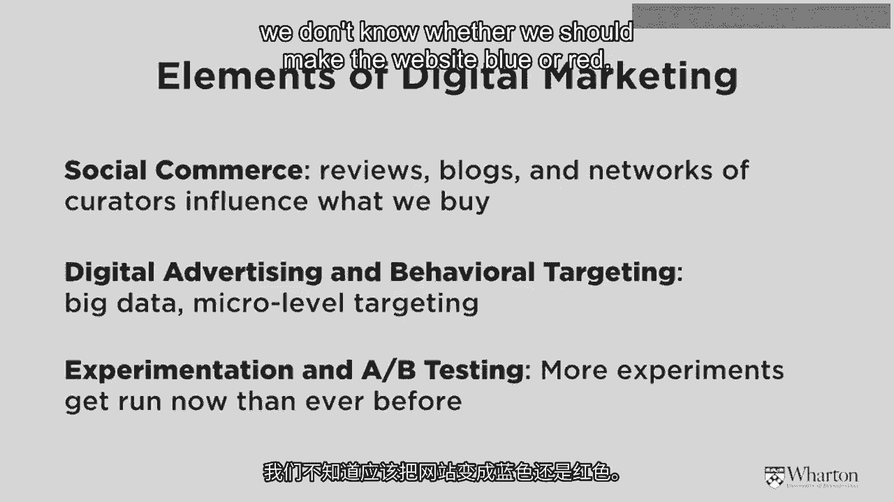

 In fact an experiment like this was done at the Walton score not so long ago where we were getting people to come to a website to choose different kinds of automobiles。

 And what we noticed if the background of the website was red and there were almost small little flames in the background。

 people who went to that website were more likely to choose automobiles that had high ratings on safety。

 Perhaps somehow the red color was making them think things were dangerous。

 On the other hand if we sent people to a green website with a green background。

 looked a little bit more like money and dollar signs。

 those people were much more focused on automobiles that were better value for money。

 So those things can be very， very easily tested out。

 In fact some data suggests that there's been more experiments run in the last year 2012 than all the prior years put together。

 So those are three very important trends in digital marketing， social commerce。

 digital advertising and behavioral targeting and then the ability to experiment。

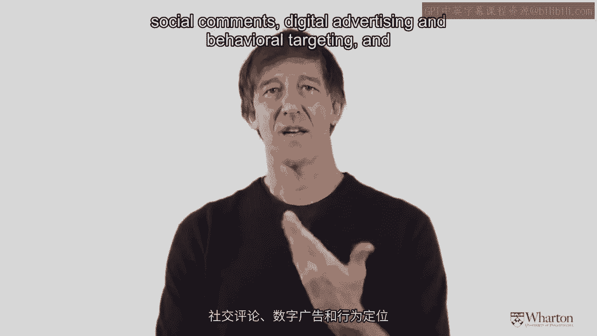

 Okay， so now let's transition into the first of the assets that we have as marketers to execute on。

 That's the brand asset。 So I'm just going to review some of the things that Barbara talked about and add a couple of additional ideas that become important when you execute in a digital environment。

 So first of all just to motivate us as to why brands are important。

 again continuing from Barbara's theme。 We notice now that about half of the assets that are howled around the world are non-tangible assets giving value。

 Think of a company like Google。 Google recently celebrated its 15th year anniversary and is one of the most important brands in the world。

 not because it has some of the most important assets。

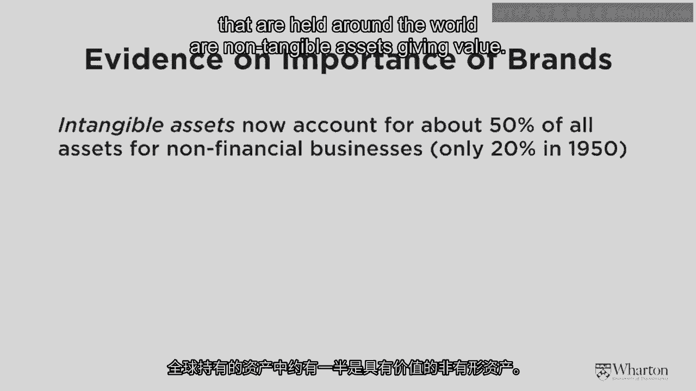

 Not because it has huge factories and huge physical plant but because it has intellectual capital。

 That's kind of the idea there。 Second thing is about one third of the value tied up in the global stock market studies have shown it due to brands and the premium that people pay for brands。

 And then thirdly my colleague here Jeremy Segal who is a finance professor at the Wharton School wrote a book called Stocks for the Long Run in which he looked at performance of stocks over a 50 year period from 1953 to 2003 on the New York Stock Exchange。

 And one thing that he found was that brands that were very strong and widely perceived as valuable by customers actually had also stocks that outperformed the market。

 So that's three interesting pieces of evidence about the brand asset。

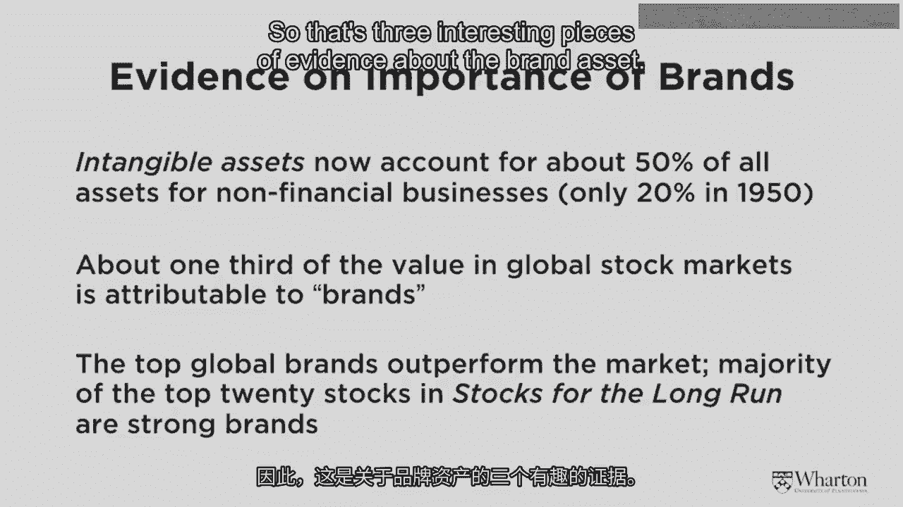

 Of course as Barbara mentioned to you branding is also perception as much as it is reality。

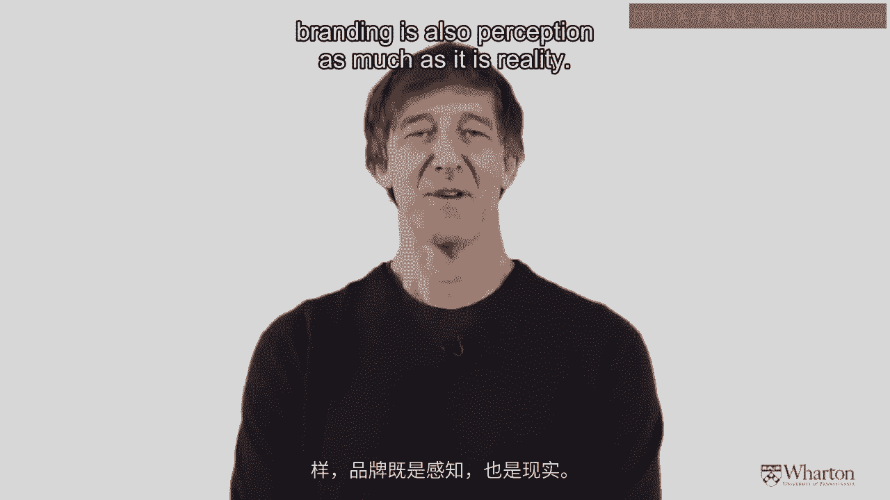

 So behind me on the screen there's a shot of six brands of beer some of them you might recognize and this was a study that was done way way back in 1964 believe it or not。

 Before most of us were born I believe。 And these six brands of beer were given to people in paper cups。

 Brand A was Pabs。 Brand B was Colt 45 and so on。 And then people were asked to drink these brands in paper cups and afterwards to answer the following question。

 How similar is brand A to brand B？ So A is Pabs。 B is Colt 45 but they don't know that because they're drinking out of a paper cup。

 And what you notice there is all of those brands from Pabs to around to Bobweiser were all perceived by customers drinking from paper cups to be almost the same。

 And yet that other guy all the way over to the right in the perception of Guinness which if you drink Guinness is a dark heavy beer at least they could figure out well gee that one's different。

 Now what was really interesting with this experiment was repeated here's the next chart where people were drinking out of the bottles and asked how similar they thought these beers were to each other。

 We get this big spread that's the difference between perception and reality and the importance of brand all of those great things that Barbara was talking about。

 So just quickly again these are the top brands in the world as mentioned by Interbrand in 2013 the surveys just come out。

 The top 10 that you see there it's the same top 10 as last year but the orders changed a little bit。

 For many years Coca-Cola was the number one brand in the world。

 Now Apple is the number one brand and number two is Google。

 I'm not saying there's too much you can do with this information but it's kind of nice to see as a marketing person。

 We'd be talking about those brands and of course also our focal brand and family of brands for the course Quidzy。

com。 So now I'm showing on the slide the family of Quidzy brands that we've talked about a little bit as we've gone through diapers。

com soap。com and so on。 So in addition to those kind of famous brands these new brands are brands that we'll be talking about。

 A couple of others that we're going to spend some time on as well。

 Warby Parker I'd encourage you to go to the website of these brands。

 Warby Parker is a company that's disrupting eyewear。

 Harry's is the shaving company that I mentioned earlier。

 Benobos is a means clothing company here in the United States that does some interesting online offline omnichannel strategy that we'll be talking about in a subsequent session。

 And of course diapers。com。

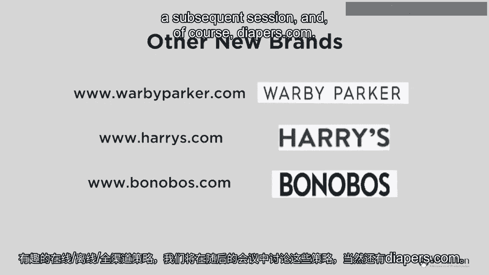

 So what are some additional things that you do when you develop a brand in a digital environment and you try and execute on all of those things that Barbara talked about？

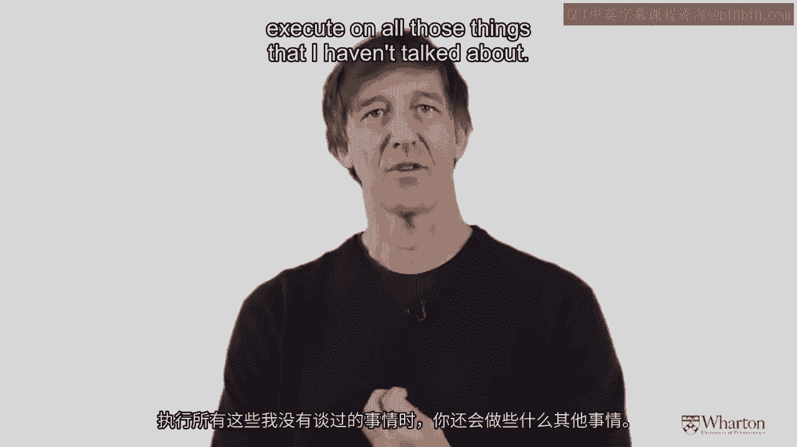

 Well just going back to basics you think about your brand goal which is to affect people's heart。

 mind， thinking and feeling and sometimes action。 So you want to change the way people feel by showing them certain messages。

 You want to change the way they think and sometimes you want to get them to do stuff。

 So let me give you some examples there。

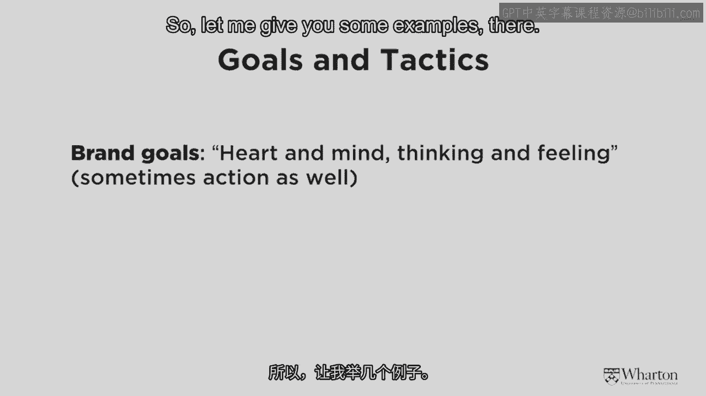

 So Google and again I'd encourage you to go to Google and Google this。

 I recently ran an ad campaign in the United States called DSOFI。

 It was a very heart rendering campaign。 If you watch the video you might want to have some tissues with you because it's a beautiful story of a child being born and a father essentially sending email making YouTube videos and communicating with his daughter through her life using all of the products that Google has。

 Now why is Google doing that？ Well they're trying to build an emotional connection to make you think that they really interact with you in a much deeper way than just purely through search。

 So that's an example of a brand using a digital marketing campaign to try and affect your heart。

 Thinking， one of my favorite ones here this is an old one but you know we all have different ways of getting our protein。

 Maybe we like tofu， maybe like fish。 If you're a Kiwi like me you like lamb。

 perhaps you like beef but anyway it wasn't so long ago that studies were done that showed that white meat was probably better for us than red meat。

 So clearly chicken and fish are on the white side。

 Beef and lamb are probably on the red side but if you're pork now which way do you go？

 You know you're more like the beef and lamb or more like the fish and chicken and so it's a very clever market。

 So those came up with a slogan "Pork the other white meat"。 So now when I think pork I think white。

 white is good。 I'm sure they got a good sales lift out of that。

 That's an example of changing your mind。 Getting you into action。

 another great campaign again it was used in the United States but I saw a similar campaign back at my home country in New Zealand。

 It's difficult to get people to drink more milk because you drink milk at a pretty regular rate and so in the United States there was a campaign that was run here that was called Got Milk。

 And the idea was to sort of create a fear if I somehow ran out of milk。

 So I have my friend Chris comes to my house reading a whole bunch of cookies while watching TV and of course what do you have with cookies but milk we go to the fridge and there's no milk。

 So sort of instilling this panic that if I don't have milk things are going to be really bad so I should go out and buy more。

 So those are examples of tactics to affect thinking， feeling and action。

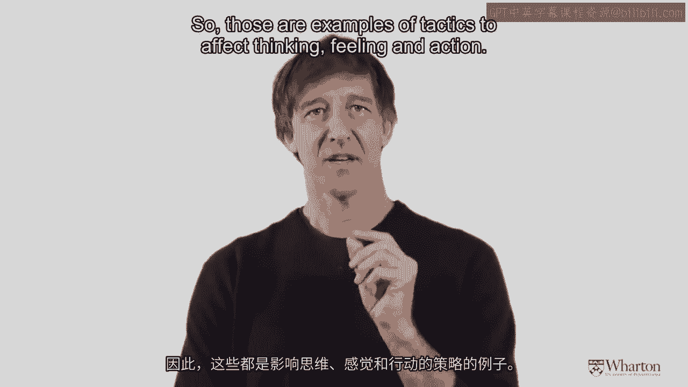

 Now what's different in digital marketing execution is sometimes you want to build this engagement through real world events that you can then leverage in the virtual world and I'm going to show examples of that using social media and so on to get the message out。

 So what are these additional digital considerations？

 So in the slide in the black you still have to have an outstanding value proposition and great positioning but there's three other things that you have to do to execute in the digital environment。

 You need to be authentic and transparent。 Barbara's already talked a little bit about that。

 Secondly you need to create a personality and be humanised and accessible。

 And then thirdly you need to consider that pretty much everything you do in terms of messages that you put out are going to have an infinite life and also you want to put out messages that potentially allow you to capitalise on chance or serendipity。

 I'll show an example of that in a moment。 So here's the first example。

 There's a company again here in the United States but many of you have probably heard of this。

 It's called JetBlue。 JetBlue is an airline that flies internally around the US。

 And a few years ago they ran a campaign called AYCJ。 All you can jet。

 And for $600 or $599 you could buy a ticket that would allow you to fly anywhere for an entire month。

 People responded to this very well。 It was promoted over Twitter。

 They got about a 700% lift in traffic to the website。 Very， very successful campaign。

 But here's the extra brand consideration to think about in a digital environment。

 It just so happened a gentleman named Drew Lawrence was going on a campaign 29 cities in 29 days。

 He was trying to raise money for cancer。 Very worthy thing to do。

 And he took advantage of this promotion。 And when he took advantage of this promotion this was picked up by news outlets and traditional media。

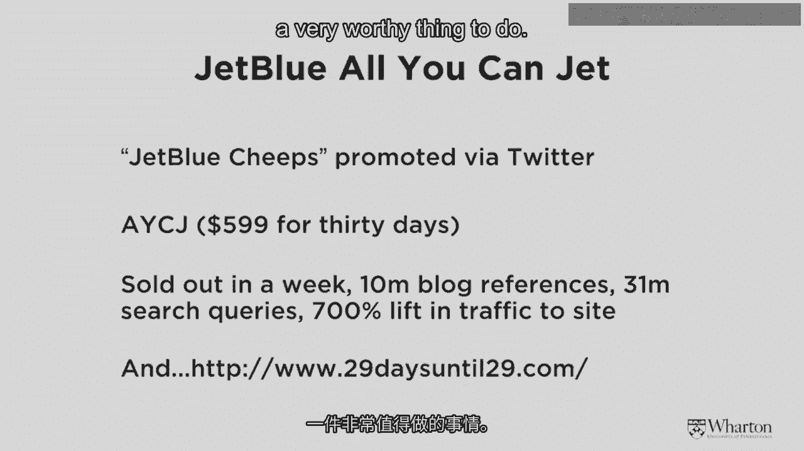

 And of course generated a tremendous lift to the campaign for JetBlue。

 So that's what I'm saying in terms of capitalizing on serendipity or putting messages out into the digital environment that allow other good things to continue on。

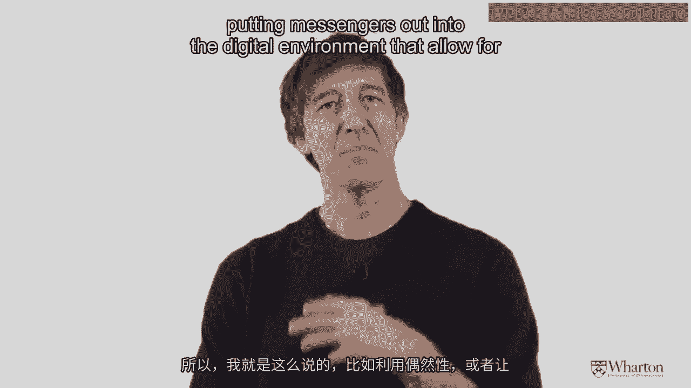

 You also have to be a little bit careful in the digital environment。

 I'm going to show you a slide now of McDonald's。 One of the world's top brands as we saw in a previous slide。

 Who tried to start in Twitter a hashtag called McD stories。

 Hopefully so that I would go there and talk about the great time I had with my friend chomping on a big Mac。

 Unfortunately this Twitter hashtag was hijacked by people who didn't like McDonald's。

 Who then produced some really kind of negative things about the company。

 Some of which I've shared with you。 So that's making the point that you just have to be careful because of the way people are going to capitalize in the digital environment for better or for worse on your marketing initiatives。

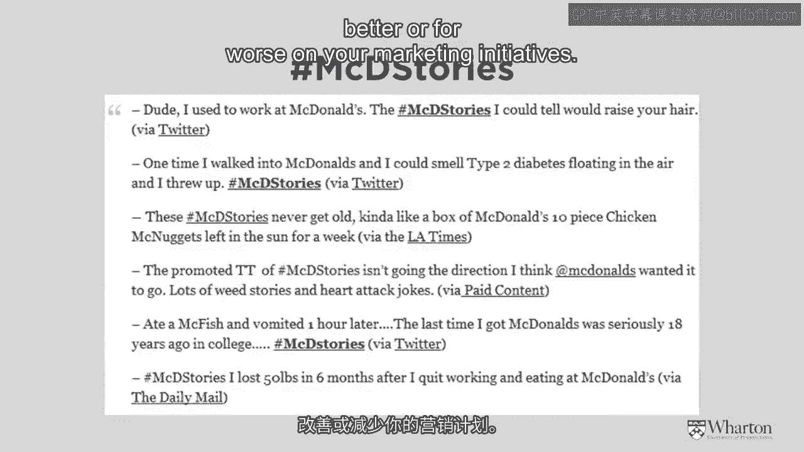

 Then the final thing I'd like to say here about branding before we just continue on and executing on the brand asset is back in the old days。

 If you weren't that far away。 We used to use celebrity sometimes to endorse our brands。

 In fact it's still a fairly common tactic。 People like Tiger Woods or Michael Jordan。

 People like Shaquille O'Neal。 So let me give you an example with Shaquille O'Neal。

 I happen to like Shaquille O'Neal。 He seems like a good guy。 He's a good basketball player as well。

 I believe he recently completed his PhD and he's also a part time policeman who couldn't like Shaquille。

 So you see Shaquille on TV in the United States promoting the Buick。

 So part of the good feeling I have about Shaquille then transfers over onto the Buick。

 That's great news for the automobile Buick because now I feel better about Buick。

 But at the same time I kind of stepped back a little bit and said you know what？

 I don't know if Shaquille O'Neal is really driving a Buick。

 That doesn't seem fancy enough for Shaquille。 So there's a bit of a mismatch between the personality and also the brand that's being promoted。

 But of course in the age of YouTube and social media what we now have is we have so-called organic celebrities springing up。

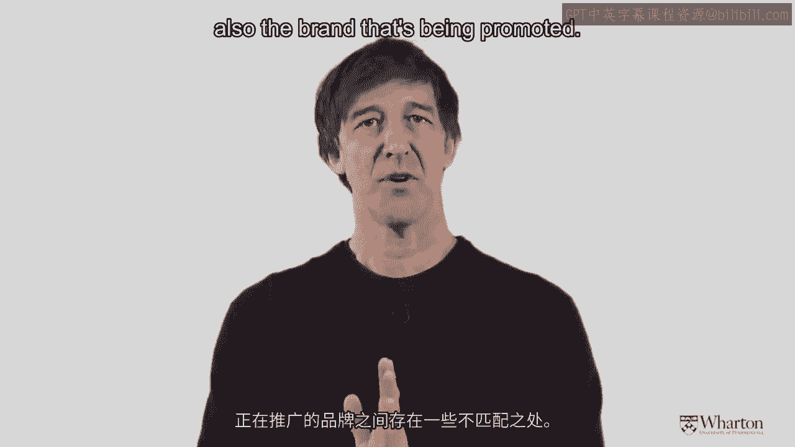

 So what I'm showing on the slide here is a lady called Redrummond who has positioned herself as the so-called pioneer woman。

 So she knows everything about southern cooking， southern way of living in the United States。

 manners， baking and so forth。 So if I were land of lakes butter who would be a better person to promote my product？

 Really or some famous actress？ And then the age of 2013 really is a better person because she's organic and she's authentic。

 [Music]。

 [BLANK_AUDIO]。

