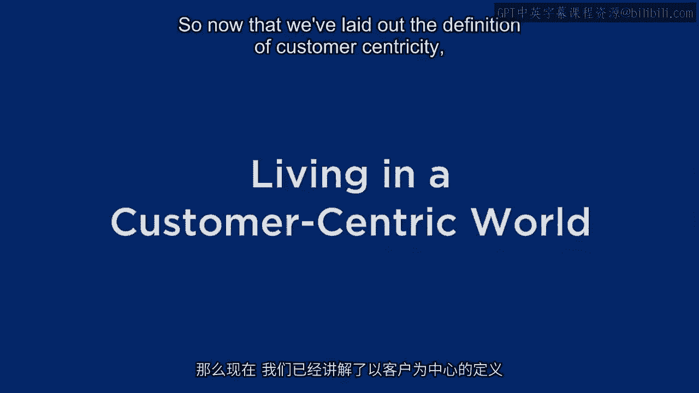
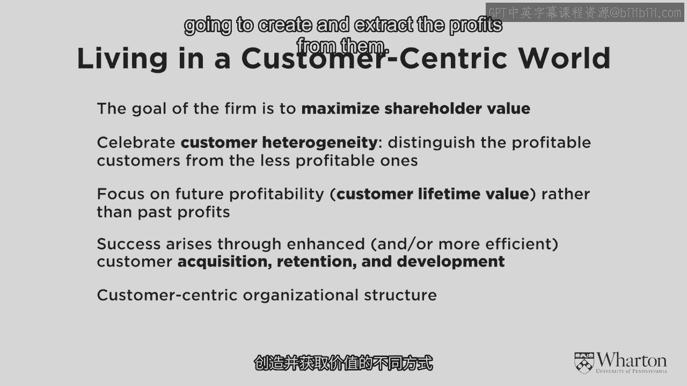
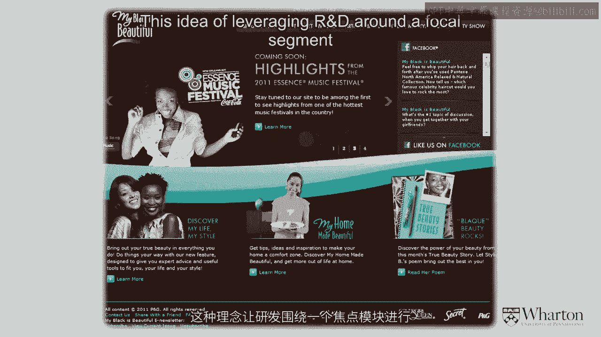
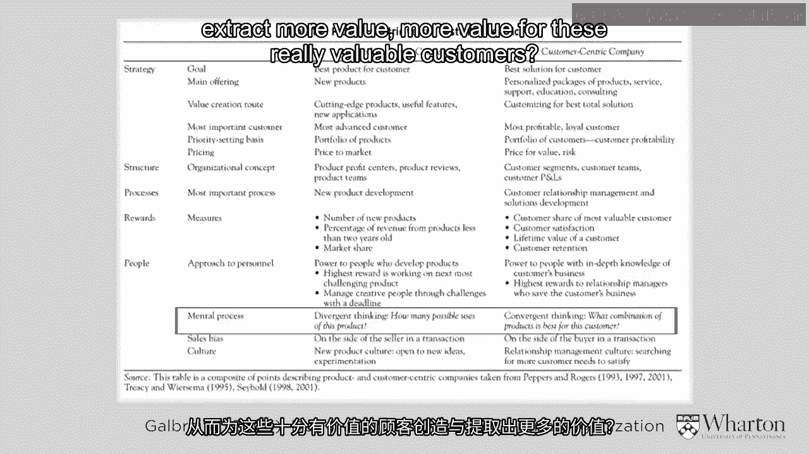
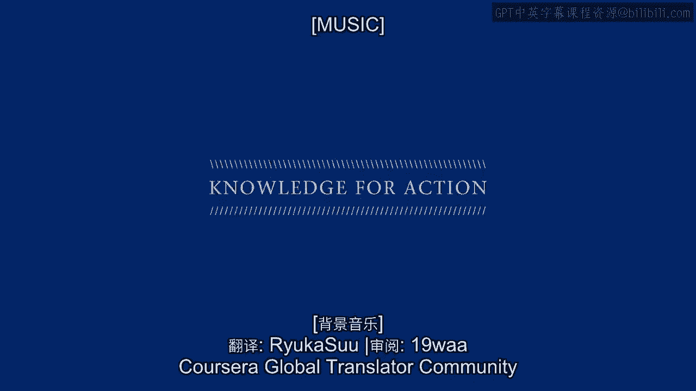

# 沃顿商学院《商务基础》｜Business Foundations Specialization｜（中英字幕） - P14：13_生活在以客户为中心的世界.zh_en - GPT中英字幕课程资源 - BV1R34y1c74c

 So now that we've laid out the definition of customer centricity， we've spoken a little。

 bit about some of the challenges that it requires companies to meet， changing incentive structures。

 and so on。 What I'd like to do is just to step back and review all the aspects of living in a customer。

 centric world。 What does that mean and then we'll spend a little bit more time talking about some of。

 the other aspects of it。 So first， if you live in a customer centric world。

 let me ask you this question。 What's the overarching objective for the commercial enterprise？

 You remember I asked that and we discussed it before for the product centric enterprise。

 but what is it for the customer centric enterprise？ So usually when I ask this question。

 people give me a lot of customer oriented answers， building loyalty， creating satisfaction。

 getting people to buy things。 Yeah， that's all nice。 That's all terrific。

 We want to do all that and we hope that customer centricity will help us do those things but。

 that's not the single overarching objective。 The overarching objective is the same as it was before。

 To maximize shareholder value。 To maximize the profits of the company in the short run and the long run。

 recognizing， the time value of money。 And even though that point seems kind of silly。

 it's the same thing， that's why I want to， emphasize it。 But in the end。

 the overall objective of any commercial enterprise is to make as much money， as possible。

 The problem is this。 There's too many people who think that the money making thing is uniquely associated with。

 product centricity but it's not。 There's lots of different paths that we can follow and while customer centricity is quite。

 different in many ways from product centricity， it's a path that's not a path that's not a。

 path that actually might help you get there faster and better。

 So if I want to emphasize that point that we're trying to achieve the same overarching。

 goal but in a very different way。 So let's talk about how we achieve it。 Again。

 going back to product centricity。 For most firms， the performance superior ones and the operationally excellent ones。

 it， was all about blockbuster idea。 Let's produce a lot of it。 Let's produce it efficiently。

 Let's think about the next thing to produce。 And again。

 that formula has worked for so many companies， still works today。

 So what is it in the customer centric world？ What is it that we celebrate in the customer centric world？

 Going back to the Harras and the Tesco and the IBM。 Well。

 this at this point might be more subtle but it's very， very important。

 What we celebrate in the customer centric world is customer heterogeneity。

 The idea that not all customers are created equal。

 The idea that some customers are just inherently much more valuable， much more profitable than。

 other customers。 See， in the old days， companies didn't know the profitability of customers。

 They didn't understand how customers are different from each other。 And again。

 they didn't care because they were so intent on just pushing products out， there。

 Once they started realizing the customers are different from each other， at first it。

 was a nuisance。 Oh my gosh， different customers。 We're going to have to talk to them in different ways and develop different products for them。

 It was a nuisance。 It added to our costs。 It was a hassle。

 And the more we learn about our customers， the more we realize they're really， really different。

 from each other。 And it's always true。 We can't avoid that。

 So unless we're going to paint ourselves into a corner and only work with one kind of， customer。

 we need to acknowledge and celebrate that heterogeneity。

 We need to find a way to say that these differences across the customers not only exist。

 but they're， a good thing。 Let's find the kinds of customers who can be very valuable to us。

 Let's make them valuable and let's find others like them。 And at the same time。

 let's find ways of dealing with the other customers in a reasonably， profitable manner。

 So we celebrate heterogeneity。 One point I want to emphasize along the way。

 and I say this over and over and over again， but it's important to make it explicit。

 is that when we're focusing on heterogeneity and， we're focusing on the profitability of our customers。

 we're talking about future profitability。 Notice that I'm always pointing over here to the future。

 It's great to look at past profitability in many cases that will be a guide towards future。

 profitability， but it's not a perfect one-to-one match。 So we need to use our data。

 We need to use models and technology in order to project the future value of our customers。

 So the celebration of heterogeneity isn't only what the customers have been worth and which。

 customers have been the most valuable， but it's which ones we think will be most valuable。

 Going back to my example about the MBA students and the airlines， most of the value is what。

 we're going to create and extract in the future。 And that's the really pivotal role of this idea of customer lifetime value。

 Now here's a tough question for you。 Okay， we're going to want to measure CLV。

 we're going to want to manage around it。 How do we do that？

 So when we look at a company as it starts changing from being product-centric to customer-centric。

 what kinds of tactics change？ So one point that I want to emphasize right now。

 but we're going to go into much greater， depth in module three are those three tactics that lie at the heart of customer centricity。

 that are the tactics that make it possible for companies to potentially make more money。

 being customer centric than product centric。 And you see those words right here。

 it's all about customer acquisition， customer retention， customer development。

 And a lot of you might be looking at those words and saying， well that's not new。

 Companies have been acquiring customers forever。 Companies have been thinking about retention and development。

 making customers more valuable。 These ideas are not new。 And you know what， they're not。

 that's true。 But in many cases， these ideas are treated at a fairly low level within the marketing。

 organization。 Because the marketing organization is often there just to support the product-centric blockbuster。

 mentality。 So it's all about how can we get as much stuff out there as quickly as possible。

 It's all about coming up with the message。 Very often branding might be associated with products-centricity。

 Not always， but in many cases it is。 And so instead。

 as we start to think about how customers different from each other， we're。

 going to want to ask questions about which kinds of customers should we be acquiring？

 How much should we be willing to spend to acquire them？ On the retention side。

 should we try to keep everybody？ Should we roll out the red carpet for everyone？

 Or should we be a little bit more selective？ And when it comes to customer development。

 are there some customers who we can make into， better customers than others？

 And how do those tactics tie in with the acquisition and the retention？

 So I'm going to spend much more time talking about it later on。

 But my point here is that these three tactics need to be elevated。

 The people who are going to be working on them need to be higher in the organization。

 The people who are running the marketing function have to be at least as painfully aware as acquisition。

 retention and development as they are around some of the branding ideas that Barbara spoke， about。

 And so we're going to get back into that， but I just want to plant that seed right now。

 One point that I've mentioned from time to time， but I want to make a little bit more。

 explicit here， would be the challenges for the organization itself。 Again。

 instead of having an organization that's organized purely around the different kinds。

 of products and services， we want to have a customer centric organizational structure。 Ideally。

 the whole org chart would be built around the different kinds of customers we。

 have and then below them the different ways that we're going to create and extract the。

 profits from them。

 I'm going to give you a nice example of a company that's seriously exploring different。

 organizational approaches towards customer centricity。

 It's a company that today focuses quite a bit on developing and distributing blockbuster， products。

 But more and more， they're realizing that they actually need to be or could be a direct， marketer。

 The company is Procter & Gamble。 What does Procter & Gamble know about you or me？ Actually not much。

 Today， Procter & Gamble's customer would be the retailer， the Walmart's or other grocery。

 chains who they sell their products to。 But Procter & Gamble recognizes that with this shift towards customer centricity。

 with， this shift towards direct marketing that eventually their customer will be me and you。

 And they want to start to understand who the really valuable customers are， how we can。

 sort them out from other customers， and what are things that we can do to create more value。

 for those customers。 So here's an example of a really nice initiative。

 one of many that Procter & Gamble is trying， out。 It's called "My Black is Beautiful" and it's aimed at African American women。

 And P&G has determined that this is a really valuable customer segment for us。 We need to be there。

 We want to be seen as a trusted advisor。 So take a look at the slide in front of you here。

 There's a number of very unusual aspects about it compared to traditional Procter & Gamble。

 or package goods advertising。 First， look at the bottom of the slide。

 You see a number of different P&G brands being advertised together。

 It's pretty unusual for a company like P&G or again other package goods manufacturers。

 to use that kind of umbrella branding， going back to some of Barbara's content。

 And if you look higher up on the slide， you notice that they're also talking about recipes。

 and music and all kinds of things that P&G isn't involved with。

 But this would be an example of Procter & Gamble trying to position itself as a trusted advisor。

 that they're offering all kinds of products and services to this valuable customer segment。

 that they don't necessarily make any money on， but they want them to see P&G as someone。

 who has their best interest in mind。 And if you look at the bottom of the slide。

 you'll notice something fairly unusual。 You see here just the mention of a line of cosmetics called Covergirl Queen。

 Covergirl is a big line of cosmetics under Procter & Gamble， but Queen refers to Queen， Latifa。

 the popular actress， and so they developed a whole line of cosmetics specifically for。

 African American women。 This goes back to our definition of customer centricity。

 According to the R&D people in saying， "You know， instead of coming up with a blockbuster。

 product that everybody's going to buy， here's a valuable customer segment， we want to come。

 up with something for them that they're going to find very valuable。 Others might buy it too。

 and that would be great。 But this idea of leveraging R&D around a focal segment。

 that's starting to show us what。

 customer centricity is all about。 Now， I have no idea if this initiative by Procter & Gamble will be successful。

 I don't even know if this is the right segment to go after。 I'm not going to comment on that。

 But given that they are going after this segment， this is the right way to do it。

 This is customer centricity。 And you have to believe that in the Procter & Gamble Organizational Chart。

 there are some， people who are responsible for "My Black is Beautiful。"。

 And they're going to bring whatever resources they can， whatever products within the P&G。

 family or outside of it in order to make this customer group as valuable as possible。

 That's what I like to see for customer centricity， and I want to see more companies developing。

 these kinds of organizational and marketing structures around it。

 The bottom line for customer centricity is this idea of relationship expertise。

 If you remember earlier， the key to product centricity was product expertise。

 We're really good at developing and delivering a certain kind of product。

 We're always steps ahead of everybody else。 But as we discussed。

 the cracks in product centricity are shortening some of those steps。

 It's much harder to stay ahead when it comes to product expertise。

 But when it comes to relationship expertise， I believe that they're a meaningful， sustainable。

 long-run advantages。 And I'm not just talking about soft， squishy。

 understand your customers in some generic， way。 I'm talking about data。 I'm talking about models。

 I'm talking about forecasts。 I'm talking about truly understanding your customer， your customers。

 celebrating the， heterogeneity。 One of the beautiful things about it is that when you collect the data and you develop。

 these kinds of forecasts， nobody can ever take it away from you。 It will never become commoditized。

 And so I believe that if your customers are assets， and I think they are， that investing。

 in the data， in the knowledge， in the heterogeneity can actually lead to better outcomes to companies。

 than pure product centricity。 There's one more point I want to raise to really help us understand the contrast between。

 product and customer centricity。 You might remember a chart that I showed you earlier that showed a lot of the characteristics。

 of a product centric firm。 And I really focused on the idea of the divergent thinking。

 We have this product goodness。 What do we do with it？ Well。

 here's the complete chart now where it shows you the contrast between the product。

 centric firm and the customer centric firm。 I hope that you'll see that many of them are entirely consistent with our discussion so。

 far。 Let's focus on the valuable customers instead of the blockbuster products， the different。

 kinds of metrics， customer retention， lifetime value。

 We're going to be saying more about those as we go on。 Again。

 I just want to call your attention towards the bottom of the slide。 Instead of divergent thinking。

 what do we do with this product？ It's convergent thinking。

 How do we bring more value to this customer？ What products and services can we develop？

 What information can we provide？ What can we do in the relationship to create and extract more value for these really valuable。

 customers？ Again， moving from the product centric world to the customer centric world is very difficult。

 Going from divergent to convergent thinking doesn't happen overnight。

 It requires all kinds of different incentives。 It requires different kinds of people。

 A totally different mindset。 That's one of the challenges associated with customer centricity。

 I want to talk about a few more。 [MUSIC]。

