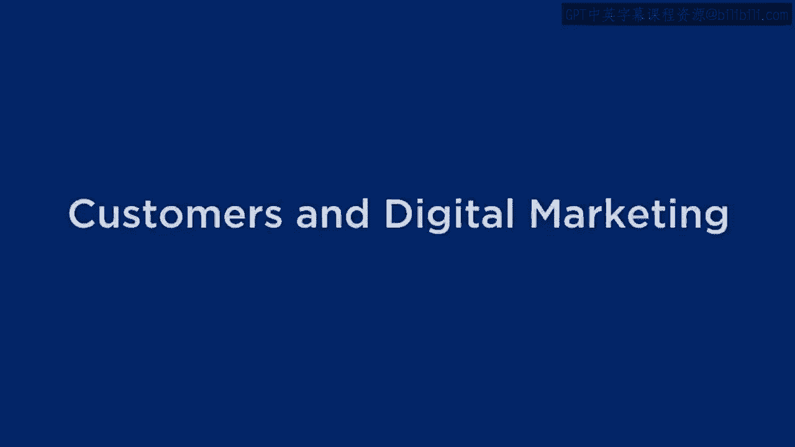
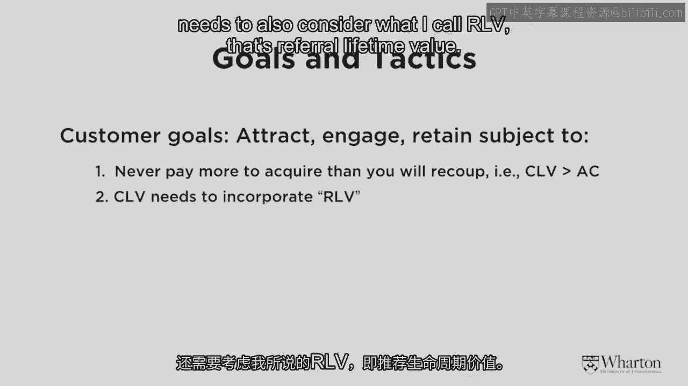
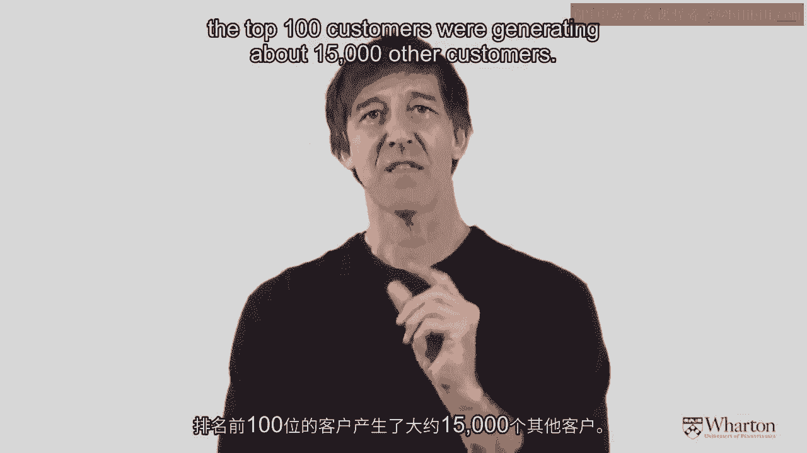
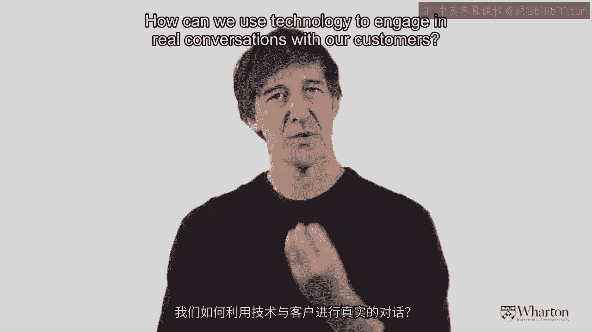
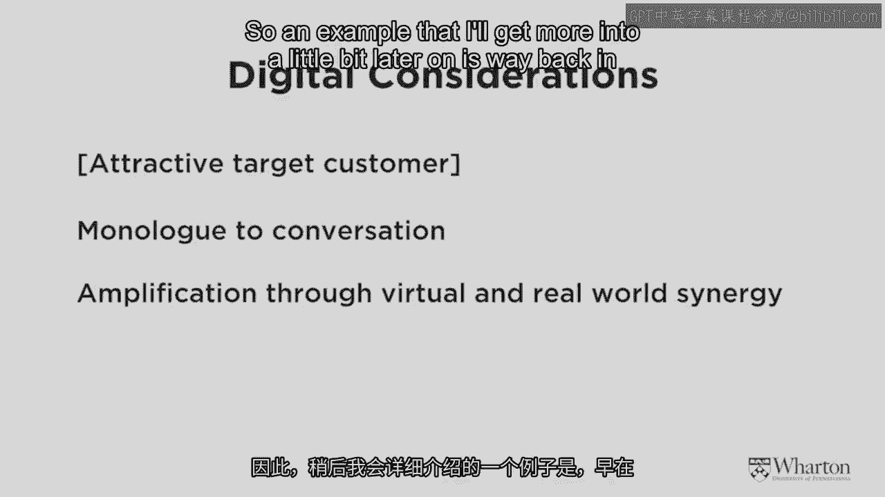
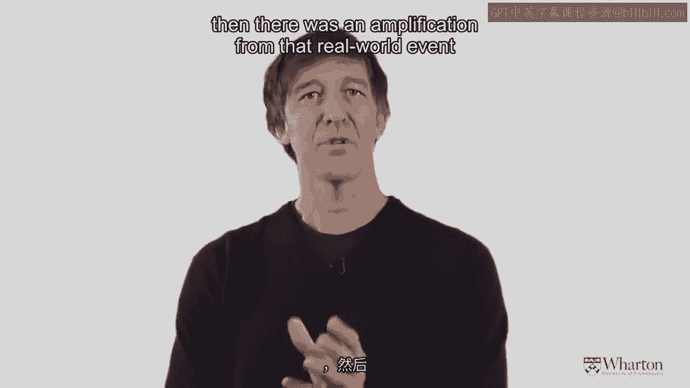
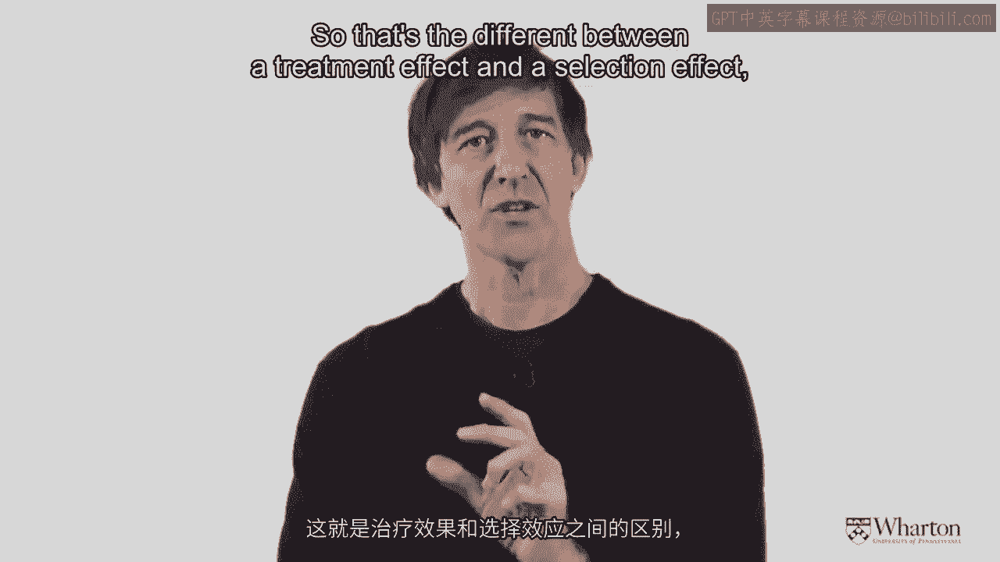
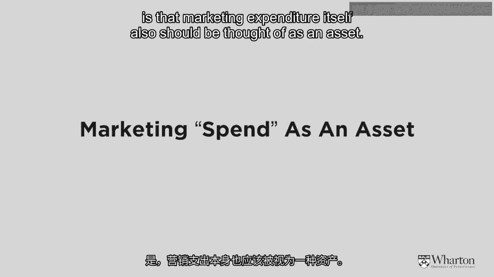

# 沃顿商学院《商务基础》｜Business Foundations Specialization｜（中英字幕） - P150：7_客户和数字营销9 49.zh_en - GPT中英字幕课程资源 - BV1R34y1c74c

 [MUSIC]。

 Okay， let's continue on now to Pete's area， which is customer assets。

 I'm just again going to add a couple of little things here in terms of digital considerations and。

 additional things we have to think about for execution。 So as Pete told you， I'm sure very。

 very clearly， your key goals are to attract， engage， and， retain the right kind of customers。

 Some customers， as Pete told you， you actually want to get rid of because of the heterogeneity。

 one of our favorite buzzwords here at the Wharton School， in the customer base。

 Some customers are just not worth hanging on to。 So as Pete has told you。

 you should never ever pay more to acquire a customer than you can expect to get back。

 So the customer lifetime value of my friend Chris， who's renting cars from Hertz。

 should be higher than what Hertz had to pay to get Chris as a customer。

 The second thing that's very important though is that the CLV， the customer lifetime value。

 when executed in the digital marketing environment， needs to also consider what I call our LV。

 That's referral lifetime value。 So let's imagine that I have a beard， actually don't today。

 but if I have a beard and I don't shave， I probably have a very low customer lifetime value to Harry's。

com， the shaving company。 However， if I'm a popular guy and I tell a lot of my friends about Harry's。

com， I might have a very， very high referral lifetime value because I'm bringing other people to the party。

 So let me give you an example。 From data based on diapers。com， one of our case study companies。

 that just shows how powerful this point is。 So a few years ago， my colleague， John， and I。

 got all of the data from diapers。com， and we looked at the first 100。

000 customers that became customers at diapers。com。 And back in those days。

 if I were a customer of diapers。com and I sent an email referral to my friend Amy。

 and then Amy made a purchase at diapers。com， I would get a $1 credit towards buying more diapers。

 Also， what I could do is I could print out physical coupons and put them on all the cars on Walnut Street here in Philadelphia。

 and some stranger might pick them up and take my code and enter it。

 and then I would get a credit if they became a customer。 So two things were very。

 very interesting to us about this process。 First of all， about 8，000 of those 100。

000 customers engaged in this customer based promotional word of mouth， if you will。

 That's kind of interesting。 About 8% of the people were motivated to go and try and acquire other customers on behalf of the firm。

 Now， of course， again， going back to what Pete talked about， we all know about averages。

 It's an important measure。 So the average number of people that were brought in by a referring customer was about 4。

 So those 8，000 people generated 32，000 new customers for diapers。com。 It's a pretty powerful number。

 But again， in the internet， it's not just the average that's important。

 The internet is the world of extremes。 There's going to be some customers out there that just love you so much。

 They may go completely nuts， as it were。 And so it turned out when we looked carefully at the data。

 the top 100 customers were generating about 15，000 other customers。

 So think about that， about 150 each。 So again， when you execute your customer strategies in the digital age。

 one of the most important things you can do is you can encourage your existing customers to refer other customers。

 So let me just summarize that， the digital considerations。

 So non-negotiable in the black at the top of the slide is that you must still attract the right target customers。

 Pete has been talking about for the last few weeks。 However。

 there are three interesting nuances that come into play here。 First of all。

 your interaction with customers changes from just a monologue， you sending out messages。

 now into a conversation。 So let me give you a personal example。

 Recently， I've been flying from Philadelphia to San Francisco to our West Coast campus。

 and where possible， I try and fly on Virgin America。 It's a great airline。

 I think they really know what they're doing in terms of marketing。 And when I get on the airline。

 sometimes I send a tweet。 I'm happy to be on VX141 looking forward to the Sushi and Beer。

 And sure enough， within a few moments later， Virgin will tweet back to me and engage me in a conversation。

 In fact， on a recent flight， I received a direct message from somebody at Virgin telling me if I took a screenshot of my status on United Airlines that Virgin would match it。

 So think about the power of that medium to change from a monologue to a conversation。

 So that's going to be an important theme。 How can we use technology to engage in real conversations with our customers？

 The second thing that we can do with customers is we can amplify activities that go on in the real world out into the virtual world。

 So an example that I'll get more into a little bit later on is way back in September 2011。

 WarbyParker。com， another company that I'll talk about a little bit。

 staged an event in the New York Public Library where their friends went in there and took over a whole floor wearing Warby Parker glasses。

 This was， of course， picked up by the traditional press and then there was an amplification from that real world event pushed out through the virtual world。

 And then finally， the third point is we need to be aware of this possibility of what I'll call the long tail leverage。

 The long tail is the idea， the conceptual idea。 There are some people who are just sort of extreme。

 like those customers for diapers。com that referred 150 customers each when the average was only four。

 So how do we use technology to tap into who those people are？

 Okay， one final thing I'd like to mention here， guys， a little bit of a technical term。

 but it's a very， very interesting distinction that's important for thinking about how to execute with customers through things like loyalty programs and referral programs and so on。

 So I wanted to distinguish two effects。 The first is what I'll call a selection effect and the second is what I'll call a treatment effect。

 And both of these things are very， very important to companies who want to get customers to acquire new customers。

 So let's start with a selection effect。

 So imagine I'm a customer of diapers。com and diapers。

com is going to give me some cash or some points if I refer somebody else。 Now。

 I happen to refer my friend Chris just because I know that he recently had twins。 Now。

 the CEO of diapers。com doesn't know that， but I know that。

 So I'm better able to find a new customer than the management of the company。

 That's the idea of a selection effect。 So the person who's doing the referring is deliberately picking out people who are going to be very。

 very appropriate for the good old service。 That's the selection effect。

 And my colleague here at the Wharton School， Christol Vandenbald。

 has shown that customers who are attracted through word of mouth and through referral have higher customer lifetime values than those who are not。

 Because of this selection effect。 The second effect is what I'll call the treatment effect。

 The treatment effect says， "Well， how did Chris come to be introduced to diapers。com？"。

 It wasn't through Google search。 It wasn't through seeing an advertisement。

 But he got introduced through me， his trusted friend。

 And because that was the way he found out about something。

 it's more natural then for him to engage in the same practice。 So when we looked at that diapers。

com data， remember I said on average， there was about an 8-10% rate of referral。 Well。

 if a customer was acquired， because of referral， the chance that they then referred went up to about 15-18%。

 So that's the difference between a treatment effect and a selection effect。

 But both of those things are very， very important。

 Okay， I'm just going to wrap up now with the third asset。

 Remember we're talking about three assets that we have as marketers to execute on。

 Number one is the brand。 We've just gone through。 Number two is the customer。

 And then the third one that I mentioned at the beginning of this module is that marketing expenditure itself also should be thought of as an asset。

 And again， the naive way of thinking about marketing is we have top line sales minus what we spend on marketing or advertising is equal to our profit。

 Now， if we make that marketing spend equal to zero。

 it's not the case that our profit will go up by the same amount。 Why is that？ Because the marketing。

 of course， is contributing to the sales and to the top line growth。

 That's something that will be exploring in more detail as we go ahead。

 The final piece of food for thought for today is the following。 I'd just like to encourage you。

 as you've been doing already on your own， is to go out and look at some examples that reinforce the points that we were making。

 So the first thing I'd like you to do just over the next few days is to try and think about some experience that you have buying coffee。

 paying for something， booking a hotel， communicating with your friends。

 keeping track of your appointments。 Whatever it is， it's just not as good as it could be。

 And try and think about how this status quo situation could be solved or fixed in the same way that Howard Schultz figured out that the coffee situation in America was suboptimal and he fixed it by introducing Starbucks。

 The second thing I'd like you to do is go to the website warbyparker。com。

 they're listed on the slides， and try and think about what you've learned from Barbara and also our additional discussion today about how in the digital age。

 a brand needs to be authentic， transparent， and humanized。

 And try and see what elements of the execution in that website touch on those three points。

 Great， hopefully you'll have a good time doing that。

 We'll come back to those examples as we go through， and that's the end of this particular piece。

 [Music]。

 (lively music)。