# 沃顿商学院《商务基础》｜Business Foundations Specialization｜（中英字幕） - P151：8_信誉和评论14 38.zh_en - GPT中英字幕课程资源 - BV1R34y1c74c

 [ Music ]。

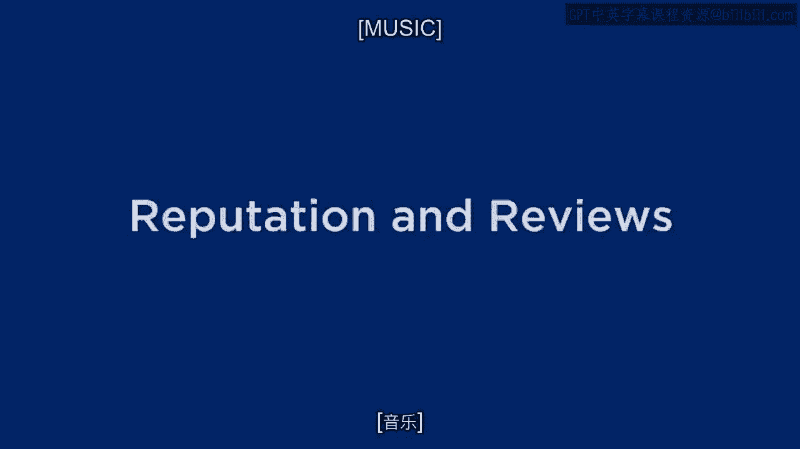

 So welcome again everybody。 Today we're going to talk about something really cool and really interesting which is。

 the whole idea of reviews and how they affect our behavior both online and offline， part。

 of our omni-channel discussion。 So how are we going to do that？

 Let me just give a quick overview of where we're going to go。

 We're going to start with some motivation for why review information is important and。

 affects behavior and markets。 Then I'm going to give you a little bit of economic theory which I think is really fascinating。

 based on some research that was done by a colleague out in Los Angeles a few years ago。

 I think you'll enjoy that。 And then finally I'll follow up some other examples of Amazon versus Barnes and Noble。

 on the internet and then Expedia versus TripAdvisor。 I'll explain those as we get through。

 So here's the first motivation for reviews and use of reviews。

 You'll notice there on the slide the statistic could even be higher。

 I think I've been quite conservative here that about 60% of us at least in the United。

 States but I'm sure around the world read reviews before we make purchase decisions。

 And secondly positive reviews whether they're for books， restaurants， movies， jeans， whatever。

 it is that we're buying are seen to influence people's behavior。

 So bringing this information into the market is very， very critical。

 You might remember from one of our previous discussions that one of the frictions that。

 we often experience in a market is we don't really know how good a restaurant is， how。

 good a product is， how good a movie is。 And now that information is being made available much more easily and much more efficiently。

 often by people who are complete strangers but the information is still useful for our。

 purchase decisions。 Also since we're here in Philadelphia or at least I am I wanted to put in a couple of。

 quotes that I think speak to the importance of reviews for merchants and probably even。

 for individuals。 So Ben Franklin said it takes many good deeds to build a reputation only one bad one to。

 lose it。 So that might be interesting to think if you write a book and you're selling it on Amazon。

 and you're getting mainly five-star reviews and suddenly a one-star review comes along。

 I wonder if that would affect your sales？ Well we'll answer that question as we go through the discussion a little further。

 William Shakespeare perhaps because of his British heritage I guess I'm partly from。

 that area coming from New Zealand。 He's a little more cynical and what he said in the quote there is that reputation is an。

 idle and most false imposition。 Often got without merit and often without deserving。

 So what he's saying is sometimes people can build fake or phony reputations and that's。

 certainly true today in 2013。 In fact many of the reviews apparently that we see on places like Amazon and TripAdvisor。

 and Yelp may in fact not be legitimate。

 We'll get to that later on as well。 So just for your interest what I've done here is I've shown a bunch of links that you。

 can go and check out if you want to see how people review airlines， people review recipes。

 people review doctors and so forth and what you'll see here is a flavor of how reviews。

 are presented whether visually with stars， whether they show the average， the deviation。

 whether there's content。 So just you may already be using some of these things but just go and take a look to。

 get a sense of how this information is presented before I now give you some of the theory。

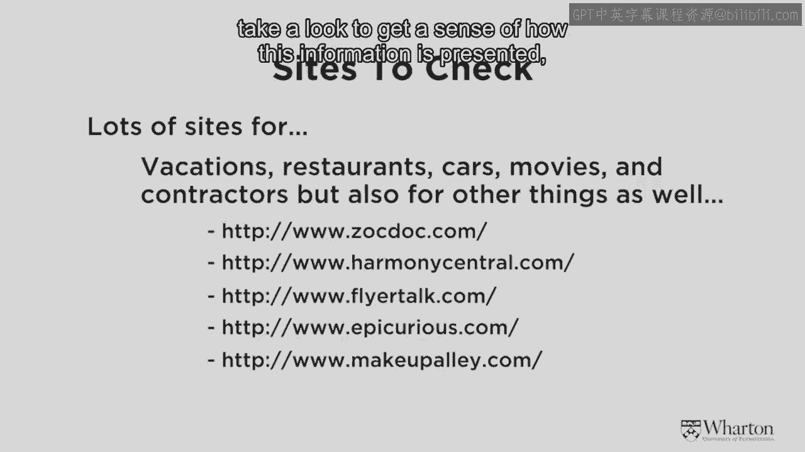

 So before we get into the theory I just want to share with you a very interesting anecdote。

 that I found on Chris Dixon's blog。 So this is a story about a startup that raised as you can see on the slide about $4 million。

 in venture funding。 It was eventually solved and then roughly at the time of us preparing these videos in。

 Philadelphia was a publicly traded company worth over $6 billion。

 So who is this company？ This company actually is TripAdvisor originally purchased by Expedia for $210 million and now。

 has grown into a huge company that's really a company primarily putting information into。

 the market， information that's contributed by people like you and I。

 So for the budding entrepreneurs out there watching this sometimes you can build a great。

 business just by bringing information into a market and helping people make better decisions。

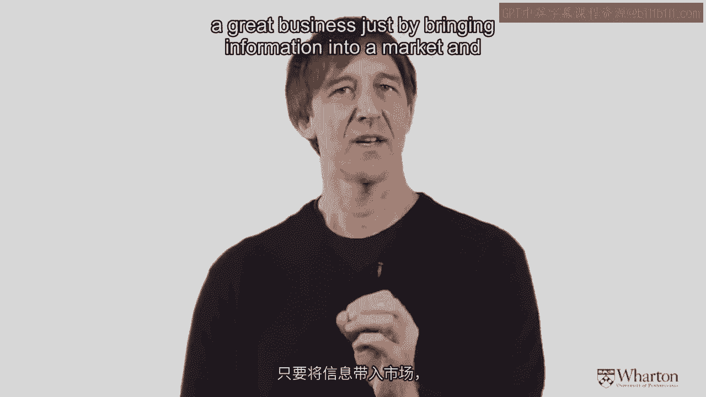

 and better choices。 So let's begin with a little bit of theory。

 Sometimes it's helpful to know this to ground what we're thinking about。

 So economic theory would suggest that more information to consumers is almost always， better。

 The more light that's brought to bear on a market it's usually better for certainly the。

 end users people like you and I。 In addition an economist might tell us that if information is provided into a market it。

 may change the behavior not only of the buyers and who they decide to buy from but also the。

 behavior of the sellers maybe they'll be more motivated to provide better quality products。

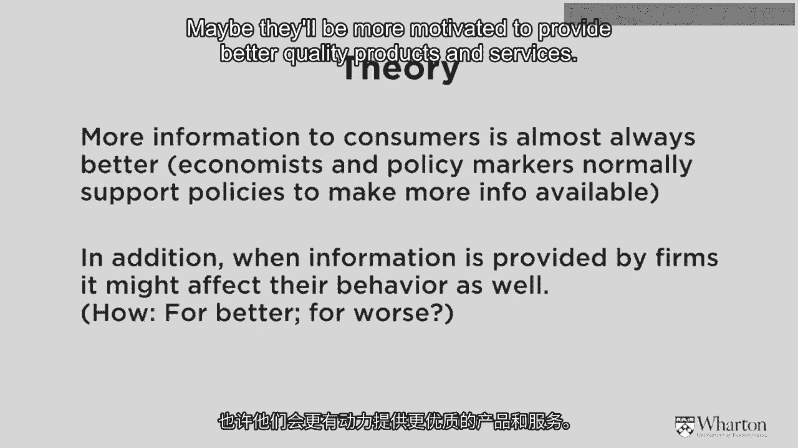

 and services。 So to examine this there was a very interesting study done by two co-authors Jin and Leslie。

 I've provided the reference for the paper in the notes if you want to read the original。

 paper who looked at what happened to the market for food， restaurant food in Los Angeles after。

 inspections were done of the restaurants there。

 So what I've shown in the slide are the actual photographs of ratings of restaurants that。

 appear in the windows of restaurants in Los Angeles。

 In the United States you also see them now in New York and probably other places too。

 Perhaps in your home country you have something similar。

 So the way this works is a health inspector visits a restaurant。

 The health inspector goes through many many things in terms of the hygiene of the restaurant。

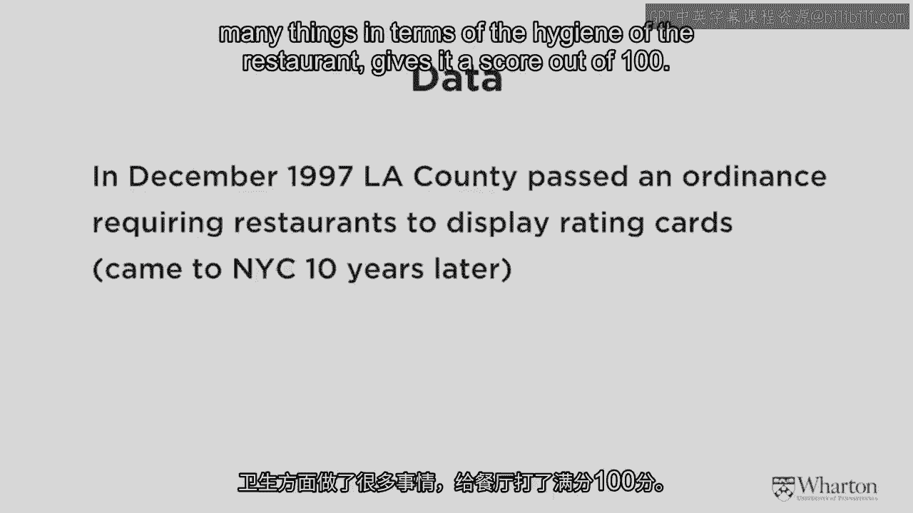

 gives it a score out of 100。 If the score is more than 90 then that restaurant places a sign in the window that says that。

 this is an A hygiene grade。 B is a lower grade and C of course is a lower grade down still。

 And so the co-authors Jin and Leslie wanted to figure out whether or not providing this。

 information into the market would change the behavior of the consumers that were there。

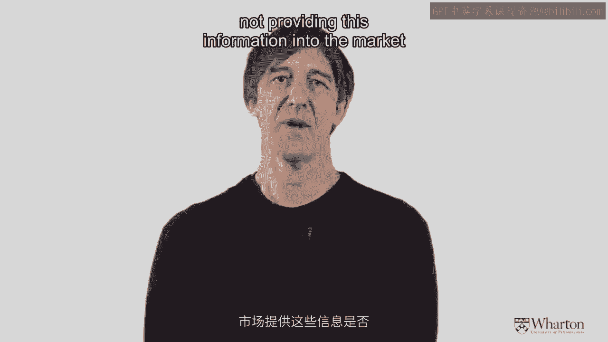

 And what did they find？ Well what they found was the demand at restaurants that got an A went up quite substantially about。

 5 to 6 percent。 And at restaurants that got a B actually went up hardly perceptibly less than 1 percent。

 and demand at restaurants that got a C of course went down。

 So once the information was in the market people as you might imagine wanted to go to。

 restaurants that had better hygiene and better quality food。

 So that was a buyer explanation or that was an effect on demand。

 But there's also an effect of information on supply which I think is at least as interesting。

 perhaps even more so。 So what did the provision of that information in the market due to the salads？

 Well it caused them actually to increase the quality of what they were offering because。

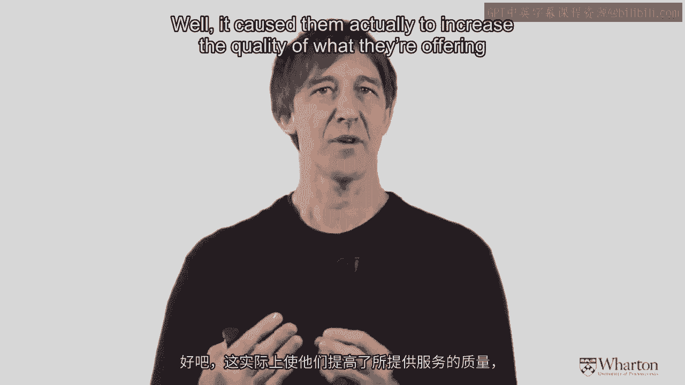

 now there's more of a benefit to be known as an A restaurant。

 So to check this out what the researchers did was something very clever。

 They looked at the number of people that got sent to hospital for food related illnesses。

 and what they found was in markets where the signs were in place that went down substantially。

 about 13 percent whereas in other parts of California that didn't have the system the。

 number of people going to hospital for food borne illness was actually going up。

 So again that's a pretty clever test that shows this was also affecting the behavior of。

 the salads as well as the behavior of the buyers。

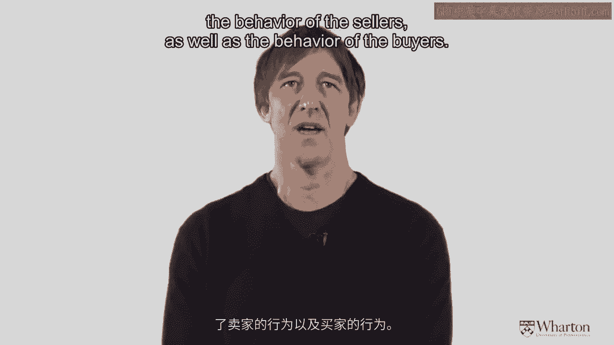

 So what do we learn from this？ Here's the key principle is that reviews and review systems definitely change behavior。

 Both of buyers and also of salads。 But the most important thing knowing that is that reviews ideally should be objective。

 and verifiable but this is not always the case。 So let's look at a couple of research examples。

 The first one was a very clever study that was done by two professors at Yale that examined。

 whether or not reviews for books help ramp up sales。

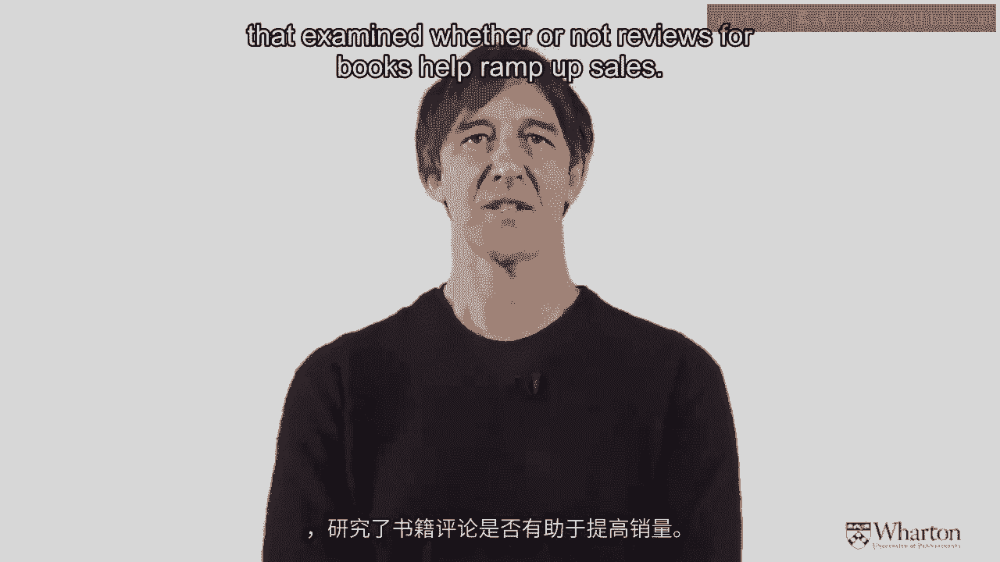

 And they looked at two different websites Amazon。com and Barnes and Noble。com and what。

 they found is most of the people who write reviews are in fact fairly generous。

 There are five possible stars that you could give for a book at Amazon and the average。

 rating at the time of the study was about 4。1。 On Barnes and Noble for whatever reason people are even more generous the average rating was。

 about 4。5。 One star reviews are pretty rare that's the lowest review。

 So one star reviews would show up about 7 percent of the time on Amazon and about 3。

 percent of the time on Barnes and Noble。 So did all of this reviewing have any impact on sales？

 Yeah you better did。 So what the authors found is if you got more positive reviews sales of your book went up。

 And they also found if you got more negative reviews one star reviews then sales of your。

 book went down。 And in addition there was kind of a subtle effect of this negative information such that。

 if I got a negative review on a book that I'd written a one star review that seemed in。

 some sense to also slow down the rate of positive reviews that were coming along subsequently。

 So again a very very interesting study showing that reviews are affecting sales。

 Now of course this might motivate people who are selling books to review their own books。

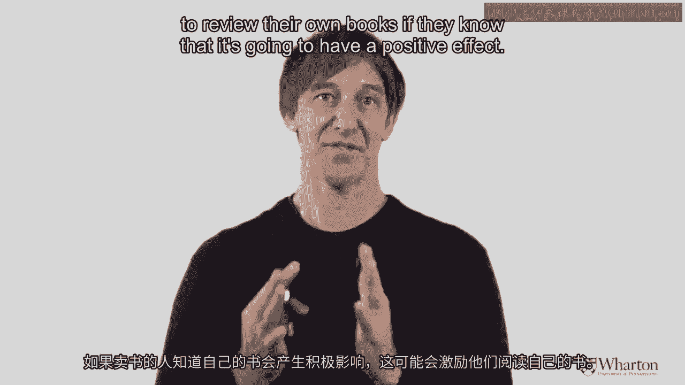

 if they know that it's going to have a positive effect。

 So what I'm showing here and you can read the articles and the links is a picture of。

 a very interesting lady Harriet who has reviewed over 25，000 books on Amazon。

 So I'm not suggesting that she hasn't but it's just interesting to notice that one person。

 can generate so many reviews。 Now in addition to our friend Harriet there was another fellow who was doing something。

 perhaps a little more devious but in some ways quite clever。

 So there's a fellow called Mr Rutherford you can read the article I've provided a link， for it。

 What he decided to do was to offer himself as a review writing service for authors。

 So if you just written a book he might be willing to write 20 reviews for you for some。

 of money let's say $100 or $500 completely of course fake reviews。

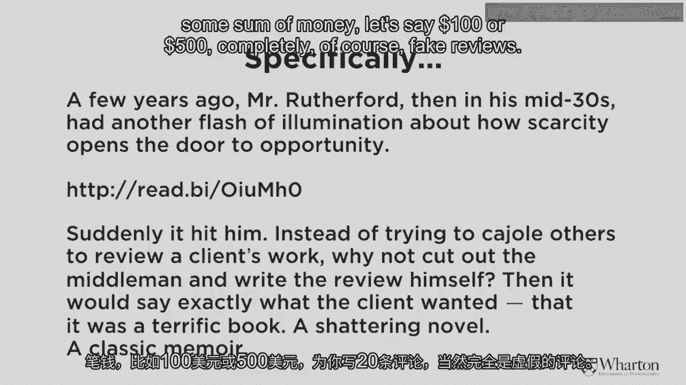

 And what was interesting about this is Mr Rutherford was making about $28，000 not a year。

 but a month by doing these fake reviews。 So what does this tell us？

 It tells us that information is powerful and it also tells us that sellers might want to。

 manipulate the information that's offered。 So you might be sitting there scratching your head as I was when I first read that story。

 Somebody making almost $30，000 a month providing fake reviews。

 So clearly this is a bit of a problem and it's come to the attention of many other writers。

 and kind of experts and so how might one address this problem of fake information being out。

 there affecting people's behavior。

 Well on the next slide I'm showing a story you can read the full story in the New York。

 Times about a gentleman who's an expert in something called data mining。

 So what he would do is he would go through all of the text of reviews and try and figure。

 out what reviews are real and what reviews are fake and so on。

 Now even though that's a pretty sophisticated technique it turns out that it's actually。

 difficult for a computer to figure out what's really true and what's not under certain kinds。

 of circumstances。 So it would be difficult for example for a data mining algorithm to figure out if I was。

 saying something sarcastically for example。 So those nuances of language might be quite difficult。

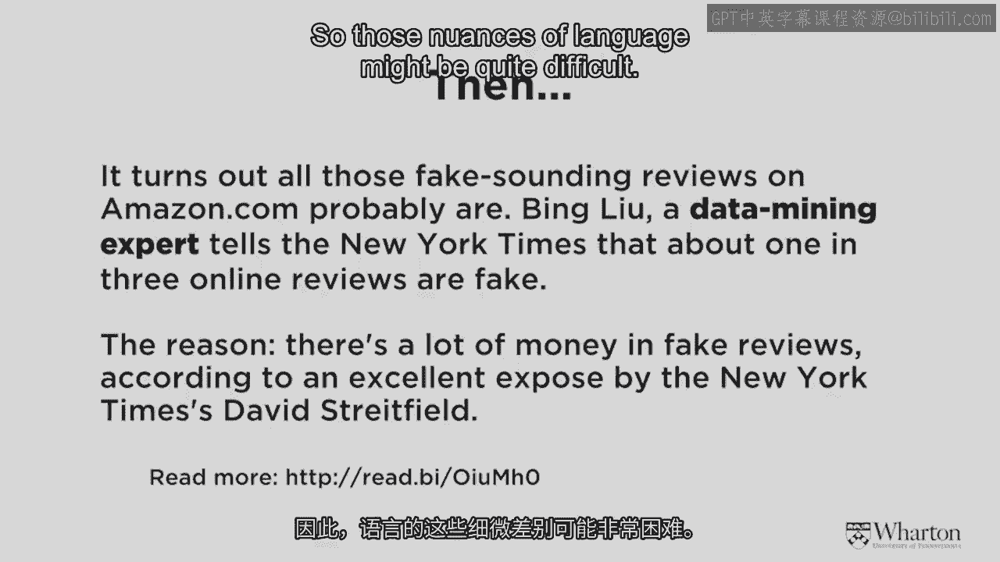

 So to look at this question from a different perspective， Deena Maislin who's a professor。

 now at USC she was one of the original authors on the other study I mentioned about looking。

 at the effect of reviews on Barnes and Noble and Amazon decided to tackle this problem。

 in a very very interesting way。 So let me illustrate that for you。

 What she did is she wanted to compare ratings on TripAdvisor versus ratings on Expedia for。

 the same property。 Well let's choose a property so we can all be clear about what we're talking about。

 So it turns out there's a share of no-tell on the corner of 36th and Chestnut Street here。

 in Philadelphia。 So Deena and her co-authors were curious as to whether the reviews of that property were。

 the same on TripAdvisor as they were on Expedia。 So most of you have probably been to those websites and you'll notice again it's a 5-star。

 review system and you get a histogram of reviews。 So some number of 1-star reviews， 2-star reviews。

 3-star reviews， 4-star reviews and 5-star reviews。

 Now if both of those sites are providing the same objective information those histograms。

 should be identically matched。 So that was the test that she wanted to see were the histograms different for the same。

 property。 And what she found was on TripAdvisor there were slightly more 1-star reviews for certain。

 properties and also slightly more 5-star reviews。 And when she dug in a little bit more what she found was if you were operating that hotel。

 the Sheridan Hotel at 36th and Chestnut Street and located quite close to you was a competitor。

 a competitor who perhaps just owned their own little hotel。 Let's call it Chris' Hotel。

 Chris our friendly videographer and Chris' hotel is competing。

 with the Sheridan and because he's a one-man shop not really accountable to a big organisation。

 as I would be if I were a manager at the Sheridan he would be more likely to write a。

 one-star review and try and knock his competitor， the Sheridan at 36th and he would be more likely。

 to write a 5-star review and to praise his own property。

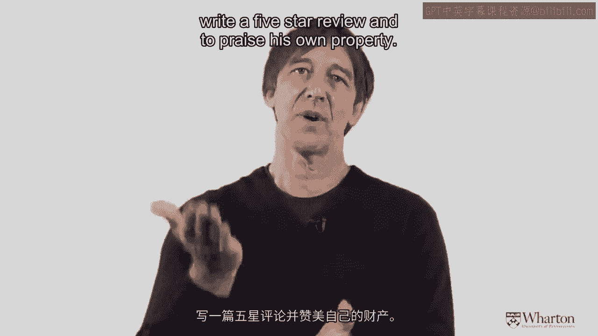

 That's what Dina and her colleagues found。 So again it's very very interesting to think about whether review information is valid。

 because certainly people are acting on the basis of review information。

 So this is a good point for me to now summarise the key idea if you were to introduce reviews。

 into a market what you'd want to do is to make sure those reviews are objective and verifiable。

 And so what Dina did in her study is she made an assumption that reviews on Expedia are。

 more objective than reviews on TripAdvisor。 So I'll let you think about that for a moment as to what the reason might be if you've looked。

 at both of those sites。 I use both myself when I'm deciding where to stay。

 TripAdvisor was less objective than Expedia for the following reason。

 In order to be able to post a review on Expedia you have to have stayed at that property within。

 the last six months。 So Expedia will send you an email and they'll know from your credit card receipt that you。

 actually booked and you stayed there。 Whereas at TripAdvisor you are supposed to have stayed there but that need not be the。

 case。 I could go and write a review for a property that I had not stayed at。

 So again I think this is a fascinating area of online offline competition and again I'd。

 like to challenge and encourage those of you out there who are thinking about starting。

 your own business if you can start a business that brings information into a market。

 That can be something very very powerful if you think about the story of how TripAdvisor。

 has grown into a multi-billion dollar company that's essentially just gathering and processing。

 and providing review information that's generated by all of us。

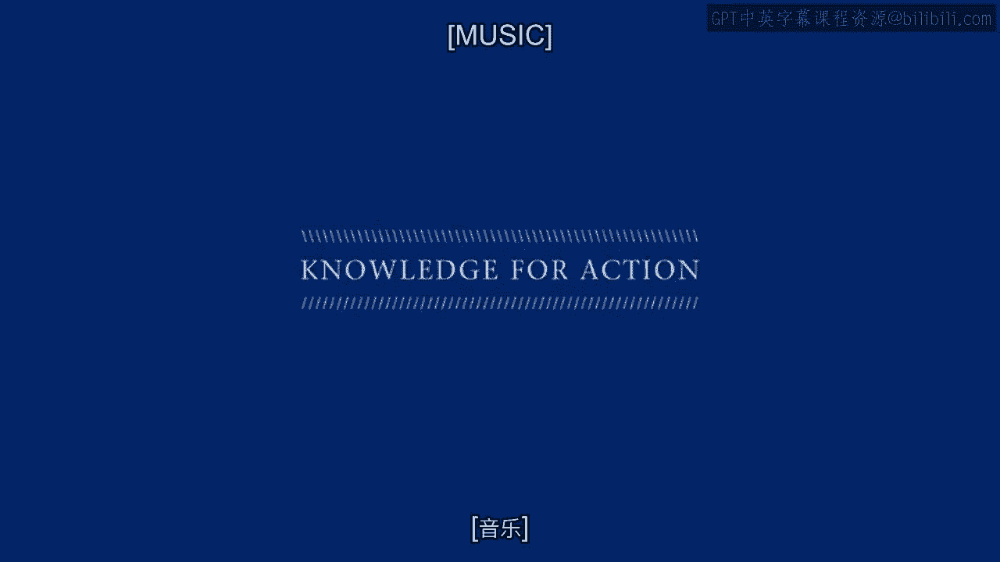

 [MUSIC]。