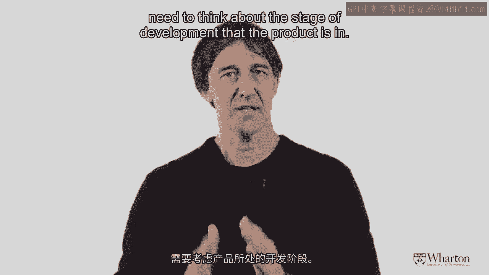

# 沃顿商学院《商务基础》｜Business Foundations Specialization｜（中英字幕） - P152：9_产品生命周期3 29.zh_en - GPT中英字幕课程资源 - BV1R34y1c74c

 [MUSIC]。

 So welcome again everyone。 Now we're getting into Module 2。 Module 2， I think。

 is going to be really fascinating。 It's all about how to try and find those lead users。

 those special people who are really going to engage with our brand。

 It's going to be about how they connect to each other and various networks。

 how influence spreads and all of those good and kind of interesting things。

 But just to establish our platform， I want to share with you one of the most， I think。

 fundamental things that we think about in a marketing course or in a marketing sense。

 This is the notion of the product life cycle。 So the product life cycle says that every product goes through at least four stages。

 First of all， the product is introduced， then it goes into a growth phase， then it matures。

 and then eventually the product declines。 And of course， at the very beginning。

 there has to be some research and， development done to bring the product to life。

 So as you can see on the screen， the sales kind of take off， peak。

 and then they peter out at the end。 Now of course， underlying that。

 that's the result for the product， are the people themselves who are driving the process。

 And what we want to do is to try and figure out how to get that process going as quickly as possible。

 and to identify the people on the left of the curve who are really the innovative ones。

 who are going to spread word of their mouth and bring other people into the fold。 So again。

 this is an old idea from Everett Rogers who is a professor who came up with。

 this theory of diffusion of innovation。 And he said， you know。

 there are kind of five sorts of people out there。 And maybe you can think about what group you fit into for what kinds of products。

 So first of all， there are innovators。 Those people are the people who just run out and buy new products on their own without any。

 need to talk to other people。 And they're thought to account for about 2。5% of the population。

 The next group are the so-called early adopters。 They account for about 13。5% of the population。

 Going on from those people are the early majority。

 They are another 34% so now we're at 50% of the curve。

 Now we're going to move over to the right side。 The next 34% of the so-called late majority。

 And then finally， this is probably my favorite group are the laggards。

 These are the people who come to the party last。 Now it's quite possible that you could be an early adopter when it comes to cell phone technology。

 You're one of the first people to get the Samsung or the iPhone。

 But you're a laggard in some other area。

 You're a laggard when it comes to televisions。 You don't really care about having the latest TV。

 So what we're going to be talking about over the next few sessions are how do we really。

 focus on those innovative people？ How do we understand their networks？

 And how do we understand how information flows？ This is also a very foundational concept for part number three or week three。

 Because when we think about doing advertising or setting prices or sending products through。

 a channel， in many ways we need to think about the stage of development that the product， is in。

 So we may price differently at the beginning of the product lifecycle compared to the end。

 We may use different kinds of advertising messages。

 And certainly we will have different sorts of distribution channels for the product。

 So again， this is a good one to internalize。 It's somewhat controversial sometimes。

 but I think it's still a great way to get our， minds around how products pick up。

 take off and eventually go into decline。

 [MUSIC]。

