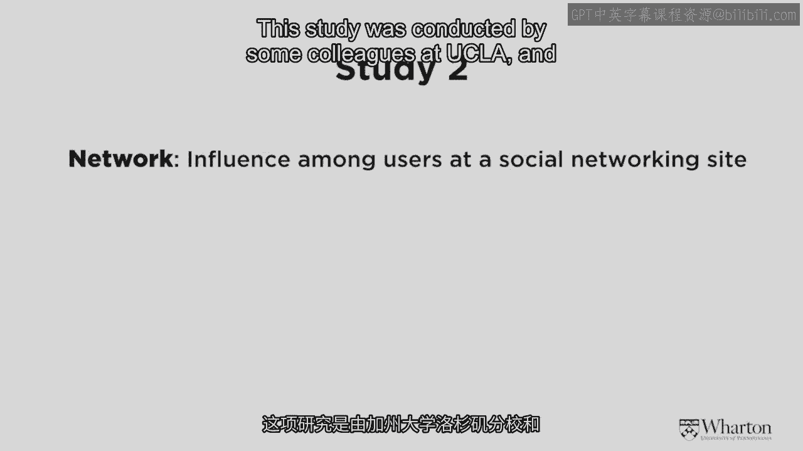
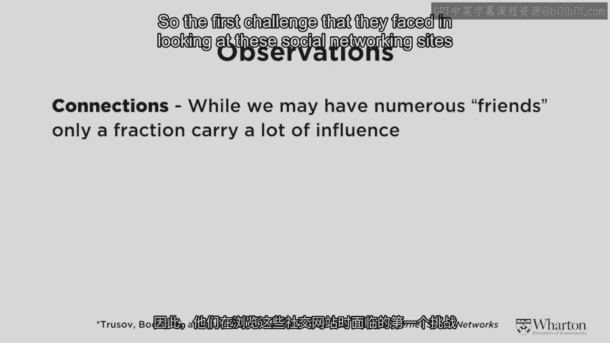
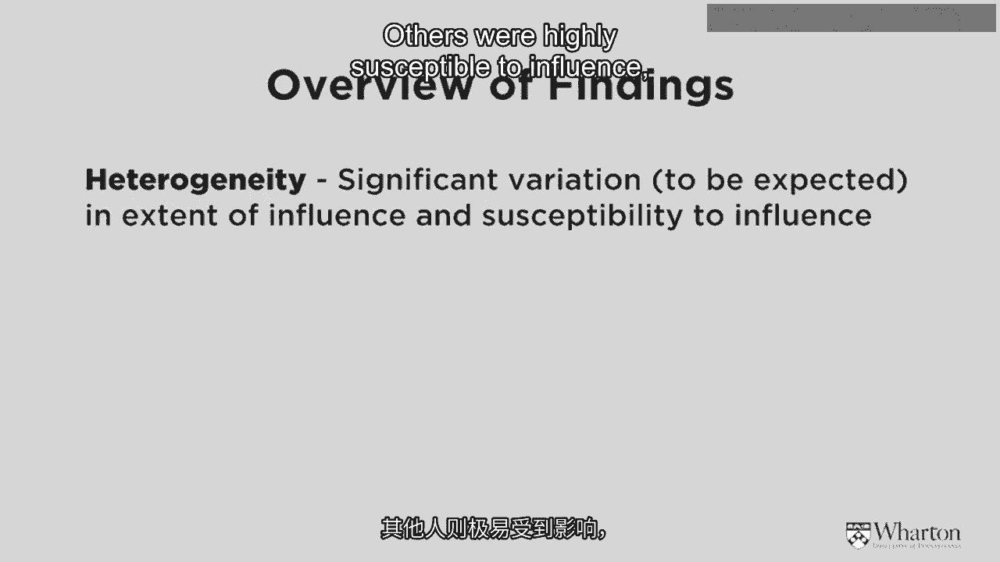
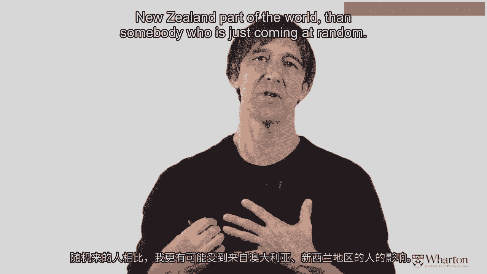
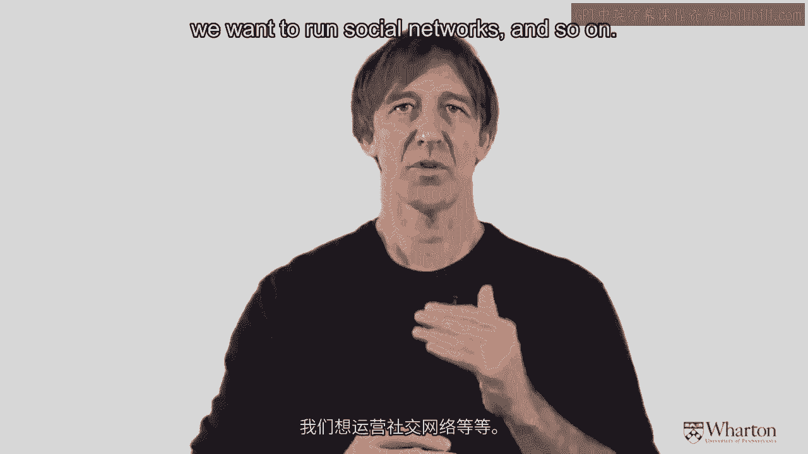

# 沃顿商学院《商务基础》｜Business Foundations Specialization｜（中英字幕） - P153：10_更多影响力案例8 42.zh_en - GPT中英字幕课程资源 - BV1R34y1c74c

 So we've just completed study number one。 Study number one was looking at the。

 spreading of lead users through neighborhoods。 Now what we're going to do。

 in study number two is we're going to look not at neighborhoods directly we're。

 going to look at actual individuals influencing each other in a social， networking site。

 This study was conducted by some colleagues at UCLA and also at。

 the University of Maryland。 So let me go through the problems or the challenges。

 first that these authors faced in trying to do this study。 First challenge they。

 face is if you're a friend of someone on a social network that could be a very。

 strong tire or it could be a very weak tire。 That friend could be your best friend。

 that you grew up with and you've known since five years of age or it could just。

 be somebody that you met at a function and you exchanged business cards and。

 became connected as friends on Facebook。 So the first challenge that they faced。

 and looking at these social networking sites is what the friend actually means。

 for some people it could mean a very very strong thing for others it could be， very very weak。

 So they didn't want to necessarily look at connections among。

 friends per se。 The second thing that was kind of challenging is these。

 databases are huge and the number of connections is very very large so they。

 had to think of some simple statistical way of trying to get at that。 And the goal。

 of the study was to try and understand who's influential for whom。 So if Chris and I。

 connected on a social networking site am I influencing him or is he influencing。

 me that was the goal of the study。 So for those of you who enjoy a little bit of。

 history I did some digging around and it turns out that the very first social。

 networking site at least in the United States was one called classmate。com。 Since。

 then at least in the US we've seen many come and go there's been friends to。

 there's been my space and of course now there's Facebook and who knows。

 Facebook seems here to stay with over a billion people currently part of that。

 community。 So the researchers wanted to understand who in the network is， influential for whom。

 So what they decided to do since the measure of just pure， friendship is not that diagnostic。

 A friend could be someone that I barely， know or a friend could be someone that I've known for 20 years。

 So the way they， measured influence was quite clever。 What they did was try to figure out if my。

 activity in the social network was influenced by somebody else meaning after。

 they did something I also started to follow their activity as well。 So to go。

 back to the example of Chris and I let's say being connected on Facebook he's。

 going to be influential for me。 If after he starts posting content and photos and。

 videos I start going to his site and start looking at it。 I'm not influential for。

 him if I'm doing those activities but that's not affecting his activity at all。

 In simple terms that's what the authors were doing here with this study。 So what， did they find？

 Well they wanted to try and figure out who was going to be。

 important and who was not going to be important and on average how much。

 influence goes on in a social networking site。 Now if you think back to some of the。

 terms that Pete mentioned in his part of the course probably the word that he， mentioned the most。

 Knowing Pete I haven't done the exact count as the word， heterogeneity。

 Heterogeneity is one of our great buzzwords in the marketing， Coursera course。

 It just means people are different and we have to understand the， extent of those differences。

 So there was huge variation they found in the level， of influence that was going on。

 Some people were highly influential， some people， were not influential at all。

 others were highly susceptible to influence， others。

 were not influenced by people at all。 So what are those numbers kind of look， like？

 Well here's the bottom line from the study。 The authors found that on。

 average you are influenced about by about 20% or one-fifth of your friends on。

 Facebook or LinkedIn or whatever other social network you're active in。 About。

 one-fifth of them are influencing you and the other 80% or so are not really。

 having much sway over your behavior at all。 Now if we turn the problem around。

 this statistic to me is also very very interesting。 They found that about one。

 third of the people in the social networking site were not influenced by， anyone。

 These are kind of the maverick people who just do their own thing and。

 they don't worry too much about who's posting what and other things that are。

 going on in the social networking site。 So you're influenced by 20% of your， friends。

 about 30% of you out there are not influenced by anybody。 Now let's sort。

 of dig under the hood a little bit and try to understand the extent of。

 variation and influence and what causes influence in a social networking site。 So。

 let me now explain the blue histogram that you see in front of you。 This is just a。

 histogram taken from the original article。 What it's showing is the amount of。

 influence that framed F has on user U。 And what you can see towards the left。

 hand side of the chart is there are many people whose influence factor if you。

 like is very very small close to zero。 And in the right hand side it's a little。

 bit like a long tail diagram again。 In the right hand side at the extreme level。

 there are some people a smaller number who are hugely influential。 And on average。

 about 20% of the social network people in the social networking space are， influencing other people。

 So what you can see on the screen now is another chart。

 from the paper and I'm just going to explain the key results here。 I think。

 these results actually are very interesting。 Actually fascinating results。

 and things I think that we could not only use but maybe also relate a little bit， to our intuition。

 So the first thing the authors found was someone who's been in a。

 social networking site for a longer period of time on average is more。

 influential than somebody who's just joined。 I think that makes sense。 That's a。

 nice statistically significant effect。 The second effect which I think speaks。

 to cultural background as well as ethnicity is that people who are from。

 the same ethnic or cultural background on average have more influence over。

 each other than just random people。 This is again partly due I think to。

 homophily。 So I'm more likely to be influenced by somebody who's from the。

 Australia New Zealand kind of part of the world than somebody who's just coming at。

 random。 The next thing that they looked at was gender， influence。

 Now this one I find particularly fascinating。 So of course there are two。

 genders and four possibilities for influence。 Men could influence woman， men could influence men。

 woman could influence woman， or woman could influence men。 Out of those four possible combinations。

 there was only one statistically significant path of influence。

 The guys and the girls out there can probably relate to this。 Girls were。

 influential over guys but not the converse。 And again think about what the。

 definition of influence is in this case。 The definition is。

 when somebody is engaging in activity in the social networking site posting。

 commenting and so on other people are checking that out and following along。

 So when females do that males follow along but not the converse。

 So there's actually a lot of interesting research that's being done in the area。

 of gender segmentation on the internet and I think this is just another finding。

 that plays right into that。 The final result that they found。

 is to do not with who you are as a person or how long you've been on the side。

 but what it is that you talk about and what you say when you get there。

 and how you present yourself。 So we've already discussed reputation and review。

 This is a little bit of your personal reputation。 It turns out if you're on a。

 social networking site and you're indicating that you're looking to date。

 other people that significantly reduces your influence。

 So maybe think about that before you start posting too much。

 Okay what are the implications of this if we want to advertise。

 on social networks or we want to run social networks and so on。

 There's really three things there that I put on the slide but let me just go， through them。

 First of all simple counts of who is， a friend with whom are not really sufficient to understand influence。

 because sometimes a friend can mean a really really close friend。

 other times it's a person you've just met。 There's really too much variation。 So we。

 need different ways to measure who's influential， on a social networking site。

 Secondly the authors found when they did some， simulations if you take the very best people out of a social networking site。

 that dramatically reduces the value。 So just like in the real world。

 there are some special people who have disproportionate influence， over others。

 That's very very important to keep in mind。 And then the final point that's related to the one that I just made。

 is if you want to advertise on a social networking site or you want to use a。

 social networking site to promote the products and services that you may be。

 wanting to offer to people most of the payoff you get。

 is from identifying the very best and most influential people。

 Since many many people are uninfluential at all there's great returns to figuring。

 out those who are the best in this environment。

 [MUSIC]。

