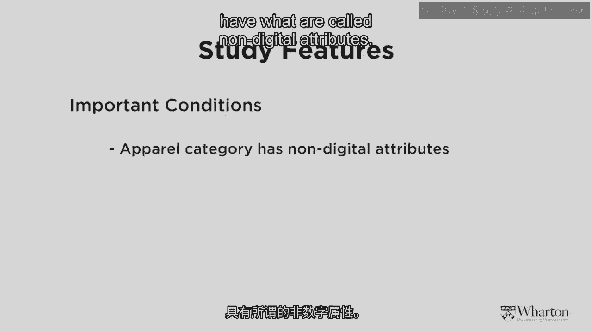

# 沃顿商学院《商务基础》｜Business Foundations Specialization｜（中英字幕） - P154：11_更多影响力案例(二)12 34.zh_en - GPT中英字幕课程资源 - BV1R34y1c74c

 So now just to recap we've done two studies that I think to show some very very interesting。

 findings about spreading contagion and influential users。 We've looked at demandfinnetgrossa。

com spreading through neighborhoods throughout the United， States。

 We've also looked at who's influential for whom in social networking sites。

 So we've been in the real world and in the virtual world now let's flip back to the real。

 world again。 So one area that gets looked out a lot for influence and contagion is among professionals。

 particularly professionals who are in the medical community。

 So what I'm showing you here is a diagram that's coming from a paper that was written。

 by two of my colleagues here at the Wharton School and also one of their colleagues out。

 at the University of Southern California。 This is a network you might recognize this kind of diagram from the very first thing that。

 we looked at when we started this discussion about networks and neighborhoods that YouTube。

 linked that I gave you to show the spreading of obesity that controversial study throughout。

 Boston and the United States。 This is the same thing here。

 What this is showing is among 174 physicians in the Los Angeles area who is connected to。

 whom and the size of the circle is also indicating some degree of influence。 So what the firm。

 the medical firm and the researchers wanted to understand is who in。

 this network is influential for whom and by how much。

 So again to go back to my all purpose friend Chris who's now going to wear the hat of， a doctor。

 Chris is a physician in LA and I'm also a physician。

 If he starts prescribing a certain drug to his patients， maybe I'm going to follow along。

 and do the same thing。 Now of course if the drug company knows which doctors are influential。

 that's very important。

 for targeting purposes。 So what the colleagues did is they used the methodology very。

 very similar to what I showed， you earlier。 Remember we had the four zip codes Z1， Z2， Z3， Z4。

 In this case it's the same idea but instead of zip codes they're doctors。

 So they looked at which doctors were connected to whom。

 That's the first piece of information and then secondly which doctors had already prescribed。

 the drug and which doctors had yet to do so。 So remember when we study contagion processes we need to know two things。

 Who's connected to whom and who's done what up until the current point in time。

 Now they found a couple of really interesting things let me give you the highlights。

 They measured influence and contagion in two very different ways。

 One way was to just ask people on a self-reported basis， "Hey are you influential？"。

 On a scale of one to ten。 And it turns out if people say they're influential it's not too bad but it's actually a relatively。

 weak predictor compared to an indirect measure of measuring influence which is whether or。

 not I'm citing Chris's work as a doctor。 I'm referring to his scientific study。

 So instead of looking at a measure of influence that is self-reported what they did is they。

 had another measure of influence that was in some sense more objective。

 Were doctors referring to each other's work and each other's scientific studies and they。

 found the second one was more important in predicting the way these drugs were going to， diffuse。

 So now let me give you the main takeaways from the study which I think was really really。

 fascinating。 So first of all the firm found it was really helpful for them to try and understand the。

 network structure of their customers in this case the doctors。

 And also in understanding this network structure they were able to identify that it could。

 be a contagion process was at work and the contagion process was driven by these influential。

 people。

 Now what's really interesting about this is some of the interests the influential people。

 weren't necessarily the people who put their hands up and said hey I'm influential but they。

 were the people that they figured out indirectly were influential that is the doctors to whom。

 others referred in terms of scientific studies and citations and so on。

 And there are also some quite special people who had their feet in different camps as it， were。

 So in the study they found that there were certain Asian American doctors who both were。

 influential for other Asian Americans but also for people outside of that ethnic group。

 as well。 So very very interesting it tells us that understanding the network structure is important。

 Number two that contagion occurs through the network and number three in all networks there。

 are certain special people who are more influential than others and our job as marketers is to。

 try and understand who those are。 So now let's turn to our fourth and final study so we've just finished a study of physicians。

 in the real world we've looked at some other things in the virtual world and now we're going。

 to go back to the virtual world again but with a real world twist。

 The company that we looked at in this case is a company called Benobo's has been around。

 since about 2007。 Selling means clothing online also selling through traditional retailers and I think I。

 mentioned them a little bit earlier in the piece as well。

 So this resulted in a paper that my colleague and friend Jay Young and I wrote about something。

 called neighborhood social capital and online sales so let's look in and see what that's。

 talking about。 So now I'm just showing you a screenshot of the company Benobo so you can see that they're。

 selling to men the target is male's age roughly 20 to 45 who are somewhat fashioned forward。

 and looking for affordable fashionable clothing。 So what we wanted to do in this case is we wanted to try and understand whether or not。

 there was real world interaction that was increasing the virtual world sales of this， company。

 So what I mean by that is that my friend Chris and I， so Chris is back in the picture。

 this time he's just a regular friend who wants a pair of pants。 He's not a doctor anymore。

 So Chris and I are friends and if Chris happens to buy some items of clothing from Benobo's。

 dot com and I see him wearing them and he tells me about them is that going to lead me。

 to then increase the chance that I buy from the same website。

 That's what we wanted to look at whether or not interaction in the real world was going。

 to lead to additional sales in the virtual world or at the website of the company。

 That was the first piece。

 Now the second piece again here it's on the slide we wanted to see whether or not there。

 was an effect of something called social capital。 Social capital is a really fascinating concept and it's one that was really coined I believe。

 by a fellow at the Harvard University's Kennedy School of Government， a gentleman by the name。

 of Robert Putnam who wrote a book called Bowling Alone。 Think of Bowling Tenpin， Bowling in America。

 The metaphor is Bowling Alone that people are maybe somewhat less social than they used， to be。

 Maybe we're spending all of our time online we're disconnected from other people。

 And so what he wanted to do is he wanted to understand in local neighbourhoods how connected。

 people were to others。 Did they participate in churches and tennis clubs and get together with each other and。

 so on。 And what he did is he did a huge survey called the social capital community benchmark survey。

 where he and his team literally went around to about 30，000 different zip codes within。

 the United States and they asked people like my friend Chris， "Hey Chris， do you like your。

 neighbours？ Do you trust your neighbours？ Do you interact with your neighbours？"。

 And so some very interesting data was collected about trust and interaction。

 So neighbourhoods with more trust and interaction and neighbourhoods that have higher social。

 capital we wanted to see whether in neighbourhoods with more social capital there would be more。

 sharing， more efficient sharing of information。 Now I just want to draw your attention to one other thing about this particular website。

 There are three conditions related to the product that are particularly important for， our study。

 The first is that items of clothing like the sweater that I'm wearing have what are called。

 non-digital attributes。 What does that mean？ Well a non-digital attribute is something that's very hard to represent perfectly over。

 the internet。 So price is a digital attribute。 If I go to Amazon and I see a book is costing $20。

 I know it's $20。 It's easy to communicate price information over the internet just as it would be if it。

 were positioned in a store。 However， to try and communicate how this fits and feels is actually quite difficult。

 So in that case transmission of information from one customer to another in the real offline。

 environment could be very very important。 Secondly in our study we wanted to focus on those customers who hadn't yet bought anything。

 from the website。 This was going to be their first time purchase。 Why is that？

 Well because once you've bought something from a website and you've tried on the sweater。

 you have your own judgment。 You don't necessarily need the opinion of other people unless it's about the overall。

 fashionability。 And then finally this is a product that's socially visible so it might be one that actually。

 generates a conversation。 So I might see Chris and say hey Chris。

 look very well dressed today where'd you get those。

 pants and then a conversation ensues。 So I just wanted to reiterate that this is a product category that's a little bit different。

 to most of the products that we've been talking about that are being sold by our friends at。

 QuizZ places like soap。com and diapers。com。 Those products have primarily digital attributes。

 There's no real surprise if you order some tied detergent and it shows up at your house。

 you know exactly what you're going to get。 There's no problem of communicating that through the internet。

 So this time we wanted to look at a business that was a little bit different。

 There was a fashion business that had these other properties。

 So let me show you what the raw data look like。 These are just the sales data for the company over the first I think 42 months or 3。

5 years， of operations。 You can see that over time the number of new customers coming in is going up。

 You can also see with the blue arrows that in neighborhoods where there's more trust。

 and interaction the sales are higher than in neighborhoods where there's less trust and。

 interaction。 So what does this all mean？ Well Jay and I put together a statistical model to try and understand this in more detail。

 And what do we find？

 And the findings are here shown on the screen but let me explain what's going on here。

 We found that about the 6，000 trials that we looked at at least half of them were influenced。

 by what we call social learning meaning the evidence from the statistical analysis suggested。

 that some of these new customers became customers because someone in their local neighborhood。

 told them about it。 So that's a pretty important effect half of all the sales of this company。

 Secondly related to that we found that the customers who came later on were the ones that。

 were most influenced by the social interaction。 This ties back to some of the themes that we've talked about earlier。

 The people who do things right in the beginning they don't usually need to rely so much on。

 the opinions of others they just like to go out and do stuff。

 The people who come in later they require more social information typically and that。

 was also confirmed in our study。 The second thing that we found that was really I think the most interesting finding to us。

 was the following。 In neighborhoods where there's more trust and interaction。

 more social capital there's， not necessarily higher sales so it's not that just neighborhoods with trust and interaction。

 have people who buy more stuff but what happens is in those neighborhoods when information。

 gets transmitted it's more believable and it's more trustworthy and it's more efficient。

 So if Chris and I live in a neighborhood where we trust each other and like each other a。

 feed tells me something I put more weight on it。 That's the result that was coming through here。

 So how could the firm or no-post。com or any firm kind of use this information？

 Well when we did our analysis we were a little bit restricted to only the zip codes where。

 the social capital survey measures had been collected so there were many many zip codes。

 in the United States for which those measures were not collected。

 Now earlier I think I said that Mr。 Putnam went out and he measured 30，000 zip codes actually。

 just to be clear he measured 30，000 people who were living in about 1000 zip codes。

 So if a firm really wanted to use this clearly only knowing about 1000 zip codes is not quite。

 enough。 So here's a question I want to put to you all out there and then I'll give you the answer。

 If you could think of a proxy that means some other variable other than the true measure。

 of social capital that would indicate that males aged roughly 20 to 45 were socializing。

 together and had some level of social capital what might it be？

 The number of hospitals per zip code， number of churches maybe， number of rugby clubs。

 okay you're going in the right direction turned out that the number of bars and liquor stores。

 per capita was a very nice predictor of the efficient diffusion of information among this。

 group。 Why am I telling you this because I want you to be creative and to think a little bit expansively。

 when you start to use these concepts and you start to think about gee how could I use this。

 idea for my own business that I'm working on or the company that I'm working at now。

 So that brings the conclusion to this piece of our discussion。

 I hope you enjoyed those four studies。 Number one the netgrosser。com。

 number two the social networking side of influence， number。

 three looking at diffusion of drug prescribing behavior by physicians and finally how offline。

 interaction is affecting people's sales of products on the internet for the notos。com。

 [Music]， [Music]。

 [BLANK_AUDIO]。