# 沃顿商学院《商务基础》｜Business Foundations Specialization｜（中英字幕） - P156：13_分销策略1 简介13 38.zh_en - GPT中英字幕课程资源 - BV1R34y1c74c

 [MUSIC]。

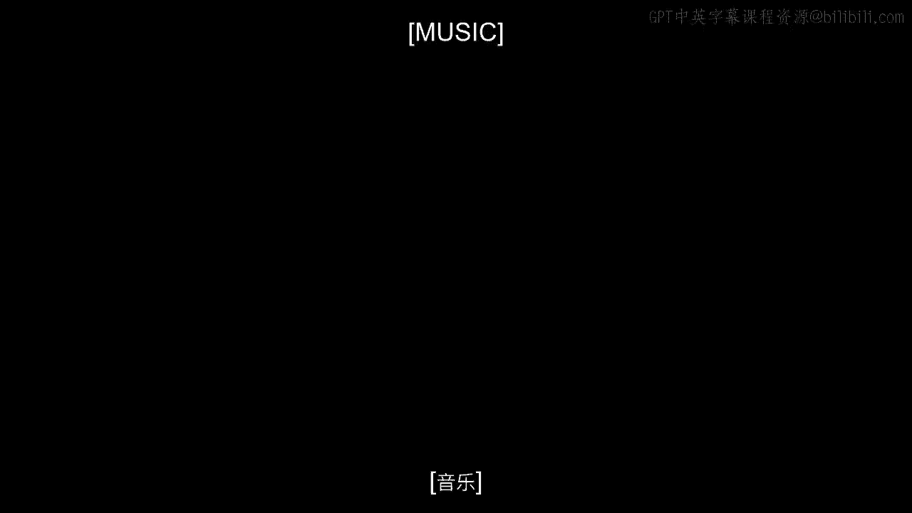

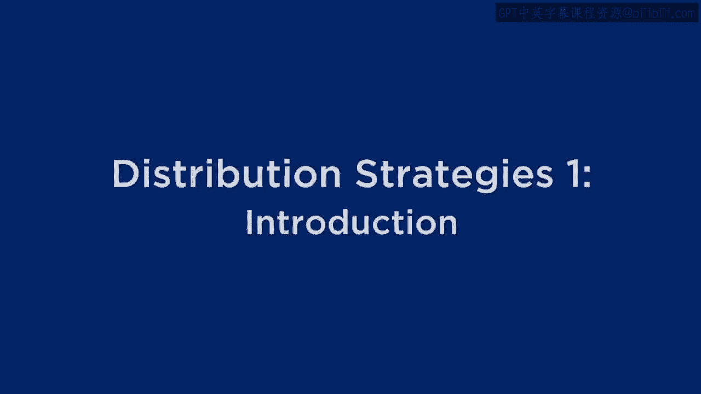

 So welcome back everybody， we're continuing with Go to Market Strategies。

 And this time we're going to talk about customer access and distribution。

 So the fourth P place distribution。 So let me just run through how we're going to address place as we go through。

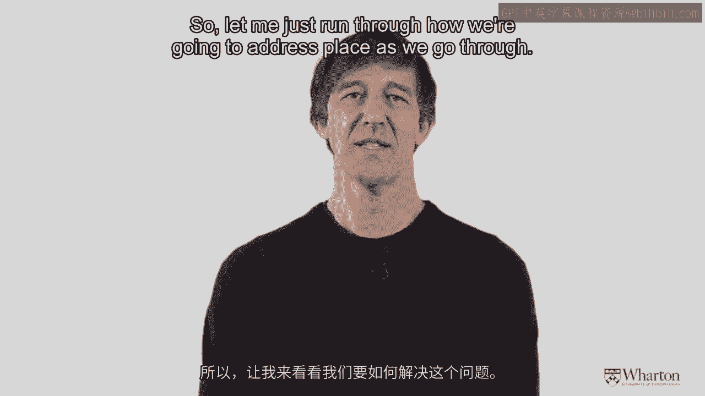

 There's really just going to be two key themes。 The first theme is how do channels of distribution develop the structure that they do。

 So who is doing what， who's getting the product to the end consumer。 And then secondly。

 how do channels get coordinated？ Because channels of distribution are often places full of conflict。

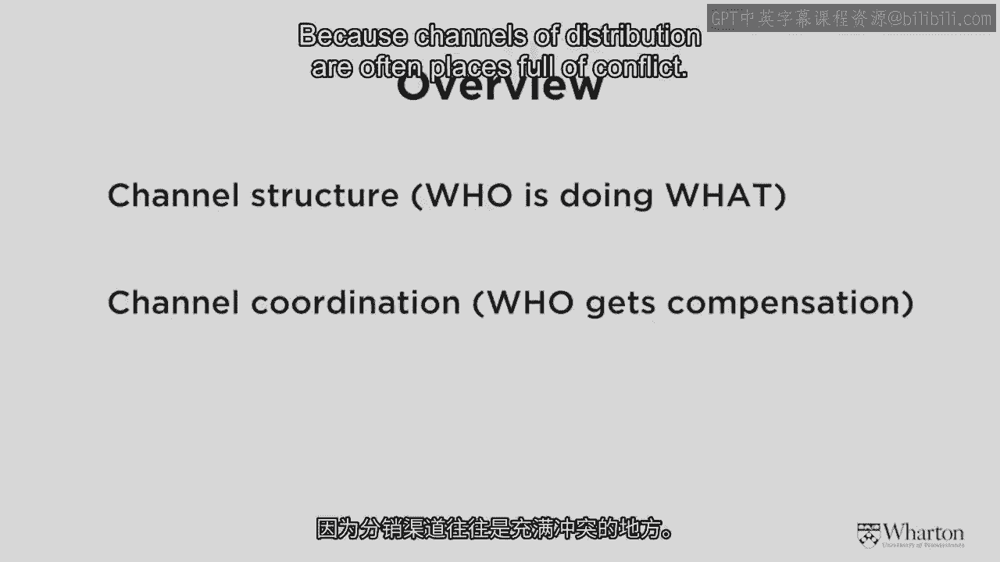

 So for example， I'm Procter and Gamble。 I'd love it if all Walmart did， it was only sell tied。

 But of course， Walmart wants to have a lot of variety on the shelf。 Why is that？

 Because not everyone wants to buy tied， people want choice。

 And so oftentimes in a channel of distribution， there is inherent conflict。

 So we're going to look at the structure of channels and。

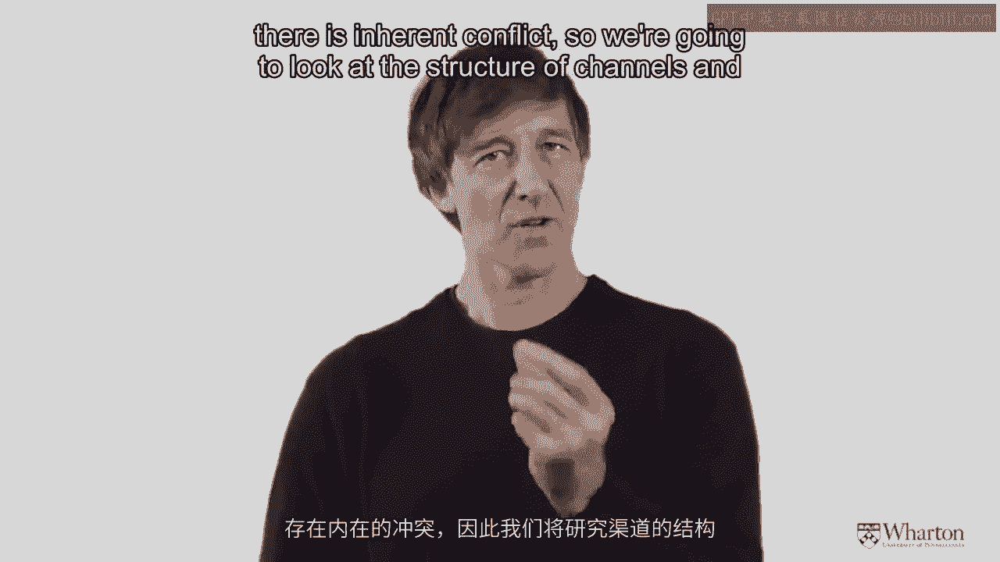

 also how channels get coordinated。 So let me begin with some interesting things I think about distribution or place。

 We call place sometimes the final frontier， the final P。

 Oftentimes people don't think about distribution as a way to innovate。

 But I think they really should， and here's some reasons why。

 So distribution can really be an important source of sustainable competitive advantage。

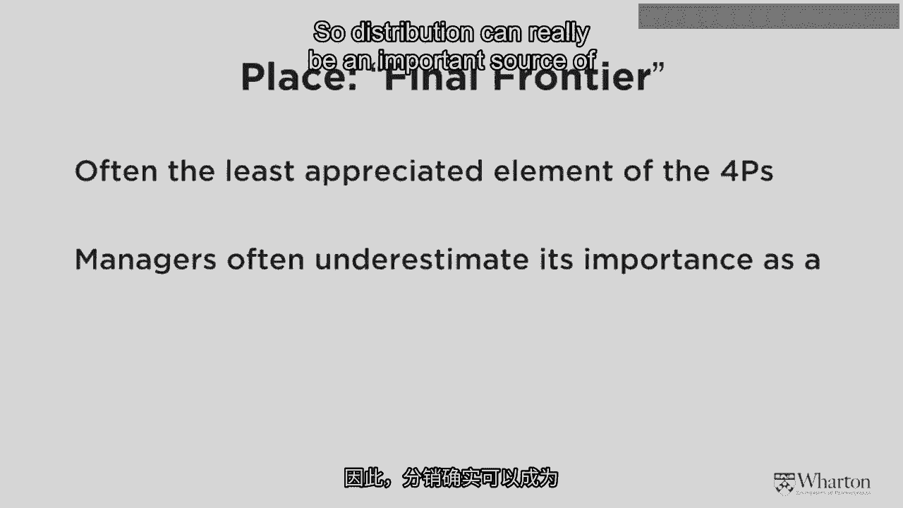

 So think about the kind of advantage that a company like Apple has developed。

 through the fact that it owns its own stores and it owns the experience with the customer。

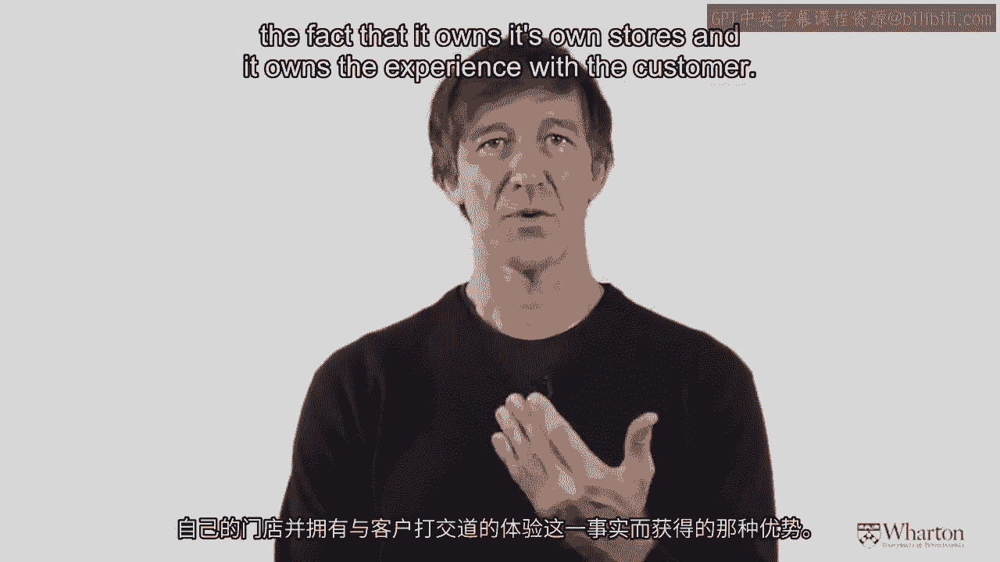

 Secondly， distribution can provide increasing returns to scale。

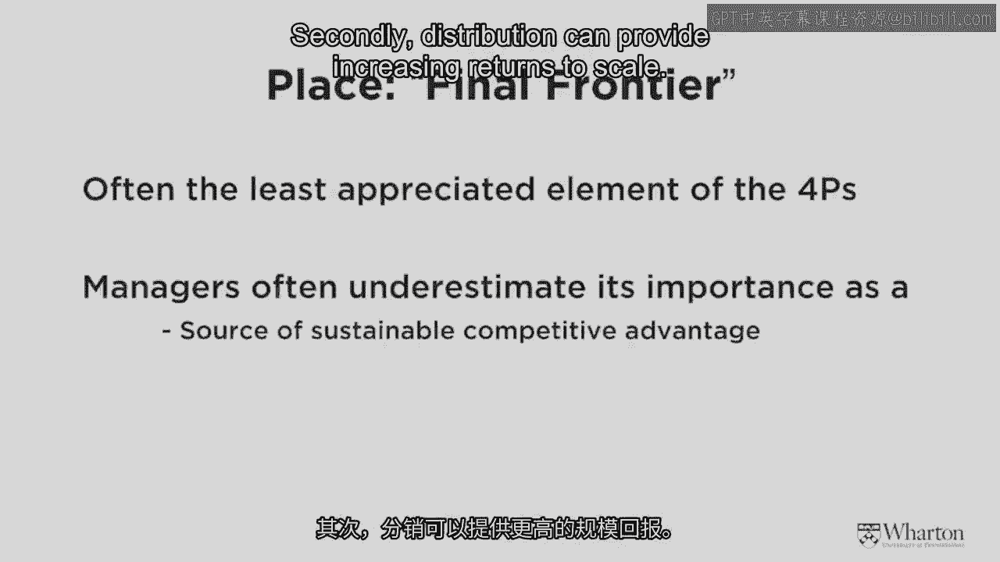

 What do I mean by that？ If I'm a large brand like Coca-Cola and I'm distributed by every single outlet in。

 the state of Pennsylvania， I may get a disproportionate return to market share。

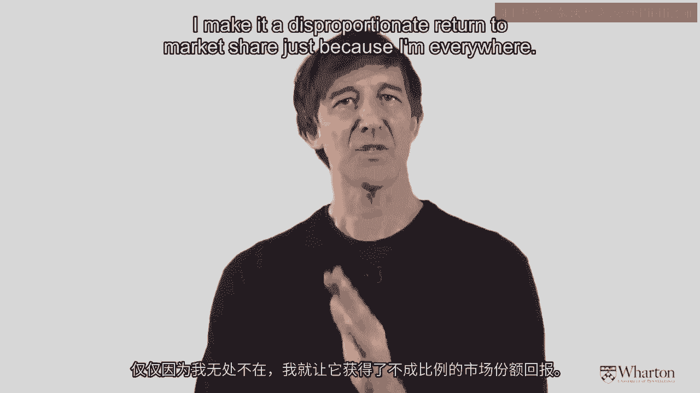

 just because I'm everywhere。 And then the third thing to think about is distribution decisions can be sort of。

 long lived and difficult ones。 If you build physical distribution。

 it's going to cost you some money to do so， so you need to really be sure about the return that you're going to get。

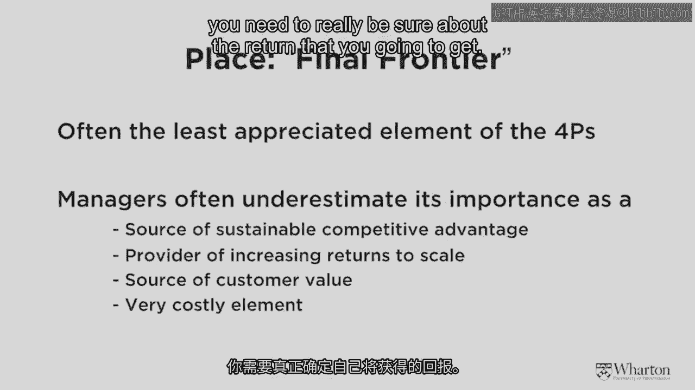

 Now， as I said earlier， I think distribution is often overlooked， but。

 also it's a place where there could be tremendous value unlocked in terms of new， business ideas。

 new services and new products coming into play。 So think about the way that you can change the nature of the distribution。

 channel by taking a hard good and turning it into a soft good。 Let me give you an example of that。

 So when money is money and only cash， there are certain things you can do with it。

 But when money becomes credit or when money becomes available on your mobile， phone。

 that really frees up the way people can transact。 If you think about a movie。

 when a movie can only be watched in a fear that's very。

 different than being able to stream a movie onto your mobile phone。

 So anytime a good is a hard good and can be changed into a soft good through an。

 innovation and distribution， that can really change the nature of markets。

 Even what we're doing now through our Coursera class is kind of an example of， this。 Normally。

 the Coursera course， or the marketing course that Barbara and， Pete and I teach together。

 would be taught in a physical facility at the Wharton。

 School to a limited audience in a particular time。 Now， of course。

 it can be taught to a much broader audience and， we're really happy about that。

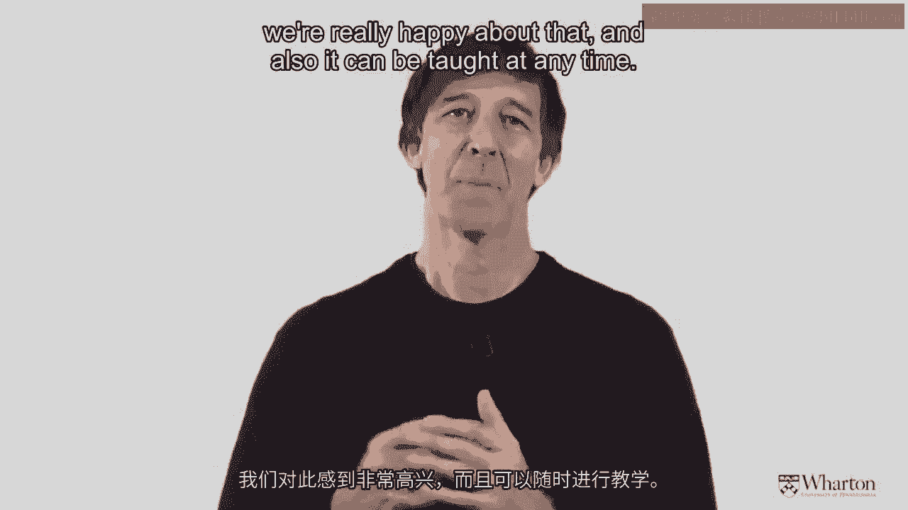

 And also， it can be taught at any time。 You guys can be watching these videos as many times as you like。

 So the first thing we're going to do in customer access and distribution is。

 think about the structure of the channel and who the key players are。

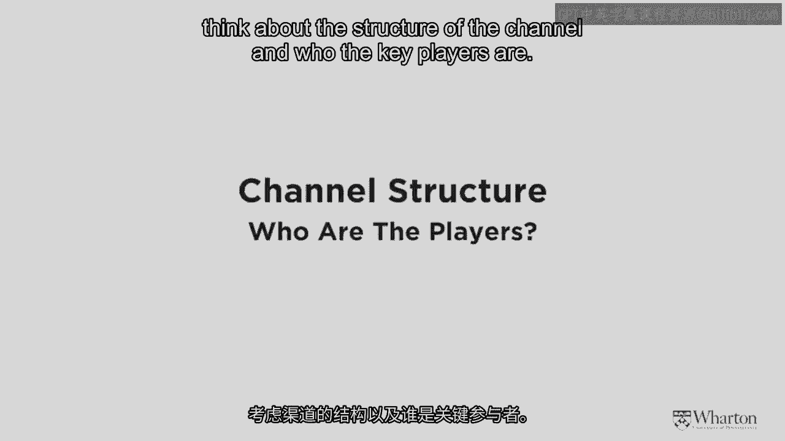

 And the most basic thing to think about here is whether a channel is direct。

 meaning that the provider of the good or service is going straight to the end user。

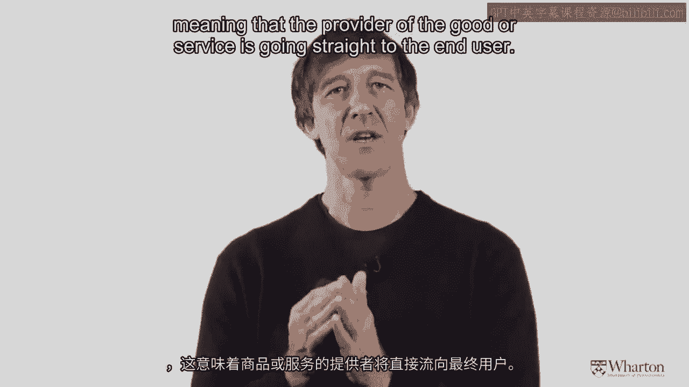

 or whether or not there are some intermediaries or layers involved。

 And let's look at this example on the slide of the American Hospital Supply。

 Company to kind of illustrate why sometimes it can be efficient to place。

 an intermediary between the producer of a good or service and the end user。

 So let's imagine we have a market with three manufacturers on the left hand side， the three squares。

 and three consumers indicated by the three circles。 Now。

 if every manufacturer had to sell individually to every consumer。

 that would be a possibility of three by three or nine different。

 combinations of buying and selling or， transacting occurring。

 as Barbara spoke about in the very first sessions。 On the other side。

 imagine now that a distributor or， middle person comes into this market。

 there are still three manufacturers and， three consumers。

 but now the three manufacturers just sell their product to。

 the distributor and the three consumers just visit the distributor or the retailer。

 So now there are only six possible interactions。 So by adding a distributor to a channel。

 creating an indirect channel， I dramatically reduced the number of transactions。 Well。

 probably not dramatically in this example， but if you look below the line， it's certainly dramatic。

 So American hospital supply found that it could reduce the total number of。

 transactions that will be needed in this market from 850 million by aggregating。

 down to only about 100，000。 It's still a lot， but it's a huge reduction。

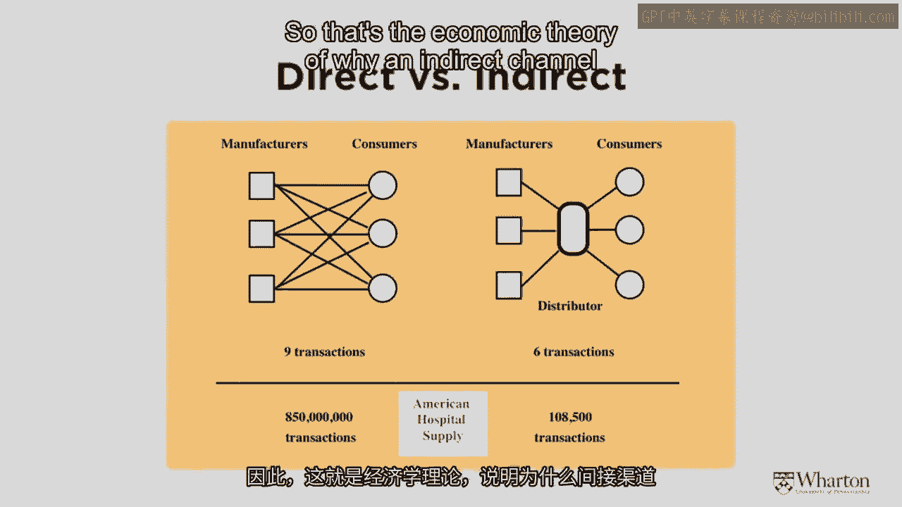

 So that's the economic theory of why an indirect channel is sometimes preferred。

 over a direct channel because it reduces the total number of transactions that are required。

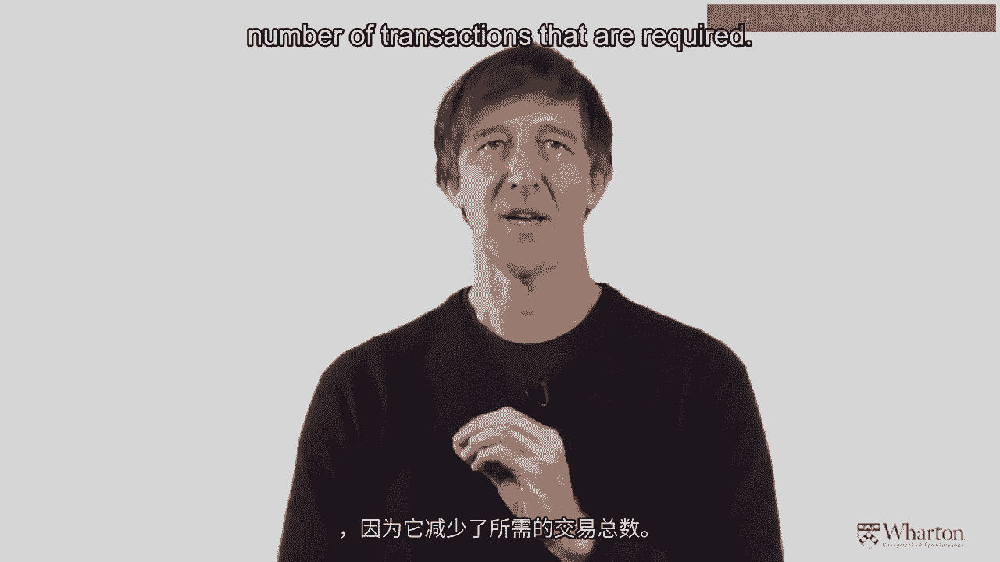

 So again， there are some efficiency advantages of having an indirect channel， over a direct channel。

 However， there are other advantages of going direct。 What might some of those reasons be？ Well。

 if I go direct to the end customer， I might create a special kind of barrier。

 to entry for others in that market。 So now for example。

 that Apple as a manufacturer goes direct to its end customers， through its own retail store。

 makes it difficult for other sellers of hardware and。

 related software to do the same thing or to do it just as well。

 Another reason for going direct is you get sometimes much better feedback from， the market。

 If you have to rely on some intermediary to tell you what customers really like。

 what variety and what prices， they may be unwilling to do so。 So by going direct。

 you can kind of go around or cut out the middleman。

 The third thing that you can do is you can sometimes bundle other goods or。

 services more efficiently， higher margin products。 So if I go into the Apple store to buy an iPhone。

 maybe they can also sell me a laptop， and some other devices while I'm in there because now the manufacturer is。

 controlling that channel and going direct to the end consumer。

 So what I'm showing here now is a diagram that kind of explains in graphical form。

 all of the things that happen in a channel of distribution， all of the various flows。

 that have to take place。 This is a pretty long channel of distribution， as you can see。

 going all the， way from the supplier of the good and service on one side， all the way to the end。

 customer on the other side。 So here are the five things that have to happen。

 And this is an interesting diagram because it also helps you understand how this flow。

 can be disrupted。 So first of all， physical product has to move from the supplier all the way down。

 to the end user。 Secondly， sometimes there's a flow of title or ownership。

 Of course there's a flow of payment， sometimes how the end user has to send。

 the payment back to the supplier。 And then of course there is information and promotional flows as well。

 So what I want us to think about here is in a channel of distribution。

 there are players who are responsible for the flow of both goods and information。

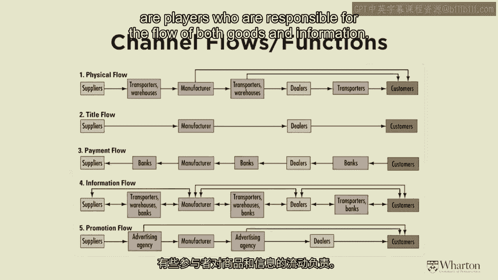

 So as you look at this chart， I'd encourage you in your own time to think about how。

 the channel of distribution could be disrupted in a way that's very， very innovative that。

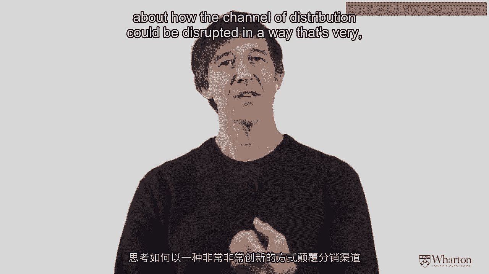

 might lead to a new business。 So let's look at the one on the top。

 which is the physical flow of goods and services。 And let's relate that back to our course case。

 quidsee。com。 So how do quidsee change or disrupt this existing channel of distribution？ Well。

 in the prequidsee days， if I wanted to buy some detergent， I had to go to a supermarket。

 who'd received that product from a manufacturer via warehouses and distributors。

 pick it up myself and take it home。 What quidsee did is innovating on the delivery to end customers by sending that product via。

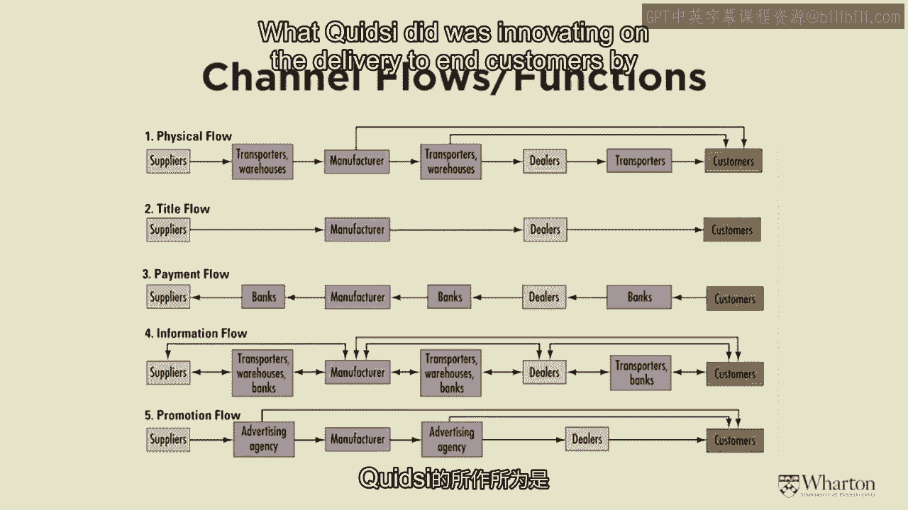

 Federal Express or UPS directly to my home。 We're seeing of course increased innovation in this area too。

 as companies like eBay， Google， Amazon and so on， are figuring out ways to either send things directly to a home。

 if they're physical goods and services， or perhaps send them to intermediary places。

 like existing stores where there are lockboxes and we can then go and pick them up。

 The same thing also applies for services， not just for physical products。

 Think about the process whereby in the old days you might want to book a hotel if you。

 were going to New York City for a vacation。 You might have to call a travel agency or even go to the hotel website and find out if the。

 product was available or call somebody。 Now of course that's been disrupted by apps such as Hotel Tonight。

 You can just go onto an app。 You can see all of the hotels in New York City where you can stay for one night at whatever。

 the rate is for a single night and you can just book directly on your mobile phone。

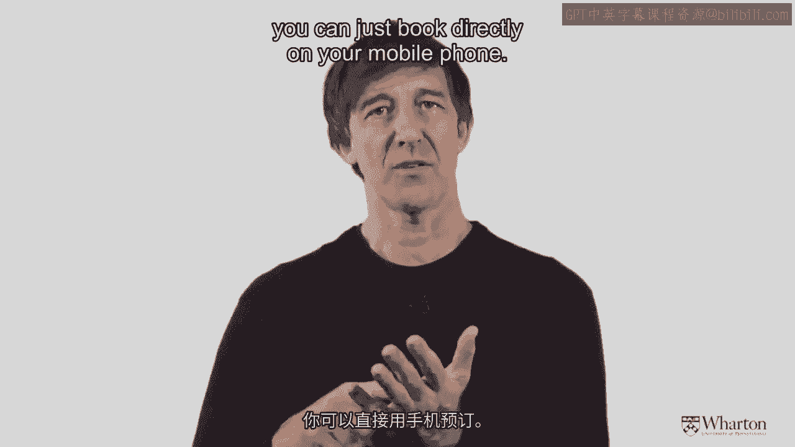

 So again， this is a very， very interesting chart because I'm sure as you go through you。

 can think of ways that this system can be disrupted either for information or for physical goods。

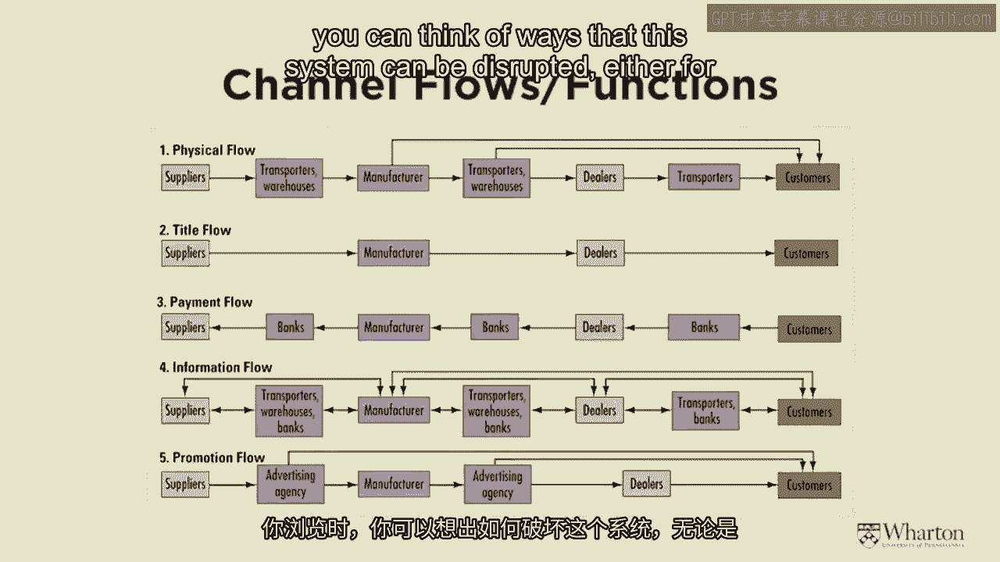

 or for title and so on。 One other example I think is an old one but very， very instructive。

 If you go back to what Michael Dowled did way back in the 1990s， he realized that there。

 was a physical flow of computers where the manufacturers like Hewlett Packard and IBM。

 and so on sold into distributors and the product eventually ended up on the shelf and computer。

 stores where Chris， my friend and I would go shopping and we would talk to a sales person。

 Amy who would tell us what we needed and so on。 So a very long complicated channel involving people handling inventory and everything else。

 At a certain point Michael Dowled realized well people know enough about computers now。

 to order them directly on their own。 They can call 1-800-DOWL。

 We can make it and customize it and ship it directly。

 So I can't really stress enough that distribution is a tremendous source of advantage of new。

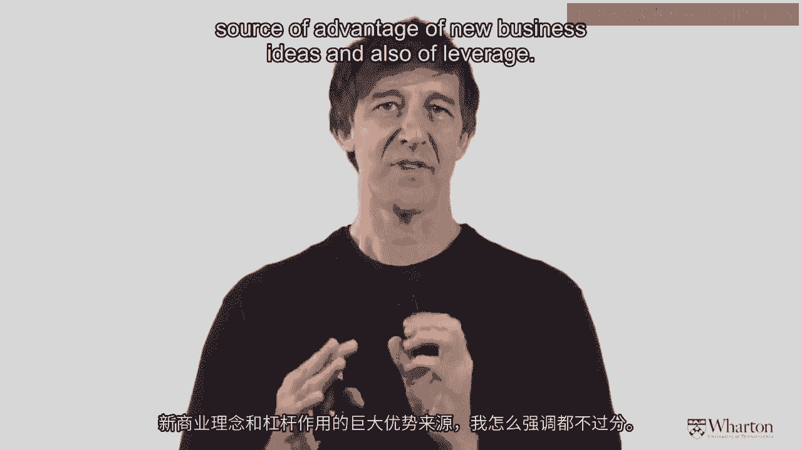

 business ideas and also of leverage。 I'll just give one more example just so you can think about this in simple terms。

 To complement the previous chart， think about distribution channels as providing flows for。

 physical things and for information things。 So what do I mean by this？

 So the distribution channel might be required to establish an assortment。

 It might be required to deliver things， to do installation and repair。

 Those are all physical things that need to be done。

 The distribution channel also needs to provide information to understand what customers want。

 generate leads， procure market feedback and so forth。

 So almost everything that's done in a distribution channel is some combination of a physical flow。

 and also an information flow。

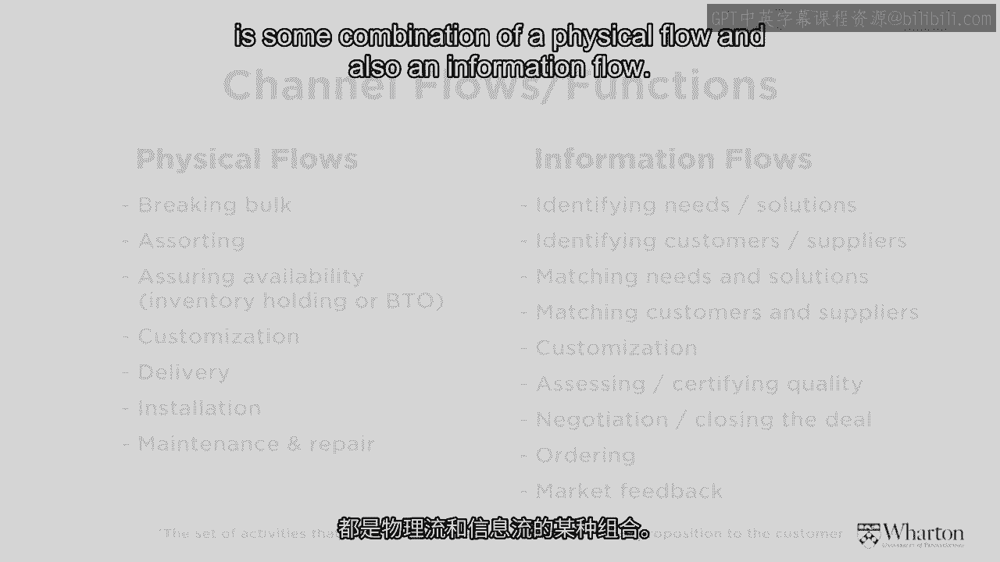

 So now what I'd like to do is to share with you a very useful tool or a very useful framework。

 for understanding how a distribution channel actually functions in terms of the activities。

 that need to be done。 It's called a hybrid grid。 A hybrid grid is just simply a matrix。

 I know you learned a lot about various matrices from Pete。

 This is the same idea in a different context。 So the columns of our matrix are going to be the activities that need to be performed。

 everything， from generating initial leads all the way through to the sale of the product or service。

 and then potentially even after sale。 The rows are going to be the individuals or entities who will be responsible for performing。

 these various tasks。 And the idea is you want to construct a system of distribution that's optimized for the customers。

 that you're trying to reach。 You want the exact right person to be performing the exact right customer such that the channel。

 operates efficiently and smoothly。

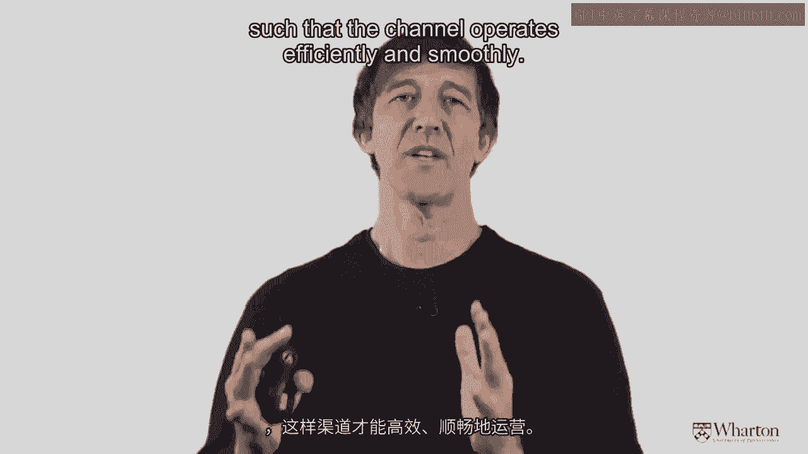

 So the example I'm going to give is interesting products。

 It's actually a business-to-business product sold to farmers。 It's called BGH。

 It's a bovine growth hormone。 I'm not suggesting that you should buy any of this but I'm going to show you how it works。

 in terms of the hybrid grid。 So the marketing challenges for the company Monsanto who produced this product were multiple。

 In particular they had four things they really had to worry about。

 So how could they educate farmers that this was a good thing to use on their herd？

 How could they assure quality？ How could they make sure that the farmers were using it correctly？

 And then also how could they recycle and take care of use syringes and so on。

 So the question was who on earth is going to do what？ So now let me show you this by way of a chart。

 Again you can see from the left to the right in the columns are all of the activities that。

 need to be performed。 Everything from generating awareness all the way through to monitoring that the vets and。

 the farmers are actually using the product appropriately。 On the columns。

 sorry on the rows we see all of the entities or individuals who are responsible。

 for various activities。 And where I blued in the square the idea is this is the optimal combination of activity。

 and person who's performing it。

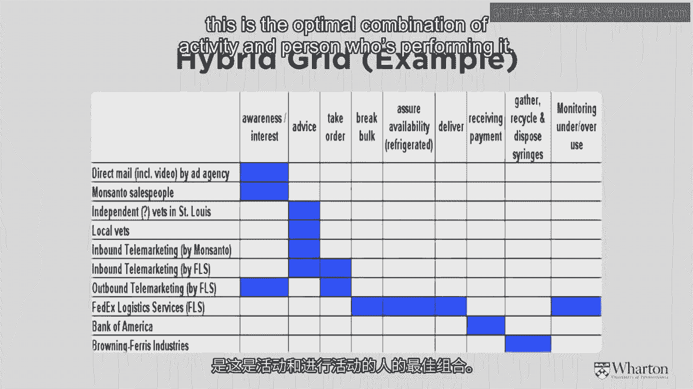

 And the way you figure out the optimal combination is to figure out two things。

 First of all who's best at doing this from a customer point of view and secondly who。

 is going to get the compensation or the rewards for doing so。

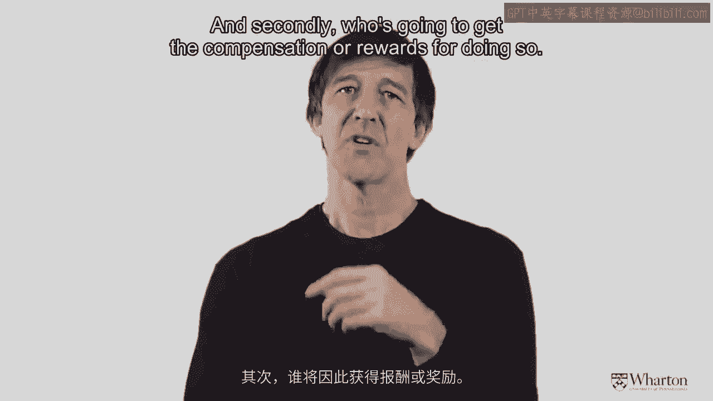

 So if we start for example with generating awareness and interest that is a task that。

 was going to fall to the agency， outbound telemarketing and also Monsanto sales people。

 That's not something that local vets are probably going to be motivated to do unless they're。

 going to be somehow compensated for doing that。 So the idea is it's the personal entity that's best at doing it and also the personal entity。

 who is going to receive the benefit from actually undertaking the effort to engage in that activity。

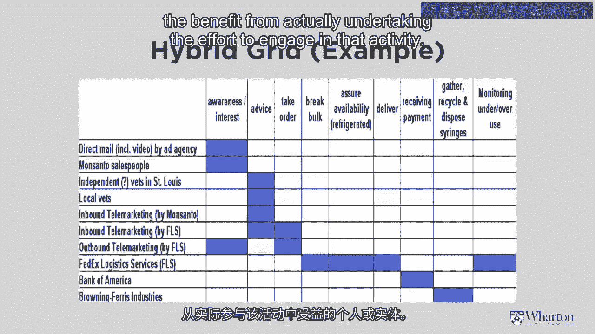

 So again if you wanted to apply this I would encourage you to take your existing business。

 or business idea if you're an entrepreneur and try to figure out what needs to be done。

 activities and then who should actually be doing these activities from the point of view。

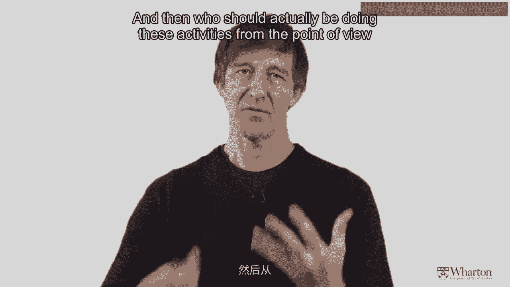

 of optimizing the design of the channel。 [Music]。

 [BLANK_AUDIO]。