# 沃顿商学院《商务基础》｜Business Foundations Specialization｜（中英字幕） - P157：14_分销策略2 渠道设计13 39.zh_en - GPT中英字幕课程资源 - BV1R34y1c74c

 [MUSIC]。

 So in addition to figuring out what activities have to be done and who is going to do them。

 we need to make some other important decisions about the design of our distribution channel。

 And one framework that's often helpful for doing this for us is to think about the intensity of distribution。

 What do I mean by that？ The intensity I mean is how many outlets or how many channels of distribution do we have serving us in a particular market？

 So if we have an exclusive distribution channel， that means in a particular market， Philadelphia。

 Los Angeles， Tokyo， wherever it is， we just have one individual or one distributor or one entity who's bringing our product to market。

 If on the other hand we have intensive distribution， that means there are many。

 many providers of the product or service in a given market。 Obviously if there are many of them。

 this may be creating some competition between them。

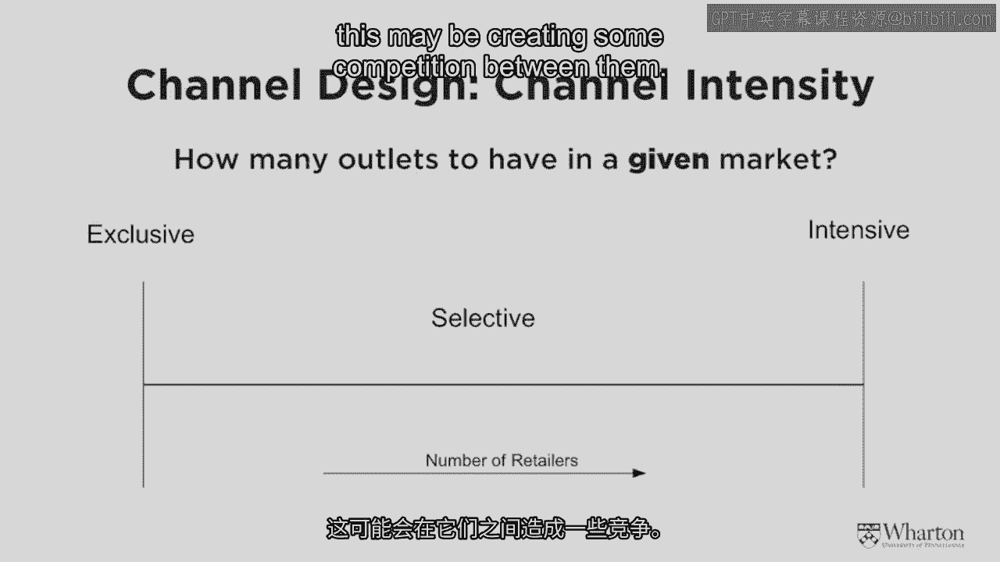

 So what are some rules of thumb that we need to think about in determining whether or not we want to go with intensive distribution。

 versus exclusive distribution or the midpoint which is selective distribution？

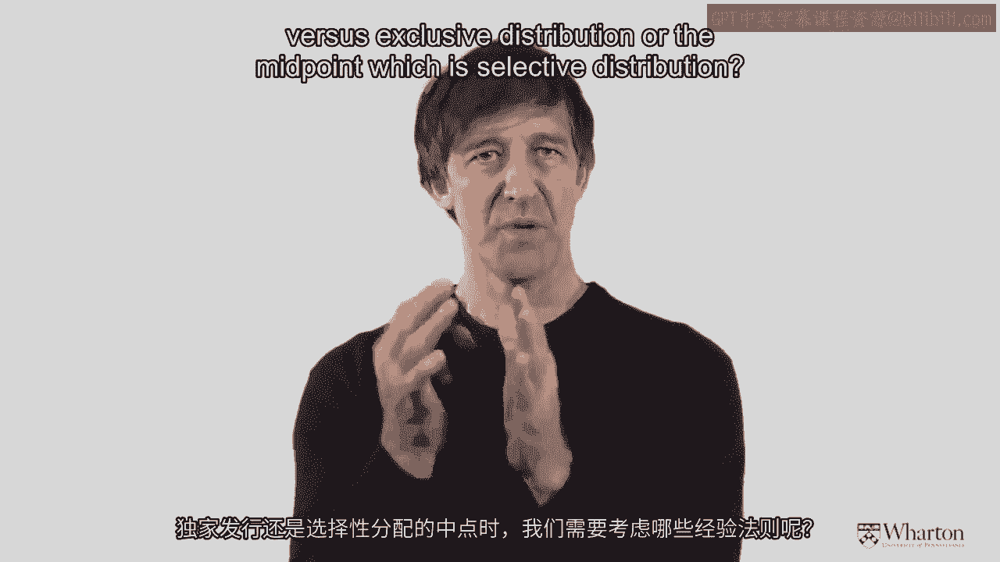

 So intensive distribution might be a good thing when we don't really need any selling support。

 If it's a product like Coca-Cola， we might want it in every store， every vending machine。

 every place possible just so it's made available， in order to minimize the consumers cost of accessing or obtaining the product。

 On the other hand， exclusive distribution might be really。

 really important if we want to try to find the strongest provider and somehow reward them。

 This is often used in the automobile market。 If I'm selling expensive cars like Ferrari。

 I don't want somebody right next door doing the same thing。

 I might want the rights to have an exclusive territory。

 So that's the reason for having exclusive distribution is to protect the reseller and give them a chance to make a better margin。

 In the middle is selective distribution where neither of those other two extremes really seem to fit。

 The customers need to get access to the product but there's also some consultative selling that's required in order to encourage the end consumer to buy the product。

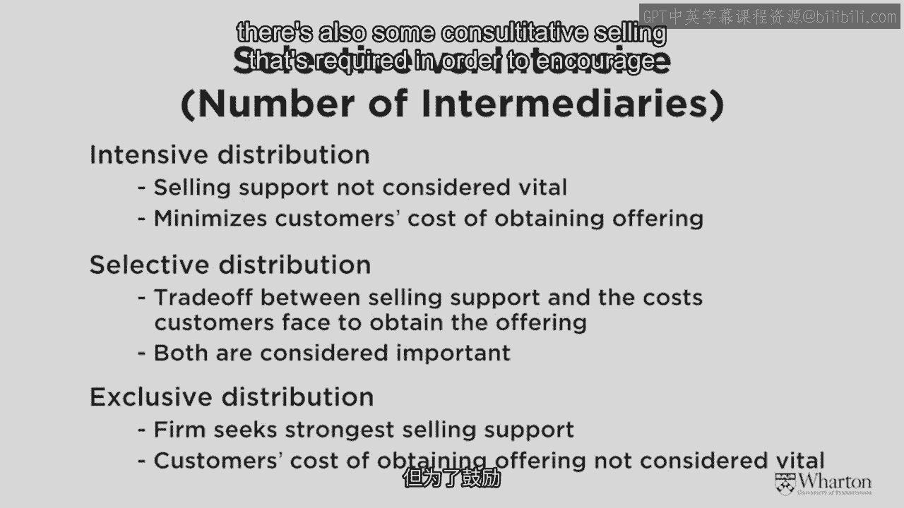

 So now I'd like to reintroduce something that we talked about earlier and something that we're familiar with from our discussion of how to generate those lead users and expand the market beyond the early customers all the way to the larger target base。

 Here I'm showing the product life cycle。 As you may remember， it goes through four phases。

 Phase one is the introduction phase， then there's a growth phase， a maturity phase。 And finally。

 most products or services at some point or brands at least enter into a decline phase。

 So let me give you an example with a very， very simple product or service。

 a piece of home equipment for an entertainment system for showing movies and things in your own home。

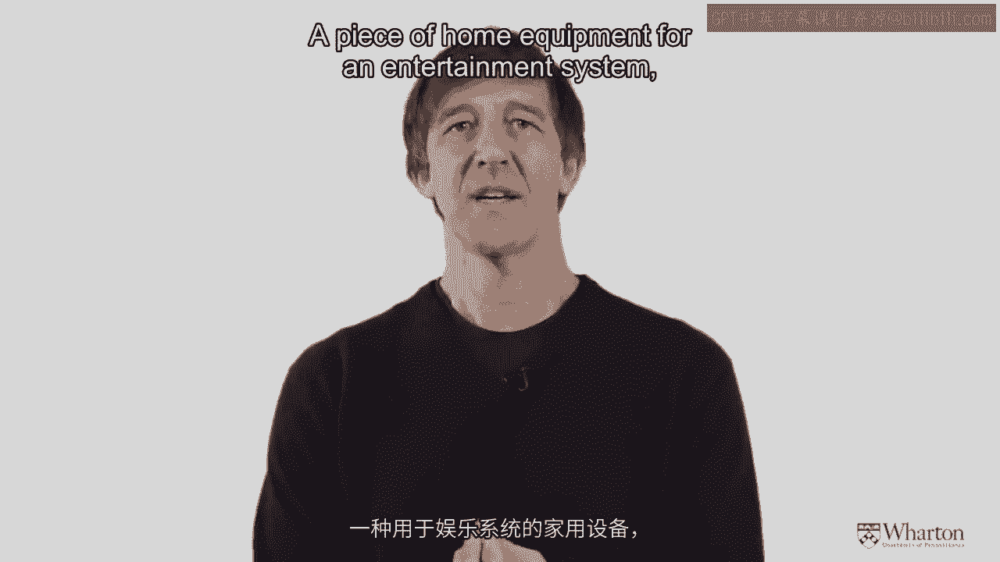

 When the products first introduced， let's imagine it's initially introduced in a very kind of selective way with home video specialists。

 As the product gets into a growth phase and we want it to be more widely available。

 then maybe it goes into a larger distributor like a best buy or something like that if we're talking about the United States。

 Finally， as the product gets into maturity， we might expand to other channels such as Walmart。

 And then finally， as it goes into decline， the product may end up being sold on eBay or other kinds of secondhand markets。

 So what you can see is the product goes through the life cycle。

 The amount of information that's required to sell it goes down because people are familiar with the product or service。

 But the intensity of the distribution tends to go up。

 We want the product available almost everywhere。 And because of that。

 the logistical needs also kind of increase。

 So again， hopefully what you're seeing from this is when we're accessing customers。

 the access to customers is also related to how the product is going through its own life cycle from introduction to growth to maturity and then to decline。

 So let's continue with this idea of the hybrid grid。

 namely that there are certain entities doing certain activities in sort of an optimal way。

 So what are the implications of this view or using a tool like the hybrid grid to understand your own customer access plan。

 your own channel of distribution？ So the first thing to keep in mind is that the kinds of activities that get done really depend on the complexity of your product。

 If you have a very， very complex product like that Bovine growth hormone that I mentioned in the example。

 there may be many， many things that need to be done from education to awareness to retrieval of the product to after sale service and so on。

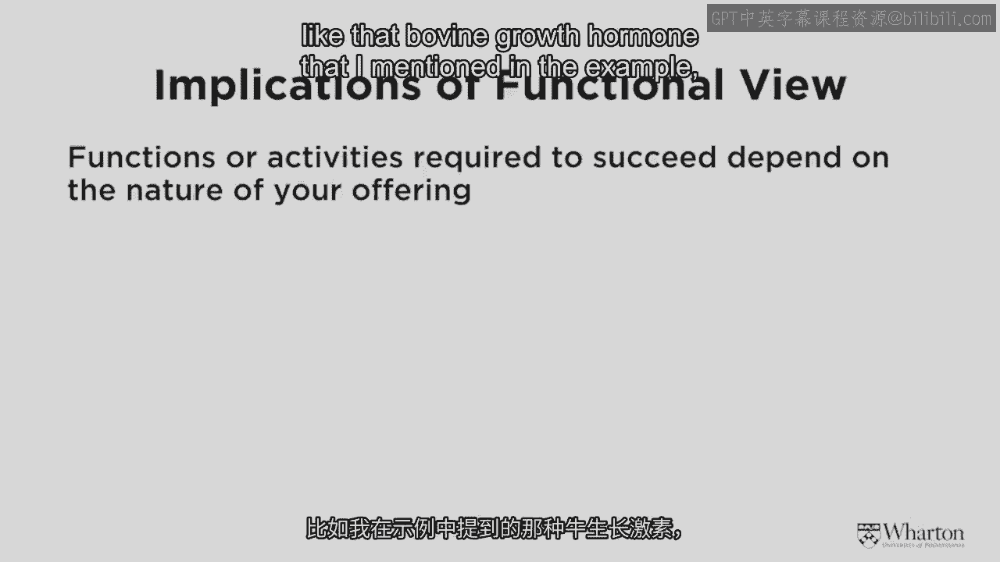

 And so that's the first thing， how complex is my product or service that will determine the list of activities。

 The second thing to keep in mind is activities， once you've decided what needs to be done。

 cannot be eliminated。 Once you've figured out the columns， they are what they are。

 You cannot change those。 You can't suddenly decide not to provide after sale service typically or suddenly decide not to generate new leads。

 What you can do however is you can change who is performing what activity and that often leads to some very。

 very interesting innovations。 So let me give you three examples。

 So you could think about the notion of a forward shift in function and that would be IKEA for example who used to in the early days do their own delivery and installation decided at a certain point。

 You know what， we can't really do that。 We're going to let some third party do it。

 So that's sort of farming off an activity to another entity who's able to do it better。

 You might also think about a backwards integration as well。

 This would be the case of Apple taking over some of the function of selling the goods and services themselves and their own stores as opposed to having independent retailers do it for them。

 And then thirdly， we could think of a sideways shift。

 This would be Amazon using a parallel company like FedEx or UPS to do the delivery of its goods and services rather than doing it themselves。

 So this is a very， very important implication。 You cannot eliminate activities。

 but you can change or eliminate certain players。

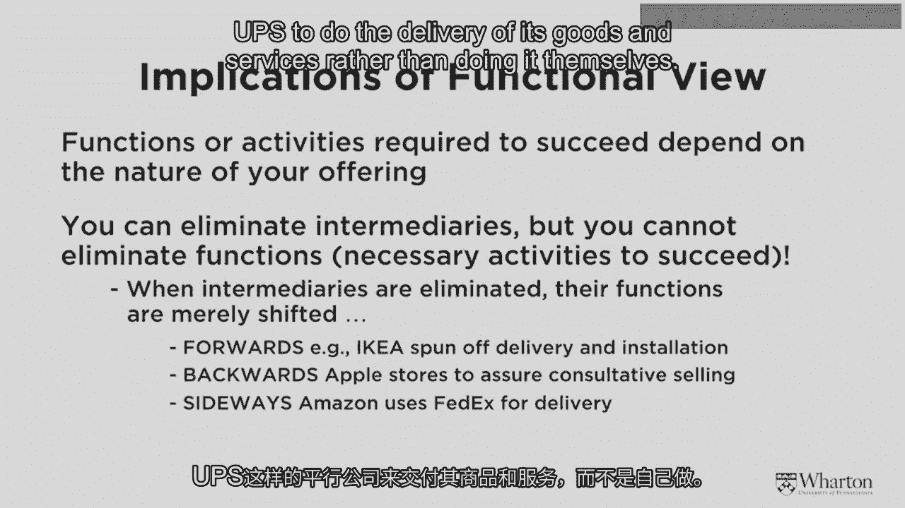

 And often that's a vital source of innovation like the Michael Dell innovation， for example。

 diapers。com。 Many， many innovative businesses don't eliminate activities。

 But what they do do is they change who's doing them。

 The important thing of course to keep in mind is that anyone who's performing an activity needs to be compensated usually in the form of some kind of channel margin for doing that。

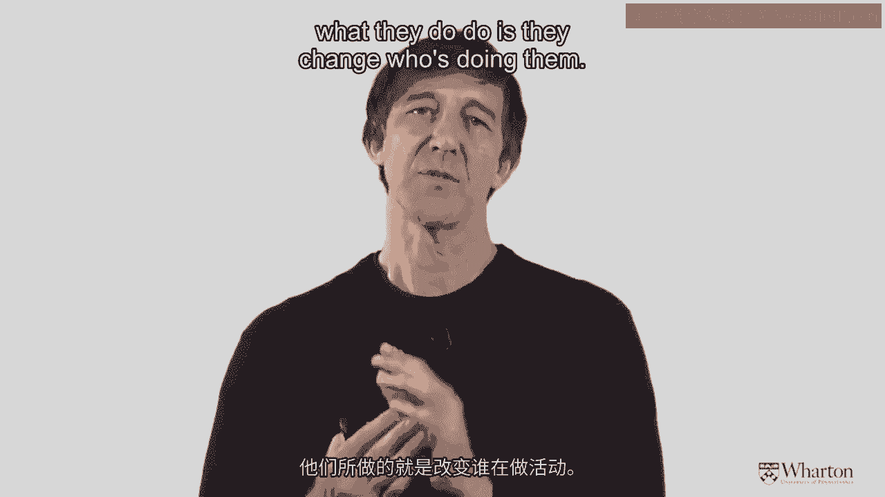

 Otherwise they're going to stop that。 And this is sort of a nice segue for us now into thinking about the next thing on our list after the structure of the channel and the design of the channel。

 which is how does one keep a channel coordinated。

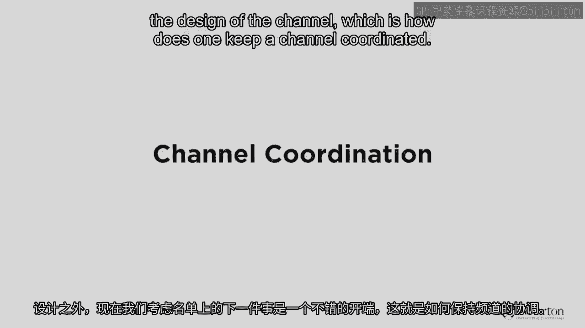

 So now let's get to our third piece on the discussion of access to customers and channels of distribution。

 This is kind of a fun one。 This is the idea of coordinating a channel。

 And when a channel often has conflict， this can be kind of a tricky thing to do。

 So let me just illustrate again by way of a chart what can go on in a distribution channel。

 So you may have a manufacturer on one side saying， "Hey。

 why aren't you taking my entire range of products？" And the distributor or the retailer says， "Hey。

 I don't want all the dogs。 I just want the best products。 I only want the three series BMW。

 I don't want the one series， but the manufacturer wants all of them to be taken。"。

 The manufacturer may say， "We'd like some more information about who's coming into your store or your channel and buying our products and service。

"， And the retailer might say， "Well， we don't keep any of that information。 And even if we did。

 we're not going to give it to you。"， The manufacturers and retailers might also argue over margins。

 So the manufacturer might say， "Gee， you're taking too much margin。"， And the retailer says， "Well。

 your wholesale price is too high。" So what we have here typically in a channel of distribution are independent businesses that sometimes might be opposing。

 And we want to try and figure out what are some solutions to all of this conflict。

 So let's go through some of that。 The first thing is that having some level of conflict is good。

 It keeps everybody on their toes。 You don't necessarily want all of the channel -- sorry。

 all of the conflict in the channel to be completely eliminated。

 You want some there just to sort of keep things fresh and to keep things interesting。

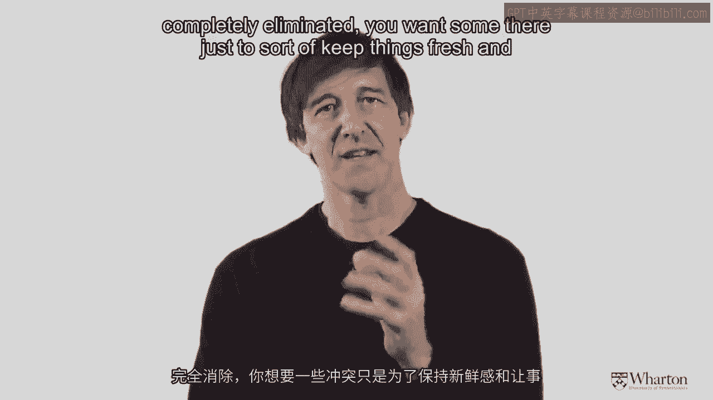

 So let's look at a diagram that explains the two main different types of conflict that occur in a distribution channel and how we can actually resolve these。

 So in the blue there， we have a manufacturer who's distributing a product to three different retailers。

 A， B and C。 And it could be the case that the manufacturer has a conflictual situation with one or all of the retailers。

 And I'll show you some examples of that in a moment。 Secondly。

 there's also a notion of horizontal conflict。 Horizontal conflict。

 retailer B and C is somehow competing with each other or something unfortunate is happening in that relationship。

 So let's start with vertical conflict。 So here's a fairly famous case of vertical conflict that I'd encourage you again to look up a little bit on the internet。

 We have a manufacturer， Nike， who got into a conflictual relationship with its main distributor Footlocker。

 Footlocker wasn't necessarily interested in selling and promoting every single SKU。

 start keeping unit of shoes and so on that Nike was selling。 Nike， of course。

 wanted Footlocker to make it a prominent brand and to give it a lot of support in the retail store。

 So there was an inherent conflict between these two entities that was a vertical conflict。

 So how could one resolve vertical conflict in a relationship like this？ Well， you could integrate。

 So Nike could decide， you know what， we're going to have our own stores and that's where we'll sell the product。

 In fact， Nike does have some flagship stores in various places around the world。

 including the United States。 So there's a flagship store in Chicago， San Francisco and other places。

 That will be one solution to eliminate in the conflict。 One of the players just decides。

 you know what， I'm going to do the whole thing myself。

 The second thing that could be done to eliminate conflicts is we could change the relationship and we could have franchised stores。

 So a lot of companies in the gasoline industry do this。

 There are franchises for ExxonMobil gasoline， Fast Food。

 there's franchises for McDonald's and Dunkin' Donuts。

 So that's also a way of minimizing conflict by bringing everybody under the same kind of umbrella。

 Those are both fairly legal or structural ways of doing things。

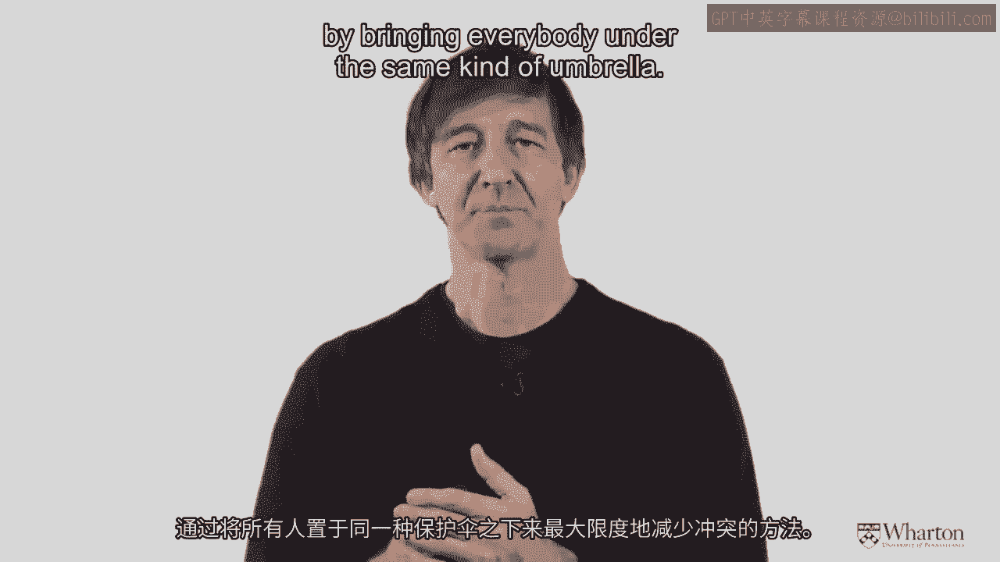

 You can also minimize conflict by being a little bit more subtle in the way that you do it by monitoring what's going on with a downstream player。

 So another way to minimize conflict would be to have mystery shoppers go into the various footlocker stores and see in earth what's going on there。

 And then report back to the other corporate entities and then negotiate if something was a mess。

 So those are various ways， both implicit and explicit， that vertical conflict could be removed。

 Another way you could do it if you were the manufacturer is you could say， you know what。

 I'll minimize vertical conflict by only giving the top performing retailers my hot products or my best tellers。

 I'll sort of use a carrot and stick approach to get rid of some of the conflict over who is getting what in the relationship。

 So that's vertical conflict。 So now let's move on to horizontal conflict。

 Horizontal conflict is really fascinating and in many ways more subtle in the notion of vertical conflict。

 So by horizontal conflict we mean conflict between players at the same level of the channel。

 So conflict between retailers A， B and C in my example。

 So why does this horizontal conflict occur？ Well， unless those retailers are literally carbon copies of each other in terms of the level of service of prices that they provide。

 there's the potential for something called horizontal free writing。

 which is actually the behavior of you and I。

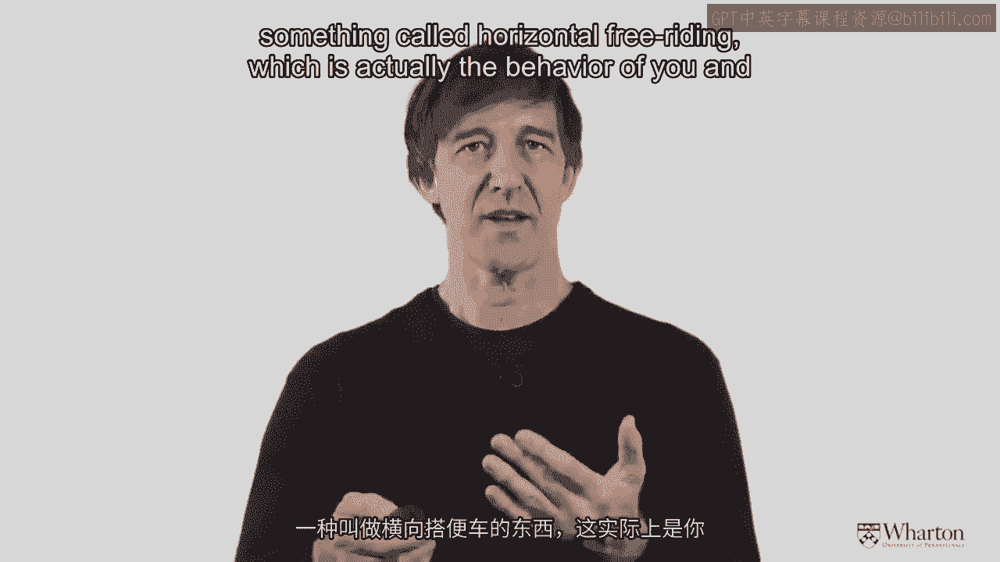

 So let me explain that。 So imagine that there are low price low sell low service retailers and high price high service retailers。

 And let's take a simple example of consumer electronics。 And for argument sake。

 let's imagine that there's a high price high service retailer in my local neighborhood。

 Let's call that Chris's high-fry store。 And also there's a lower price retailer in the same neighborhood。

 Let's call it let Amy's discount store。 So there's a high price seller high service and a low price seller that's offering less service。

 So what might I do as a consumer？ Well， I might go to Chris's store。

 I might spend an hour engaging with a sales person learning about exactly the right kind of color TV。

 sound system and so on to put into my home。 And then instead of buying it。

 what I do is I walk across the street to Amy's store and I get the lower price。

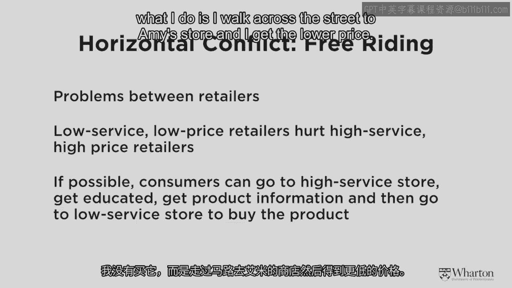

 So what I've done is I've taken something that's been provided by Chris。

 not compensated him for it and in fact got a lower price from Amy。

 This is called horizontal free writing and in its most extreme form we see it in terms of the phenomenon showrooming。

 Where I go into a store， I engage with a sales person。 I look at all the variety。

 I touch and feel the sweater to make sure it's the one that I want。 And then I go to sweaters。

com or Amazon。com and buy it at a lower price。 So how could we possibly get around that sort of situation？

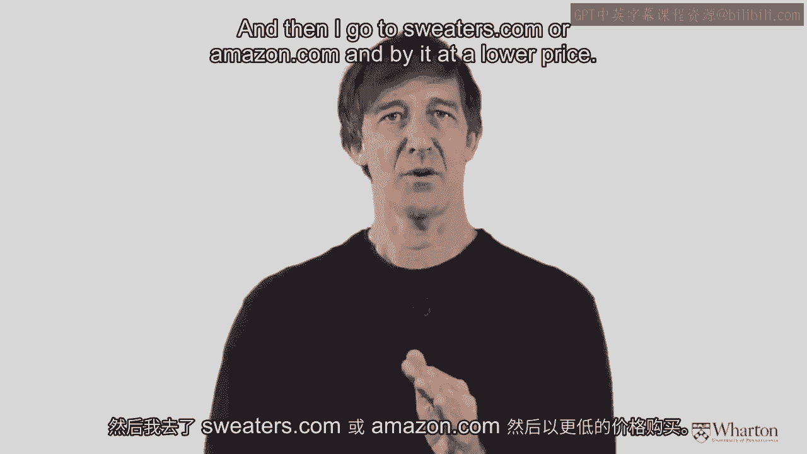

 Well， let's start with traditional horizontal free writing before we go into the phenomenon of showroom。

 So what we could do is we could reduce the number of retailers per territory to separate Chris's store from Amy's store。

 We could try and make those stores more uniform through something like franchising。 But in general。

 what we could do is we could create more like selective or exclusive distribution that would minimize the chance of horizontal free writing。

 It's a little bit more difficult though when we get to the internet。

 So we'll look at some statistics on that in a moment。

 [Music]。

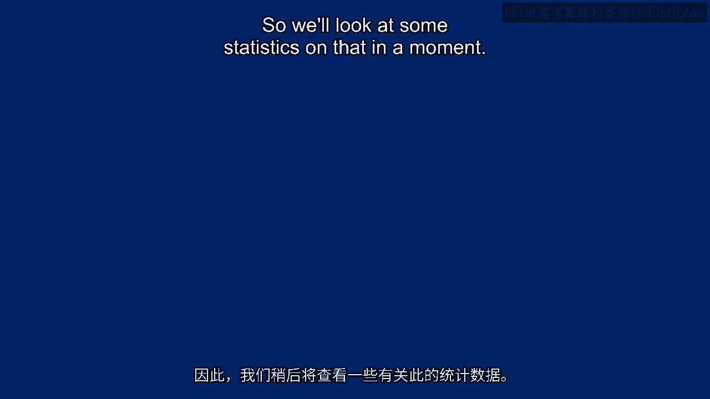

 (buzzing)。