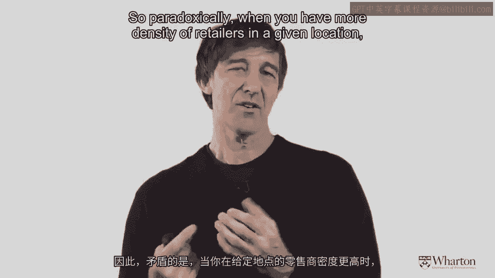

# 沃顿商学院《商务基础》｜Business Foundations Specialization｜（中英字幕） - P158：15_水平冲突12 46.zh_en - GPT中英字幕课程资源 - BV1R34y1c74c

 So， let's dig a little bit more into this notion of showrooming， which is an extreme。

 form of horizontal freerating。 For better or for worse。

 the showrooming is really facilitated by technology， both mobile。

 technology and other internet technologies， even our laptops and our desktops。

 So the data I'm showing you here is data that's going through 2011 and it shows the fraction。

 of consumers actually even increased through 2012 and 2013 of people who actually used。

 their device， their mobile device to find a better price while shopping in a store。

 Many of you may have done this yourself。 You've been in a local store。

 you've been gathering information， doing a little bit。

 of horizontal freerating and then you've picked out your mobile phone and you've gone。

 to Amazon or another supplier to buy it。

 So let's look at some additional data that kind of gets under the hood a little bit and。

 sees what happens here。

 So if you're someone who wants to do this， who's prone to do it， who's looking at mobile。

 phone information and prices and so forth while shopping， the good news is that some of these。

 people actually will buy from the website of the store that they're currently in。

 But notice also about 25% of these individuals end up buying from somebody else， Amazon or。

 a competitor。 So the question becomes for the traditional retailer。

 what can be done to sort of push， back or fight back against this practice？

 Now you'll see as we go through these statistics， it relates back to some of our early discussion。

 about why omnichannel retailing now makes sense and you need to touch customers both。

 in the physical world and the virtual world as well。

 Again， here's some more data on the kinds of product categories that are most susceptible。

 to showrooming。 Right at the top there is consumer electronics and then it declines a little bit through apparel。

 and clothing and so on。 My own hypothesis about why consumer electronics are at the top is this is a product category。

 where we like to be fairly well informed before we make a purchase so we may want to actually。

 interact with a salesperson but because it's a pretty big ticket item， what ends up happening。

 is we may then be persuaded or we may be inclined to after having figured out from the sales。

 person or the physical store the best product to buy to then go online and do it at a much。

 cheaper price just simply because of the value of the items involved。

 So how good manufacturers and retailers fight back against this practice？

 One thing that's happening now is literally the same TV produced by a big manufacturer。

 like a Sony or a Sony or somebody else may end up having a slightly different model name。

 for different suppliers。 So then it becomes more difficult for me to compare the price and to buy one electronically。

 as opposed to buying it in the store where I end up shopping。

 There are however some good news for retailers and physical stores about how they can push。

 back against this practice of showrooming。 So the chart that I'm showing you now is the purchase intentions of individuals who are。

 engaging in the showrooming behavior namely being in a physical store then taking out。

 friendly mobile phone and looking for information in the virtual world and then thinking about。

 buying it。 So a third of them always plans to buy the product online。

 These are kind of the hardcore horizontal free riders。 I'm going to go into Chris's high-five store。

 learn everything I can and then just buy it， at the cheapest possible online website。

 However the other 60 odd percent actually planned to buy it in store but something happened。

 that caused them to end up buying it online instead。

 So let me say a little bit more about that opportunity represented by the 56 or close。

 to 60 percent of individuals who say you know what I would have bought the product in the。

 store but I ended up buying it online instead。 So my two colleagues Tony Moreno at the Caloog School of Management and Santiago Galano。

 they're at the tuck school investigated this through something they called BOPS buy online。

 pick up in store as a way for traditional retailers to fight back against this phenomenon of show。

 rooming。 So the idea of buy online pick up in store is the following。

 I can go to the website of a large retailer and Tony and Santiago looked at a large retailer。

 operating both within the United States and Canada that had about 80 or 100 stores in this。

 analysis and the retailer implemented a program where you could buy the product online then。

 go to the store and pick it up BOPS buy online pick up in store。

 And so what they found was the following you might hope actually that sales at the websites。

 would then go up because now as a consumer I can go on to the website I can see that this。

 coffee maker that I'm interested in is in stock and then I can buy it online and go to。

 the store on the way home and pick it up。 So the hope was that by offering consumers this option that the sales at the website would。

 increase and I should mention that the retailer in question I cannot disclose the name but。

 the retailer in question was mainly selling products that are for your home so betting， towels。

 coffee makers those kinds of things and this is very important for the explanation。

 that comes later on。 Now what Tony and Santiago found is instead of sales at the website going up sales at。

 the website actually went down doesn't sound too good but there's a silver lining they。

 found after this BOPS was implemented sales in the stores went up。 So what was happening？

 So imagine myself as a consumer I want to buy a coffee machine from this particular retailer。

 I go to the website I see that the product is in stock and the price is good but because。

 it's a coffee machine I'd still like to perhaps taste the coffee or touch the sweeter。

 or try out the betting。 So because most of what this retailer was selling was products that required some physical inspection。

 by the customer to make them feel comfortable what the customers were doing were going online。

 to make sure the product was there then going into the store and actually purchasing in。

 the store right down in there。 So offering that option was very valuable and actually led to an overall increase in sales。

 at that retailer so much so that the new acronym instead of BOPS buy online pick up in store。

 Tony and Santiago referred to this as ROPO ROPO research online purchase offline。

 So again those of you who are facing these kind of omni channel problems and horizontal。

 free writing show rooming for your own business this shows that this potentially clever ways。

 out by really understanding what the consumers want。

 They want information first but they want to touch and feel the product and if you can。

 deliver them that package you can get yourself out of some of these traps。

 Now let me just summarize what we've talked about in terms of horizontal free writing and。

 how this can be illuminated。 There's essentially free broad strategies that can be put into place in a particular。

 market to try and eliminate this problem between Chris and Amy where Chris is the high price。

 the high service seller and the customer goes to his store to get the information and then。

 goes to Amy store to get the lower price。 The first thing that you could do is you could make sure that in different territories different。

 products are available so give Chris some of the product line and give Amy something else。

 so there's not direct competition between them。 Related to that you might need to think carefully about the appropriate level of distribution。

 intensity。 If a lot of horizontal free writing is going on you might want to make your distribution。

 intensity a little bit lower and be more exclusive or more selective meaning that local retailers。

 have kind of a local monopoly。 And then finally the other thing that you could do is you could introduce different brands。

 for different retailers。 So literally just call the product different names so Chris's product has a slightly different。

 label on it than Amy's does and this again works against the problem of direct comparison。

 which is an important component of horizontal free writing。

 So now let me summarize everything that we've been talking about so far in this module with。

 respect to conflict。 Here's three rules of thumb that have been discovered through academic research and to。

 just generally what causes more conflict in a channel of distribution or a system of distribution。

 So three things we're going to look at first of all are the length of the channel。

 So how many players are there between the person who provides the product initially or creates。

 it and the person who ends up buying it。 Secondly how much autonomy is there in the channel are all of the channel members owned。

 by the corporate entity so they're all stores owned by Starbucks。

 Are they mainly franchise so McDonald's might have franchisees or are they all completely。

 independent agents and then thirdly how much density is there in the channel。

 Is there only one retailer or distributor in a particular market are there two or are。

 there multiple。 So this is what the researchers found with respect to these three important factors。

 So generally as the channel gets longer and longer there is just more potential for conflict。

 and there's one really fundamental reason for this。

 This is a term that was developed by a French economist many centuries ago and it's called。

 double marginalization。 It's a fancy term it's a simple idea。

 It says every time you add someone between the producer and the end consumer you're adding。

 a markup and a layer of margin。 So if you have one retailer between the customer and the end user there'll be two levels of。

 markup from the manufacturer to the retailer and then the retailer to the customer。

 If you have two intermediaries there will be three levels of markup。

 Manufacturer to the distributor， distributor to the retailer， retailer to the customer。

 So as you lengthen the channel you're always adding an additional markup to the margin。

 and you're adding more people so there's more potential for conflict that's fairly unambiguous。

 Secondly， if you look at the level of autonomy from having completely owned distributors to。

 franchise distributors to completely independent again as people become independent there's more。

 and more conflict the conflict increases。

 So those two I think are fairly intuitive and fairly obvious。

 The last one is less so until you hear the story and this is why I think it's interesting。

 So the researchers who looked at this issue also looked at the density of a channel。

 Now you have a fairly low level of conflict if there's just one exclusive outlet per territory。

 Of course as you increase to two the conflict goes up because now I'm in competition with。

 that store in the territory next door he's stealing some of my customers I'm stealing some， of his。

 However what the researchers notice is kind of interesting is the level of competition。

 or conflict starts to decrease when density gets really really large。

 Why is that？ Well it's because there's now an attribution problem if I see my market shares going down。

 and I have eight different competitors in my local area that I'm competing against I。

 don't really know which one of those guys is taking my market share so paradoxically when。

 you have more density of retailers in a given location sometimes the overall conflict can。

 go down。 Okay the last little task I'd like you all to think about as you're working through this。

 material and you're thinking about what it means both how channels get created in terms。

 of who is doing what the hybrid grid the other elements of design like intensive versus exclusive。

 versus selective distribution and finally this whole area of minimizing conflict I think to。

 bring it all together would be good to have an exercise to kind of percolate on。

 What I'd like you to do is to try and think about a company that really innovated in the。

 area of distribution either they took over some existing activity they eliminated activity。

 they turned hard good into a soft good they completely changed the way customers procured。

 the product and in so doing really developed an advantage over their competitors。

 So try and think about that because I think a lot of the really interesting innovations。

 that are going to occur in markets are going to be innovations around the area of distribution。

 and access to products and services particularly as I've said many times but it bears repeating。

 that there's about a billion of us running around on the planet it'll be more than that。

 soon who are carrying computers in their pockets that can have all kinds of things distributed。

 to us and things that we can also respond to。

 [MUSIC]。

