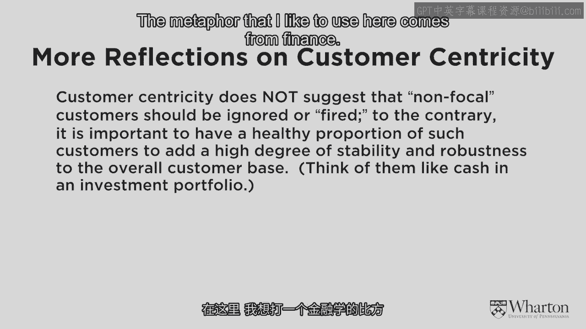

# 沃顿商学院《商务基础》｜Business Foundations Specialization｜（中英字幕） - P15：14_更多关于客户本位的思考.zh_en - GPT中英字幕课程资源 - BV1R34y1c74c

 I'm going to spend a little bit more time thinking about the distinction between those。

 really focal， those really valuable customers and the not so valuable ones。

 How do we achieve the right balance there？ If you take my words a little bit too literally。

 I keep focusing on the valuable， valuable， customers and I keep saying let's just zoom our whole business around them。

 If we were to do that then we'd come very vulnerable。

 We have all of our eggs in one basket and what happens if we're wrong about them？

 What happens if there's other customers out there who are fairly valuable？

 What happens if something changes to our product or in the marketplace that turns those really。

 valuable customers against us？ So how do we find the right balance？

 And so here I want to raise an important but subtle point。

 The idea that the more we zoom in on those really focal customers， the more we need the。

 less valuable customers in order to have a stable mix。

 The metaphor that I like to use here comes from finance。

 We want to have some really high flying stocks in our financial portfolio。 High risk， high return。

 We definitely want to have some of them。 Those are going to be where the real growth comes from。

 But the day to day stability comes from the more predictable ones， the cash， the bonds， and so on。

 So in our customer mix we want to have that same kind of portfolio approach。

 We want to have a large number of the stable， predictable but potentially not very valuable。

 customers that we're going to balance off with the high flyer customers， the really， focal ones。

 This is where I come up with the notion of the paradox of customer centricity。 It goes like this。

 The more we zoom in on those really valuable customers， the more we need those other customers。

 around in order to have a stable balance for the company as a whole。 You see。

 with only a few exceptions， no company can be truly， purely customer centric。

 If you're a private wealth manager and your customer base consists of four billionaires， yes。

 you can be totally customer centric。 You know everything about every one of them。

 You can be a trusted advisor to each one of them。 But if you have millions or tens or hundreds of millions of customers。

 it's a matter of， finding that just right balance between being truly customer centric with the customer segments。

 that we see as really valuable， but being product centric with the remaining customers。

 who aren't as valuable， being operationally efficient with them。

 Now the difference between a true product centric firm is that we're not going to let。

 those so-so customers drive the business。 We're going to continue to focus on the customer centric ones for growth。

 We're going to continue to focus a disproportionate amount of our R&D activity on those really。

 good customers， coming up with products for them， hoping and finding ways to make those。

 same products palatable and attractive for the product centric customers， but it's a matter。

 of finding that balance。 That's the paradox of customer centricity and one of the challenges for firms is to figure。

 out how to do that well。 [MUSIC]。

