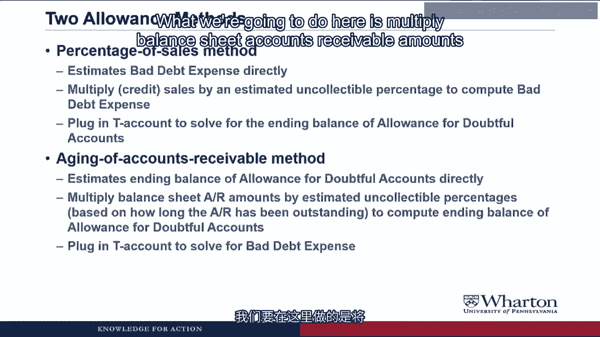
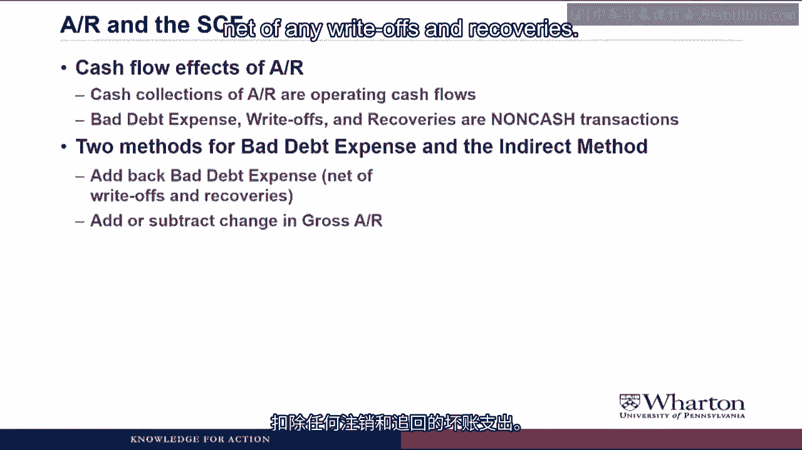
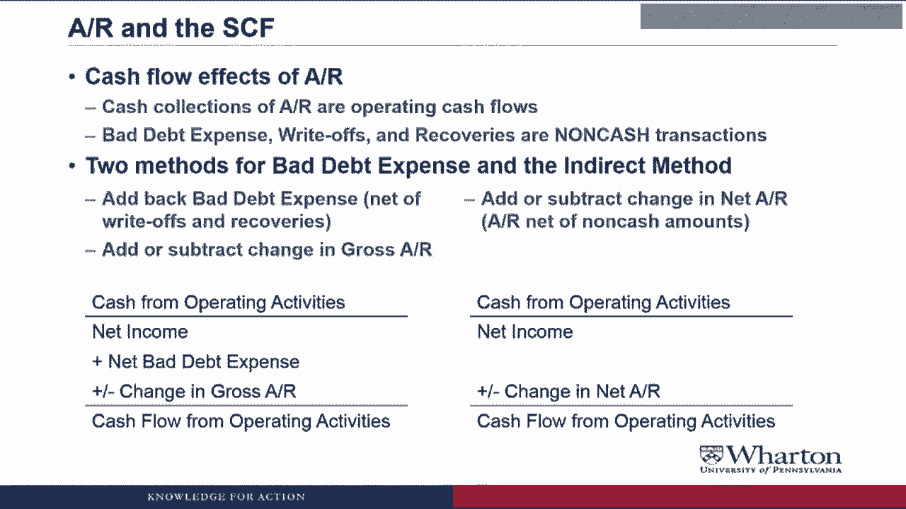
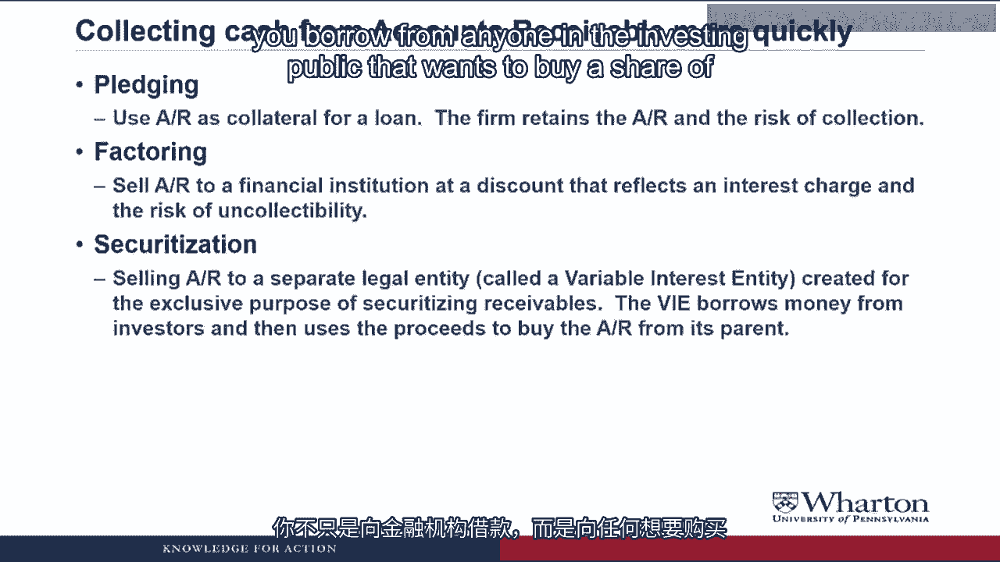

# 沃顿商学院《商务基础》｜Business Foundations Specialization｜（中英字幕） - P160：17_估计坏账损失15 31.zh_en - GPT中英字幕课程资源 - BV1R34y1c74c

 Hello， I'm Professor Brian Buchay and welcome back。 In this video。

 we'll talk about the different methods that companies use to try to estimate。

 that number for expected bad debts during a period。

 We'll also talk a little bit about how accounts receivable shows up on the statement of cash。

 flows and methods that companies use to try to collect their accounts receivable more， quickly。

 Let's get to it。 So we have two methods that are commonly used to try to calculate the amount of uncollectible。

 accounts。 Accounting is almost like Noah's Ark。 There seems to be two of everything。

 Anyway， the first method is called the percent of sales method。

 This estimates bad debt expense directly。

 So what we're going to do is look at our sales for the period， or if we have it， the。

 credit sales。 Apply those sales times the percent that we expect to be uncollectible。

 So of those sales， what percentage do we estimate that are going to be not collected。

 in cash， that will be our bad debt expense。 Then we'll use our T accounts to solve for the ending balance of the allowance for doubtful。

 accounts。

 The other method is a balance sheet approach where you estimate the ending balance of allowance。

 for doubtful accounts directly。 What we're going to do here is multiply balance sheet accounts receivable amounts at the。

 end of the year by estimated uncollectable percentages。

 So the percent of accounts receivable we expect not to collect in cash。

 But it's called aging because we're going to do it based on how long the accounts receivable。

 have been outstanding。

 So there'll be different percentages for those that are under 30 days， those that are， 30 to 60。

 60 to 90， and so forth。

 That's going to give us the ending balance of allowance for doubtful accounts。

 Then we'll plug in our T accounts to solve for bad debt expense。

 Are you just teaching us two methods so that you will have more questions to ask on the， exam？

 Which method do companies use in the real world？ Yes， if you're a conspiracy theorist。

 you could assume that if there are multiple methods。

 it's because accounting professors want more material that they can ask you about on an， exam。

 And the real world companies could do either method or they could do both methods and take。

 an average of the two。 The key point is that if you're going to estimate bad debt。

 you either do it based on your credit， sales or you do it based on receivables outstanding at the end of the year or you do。

 some combination of those two。 Either way， you need to come up with some estimate for the expected bad debts。

 the expected， uncollectable receivables during the period。

 So let's do an example where we implement both methods。

 So we're going to look at our old example company BOC and we're going to assume that。

 during the period that credit sales of 75，000， so that when a new account's receivable and。

 into sales revenue， we'll assume that they collected cash on those receivables of 69，500。

 The debit here is to a cash T account which is not on the screen。

 And we'll assume that write-offs were 500 during the period。

 So now that we have all this stuff filled in， the only thing that's missing is the bad debt。

 expense and the ending balance and allowance for doubtful accounts will calculate one and。

 plug the other。 First we'll do the percent of sales method。

 So BOC， as we just saw， had credit sales of 75，000 during the quarter。

 They estimate that 2% of those credit sales will be uncollectable。

 They'll never get the cash。 So bad debt expense is going to be credit sales times that estimated uncollectable percentage。

 75，000 times 2%， or $1，500 for the quarter。

 This method looks easy-peasy， however， how shall we determine the estimated uncollectable。

 percentage？ You're correct。 The formula is easy-peasy。

 All the difficulty here is coming up with that percentage。

 So companies are supposed to both look historically。

 So what's been their recent experience with defaults？ What is the industry。

 recent industry experience with defaults？ And look ahead。

 So if you think the economy is moving into a recession， you'd want to make this rate higher。

 If the economy seems to be moving into boob times， you'd want to make it lower。

 And essentially you're going to adjust this rate as you go based on things that have just。

 happened and new information about the future。 There's a lot more art than science that goes into coming up with this percentage。

 Now that we have bad debt expense， we can figure out the allowance for doubtful accounts。

 So we put the bad debt expense in the allowance for doubtful accounts to your account。

 If we add the beginning balance plus bad debt expense， subtract the write-offs， we come up。

 with the ending balance of allowance for doubtful accounts of $2，100。

 Now we're going to look at the aging of accounts receivable method where we calculate that。

 ending balance directly and then go back and plug bad debt expense。

 So let's say BOC is $15，000 of accounts receivable at the end of the quarter。

 I mean， we don't have to say that we can actually go back to the T account and see the ending。

 balance is $15，000。 BOC groups the accounts receivable by age。

 How long it's been since the sale was made。

 They estimate an uncollectable percentage for each age group and compute a necessary allowance。

 for each age group。

 And then they add all that up to get the ending balance for doubtful accounts。

 So it looks like something like this。

 So if you look at the breakdown of BOC's receivables， you see that they have $8，000 of receivables。

 that are 0 to 30 days old。 $4，000 of receivables that are 31 to 60 days old。

 $2，000 of receivables that are 61 to 90 days old。

 And $1，000 of receivables that are over 90 days old。

 So we've been waiting over 90 days to collect the cash。

 For each category， we come up with an estimated uncollectable percentage。

 And this is why you want to do it with the aging method because obviously the new ones。

 there's going to be a much higher percent you expect to collect than the ones that have。

 been outstanding over 90 days where maybe you're going to get only half of those。

 So we've got an estimated uncollectable percentage that gets bigger the longer the receivables。

 been outstanding。 We take the accounts you will balance for each age group times the uncollectable percentage。

 for each age group to get an allowance amount for each age group， add it up and come up with。

 an ending balance of allowance for doubtful accounts of $1，900。

 This looks like a lot of math。 How do you come up with all of those percentages？

 The same way that you come up with the percentages for the first method， you go based on past。

 experience and any information you have about the future。 And in fact。

 one of the reasons companies could use to decide which method to use is。

 where do they think they can be more accurate at estimating these percentages of uncollectables。

 Is it the percent of credit sales that will be uncollectable or is it the percent of each。

 age of receivables that will be uncollectable？ Based on your experience in coming up with these rates。

 that would determine which method， might be better to use。

 So we can plug the ending balance of allowance for doubtful accounts in the T account。

 Now the only thing missing in the allowance for doubtful accounts T account is bad debt。

 expense and so we can figure out what that is， so what number plus 1100 minus 500 gives。

 you 1900？ It would be 1300， so that's the amount for bad debt expense that we have in allowance。

 for doubtful accounts and that's the amount of bad debt expense that we're going to show。

 on the income statement。 Whoa。 These methods gave us different answers for bad debt expense。

 How can that be？ Bad debts are bad debts。 Should we rejig or the percentages to get the same answer？

 Yes， bad debts are bad debts， but unfortunately they're all going to happen in the future and。

 so they're uncertain。 They can't be known with 100% accuracy。

 We got 1500 as our estimate on the first method， 1300 under this method， which one's more correct？

 Who knows？ Nobody knows what the future holds。 We could split the difference and go with 1400 or if we're more confident in our estimate。

 of the percentage of uncollectibles for one or the other method， we could use that method。

 The fact of the matter is whatever we estimate is probably going to be wrong anyway and what。

 we'll do is every period we will update our estimate based on our experience， we'll learn。

 from our mistakes and try to get better and better every period in estimating these bad， debts。

 So anyway， that ends our discussion of computing the bad debt expense and the allowance for。

 doubtful accounts。 A couple other topics related to cash flow that I want to make sure I talk about。

 Next is how accounts receivable and these allowances and bad debts show up on the statement。

 of cash flows。 So obviously cash collections of accounts receivable are going to be operating cash。

 flows， but the bad debt expense， the write offs， any recoveries are non-cash transactions。

 So there's two methods for treating bad debt expense under the indirect method that you。

 see when you look at financial statements。

 First method would be to add back bad debt expense， net of any write offs from recovery。

 So basically take all of those non-cash transactions in net income and add back the net number。

 Then add or subtract the change in gross accounts receivable。

 the original amounts account receivable。

 looked。 So the way it would look is you'd start with net income， you would add back the net bad。

 debt expense， so net of recoveries and write offs， and then you'd either add or subtract。

 the change in gross accounts receivable， obviously using the balance sheet equation where gross。

 account accounts receivable went up， you'd subtract it， if gross accounts receivable went。

 down you would add it。 The other method is just take net accounts receivable。

 So accounts receivable， net of all the non-cash amounts， just add or subtract the change in。

 that。 So there you would have net income and then all you would do is add or subtract the change。

 in net accounts receivable because that change already incorporates all the non-cash。

 stuff or they adjust for it。

 And so it should get you to the same place whether you break this out separately or combine。

 it all into one net number。 Dude， this is so uncool。 Two methods again。

 How can anyone like figure this stuff out if you cannot like agree on any methods？ Hey。

 at least there's not ten methods to do it。 So what's going to determine which method you use here is basically how important or。

 how big the bad debt expense is。 If bad debt expense is a big number for a company。

 it's probably going to do method， one so that investors and analysts can prominently see how big the bad debt expense is。

 If it's really not a big deal， if it's such a small number， then the company might go。

 with method two because it's just not that big of a deal。

 We basically give companies two methods so they can choose the one that best communicates。

 their business。 So although it makes your life more difficult。

 hopefully we're making things easier for companies。

 and for investors and analysts that need to know this information。 Okay。

 one more sort of big topic I want to talk about before we look at an example of。

 an accounts receivable disclosure。 And that is the different methods that companies use to collect cash in their accounts receivable。

 more quickly。 So one method that companies use are pledging their accounts receivable。

 So instead of waiting until the customers pay you， you could go out and borrow money using。

 the accounts receivable as collateral。

 What that would mean is as long as you paid back the loan， then you would obviously keep。

 the accounts receivable and collect them in the normal course of business。

 But if you didn't pay back your loan， the financial institution could seize those accounts。

 receivable and then collect them and keep the cash。

 But in this case， the firm keeps the accounts receivable and still has to collect them， still。

 has to take the risk in order to pay back the loan。

 To reduce that risk， some companies use what is called factoring， where you just basically。

 sell the accounts receivable to a financial institution at some discount that reflects both。

 an interest charge and the risk of uncollectability。

 So let's say you have a million dollars accounts receivable， you might have to wait 30 to 90。

 days to collect that cash。

 Instead， maybe you can sell that million dollars accounts receivable to a bank for 950，000。

 You get your cash right away。

 You don't have to worry about collecting them or not。 And the bank pays you $50。

000 less than the million because they're building in an interest。

 charge and also they're recognizing the fact that some percent of those are going to be。

 uncollectable。

 And obviously if they were longer term receivables or there was a higher risk of not collecting。

 them， the discount would get bigger。 And the last thing that companies do is securitization。

 So they sell their accounts receivable to a separate legal entity called a variable。

 interest entity that's created for the sole purpose of securitizing the receivables。

 And the VIE borrows money from investors and uses the proceeds to buy the accounts receivable。

 from its parent。 So basically instead of just borrowing from a financial institution。

 you borrow from anyone。

 in the investing public that wants to buy a share of those securitized receivables。

 Excuse me， but what the lamb are you talking about？

 What does any of this have to do with the price of fish？ Did you say what the lamb？

 Is that some kind of New Zealand expression that I've never heard of？ Anyway。

 I realize that this is beyond the scope of what we can talk about here。

 I teach securitization in my second year elective。 It's incredibly complicated。

 I think I had to teach it for about six years before I fully understood it。

 But it's also very important because I would argue that securitization was the big thing。

 that drove the financial crisis of 2007， 2008， 2009。 So anyway， for now。

 I just want you to know that there are these ways that companies have。

 to get receivables off of their balance sheet， collect the cash earlier。

 factoring and securitization， are two big ones。 And maybe if I ever get around to doing my second year elective at Warden as a Coursera。

 course， then you can watch 17 hours of video as I talk about securitization and excruciating。

 detail。 Did I just offer to do another Coursera course？ I need to go back and edit that out。

 So this wraps up our look at all the different topics I want to talk about with accounts receivable。

 In the next video， we're going to look at an example of a disclosure that you would see。

 about a company's accounts receivable and see what kind of information we can learn from。

 that disclosure。 I'll see you then。 See you next video。 Bye。 ‑‑。 [ Silence ]。

