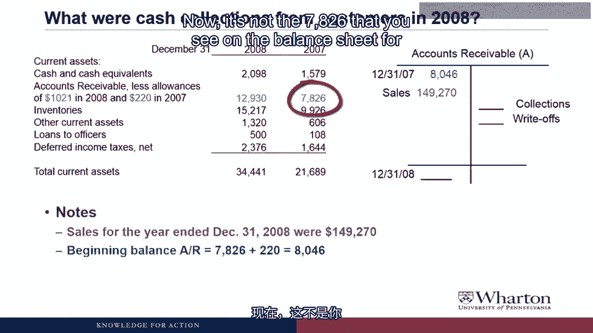
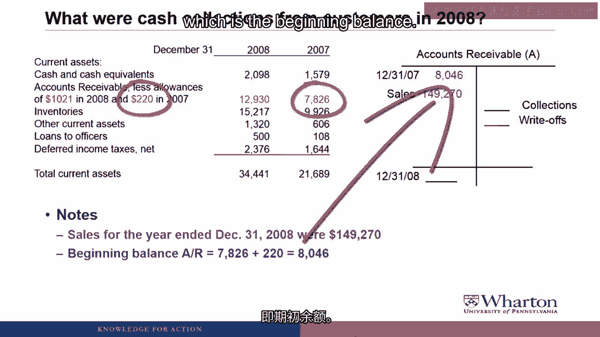
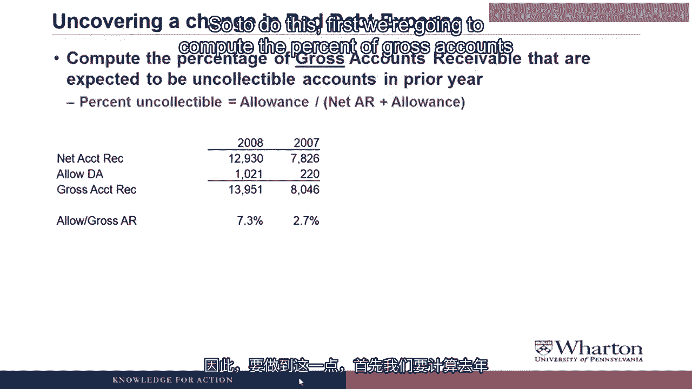
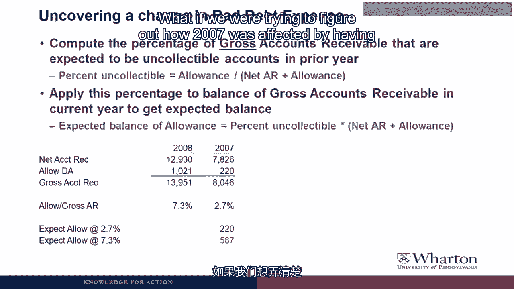

# 沃顿商学院《商务基础》｜Business Foundations Specialization｜（中英字幕） - P161：18_应收账款披露示例16 35.zh_en - GPT中英字幕课程资源 - BV1R34y1c74c

 Hello and Professor Brian Bache。 Welcome back。 One more video looking at accounts receivable。

 Here we're going to look at where we would pull information out of financial statement。

 disclosures in order to calculate some key information that's not otherwise disclosed。

 So let's get to work。 For example of an accounts receivable disclosure we're going to look at TK Incorporated which。

 sells coin wrappers to the banking industry。

 In case you're wondering this is not a real company。

 What I decided to do for this class was disguise all of the companies， change the names， make。

 up different businesses just so they don't get in trouble for calling out a company on。

 these videos。 So anyway TK Incorporated is selling coin wrappers to the banking industry。

 There's sales for the year end of December 31， 2008 where 149 to 270 that's in 1000 so。

 that's 149 million。

 We're going to use excerpts from the balance sheet and statement of cash flows to answer。

 the following questions。

 First what were write offs of accounts receivable in 2008？

 What were cash collections from customers in 2008？

 Both of those things are handy to know but you often can't find them very easily in the。

 disclosure so we're going to actually calculate them using the other information that we're。

 going to do in the last segment。 And then the last question is by how much did it change in the estimated uncollectable。

 percentage affect their bad debt expense in 2008？

 Here's the operating section of the statement of cash flows for TK Incorporated and you can。

 see three years 2008， 2007， 2006， net income and cash from operations both dropped substantially。

 in 2008。

 Wow， it looks like all TK had an awful year in 2008。 Weren't banks buying coin wrappers that year？

 Yeah， it does look like old TK did have a bad year in 2008 and I'm pretty sure that most。

 banks weren't using their government bailout money that year to buy new coin wrappers which。

 is why TK was struggling so much。 One quick thing I want to point out on the statement of cash flows before we move on。

 is the big negative number for accounts receivable in 2008 which is one of the big reasons they。

 had negative cash flows。

 Basically TK was making sales。 Most of these sales were on account。

 They weren't collecting all of the cash。 Their accounts receivable is growing and that's like a use of cash。

 Basically you're booking the sales revenue but you're not getting the cash。

 Big upward trend in how much receivables have been growing over these three years。

 Here is the current asset section of the balance sheet for TK incorporated and of course。

 the thing we're focusing on here is accounts receivable。

 So the disclosure you see here is net of allowances and it gives you the two allowance。

 numbers 1021 in 2008 and 220 in 2007 and as you can see the allowance for doubtful accounts。

 went up substantially in 2008。 So the first question we're going to answer is what we're right offs of accounts receivable。

 in 2008。

 So what we're going to do over here on the right is bring in our accounts， allowance。

 for doubtful accounts， T account， contra assets so it has a balance on the credit side。

 The beginning balance is 220 which is what the allowance was at the beginning of 2008。

 Ending balance is 1021 which is what the allowance was at the end of 2008。

 Right now we have two unknowns we don't know write offs and we don't know bad debt expense。

 If we can find bad debt expense then we can calculate write offs。

 If we bring back that statement of cash flows one of the light items on the statement of。

 cash flows was provisioned for doubtful accounts。 It's a non-cash expense so it reduces net income and then we add it back on the cash flow statement。

 in this case so that we can see it was 1558。

 So we can fill in that 1558 on the credit side this is what increases allowance for doubtful。

 accounts。 There's only one thing missing and that's write offs。

 So what we can do is plug and calculate what the write offs were。

 So if we take 220 plus 1558 minus the ending balance of 1021 we come up with write offs。

 had to have been 757。 I believe you mistaken if there were any recoveries you would need to also include them in the。

 T account。 These write ups are really write ups net of recoveries。

 Good catch we would also have recoveries flowing through this T account so if there were any。

 recoveries of prior write offs then really what we're calculating here is write offs net。

 of recoveries。 Good job。

 So we're going to calculate what were cash collections from customers in 2008。

 So I've got the accounts receivable T account over here on the right and when we first introduced。

 the disclosure example I said that sales for the year were 149 to 70。

 Of course we could have found that from the income statement I didn't need to give it to。

 you but it was easier to just give you the number than to show you the income statement。

 So we fill the sales in on the debit side because of course sales increase accounts receivable。

 Next thing we need to figure out is the beginning balance of accounts receivable。

 Now it's not the 7826 that you see on the balance sheet for 2007 because that's net of。

 allowances。 So to get the beginning balance in gross accounts receivable we need to add 7826 plus the allowance。

 of 220 to get 8046 which is the beginning balance。

 Need to do the same thing for the ending balance the 12， 930 that you see on the balance sheet。

 is the net amount we need to add the allowance of 10， 21 to get 13， 951 which will be our。

 ending balance in gross accounts receivable。

 And last we also know what the write offs of accounts receivable were because we calculated。

 that on the last slide。 So write offs of accounts receivable were 757。

 Once we plug that in on the credit side all that's missing is the cash collections from。

 customers。 And so it's just a matter of figuring out what the plug is that makes us balanced。

 So if we take 8046 the beginning balance plus sales minus write offs of 757 minus the ending。

 balance of 13， 951 we end up with collections of 142，608。

 Now notice the difference between the sales and the collections is 6，662 where we've seen。

 that number before is that was the change in receivables on the cash flow statement。

 So that's 6， 662 was the increase in gross receivable the sales minus the collection。

 That seems like a lot of work to get cash collections。

 Don't companies just disclose this number somewhere in the financial statements。 Actually no。

 most companies don't explicitly disclose the amount of cash collected from。

 customers and the only way to figure that out is to work through the T accounts fill in what。

 you know and then plug for what's missing which will probably be cash collection customers。

 Pardon me。 Before you go on， maybe please explain why you can use total sales and not credit sales。

 to do this calculation。 Yeah dude you had like credit sales in the RT account in an earlier slide。

 Okay I'm going to do a quick digression to show you that total sales is actually the。

 number that will get us what we need in this case。 So let's go to the digression。

 This is the mega slide that we had a couple videos ago where we showed how all the transactions。

 flow through accounts receivable allowance sales and bad debt and yes within sales we。

 did have credit and cash sales separate。 So let's look at an example。

 Just get rid of the allowance from the bad debt and just focus on collecting cash on。

 receivables and let's just make it easy say write-offs and recoveries are zero so we won't。

 even worry about those。 They could be non-zero and we would get the same results。

 I guess you could check that later if you wanted to。

 We're going to add a beginning and ending balance of 100 for the beginning balance， 200 for。

 the ending balance。 We're going to say cash sales are 500 and credit sales are going to be 1000。

 So total sales are 1500。

 Well now that we've assumed write-offs and recoveries are zero the only thing missing。

 in the accounts receivable to account is cash collections on accounts receivable which。

 is going to be 900。 So 100 plus 1000 minus the ending balance of 200 gives us cash collections of 900。

 So how much cash should we collect from customers in total？

 We got 900 collecting on accounts receivable。

 500 as cash sales a total of $1400 cash collection from customers。

 Now here's the problem when you look at financial statements。

 Financial statements don't give you cash collection from customers and they don't give you cash。

 sales。

 So there's no way that we could actually do this from a financial statement because there's。

 no disclosure of cash versus credit sales but it doesn't matter。

 We can do it with just sales。

 So now let's redo the example， start with the same beginning and ending balance， write-offs。

 and recoveries are zero and we're just going to use total sales this time。

 So carrying on the example total sales were 1500 before remember they were 1000 credit。

 and 500 cash for a total of 1500。 We plugged that 1500 total sales into the accounts receivable to account on the debit。

 side。

 Now we can solve for cash collections。 100 plus 1500 is 1600 minus the ending balance of 200 gives us cash collections of 1400 which。

 is identical to what we had before。

 So essentially what happens in this case is any cash sales show up on the debit side of。

 accounts receivable and then they're also going to show up on the credit side as a cash。

 collection。

 So by using total sales in the accounts receivable to account we're going to naturally get cash。

 collections due to cash sales plus cash collections due to the collections on accounts receivable。

 from the credit sales。 So it actually becomes easier when you go to financial statements you can plug in total。

 sales and then you get total cash collected from customers。

 Okay， now let's get back to the disclosure example。

 Last thing we're going to do with the disclosure is to uncover the effect of the change in。

 bad debt expense due to a change in the estimated percent on collectible。

 So to do this first we're going to compute the percent of gross accounts receivable that。

 are expected to be uncollectible in the prior year。

 So we take the net accounts receivable on the balance sheet， add back the allowance to。

 get the gross。

 We did that a couple slides ago。 Then we take the allowance divided by the gross to get the percent uncollectible。

 Now before the virtual students even ask the question I know this wasn't one of the two。

 methods we learned。 One of the methods we learned were the percent of sales method but to figure out that percentage。

 we need credit sales we learned the aging of accounts receivable method to that we needed。

 to know a breakdown of receivables by age。

 As users of financial statements we often don't have those pieces of information。

 So as a quick and dirty approach to get the percent uncollectible I like to take the allowance。

 divided by the gross accounts receivable。 So for instance at the end of 2008 we have 13。

951 of gross accounts receivable。

 What percent of those do we expect not to collect？ 7。3% or 1021。

 Now what we're going to do is apply the percentage from the prior year 2。7% to the current year。

 balance in gross accounts receivable to get the expected balance。

 So this calculation basically says let's say that TK did not increase their percent from。

 2。7 to 7。3 but instead kept it at 2。7。

 If they had their allowance would be 2。7% of 13，951 or 3。77。

 So that's the expected allowance if they kept last year's rate。

 Then as a final step we just take the difference between those two and it tells us how much。

 bad debt expense increased solely due to increasing the percent of uncollectibles。

 So by increasing our assumption of uncollectible percent from 2。7 to 7。3 it added 644 to the。

 bad debt expense。 Now notice the allowance total went up by 800 so a lot of the increase in the allowance。

 was not due to the growth and accounts receivable but rather due to this increased assumption。

 for the percent of uncollectibles。 Not only math， dude but when would we like ever have to do this calculation？

 If I was concerned that a company was manipulating its earnings to try to meet an analyst forecast。

 or some kind of earnings target this would be one of the first things I would look at。

 because if this change percentage went the other way if it went down what that would。

 do is it would reduce bad debt expense and increase net income。

 So I always tend to look at this if I'm concerned about earnings management。

 And I think what I'll do is let's look at how a rate decrease would affect bad debt。

 expense by calculating 2007。

 So let's quickly run this back the other way what if we were trying to figure out how 2007。

 was affected by having what may have been an abnormally low expected percent of uncollectible。

 So maybe what happened is TK should have increased their percent sooner but kept it。

 lower just to try to avoid signaling the bad news。

 So what we could do here is we could calculate what the allowance would have been at 7。3%。

 so we take 7。3% times 8。046 and we come up with 5。87 and then what we can see in the。

 last step is that basically by using the lower rate of 2。7% TK was able to record 376，000。

 of less bad debt expense。 So if you believe a company is artificially keeping its bad debt expense or keeping its。

 percent of uncollectible too low to try to keep its bad debt expense lower and maybe。

 increase its net income。 We can sort of estimate what that effect might have been here and by not increasing their。

 percent of uncollectibles from 2。7 to 7。3 a year earlier it saved them expenses of 367。

 Now of course it could also be that the economy changed between the two years so this always。

 isn't going to be a definite indicator of manipulation but it's a piece of information。

 to have。 And if you think the economy in the banking industry the demand for coin wrappers was。

 bad in 2007 then maybe the 2。7 was artificially low。

 So anyway you can always back out this percent of uncollectibles and try to redo what the。

 bad debt expense would have been had they not changed their assumption for the percent。

 of uncollectibles and that's going to wrap up or look at what we can pull out of an accounts。

 receivable disclosure。 And that wraps up or look at what we can pull out of an accounts receivable disclosure。

 I just said that did not。 Anyway this is the last video on accounts receivable。

 Join me next video as we start our dive into inventory。 I'll see you then。 See you next video。 Bye。

 Bye。 [ Silence ]。