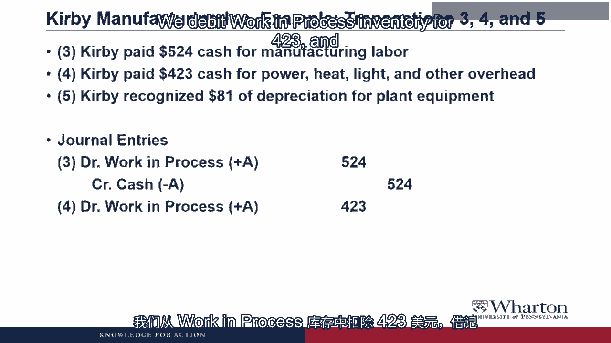
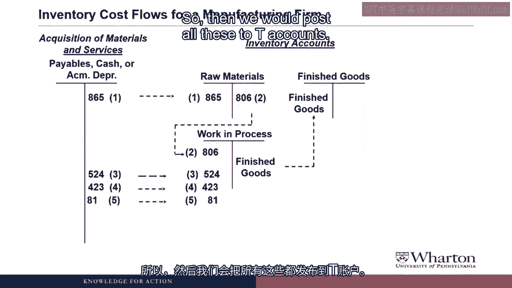
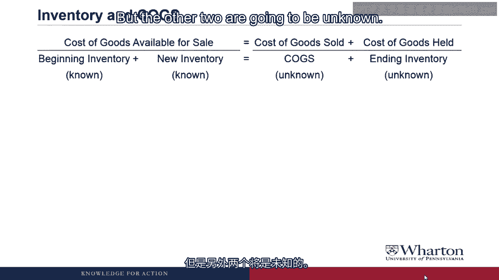
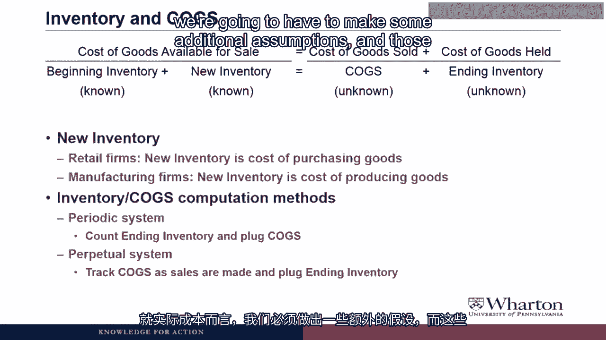
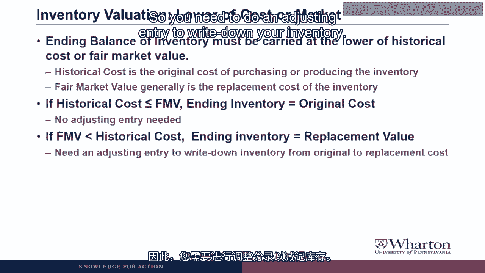

# 沃顿商学院《商务基础》｜Business Foundations Specialization｜（中英字幕） - P162：19_存货19 59.zh_en - GPT中英字幕课程资源 - BV1R34y1c74c

 Hello， I'm Professor Brian Bouscher。 Welcome back。

 We are now going to turn our attention to inventory。

 We're first going to talk about inventory for manufacturing firms， which is much more。

 difficult and complicated to account for than inventory for retail firms， which is what。

 we've seen so far。 We're also going to start to talk about some of the assumptions you need to make to figure。

 out cost of goods sold and the cost of the goods still held in ending inventory。 So let's get to it。

 Let's start by reviewing the accounting for inventory for a retail firm， which is what。

 we saw with the relic spotter inventory earlier in the course。

 So the first step is you go out and buy inventory， which means you debit inventory。

 Those are your purchases that increase the inventory。

 And then you credit either accounts payable or cash， depending on whether it's bought。

 on account or with cash。

 Then when you sell the inventory， you credit inventory as the goods sold reduces it and。

 you debit cost of goods sold， which is the expense that shows up on the income statement。

 We also earlier talked about the difference between product and period costs。

 So the product costs are the inventory costs， which are matched to revenue， but then selling。

 general and administrative costs directly go into SG&A expense when we incur them。

 Now what we're going to talk about is how this looks for a manufacturing firm， so a company。

 that actually makes the inventory as opposed to buy it。

 And we just have to make a few small changes。

 So as you can see， we need to add three accounts in the middle。 I can't remember。

 How do you expect us to understand this mess？ Okay， I know。

 How about we go through a detailed example of how this works？

 So the first step is going to look just like what we saw for the retail firm where we're。

 making some initial purchases， but instead of purchasing goods that we can turn around。

 and sell， as in the case of a retail firm， the first step is that we purchase raw materials。

 And so we create an inventory account that's titled raw materials。

 What types of items are considered raw materials？ Well。

 raw materials would be any materials that are not cooked。 Yeah。

 so raw materials are any materials that are going to be used in producing the product。

 So if we were making eyeglasses， it would be the metal for the frames， the glass for the， lenses。

 the screws， the little nose pads that are here， all the pieces that go into making。

 the final product。 To make our walk through this flowchart a little bit more interesting。

 let's talk about an。

 example of a company and see how these flows work with some real numbers。

 So Kirby Manufacturing Incorporated， their first transaction is they're going to purchase。

 865 raw materials of raw materials on account。

 And I guess to make it even more interesting， why don't I throw up the pause sign here and。

 have you try the journal entry before I give you the answer。

 So the answer here is that we're getting raw materials。 Raw materials inventory is an asset。

 so it's going to increase with a debit， debit raw materials。

 865 on account， which means accounts payable， accounts payable is a liability。

 We make a liability go up with a credit， so a credit accounts payable for 865。

 And then in our T accounts we're going to post the increase in the payable and the increase。

 the debit in raw materials。 And then I've got on here the next step。

 which is as we use materials in manufacturing， those。

 materials come out of the raw materials inventory account and they go into the work and process。

 account。 So the next journal entry， transaction 2。

 Kirby uses $806 of raw materials inventory and manufacturing。

 So why don't you try to come up with the journal entry for this。

 So what's going to happen here is we're going to put these raw materials into this new inventory。

 account called work and process。 So we debit work and process for 806。

 We take these out of the raw materials inventory account。

 That's an asset， so we reduce it by a credit。 Credit raw materials for 806。

 If I understand this correctly， all you're doing is moving from one inventory account to， another。

 There is no transaction with outsiders。 Do you have to do this journal entry every time you use a raw material in production？

 You're correct。 So when we put the entire transaction with outsiders， external parties。

 it's completely， an internal transaction。 And so it's just like an adjusting entry。 And in fact。

 we're probably going to do this as an adjusting entry。

 It wouldn't make sense to do this entry every time we move a little bit of raw materials。

 into production。 Because the only time this breakdown matters is when we put together financial statements。

 So at the end of the period， when it's time to put together financial statements， then。

 we will count up how many raw materials we've used in production and do this as an adjusting， entry。

 So when we post this journal entry to the T-accounts， we reduce or credit the raw materials and。

 we increase or debit the work and process inventory account。

 Now we're going to have more stuff come into work and process as we're starting to produce。

 our product。 We're going to have direct labor and overhead。

 What is this overhead？ Do you also have to account for underfoot and against the wall？ Good one。 No。

 we do not have to account for underfoot or against the wall， only overhead。

 Overhead is a catch-all term for any cost of manufacturing that's not materials or labor。

 So it would include things like the electricity for the factory， the water bill， heating and。

 air conditioning， insurance that you have to take out against employee injuries or theft。

 and depreciation on the plant and equipment used。 Because one of the costs that we want to make sure we get into the cost of producing these。

 goods is the depreciation on the machinery used to produce the goods。

 So let's see how Kirby would account for direct labor and overhead。

 So three transactions here， Kirby paid $524 cash for the labor that went into manufacturing。

 Kirby paid $423 of cash for power， heat， light and other overhead， and Kirby recognized $81。

 of depreciation for plant equipment。 So let's do the journal entry step-by-step starting with number three。

 So here we're going to debit work and process inventory to increase it by 524， and since。

 we're paying cash， cash goes down， we credit cash。

 So now try number four， Kirby paying $423 cash for power， heat， light and other overhead。

 Journal entry here is going to be the same。

 The debit work and process inventory for $423， and credit cash since we're paying cash for。

 $423。

 Now try number five， Kirby recognized $81 of depreciation for plant equipment。

 The journal entry here is we're going to debit work and process inventory for $81 to recognize。

 this cost as part of the cost of producing the inventory。

 And credit accumulated depreciation by $81。 Remember there's a contra asset。

 so crediting increases the accumulation， accumulate depreciation。

 which is reducing the netbook value of our plant equipment。

 If I recall correctly， at the 10 minute and 13 second mark of video 2。2。1， you said that。

 the journal entry for depreciation is always debit depreciation expense and credit accumulated。

 depreciation。 What is this debtbook work and process stuff？ Well， when I said always。

 I clearly met until we get to the video where we talk about inventory。

 accounting for manufacturing firms。 So the depreciation on the machinery and equipment is going to be a product cost。

 which means， we want to store it in inventory until we sell the product when we recognize revenue on the。

 product。 Then we take the cost of the product and show them as an expense， cost of goods sold。

 To do that， we can't debit depreciation expense， which would immediately put this on the income。

 statement。 Instead， we're going to debit the inventory account work and process to help store up。

 these costs。 So yeah， in this situation， we actually do have a debit to an inventory account instead。

 of debit to depreciation expense。 That'll always be the case when depreciation is a product cost。

 So then we would post all these to T accounts。

 Notice on the left， I added accumulated depreciation as one of the accounts that gets a credit。

 So we're not just acquiring inventory or putting things in work and process with credits to。

 cash and credits to accounts payable。 We also have that credit to accumulated depreciation for the depreciation that goes into the manufacturing。

 process and hence goes into work and process。

 Then once we finish producing the goods， they're all ready to be sold。

 We're going to take the costs out of work and process。

 So we're going to credit work and process and move them into finished goods。

 So with debit finished goods。

 So for Kirby， they finished manufacturing goods that cost 1，960。

 What's their journal entry for this transaction？

 We're going to debit finished goods inventory， 1960， to increase this asset。

 And credit work and process inventory for 1962 reduce the costs that are kept in the work。

 and process inventory。 So the finished goods account is like what we have been calling the inventory account。

 in prior videos， except instead of the inventory balance being the cost of purchasing inventory。

 the balance is the cost of manufacturing the inventory。 Exactly。

 I couldn't have said it better myself。

 So now let's look at how these flow through the T account。 So work and process goes down。

 is credited by 1960 and finished goods is increased by。

 1960。 The next step is that we're actually going to sell the finished goods。

 And when we sell the finished goods， we're going to take it out of the finished goods。

 inventory account and recognize the cost as cost of goods sold on the income statement。

 So now we've got transaction 7 and 8 for Kirby。 Kirby sold 2862 of goods to customers on account and the goods cost 1938 to manufacture。

 So the journal entry for number 7 would be。

 So this is the transaction for the revenue piece。

 So we debit accounts receivable for 2862 because it's on account。

 We're not getting cash instead we're getting the promise that the customer is going to。

 pay us in the future。

 And we credit sales for 2862 to recognize the revenue for the goods at the selling price。

 Now try to do number 8。

 So hopefully you remember this from earlier in the course。

 You debit cost a good sold the expense for 1938 and we credit finished goods inventory。

 1938。

 How do you keep track of the cost of the specific goods that you just sold？

 Do you have a tea account for every individual like a manufacturer？ No。

 you do not have to keep track of a tea account for every individual goods you produce。

 Instead you have to make some assumptions。 So we'll talk about a little bit in this video and then in the subsequent videos is the kind。

 of assumptions you need to make to assign costs to the goods that you have sold。

 And then let's put these in our tea accounts at least from the not the revenue but at least。

 the inventory side。 We reduce finished goods and we increase costs to get sold。

 And then of course selling at administrative costs directly going to SG&A expenses。

 And this chart basically shows you how a manufacturing firm acquires materials and services。

 It's a long time between the cash or the accounts payable or accumulated appreciation for acquiring。

 materials and services actually turns into an expense。 It has to flow through raw materials。

 work in process and finish goods inventory before。

 it actually shows up on the income statement。

 So what I'm talking about next is getting to this question of how do we know the cost。

 of the goods we sold versus the cost of the goods that we still have in inventory。

 And there's a basic equation for this which is that the cost of goods available for sale。

 which is what you start with in your beginning inventory plus any new inventory acquired during。

 the period has to equal the cost of goods you sold and the cost of goods that you still。

 hold which would be your ending inventory。 Now the tricky thing is that beginning inventory is known because it's the ending inventory。

 from last period。

 New inventory is known but the other two are going to be unknown。

 So new inventory is known because for retail firms it's just the cost of purchasing goods。

 So whatever the total invoice amount was for the goods you purchased that's going to。

 go into the new inventory。 Or for manufacturing firms it's just the flow chart we looked at a second ago where it's。

 all of those costs of producing goods during a period go into the new inventory。

 But where we need some kind of assumption is how to figure out either cogs or ending。

 inventory once we figure out one we can plug the other。

 There's basically as always two different methods that you can do it。

 There's the periodic system which says that at the end of the period you count up all。

 your inventory， figure out how much inventory you have and then you plug cost of goods sold。

 Or the perpetual system which means you track cost of goods sold as sales are made and then。

 you plug ending inventory because it's got to be whatever is left over。

 Do companies really count every single piece of inventory just so they can calculate cogs？

 It seems much easier to track what you sell。 Some companies use some of that newfangled computer technology to keep track of all the。

 goods they sell as they sell them。 They still have to count inventory at least once a year to get non-revenue sales。

 A non-accountant would call theft。 So if a customer or employee steals your inventory they're not going to let the computer system。

 know to record it。 The only way that you're going to find out is at least once a year you've got to count。

 what you have and then take a write-off of any inventory that you can't find that's， been stolen。

 I should also note before we move on that the periodic versus perpetual system helps figure。

 out how many goods you have versus how many goods you sold。

 But in terms of what the actual costs are we're going to have to make some additional。

 assumptions and those additional assumptions are going to take up all the rest of the videos。

 in the week。

 But before we get to that part there's one more topic I want to do on this video which。

 is another thing you have to think about in valuing that ending inventory。

 So the ending balance of inventory must be carried at the lower half historical cost。

 or fair market value which is what we're going to call lower of cost or market or LCM。

 Historical cost is the original cost of either purchasing the inventory for your retail firm。

 or producing the inventory for your manufacturing firm。

 Fair market value was generally thought of as the cost to replace the inventory given。

 current market prices。 How do you determine the replacement value of the inventory？

 Is this a number that accountants just make up off the top of their head？

 Actually management is responsible for making up this number off the top of their head。

 So clearly replacement value replacement cost is not an exact number but management should。

 be in a position where they can estimate how much it would cost to either remanufacture。

 the product or reacquire the product if they're a retail firm。

 And usually when you see these write downs it's obvious that the value of the inventory。

 has dropped below what it is on the balance sheet。

 So even though we can't get an exact number any write off is better than no write off when。

 it's clear that the value of your inventory has dropped。

 So once you have these two values calculated historical cost and fair market value if historical。

 cost is less than fair market value than the ending inventory stays at original cost you。

 don't need to change anything and no adjusting entry is needed。

 You certainly don't write it up in value because it's lower of cost or market。

 What you have to worry about is if this fair market value or replacement value drops below。

 historical cost then your ending inventory has to be valued at this replacement value。

 So you need to do an adjusting entry to write down your inventory and it's essentially。

 going to be debit cost of goods sold for the amount of the write down credit inventory。

 for the amount of the write down。

 So our inventory account on the balance sheet is going to drop to replacement value and then。

 the amount of the write down will show up as an additional expense on the income statement。

 Now one key international difference comes up here under US GAAP once inventory is written。

 down to fair market value essentially that becomes the new historical cost。

 It can't be later written up to its original cost if the market value subsequently rises。

 So the way to think about it is once you write it down that's the new historical cost。

 and then you start looking at historical cost versus future fair market values。

 But under IFRS if you write inventory down you can actually write it back up to the amount。

 of the original cost。 You just can never write it over the original cost。

 So one little difference that we haven't yet ironed out between US GAAP and IFRS。

 So now that we've started to talk about the assumptions you need to make to figure out。

 cost of goods sold and the cost of the inventory we still haven't addressed the question of。

 how do you figure out the costs of each individual good that you sell。

 Well that's going to take a lot of assumptions and those costful assumptions are what we're。

 going to tackle in the next video。 I'll see you then。 See you next video。 Bye。 [ Silence ]。

