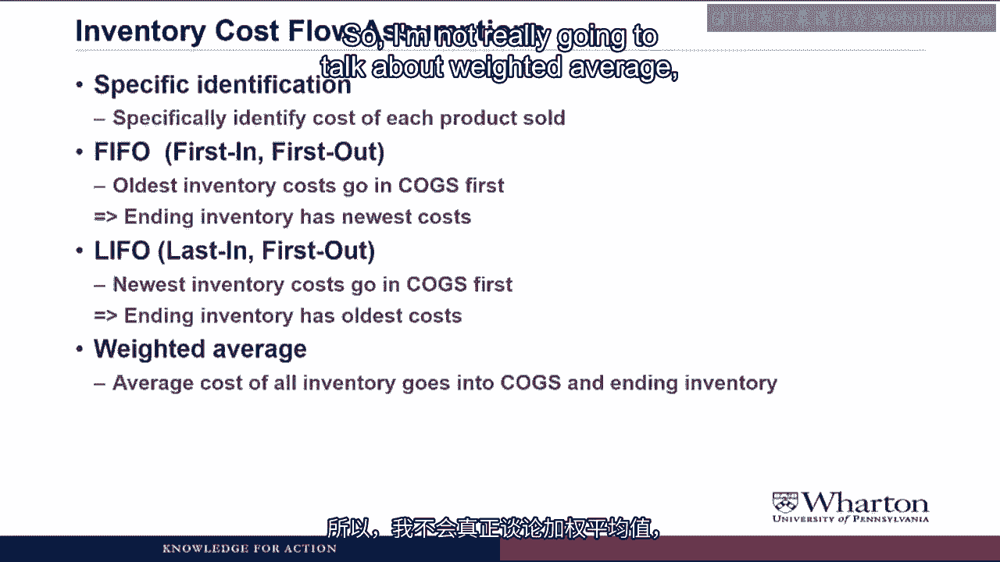
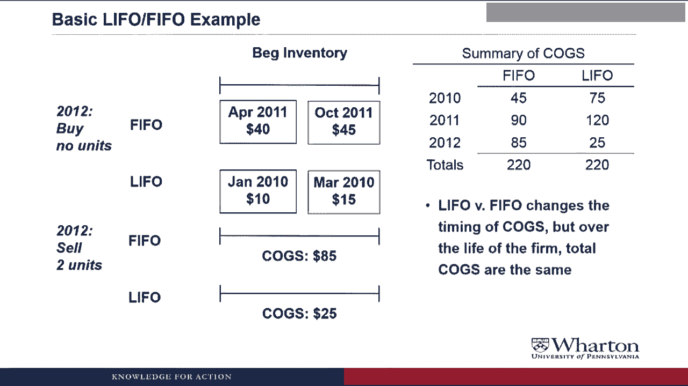
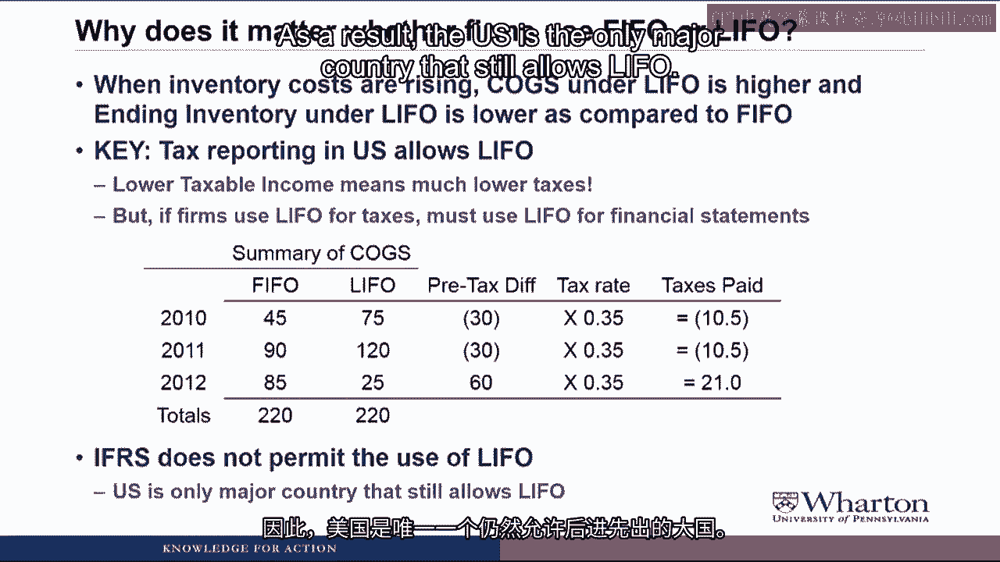

# 沃顿商学院《商务基础》｜Business Foundations Specialization｜（中英字幕） - P163：20_后进先出法与先进先出法23 11.zh_en - GPT中英字幕课程资源 - BV1R34y1c74c

 Hello and Professor Brian Boucher。 Welcome back。 In this video we're going to talk more about inventory cost flow assumptions。

 And if you've ever been curious about what LIFO and FIFO means， this is the video for。

 you because we're going to go through LIFO versus FIFO in detail。 Let's get started。

 We have to start out with a key assumption。 And if you don't keep this assumption straight。

 you're going to be confused for much of this， video。

 The key assumption is that inventory cost flows do not have to follow the physical flow of， goods。

 So we talk about our inventory equation， that beginning inventory plus new inventory equals。

 cost of goods sold plus ending inventory。 If we think of physical flow of goods。

 let's say we sell something like bananas， it's probably。

 the case that we're selling the oldest bananas first and keeping the newest bananas in ending。

 inventory。 So for the physical flow of goods， the goods in ending inventory are whatever specific。

 goods that we haven't sold yet， probably the newest bananas。

 But for the flow of costs and costs are what we're actually running through the T accounts。

 and journal entries， the costs in ending inventory could either match the original cost of the。

 goods， so be the exact cost of every banana that we hold at any inventory。

 It could be the most recent cost incurred， so the cost of the most recent bananas we bought。

 during the period。 It could be the oldest cost incurred。

 so it could be the cost of the bananas that we bought。

 a long time ago or an average of costs over time。 And three is often the one that people have trouble with。

 How could we use the oldest costs in ending inventory when we have probably the newest。

 goods we produced？ And the reason is that the physical flow of goods。

 the actual bananas we hold in the， inventory， doesn't have to match the costs of those specific bananas。

 We can make a different assumption of how cost flow versus how the physical flow of goods， flow。

 Does that make sense？ Hopefully。 So there are a number of ways that we can do these inventory cost flows。

 First one is specific identification， which would mean we specifically identify the cost。

 of each product sold and the cost of each product held in inventory。 With computer technology today。

 I think companies should have to keep the accounts for each individual， good。

 giving me a compelling reason why any master does and specific identification should， be used。 Okay。

 Here's a compelling reason。 What if you made toothpaste or you manufactured salad dressing or gasoline？

 Then how are you going to use specific identification there？

 How can you track a specific gallon of toothpaste or a specific gallon of salad dressing？

 You really can't。 So in that case， you'd have to use some kind of assumption about cost flows other than specific。

 identification。 Even with computer technology these days。

 it still would probably take up a lot of data， processing capacity to keep track of millions and millions of products with their individual。

 costs。 So these cost flow assumptions just make things easier to keep track of without detracting too。

 much from providing a picture of how much your inventory and cost of goods sold really。

 cost to manufacture。 Another method that companies could use。

 and this is probably one of the most common methods， is FIFO。 First in， first out。

 That means that the oldest inventory costs go into cost of goods sold first。

 So the oldest inventory costs are the first one into inventory。

 And so they're the first ones to go out to cost of goods sold。 And because of that。

 the ending inventory is going to reflect the newest costs of the， inventory that we acquired。

 The opposite way to do this would be LIFO， which is last in， first out。

 So here the newest inventory costs are going to go into cost of goods sold first。

 So the last cost to come into inventory through our most recent purchases or most recent manufacturing。

 are the first costs that we pull out into cost of goods sold。

 And so what's left in ending inventory are the oldest costs。

 The cost that we incurred potentially a long， long time ago， because what we're doing every。

 period is we're taking out only the newest costs， leaving behind the oldest cost of manufacturing。

 or acquiring inventory。 If I understand you correctly， you're insane。

 Now would a company sell the newest products first？ They would always sell the oldest ones first。

 otherwise they become obsolete。 Exactly。 A company that sold bananas or milk could never use LIFO。

 Just think， I think is a rare house， would become with all of that old product。

 You forgot that assumption from the prior slide。 The physical flow of goods does not have to match the flow of costs。

 So even a banana company could use LIFO without having a stinky warehouse。

 Certainly they would sell the oldest bananas first and the newest bananas would be kept。

 in inventory。 That's the physical flow of goods。 But in terms of costs。

 you could still use LIFO and use the newest costs of bananas acquired。

 as cost of goods sold and have the oldest costs of banana be ending inventory。 So again。

 the physical flow of goods doesn't have to match the flow of costs。

 And the last method that we could use for handling inventory costs flow is weighted average。

 where we have an average cost of inventory going into cogs and into ending inventory。

 And in practice， weighted average ends up giving results that look a lot like FIFO。

 So I'm not really going to talk about weighted average。

 Instead， I'm just going to focus on the comparison between FIFO and LIFO。

 So I saw this advertisement， I don't know about 13， 14 years ago， in a lavender catalog。

 which was called Inventory Management for Newspapers。 What are these things called newspapers？

 Is that what Grandpa talks about when he said that you used to have to get news delivered。

 on paper to your door in the morning？ Yes， prior to the Netscape IPO in 1995。

 which popularized the internet， many people actually。

 got their news by getting physical pieces of paper called newspapers delivered to their。

 door every morning and sometimes in the evening。 So while you were 10 years old playing video games and eating Cheetos。

 when your grandfather， was 10 years old， he was out delivering these newspapers at the crack of dawn earning a。

 nickel a day。 So I'm sorry for the stale example here。

 but it's good for you to learn a little bit of， ancient history every now and then。

 Going back to our newspaper， Charlie example， LIFO would be a system where you would pull。

 newspapers from the top anytime you wanted to read a newspaper， which would leave all。

 the old newspapers at the bottom still in your inventory of newspapers， which is probably。

 how I would do this。 But that's the physical flow of goods。

 The way you really want to think about this is think about each newspaper as an invoice。

 So anytime you pay money for materials， labor， overhead， anything to acquire inventory， you。

 put an invoice in the trolley。 LIFO would say that you pull the invoices or costs from the top。

 those go into cost of， goods sold。 The invoices that are still at the bottom are the ones that are left in inventory。

 which， are the older invoices。 LIFO， which is how this is intended。

 is you pull the newspapers from the bottom， leaving， the most recent newspapers still in inventory。

 Now again， thinking about this in terms of costs， if this was a stack of invoices， LIFO。

 would say pull invoices from the bottom， which means that you're taking the first or the oldest。

 invoices in inventory out to cost of goods sold。 And what's left in your inventory is the most recent invoices or the most recent costs。

 So that's the difference in LIFO and FIFO with flow of costs。 Again。

 remember it's not flow of goods， but it's flow of costs。

 What I want to do now is throw some numbers at this and do an example of how LIFO and。

 FIFO can affect the cost of goods sold and the ending inventory。 So in our basic example。

 in 2010 we're going to buy five units of inventory。 So to make it simple。

 we're just going to be a retailer。 We buy five units， we buy one in January， March， June， September。

 and December。 And as you can see， we're in an industry where prices are rising dramatically throughout the。

 year so that the January unit only costs us $10， whereas by December it'd cost us $30。

 Under FIFO we have to figure out what are the costs and what are the ending inventory。

 if we sell three units。 So we're going to sell three units which means that the first costs that we acquired are the。

 first ones to go out into costs。 So that would be the $10， the $15。

 and the $20 coming up to a total of $45 for cost of， goods sold。

 What's left in inventory are the September and December units which are $25 and $30 for。

 a total of $55 in ending inventory。 Now if we sell those same three units but use LIFO。

 now what we do is we take the last， costs in as the first costs out。

 So the last three costs in are the $30， the $25， and the $20 which adds up to a cost of， $75。

 What's left in inventory are the first costs we acquired， the January and the March， $10。

 plus $15 which means their ending inventory is $25。

 So there's a difference of $30 in both of our costs to both our costs to goods sold and。

 our ending inventory between LIFO and FIFO。 Okay， you'll get different numbers for costs。

 Close these costs。 It is what it is。 You are telling me that a simple accounting choice can have such a big effect on profits。

 Well for costs you can't use the old it is what it is because every time you look at costs。

 of goods sold in a financial statement it's the product of certain assumptions of how。

 inventory costs flow。 The company could have made different assumptions and it would have been a different number。

 So there is no absolute truth or absolute standard for what COGS is。

 It's a product of assumptions and the assumptions could be changed and you'd get a very different。

 costs。 So keep in mind when we go through this this is not a trivial decision because it could。

 have a big impact on COGS and hands-on unit income。

 Continuing on to 2011 we're going to come into 2011 with different beginning inventories。

 depending on whether we did FIFO or LIFO as we saw from the prior slide。

 So FIFO has the most recent costs in inventory。 LIFO has those oldest costs in inventory。

 In fact another term for LIFO could be fish first in still here and FIFO could be lish。

 last in still here。 Although many people refer to LIFO as LIFO backwards which would be awful because it's。

 an awful way to do accounting。 Anyway so we come in with very different beginning inventory and then we purchase three units。

 during 2011。 Again prices are rising so we purchase a unit in February for $35 April $40 October for $45。

 So now we're going to look at FIFO and LIFO separately for FIFO where we sell three units。

 during 2011 again。 First in first out so we grab those first three costs from inventory 25 30 and 35。

 Let's become our cost of goods sold first in first out， cost is 90。

 These last two purchases of inventory the last two costs are what stick around an ending。

 inventory so 40 plus 45 gives us an ending inventory of 85。

 Now if we sell three units under LIFO here's what it's going to look like last in first。

 out so we start at the right we go back three units so 45 40 35 our cost of goods sold is， 120。

 Our ending inventory are those first costs that we acquired first in still here。

 Our ending inventory is still just 25 so when we compare the two the difference in， COGS is 30。

 LIFO is 120 versus FIFO of 90。 Higher COGS for LIFO reflecting that prices have been going up during the year so the last。

 cost in are higher than the first cost in and there's an enormous difference in ending。

 inventory 25 versus 85 which is reflecting the entire increase in prices since we started。

 building inventory since those costs in LIFO are the first costs that we ever acquired whereas。

 the cost in FIFO are the last costs that we required。 You are insane。

 It simply is not plausible that companies could have such different values on the same。

 goods and inventory。 LIFO must require you keep the older goods。

 I am not insane and in fact this does happen in the real world。

 LIFO came into the US sometime after World War II so if you look at companies that have。

 been around since before the 1940s in their ending inventory some of those costs could。

 reflect cost from the 1940s the 1950s the 1960s so yeah you could have some really really。

 old cost still in inventory even though of course the goods are not still there but。

 don't worry we'll see a disclosure later which will allow us to adjust for that age。

 difference in costs and find out what inventory would be using more recent costs。

 Okay let's finish up this example so in 2012 we're not going to buy any more units we're。

 just going to sell what we have and go out of business。

 So under FIFO when we sell those two units we just take those two costs out of beginning。

 inventory and our cost of goods sold is 85。 For LIFO when we sell our beginning inventory our cost of goods sold is only going to be。

 25 which means our cost is going to be $60 less than it would be under FIFO if we use LIFO。

 so LIFO cost is 60 less than it would be under FIFO。

 The low LIFO cost in 2012 is due to dipping into the old LIFO layers of inventory so。

 anytime you sell more inventory than you produce you end up dipping in or going back to these。

 old costs under LIFO that's called a LIFO liquidation and it has to be disclosed in。

 the financial statements because it has such a dramatic effect on cost of goods sold and。

 it income basically giving the company an extra $60 of pre-tax income this year。

 So when your company says it is having a liquidation sale does that refer to LIFO inventory？

 Not necessarily a liquidation sale just means that you're selling a lot of inventory。

 We use the term LIFO liquidation because you see this happen when you sell more inventory。

 than you produce which is what often happens when you're having a liquidation sale but。

 you can have a liquidation sale without having LIFO inventory。

 So let's take a look at a summary of the cost of goods sold over time from this example。

 So as you can see in 2010 and 2011 FIFO had lower cost of goods sold by 30 each year。

 but then in 2012 FIFO has 60 higher of cost of goods sold which means that the total cost。

 of goods sold over the three years is identical。 So LIFO versus FIFO is going to change the timing of cost of goods sold but over the。

 life of the firm total cost of goods sold are going to be the same either way。

 Based on this chart I would think that every company uses FIFO it gives you lower cogs。

 in every period except the last but by that point you are。 You are dead。

 John Maynard can said in the long run we are all dead。

 Wow that's a cheery quote to inject into a LIFO FIFO video。

 My key point is that cogs are going to be the same either way over the total life of， the firm。

 Yes it's true if for some motivation you wanted lower cogs earlier on FIFO would deliver， that。

 But there is actually a good reason that you might want higher cost of goods sold earlier。

 on and lower cost of goods sold later as you get under LIFO and I am going to talk about。

 that on the next slide。 So let's talk about why it would matter whether a company uses LIFO or FIFO。

 So when inventory costs are rising which is generally the case in inflationary economies。

 generally prices go up over time so inventory costs rise。

 This under LIFO is higher and ending inventory under LIFO is lower as compared to FIFO。

 Now if it was the case that inventory costs were dropping over time then this would be， reversed。

 Cogs under LIFO would be lower and ending inventory higher。

 But more common case is inventory costs are rising over time due to inflation， cogs under。

 LIFO is higher。 In the US tax reporting allows you to do LIFO。

 lower taxable income due to higher cost of， goods sold would mean lower taxes。

 And the rule in the US is that if you use LIFO to take advantage of this potential tax。

 break then you also have to use LIFO for financial statements。

 So it's called the tax conformity rule。 This is one place where tax reporting and financial reporting does have to match up。

 If you use LIFO for taxes you have to use that on the financial statements。

 So let me bring back that summary of cost of goods sold from the example to show you how。

 these tax savings could work out。 So in the first two years 2010 and 2011 LIFO is giving you lower pre-tax income of 30。

 And in 2012 LIFO gives you higher pre-tax income of 60。

 Let's assume the US tax rate is 35% on this income which means that under LIFO you're。

 going to pay $10。5 fewer taxes in 2010 and 2011。 So those lower pre-tax income due to the higher cost of goods sold means lower taxes paid。

 But then in 2012 when we have the LIFO liquidation and your pre-tax income is 60 higher under。

 LIFO you end up paying an extra $21 of taxes。 So you might be thinking well so what you save some taxes now you pay more later but。

 if it's inflationary then a dollar today is worth more than a dollar in the future。

 So you'd rather save taxes now than save taxes in the future。

 And we'll talk about time value money more later in the course。

 But an easy way to think about this is you could use LIFO save $10。5 of taxes in 2010。

 Use those tax savings to buy a high-performing stock which then returns the 10。5 plus a 10%。

 return on an investment。 So when you have to pay the extra taxes in 2012 you sell your investment。

 You have plenty of cash to pay not only the taxes but you also get a return on the cash。

 that you've invested over time。 The only catch to this is that IFRS does not permit the use of LIFO。

 As a result the US is the only major country that still allows LIFO。

 Let me get this straight。 The US is the only country in the world that allows LIFO。

 LIFO is not allowed under IFRS so why are you wasting our time teaching it to us？

 Let me answer that。 America is the most vital， important and dominant country in the world。

 Who cares about euphoria？ This is a good time to remind you that the opinions expressed by Professor Brian Bush。

 A or by his virtual students do not represent the views of the Wharton School， the University。

 of Pennsylvania， its management， employees， families or casual acquaintances。

 These opinions solely represent the views of Professor Bush A and his virtual students。

 We apologize in advance if you have been or will be offended by their comments。

 We ask that you direct all complaints， criticisms， disputes and legal actions to Professor Bush， A。

 Having said that， we hope you are enjoying the course。

 Let's return to the video， joined in progress。 But anyway， even if you're outside the US。

 it's still important to learn LIFO because， if you end up comparing a non-US company to US company and the US company is using LIFO。

 there's some adjustments you need to make in order to do a reasonable comparison across。

 companies and we're going to talk about those adjustments in the next video。

 I think I should wrap up here because I have an urgent voicemail on my phone for some reason。

 But anyway， in the next video， we're going to talk about comparing firms that use LIFO。

 to firms that use FIFO， looking at a disclosure to see what information you need to pull out。

 of the disclosure and then that you would use to adjust the LIFO firms that you can compare。

 the two firms despite the differences in inventory methods。 I'll see you next time。

 See you next video。 Bye。