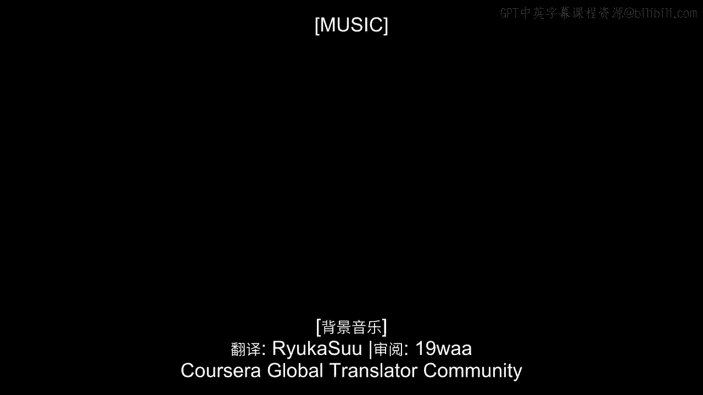

# 沃顿商学院《商务基础》｜Business Foundations Specialization｜（中英字幕） - P16：15_有关客户本位的问题.zh_en - GPT中英字幕课程资源 - BV1R34y1c74c

 [MUSIC]。

 As we wrap up our discussion about what customer centricity is。

 I just want to offer a few more reflections or questions associated with customer centricity。

 For instance， a really big one is who is the customer？ Again。

 is it the end consumer who's buying and using the product？ If you think about many situations。

 it's not so clear。 I work with a lot of pharmaceutical firms。 When I ask people at those firms。

 who is the customer？ I'll often get four different answers。 Is it the patient？ Is it the physician？

 Is it the hospital or the medical practice？ Is it the insurance company？

 You can make an argument that each one of them is the customer。

 and depending on who you talk to at the pharmaceutical firm。

 you'll get a very strong argument one way or another。

 So one of the important steps on the road to customer centricity。

 is getting some agreement on that question。 Agreeing that one of these entities is the customer。

 We care a lot about the others。 We need to keep them in mind as we go through our planning practices。

 But one kind of customer matters more than others。

 Going back to the Procter and Gamble example I mentioned before。

 there's a tremendous amount of clarity on it。 Procter and Gamble knows that today their customer is the retailer。

 I wouldn't be surprised if 20 years from now， Procter and Gamble said。

 "The customer is the consumer。"， But they're moving in an orderly way。

 So it's important to first sit down and figure out who the customer could be。

 who are all the different constituents who could qualify as being the customer。

 and then having a healthy discussion to try to come up with the consensus。

 about which one we're going to focus on， and which other ones might still be on our horizon。

 We also want to think about what are the barriers associated with customer centricity。

 A few of them I've mentioned already， it might be the data。

 Perhaps we can't get the data to be able to track individual customers doing things over time。

 There might be regulatory issues。 There might be reasons why we can't treat customers differently。

 for instance， in the pharmaceutical space。 There might be cultural reasons。

 It's just impossible for this company to move from a product centric to a customer centric view。

 If the company has been focused on developing and distributing blockbusters。

 for all of its existence， it's hard all of a sudden to pivot around the customers。

 So there's a number of barriers that can be in place。

 The ones that I just mentioned are fairly general， they're fairly broad。

 but every company is going to have its own challenges。

 Before saying we're going to become customer centric， it's very important to come up with that list。

 and think real carefully about existing barriers and new ones that can be arising。

 So to do a real careful inventory of barriers towards customer centricity。 And of course。

 at the same time， you want to think about the resources that you can bring in。

 to address or maybe preempt some of those barriers。

 Very often the resources are going to be financial， we're going to have to invest money。

 to build the information technology systems and to hire employees。

 and to start developing a data infrastructure。 Sometimes they're going to be cultural。

 we're going to have to hire the right kind of people。

 who can think around conversion thinking around the customer instead of divergent thinking around the product。

 So there's a number of different ways that we can start thinking in advance。

 about overcoming the barriers before the barriers actually start impeding our progress。

 Another important consideration is competition。 It's interesting that in some cases。

 seeing your competitors taking moves towards customer centricity。

 is a very strong incentive for you to do so。 So for instance。

 we see a number of industries where customer centricity has really made great strides。

 such as financial services such as hotels and hospitality， where it's competitive pressures。 Hey。

 they're moving towards customer centricity， we should be doing it too。 But in many cases。

 the best motivations to move towards customer centricity， it's the entire opposite of that。 Hey。

 no one's doing it， let's be the first。 That would be the example of Harris and Tesco。

 Sometimes being the only one doing the customer centric thing is the way to make it most successful。

 So again， you want to think about the ecosystem for your industry。

 and is it better for everybody to be customer centric？ Is it better for it to be only you？

 And that might drive your decision。 In the end， the big question is。

 do you want to be customer centric or not？ Does it make sense for your company？ And if not now。

 when should you be customer centric？ I think about， again， a company like Procter & Gamble。

 Walmart and so on， making plans now for changes that they can make in a few years。

 And as you decide whether to be customer centric， the timing about it。

 you want to start laying some of the baby steps towards it。

 So it might be developing technology initiatives like the Scan & Go program that I mentioned for Walmart。

 It might be an organizational initiative like MyBlackIsBeautiful for Procter & Gamble。

 It might be other kinds of experiments that a company is going to run。

 They're going to set aside a part of the organization or a group of customers。

 And just treat them differently and see if we can and see if it's more profitable than handling them。

 in the usual product centric manner。 Those are the kinds of decisions I want to see companies making。

 And I think it's very important for all companies to at least be thinking about it。

 so they can make an informed decision about what customer centricity might mean for them。 [Music]。

 [BLANK_AUDIO]。

