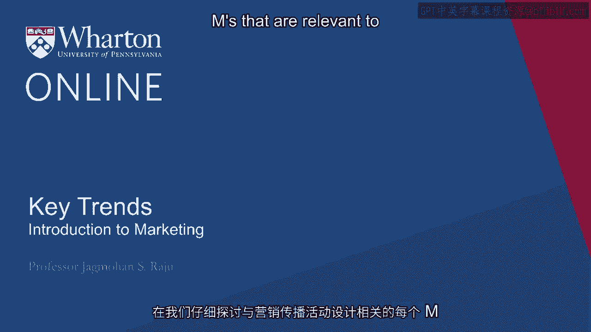
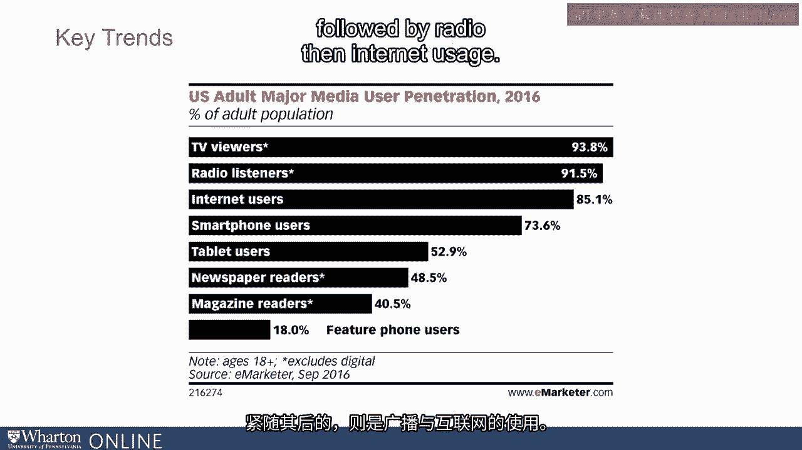

# 沃顿商学院《商务基础》｜Business Foundations Specialization｜（中英字幕） - P18：17_关键趋势.zh_en - GPT中英字幕课程资源 - BV1R34y1c74c

 Before we go into details of each of these M's that are relevant to designing a communications。

 campaign， I think it will be worthwhile to look at a few key trends especially on the， media side。

 I think most of us know that despite the changes in the industry in terms of various。

 media available to us， TV viewing is still covering a largest part of the audience followed。

 by radio， then internet usage。

 But in terms of frequency， if you look at the data， there are a lot of changes。

 Overall spent in terms of time people spend on various media that is changing。

 Television is going down， some of the digital media is increasing。

 I think that's very consistent with our intuition。 But it's not like TV is falling apart。

 TV is still and it's projected to be at least one-third of total ad spending will be on， television。

 Much of it will shift to digital。 Newspapers have gone down quite a bit。

 Radio is still stable but not as big。 Out of home is what we call as billboards and so on。

 That remains pretty strong。 It's not going to go away。 If you look at the overall trends。

 what you will see is digital going up。 Now this is often very misleading。

 The reason it's very misleading is digital， if you really look at it， digital is also。

 looking more and more like TV。 Much of digital advertising and content on digital is really videos。

 So it's only the method of distribution has changed。 The content looks exactly like TV。

 So instead of you watching your regular TV channel， you're going to watch YouTube。

 But even if you look at our own websites of companies， our own website at the Wharton， School。

 most of our messaging is video based。 So really I think it's important to understand that even though digital is going up。

 the， content which is video content is actually probably increasing as a percentage of total。

 Only part of it gets delivered through the television。

 The rest of it is getting delivered through digital means。

 So I think people often say the media is changing， therefore your strategy should change。

 I think what we want to emphasize here is the key principles of campaign design are not。

 affected by media choice or media availability。 It's actually the other way around。

 Media choice is determined by campaign design rather than media affecting campaign design。

 So first we have to design the campaign properly， then select the media rather than the other。

 way around。 So with that in mind， let's start with the first key M of a communications campaign which is。

 figuring out the mission。 What we know from buyer behavior and consumer psychology is that a consumer does not go。

 from being a non buyer to a buyer in a zero one manner。

 That is suddenly they don't like something and they go ahead and buy。

 They go through certain stages。 They go through stages such as becoming aware of the product or a service then generating。

 some interest about the product or service next having some desire to either buy or consume。

 it and finally deciding to buy it。 What do we know from research on how we influence buyer behavior in our favor？

 What we know is that if you look at through these stages carefully things such as mass。

 media which could be either digital or others， they are very good at creating awareness but。

 not as effective at the latter stages of the persuasion process。

 Correspondingly things like word and mouth and interpersonal word of mouth or personal。

 sources and personal selling， these are much less effective at the early stages of the decision。

 making process but become much more effective at the later stages of the decision making， process。

 What does that say about improving our communications campaign？

 What it says is very simply that if you had $100 to spend， you would not spend all $100。

 on mass media。 You would spend a good part on that to improve awareness and interest but then you would。

 also spend a good portion on personal and interpersonal sources to create more word of， mouth。

 This is often referred to as the one to punch theory of persuasion。

 Where does the phrase one to punch come from？ It comes from boxing。

 What does that really mean in this context？ What it means is you use mass media to soften your consumer。

 make them familiar with your， products and services。

 get them interested and then use either personal selling or interpersonal。

 word of mouth to actually convert them to your users。

 If you try to use personal selling at the very beginning， it's not going to be very effective。

 Same way if you are going to use mass media or digital at the later stages of the decision。

 making process， it's not going to be very effective。

 So one of the key lessons in determining and designing a communications campaign is to make。

 sure you have a good mix of these sources。 Both mass media as well as personal and interpersonal communications。

 Now let's focus a little bit on message design。 This is a key component of a communication strategy is how do you say what you need to。

 say and psychologists and advertisers have learned over the years that there are two types。

 of appeals we focus on。 One is what we call as rational appeals。

 They appeal to one side of your brain。 Others is what we call as emotional appeals and for each one of them there are many different。

 types and we will discuss a few more few of each in this module。

 Let's think of first rational appeals。 A very popular and powerful rational appeal is what we call as product demonstration。

 What do we mean by product demonstration？

 There are many products and services where we want to let the consumer or our buyers know。

 that they deliver a particular point of difference or deliver a particular value proposition。

 But that claim is not very easy to believe。 People may not believe why this particular shaving system does give you a better shave。

 than another one。 One way to communicate that is to show the technology behind your product。

 If you look at this particular ad you see there are four pictures in that one picture shows。

 a person actually using the the shaver then there are three other pictures。

 The one picture right under the main picture is what is demonstrating the technology。

 It's showing how this particular shaving method will actually give you a better shave。

 This is what we mean by product demonstration。 It's not demonstrating the product on your face but it's demonstrating how this technology。

 will deliver what it claims to deliver。

 Let's look at another popular example that you may have seen。

 If you see vacuum cleaner ads or washing machine ads they'll often focus on the technology。

 in the vacuum cleaner or the washing machine。 Dyson is a popular company that makes vacuum cleaners。

 If you look at any of their ads which you can see on YouTube you will see they often talk。

 about the technology。 Why will this vacuum cleaner work better than other vacuum cleaners？

 And this is what we call as the use of product demonstration in your communications campaign。

 It's a very strong rational appeal。

 Another type of rational appeal is use of a spokesperson。

 Spokespersons if they use a product you believe they do well with the product you may also。

 feel that you will also be like them。 Again the use of a spokesperson at times is very expensive so you have to select your spokesperson。

 very carefully otherwise it can be not a good value proposition。

 Some companies often use another type of a spokesperson which is a cartoon character。

 or an inanimate object and they use this cartoon character or other cartoon characters like。

 that as a spokesperson。 Different than a spokesperson is the use of a testimonial。

 This comes from a regular user who then says look I use the product I feel good about it。

 you should also do the same。 Testimonials many people believe are more effective because they are coming from regular。

 users and these regular users are not being paid to say something good about the product。

 they are doing it because they themselves find the product of the service useful。

 Another strong rational appeal that advertises use is product comparison。

 They might compare their product against another product on a number of characteristics or holistically。

 say more people prefer our product to somebody else。

 Whenever you use product comparisons it is very important that you follow the legal guidelines。

 for product comparison。 Most countries have very strong guidelines put in place。

 Some countries actually do not allow direct product comparisons but those that do have。

 strong legal requirements and you must follow those if you use product comparisons。

 If done well this is a very strong rational appeal。

 Emotional appeals are another popular way of communicating your message and there are。

 different types of emotional appeals that we use。 Broadly classified as positive emotions or negative emotions。

 Positive emotions there are many examples of positive emotions that that advertises use。

 as they develop a campaign。 A good example of that is the Procter & Gamble campaign for Olympics。

 You see children growing up， their mother is taking care of them and as the children grow。

 up you see them in playing or participating in one of the Olympic games doing very well。

 and then you see the child actually hugging the mother and anytime you see this ad no matter。

 how many times you see it at least whenever I see it I still have a tear in my eye。

 What is interesting about this campaign is when it was developed Procter & Gamble managers。

 were not very excited about it。 Why because it did not sell the product itself it only sold the company's name。

 So this is also an example of what we call as corporate image advertising。

 There are good studies done including something we did many years ago along with one of my。

 doctoral students on what type of company should use corporate advertising and what type of。

 company should not。 The general theme there was companies that use a common brand name across many of their。

 products should use corporate advertising and those that use different brand names or a。

 house of brand so to say versus a branded house as Professor Bhabra Khan mentioned in her。

 module wherever you have a branded house there is a stronger case for using corporate。

 advertising and Procter & Gamble it turns out does not use a branded house it uses a。

 house of brands。 Another strong emotion that we use in developing a communications campaign is fear that is。

 one of the negative emotions we use。 What is interesting about fear is we have found that too little fear does not have much effect。

 too much fear also in a campaign does not have much effect。

 So the efficiency of fear goes down if there is too much of it。

 So a question can be asked is why too much fear is not good in a campaign。

 What advertisers have found is that if you use too much fear in your advertising people。

 get turned off in fact they do not even remember seeing that。

 So it is very important that if you use fear in a mass media kind of a setting you have。

 moderate levels of fear in your campaign that is what researchers say in their work。

 One way to moderate the effect of fear is to combine it with humor and there are many examples。

 of that when you look at many of the pharmaceutical company ads here is one example where you have。

 germs but we never show germs as real germs we will show them as nice looking cartoon， characters。

 So at least there is fear but it is moderated by using humor。

 Next M we talk very briefly about is media planning。 [BLANK_AUDIO]。

