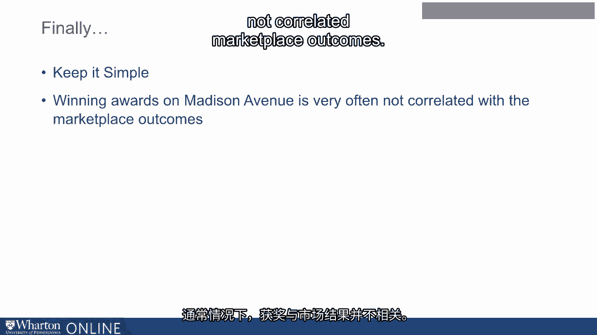
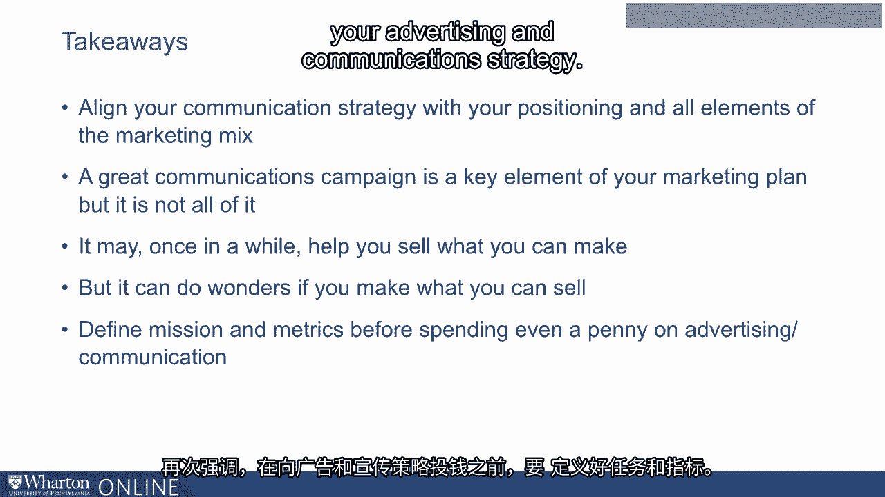
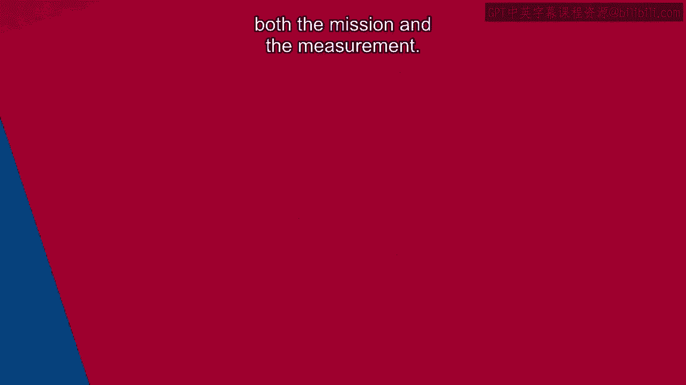

# 沃顿商学院《商务基础》｜Business Foundations Specialization｜（中英字幕） - P19：18_媒体规划.zh_en - GPT中英字幕课程资源 - BV1R34y1c74c

 As I mentioned earlier at the beginning of this module， media planning is one of the。

 key aims but given our constraints， we are not going to spend too much time on it but。

 I do want to give some important messages here。 There are three types of media when you look at it from a strategic perspective。

 If you look at it from a tactical perspective， people will say media consists of newspapers， TV。

 digital but when you look at it from a strategic perspective， we classify media， into three types。

 Paid media， earned media and owned media。 So any communication campaign has to decide how much emphasis to put on paid。

 earned and， owned。 What do we mean by paid media？ Paid media is what we know typically。

 It's your television， it's your search advertising， it's your banner advertising， it could be。

 videos on YouTube， on your own website。 So that will be paid media。

 Earned media is what you earn based on what activities you do。

 So this could be actually you conduct an event， you may sponsor a golf tournament or a tennis。

 tournament and then people talk about it。 Or you might have a campaign where you give out free glasses to people who can't afford。

 it or free shoes to people who can't afford it。 And then news media talks about it。

 all of that we'll call as earned media。 And then there is owned media。

 Own media is your own website， your own company's building， your name on it。

 If it's at a very popular location people drive by it。

 But owned media owned is also your own product。 Your product advertises itself。

 If you look at a typical car， you know the name of the car is written on the back of the， car。

 not the front of the car。 Why is it written on the back of the car？

 Well people who are driving behind you can read the name。

 If it were written on the front of the car and you'll see it in your heavy mirror you won't。

 be able to read it。 Your own media is not just your own website but your also your products and services advertising。

 itself。 I think a good important strategic choice in media is how much emphasis will be paid on。

 paid media versus earned media versus owned media。

 Once you've done that of course then there is a next step of the media planning process。

 Who are you targeting？ What media channels you are using？ Where you are going to spend your money？

 When you are going to spend your money， how much you are going to spend？

 All of these are technical decisions that if you have a good advertising agency they。

 can help you make these decisions。 So this is not an area where a typical person who is taking their own product or service。

 to the market needs to specialize in。 If your advertising agency doesn't know how to do this please find another one。

 But this is an area where their skill sets are strong and you should take advantage of。

 that。 Money。 Next 10。 Once again there are many formal methods of deciding budgets。

 Here we'll just give you some key insights。 Many companies when they are setting up their communications budget use heuristics or rules。

 of thumb such as let's set our budget as a percentage of sales or let's set our budget。

 to match or do a little bit better than competition。 All these are as the name suggests heuristics。

 They are not very good ways because they are not very purposeful。

 What you should be doing is what we call as use objectives and task methods。

 Think of what the end goal of your communications campaign is。

 For example the mill campaign had a very specific goal in mind。

 We would like to have these many people aware of our product in these many months。

 You start with that end objective in mind and then work backwards from there and ask yourself。

 how much money you need to spend to get to that objective。

 That's how you set a budget as opposed to percentage of sales or matching or doing something。

 better than the competition。 Advertising agencies might encourage you to set a budget that is percentage of sales so。

 that when your sales grows the budget grows and when the budget grows their fees may also， grow。

 So you need to be very sensitive to that。 So always use objectives and task method which is start with the end goal in mind and。

 then work backwards as to how much you need to spend and there are formal ways to do that。

 Now let's talk about the last one which is measurement。

 Now measurement is the last term but I always say don't decide at last。

 You should decide it early on。 In fact before you spend a dime on communications decide what measurement method you are going。

 to use。 There is no dearth of measurement methods。 We have methods that cover many different areas。

 We can test creative strategy。 We can test print advertising。 We can test television advertising。

 We have fancy methods that are physiological methods。 We can look at consumer skin responses。

 We can look at their eye tracking。 So there is no dearth of these measurement methods。

 The problem often is it's the will and willingness to measure that prevents measurement and it's。

 not even the cost of measurement。 For a dollar that you spend on communication even the more sophisticated method does not。

 cost more than one cent on the dollar。 So please decide on what the mission of your campaign is。

 Set the measurement method in advance and then go ahead and develop your campaign and， execute it。

 Finally when it comes to communication strategy I think a good idea is to keep it simple。

 Your advertising agency may be more interested in winning awards but your job is to improve。

 the sales of your products and services。 Oftentimes winning awards is not correlated marketplace outcomes。

 A very nice ad that I would all like you all to see is the Miya mix ad。

 Once you see it it's on YouTube anyone can go see it。

 It's very simply a cat saying Miya Miya Miya Miya Miya。 I think more than 60 times in 30 seconds。

 And under that ad you see the line which says what is good about this product。

 It's a very simple execution。 It is one of the most memorable ads the day after recall of this ad has rarely been beaten。

 The cost of the spokesperson is nothing。 It's a cat。

 What are some of the key principles in this particular ad？

 The company shows the product， mentions the brand name many many times。

 Many of the advertisements you see whether it's on digital or TV。

 You've seen the whole ad and then at the very end you see the brand name。

 By that time many people have walked out， engaged in something different。

 This particular ad mentions the brand name many many times。

 It states all the positives about the product。 It shows the product in use。

 avoids any unpleasant connection with your product。

 And it also tells people where and how they can buy it。

 It's never won any award but the day after recall of this ad in terms of people's recall。

 of the brand name has been one of the highest。 So a quick summary of what we covered in this module align your communication strategy。

 with your positioning and all the elements of your marketing mix。

 A great communication campaign is a key element of your marketing plan but it is not all of it。

 Once in a while it may help you sell what you can make but it will do wonders if you make。

 what you can sell。 And again define mission and metrics before spending even a penny on your advertising and。

 communication strategy。 So even though measurement is the last 10 you should be designing deciding it along with。

 your mission and not executing your advertising before you combine both the mission and the。

 measurement。 [BLANK_AUDIO]。

