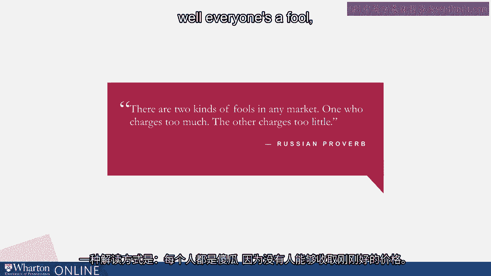
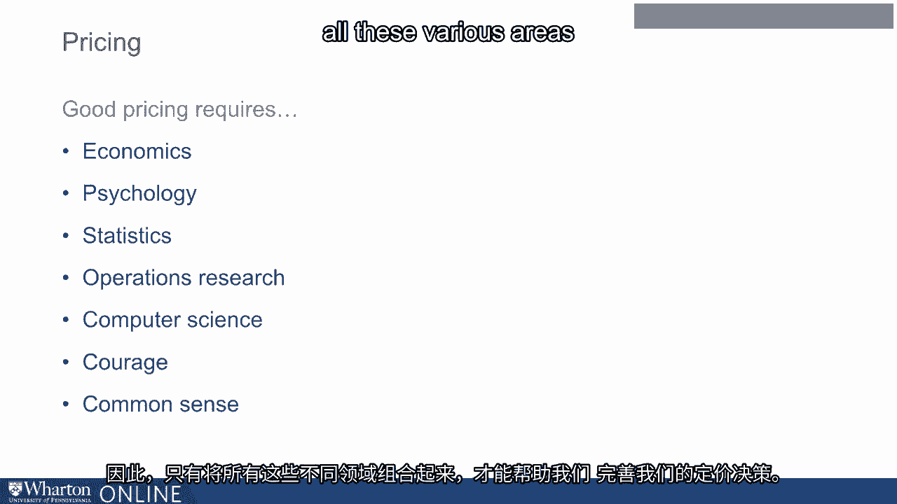

# 沃顿商学院《商务基础》｜Business Foundations Specialization｜（中英字幕） - P20：19_定价.zh_en - GPT中英字幕课程资源 - BV1R34y1c74c

 In this module， we will discuss pricing in more detail。

 All companies， all businesses have to make a pricing decision。

 Pricing is one of the four key piece that Professor Kant discussed earlier in her opening， module。

 So first let's talk a little bit about the importance of pricing and by pricing is a key。

 driver of profits。 This study was done by McKinsey many years ago and we replicated it in our book Smart。

 Pricing More Recently using data from words which is a modern data service。

 So what this study does is it looks at the improvement in your bottom line if you were。

 to change or improve either your fixed cost， your sales volume， your variable cost or， your price。

 So think about it as the following。 Let's say we were to look at all S&P 500 companies in the US and create a combined income。

 statement of all 500 companies。 So once we have that combined income statement。

 we say okay if these companies were to lower， their fixed cost by 1%。

 what would happen to their operating profits？ And the answer is they will improve by 2。3%。

 What if these companies could increase their sales volume by 1%， what would be the response。

 on the bottom line？ It will be lower than 3%。 What if these companies could reduce their variable cost by 1%。

 what would be the impact， on the bottom line？ Well close to 8%。

 What if these companies could improve their price by 1%， what would be the impact on the。

 bottom line？ And the answer is close to 11%。 So if you look at all the levers or drivers that are available to a manager。

 improving， your pricing has the biggest impact on the bottom line。

 We have known this for a while and many good managers have known this for a while。

 But now you combine it with the next piece of data。

 When it comes to managers perceptions as to what they are better informed about， what。

 do they focus on？ Well if you look at variable cost， that's the highest thing people focus on。

 Number 2 is fixed costs。 Number 3 is comparative prices。 And then when you look at pricing。

 those numbers are much lower than the first few numbers。 So what does that mean？

 Even though people realize that pricing is one of the most important drivers， their knowledge。

 about how to use and execute on pricing is limited and can be much better。

 I think this highlights the importance of all of us learning a little bit more about。

 pricing and becoming better prices。 There is a very nice Russian proverb that I often share with my students in the class。

 There are two kinds of fools in any market。 One who charges too much and the other who charges too little。

 Now there are many ways to interpret this problem。 One way to interpret this is。

 well everyone is a fool because nobody can be charging the。

 exact right price。 There is another way to interpret this problem which I think is a more appropriate way。

 What it is really trying to say is that good pricing is a balancing act。

 And in order to achieve the right balance， we need to be cognizant of a number of different， areas。

 We need to understand economics because pricing is about economics。

 We also need to understand psychology。 Both consumer psychology as well as psychology of people who make pricing decisions because。

 human beings make pricing decisions and human beings respond to pricing decisions。

 In this age and also in any other age， the knowledge of statistics is very important。

 You need to be able to manage data。 You need to be able to analyze data。

 You need to have a good understanding of operations research which means you need to learn how。

 to optimize given some data。 These days you need some basics about computer science。

 And you also more importantly need a lot of courage because good pricing decisions are。

 not made by changing the price。 They are made by changing the pricing strategy in a company。

 And also good pricing requires common sense。 So it's a combination of all these various areas that help us improve our pricing decisions。

 [BLANK_AUDIO]。

