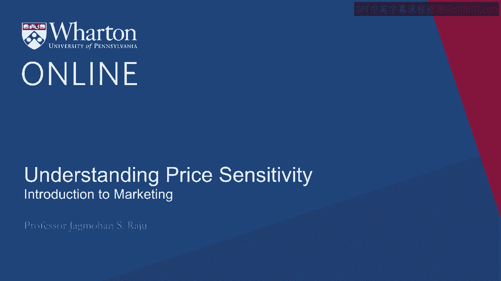
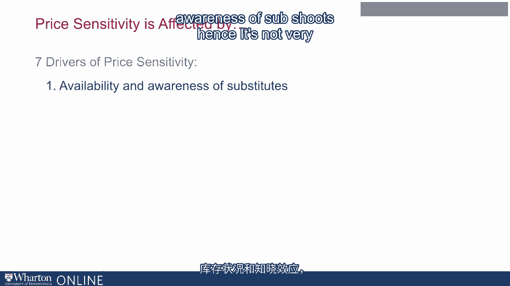
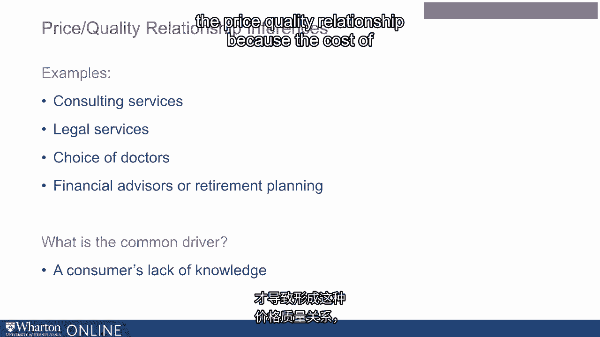
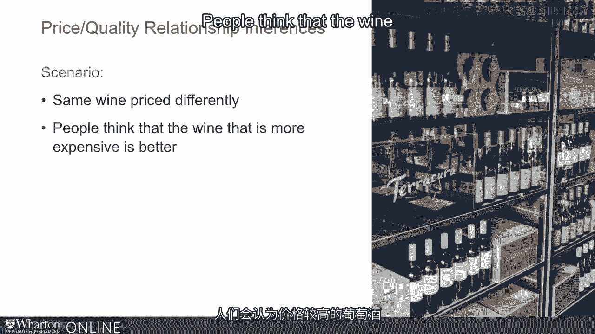
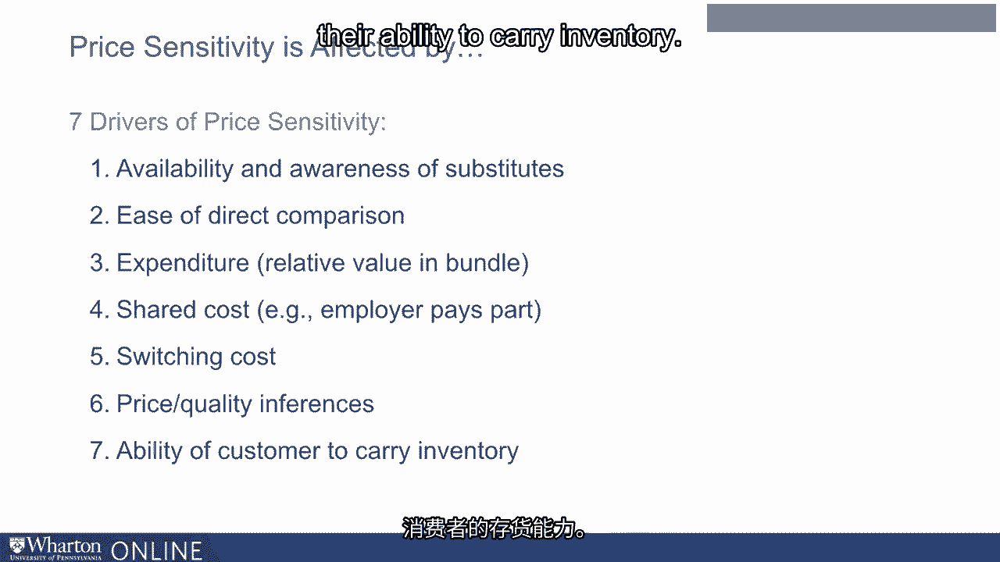
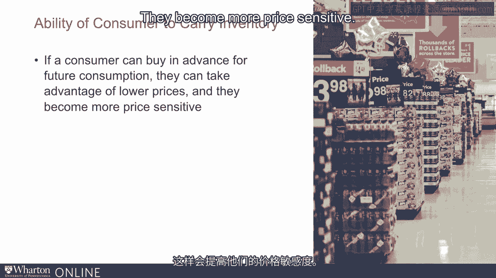
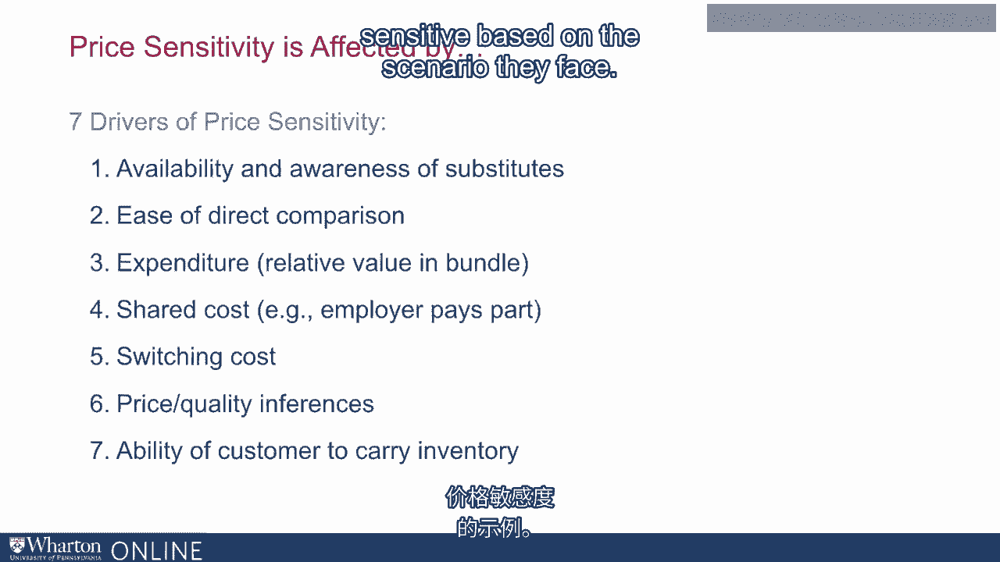

# 沃顿商学院《商务基础》｜Business Foundations Specialization｜（中英字幕） - P21：20_理解价格敏感性.zh_en - GPT中英字幕课程资源 - BV1R34y1c74c

 A key to making good pricing decisions is understanding the concept of price sensitivity。

 and price elasticity。 In this module we will focus on this particular aspect in more detail。

 We will do it in two parts。 In the first part we will think about what drives price sensitivity or price elasticity。

 In other words， under what conditions are consumers more or less price sensitive。

 If we know this we get some useful directional guidelines on when to price higher and when。

 to price lower。 The next part of this module we will talk about formal methods of measuring price elasticity。

 and of course before we do that we will define formally what price elasticity means。

 So let's start with the first one， drivers of price sensitivity。

 These are things we know from previous research and previous observations and are fairly robust。

 findings。 So what are the things we are going to focus on？

 We are going to focus on seven different drivers of price sensitivity starting with availability。

 and awareness of substitutes。

 I think it's not very complicated to recognize that if your product has more substitutes。

 people will be more price sensitive。 So this is very straightforward。

 More substitutes that exist greater will be the price sensitivity。

 What is important is it's not just the availability of substitutes even awareness of substitutes。

 matters。 So for example， I live close to Philadelphia， I work in Philadelphia， so I know a lot of。

 restaurants in Philadelphia。 So if I am price sensitive about where to eat。

 I have good information of various restaurants， their prices， I'll be more price sensitive。

 But if I go on a vacation， let's say I go on a vacation to Paris or another city which。

 I'm not very familiar with， I don't know many restaurants there， I'll be less price sensitive。

 Probably there are more restaurants in Paris than there are in Philadelphia。

 So there are more substitutes available in Paris， but my price sensitivity in Paris is。

 going to be lower because I'm not aware of all of them。

 Another important concept to keep in mind is it's not just availability and awareness。

 how easy it is for us to make direct comparisons， makes price sensitivity higher or lower。

 So let me give you an example from my own research。

 I do a lot of work on private labels at generics。 Professor Kant talked about private labels earlier also in her module。

 Private labels command a very high share in the US market。

 Not just because they are priced lower than major national brands， but because they are。

 kept right next to major national brands on the same shelf。

 So consumers can easily see that national brands say Tylenol cost this much and Acinomifene。

 produced by Walmart or sold under the Walmart name cost much less and they are kept right。

 next to them。 So many people choose the store brand。 Think of the following scenario。

 Suppose all these store brands were put on a separate shelf in the store。

 Just like generics were put on a separate shelf many years ago in some stores。

 If all the private labels of various categories were taken out and put on a separate aisle。

 in another part of the store one of our papers that we did for a company indicated that the。

 share of private labels will fall by 10%。 So it's not just it's not just the availability of private labels。

 It's our ability to compare the private label price with the national brand in a very easy。

 way that increases our price sensitivity。 So availability of substitutes。

 awareness of substitutes and then how easy it is for us。

 to compare the price of one product against another and even small changes there make a。

 big difference in price sensitivity。 Another important driver of price sensitivity that we've observed is what is the total expenditure。

 on the product and also what is the total expenditure on this product as a fraction。

 of your total cost。 So let me give you examples of both。

 If you spend more on a product or a service you are going to be more price sensitive。

 Bigger families are more sensitive to the price of groceries。

 Why because for a bigger family their expenditure on groceries is a bigger part of their budget。

 So they are more price sensitive。 So if you spend more on a product or a service you are usually more price sensitive。

 What is also interesting is the same product if it's a bigger part of your cost structure。

 you will be more price sensitive。 If it's a very small part of your cost structure you will be less price sensitive。

 So let's say if I'm making a steel furniture I'll be more sensitive to the price of steel。

 than somebody who makes wooden furniture and uses steel nails。

 Now steel is still steel but the cost of nails as a fraction of the total cost is much smaller。

 for somebody who makes wooden furniture as compared to the price of steel that goes into。

 steel furniture。 So even though we have the same metal steel the person who is more price sensitive to。

 the steel is the person who makes a steel furniture as opposed to the person who makes。

 wooden furniture。 Now this one is not very surprising。

 If somebody else is sharing a part of the bill you are going to be less price sensitive。

 So people observe this that if your company is paying for your airfare you will probably。

 not as search as much for a lower cost of light。 How do you tackle that？

 Well you may want to give your employees some incentive in terms of some shared benefit。

 if they are finding a lower price。 Another example is when you are pharmaceuticals or the products that you buy in a pharmacy。

 when they are covered by insurance you are likely to be less price sensitive。

 So how do companies encourage people to become more price sensitive and buy the cheaper product？

 If you go through the insurance company and lower the price let us say if a drug costs。

 a hundred dollars insurance company pays 80 percent you pay only 20 you are going to。

 pay 20 and the insurance company picks up 80。 Alright well if you lower the price from 100 to 50 what will happen？

 You will pay 10 instead of 20。 Who is getting the biggest advantage it is the insurance company but if you can give。

 a direct to consumer discount then the consumer sees a bigger benefit of that discount。

 So whenever you have shared expenses and you want the consumer to actually be more more。

 price sensitive you give a direct to consumer discount as as opposed to lowering the price。

 of the product directly。 Your switching costs affects price sensitivity。

 So if I already have a big car a big SUV for example I have a V8 SUV that I have owned。

 for 10 years it still works well so I do not change it even though my kids tell me to buy。

 a new one。 But because I already have a big SUV when the price of gasoline increases I still fill。

 it up I am not very price sensitive to it even though I want to be I have no choice because。

 I get only 15 miles per gallon if I were able to change my car then I would become more。

 price sensitive but I am stuck with a particular car or a particular SUV in this case so when。

 the price of gasoline changes my behavior does not change I still have to go to the office。

 every week or every day of the week I pretty much go 6 days a week so I still consume as。

 much gasoline as I did even when the price was lower。

 An area that is also important to think about is price quality relationships。

 There are many product categories where consumers infer the quality of the product from the price。

 so many people say perfumes is one example of that。

 Let me give you some more examples that may be even more relevant consulting services。

 legal services， choice of a doctor， financial advisors or retirement planning。

 In all these cases what we find is people infer quality of the product from the price。 Why is that？

 What is the common driver？ The common driver here is consumers lack of knowledge about the product of the service。

 I do not know who is the best legal professional because I do not use them very often but if。

 I have somebody who is really cheap I might infer from their lower price that they are。

 not very good whereas the somebody who charges a lot may be better because why？

 Because if other people are willing to pay more for them they must be good。

 I am not very knowledgeable about this service and if I find that the market is willing to。

 pay more for them they must be good。 And this is consumers lack of knowledge that drives price quality relationship because。

 the cost of error is very high in all these settings。

 Price quality relationships happen in other areas too with a very similar kind of an idea。

 The same wine when price differently people think that the wine that is more expensive。

 is better。 Again this happens more with novice wine drinkers as opposed to knowledgeable wine drinkers。

 Knowledgeable wine drinkers will not show as much price quality effects as as novices。

 And by the way we have seen many studies which are brain scans where for novice drinkers。

 you see this effect very strongly。 Another area that affects consumers price sensitivity is their ability to carry inventory。

 If a consumer can buy an advance for future consumption they can take advantage of lower。

 prices they become more price sensitive。

 If a consumer is not able to carry inventory for example say products like milk fresh vegetables。

 where you can't store them for a long time people are less price sensitive because when。

 the product is on sale you can't buy it for the next month of consumption。

 Whereas for cereal and many other products people find that if the product is on sale。

 people buy a lot more of it because they can store the product for future consumption。

 So these are some of the instances where we see people becoming more or less price sensitive。

 based on the scenario they face。

 [BLANK_AUDIO]。

