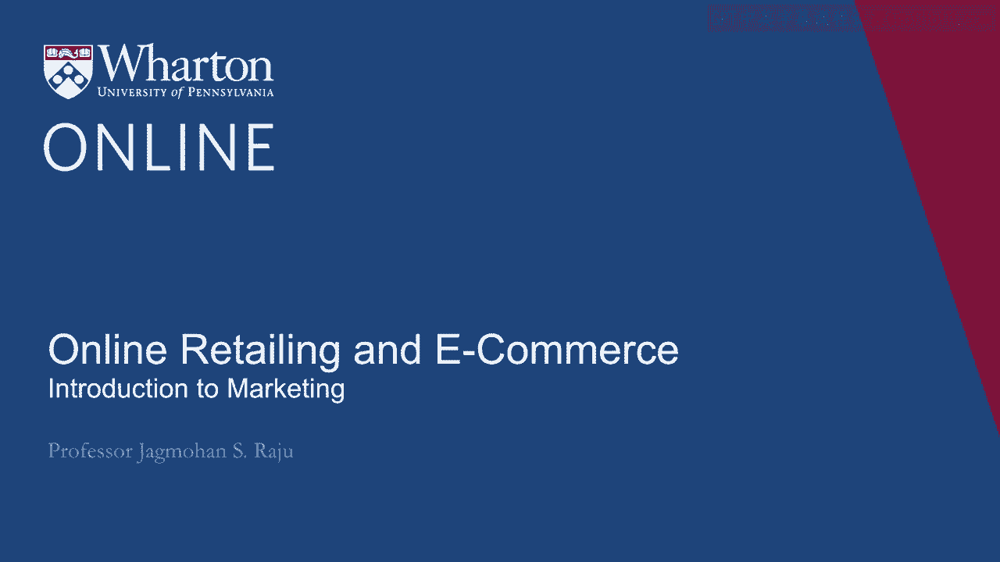
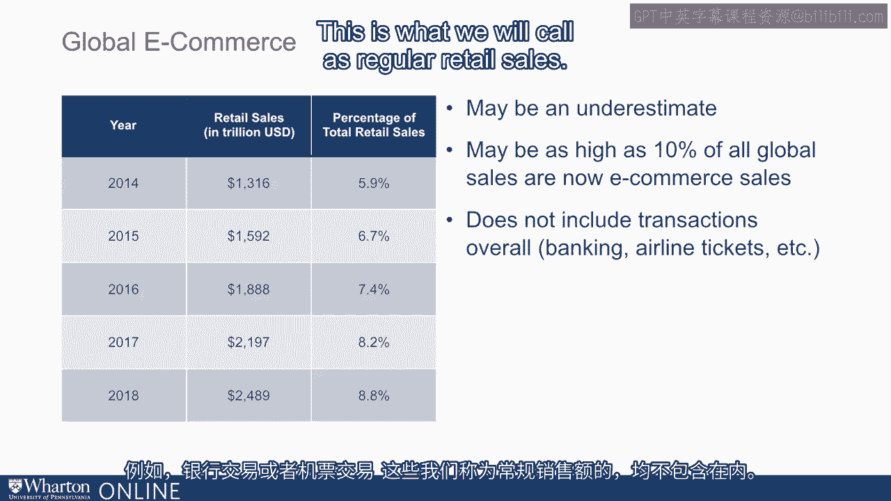
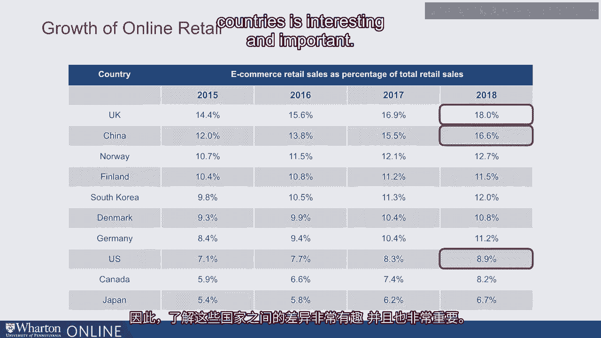
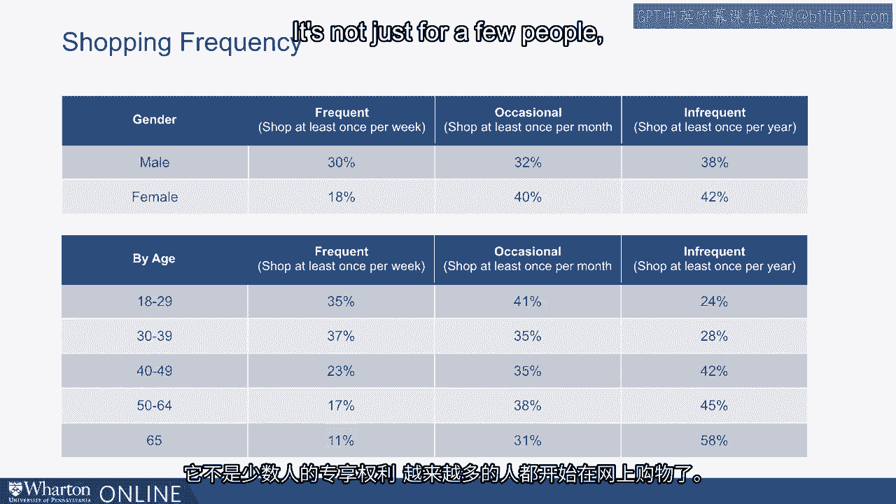
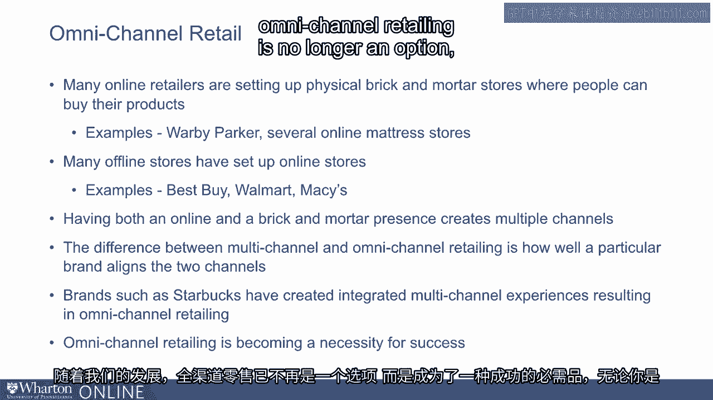

# 沃顿商学院《商务基础》｜Business Foundations Specialization｜（中英字幕） - P29：28_网上零售和电子商务.zh_en - GPT中英字幕课程资源 - BV1R34y1c74c

 In this lecture， we'll talk about online retailing and e-commerce， an area that has been growing。

 rapidly over the years。 Let's start by looking at some data。 If we look at global e-commerce sales。

 they've been growing since 2014， these data shows， started at 5。9% of total retail sales globally。

 and in 2018 it's 8。8%。 By many estimates， actually this is an underestimate of the activity。

 By some other estimates， it's as high as 10% of all global sales are now e-commerce sales。

 By the way， this does not include transactions overall。 For example。

 banking transactions or airline ticket transactions。

 This is what we'll call as regular retail sales。

 If we look across countries， you see some interesting differences。 Let's focus on China， where 16。

6% of total retail sales are online。 Compare that with the US， which is 8。9% in 2018。 So China has。

 in terms of percentage of sales that have gone online， is much higher than， the US。 In fact。

 I was in China just a few days ago。 It is very hard to actually make payments by cash。

 All payments have moved online， and much of the stores sales have also moved online。

 What is interesting also is that UK is as high as China， or even in fact， even higher。

 than China when it comes to retail sales。 So understanding these differences across countries is interesting and important。

 Our focus today is going to be predominantly on what's going on in the US。

 If we look at how frequently people shop online， you see some interesting differences。

 Now please note that these data look at given that people shop online， how frequently they， shop。

 So when you look at men， 30% of men shopping is at least once a week online。

 And shop once a week per month is 32%， at least once a year， 38%。 On the women's side。

 it is a little bit less when it comes to frequency of shopping online。

 If you add these numbers in any row together， you'll get 100%。

 Now these data are not saying who shops more often。 It's saying given that they shop online。

 how frequently there's a shop once a week versus， once per month or once a year。

 If you look at differences across ages， it's not surprising that younger people are more。

 frequent shoppers。 But that is not to say that older people do not shop online。

 Even those who are 65 plus at least make one purchase every year， 58% of them make one。

 purchase every year online。 So what this all indicates is that online shopping is now become commonplace。

 It's not just for a few people， but more people are buying products online。

 You look at a little bit more in terms of how they buy online and this gives some interesting。

 ideas on what's going on behind the scenes。 If you look at traffic。

 percentage of traffic on the PC is e-commerce traffic is about 54%。

 But if you look at percentage of sales， it's close to 77%。 What does that mean？

 It means more percentage conversions happen on the PC。 On smartphone， it's 33。7% e-commerce traffic。

 but only 10。7% retail sales。 What that means is people are browsing on the smartphone。

 but when it comes to buying， they probably shift to the PC。 Same way for tablet。

 It's about the same。 So tablet is somewhere in between the PC and the smartphone as we would expect it。

 So again， PC is the dominant conversion channel when it comes to actually buying the product。

 But yes， smartphone is more for browsing， but these numbers are likely to change as smartphones。

 become better as we've come more used to buying on the smartphone。

 But this is where it stands today。 Now let's ask a broader question。

 which is why is this trend happening？ Why are we shifting more towards e-commerce？

 And there are many reasons for that。 It's convenience， it's ease。

 it could be some people say it's lower prices， but let's go。

 a little deeper and try to understand why we are all shifting towards online purchases。

 Any one of us， when we are buying a new product， our first task is to get more information。

 about the product。 So in marketing terms， we think of each product as a bundle of attributes。

 benefits or features。 So think of a notebook computer。

 A notebook computer has features such as screen size， it's memory， whether it has a。

 touch screen or not。 And whether the， you know， what's the feel of the keyboard？ Is it soft？

 Is it hard？ Those are the kinds of features or benefits we are looking at a notebook computer。

 We can classify these attributes into two types。 Let's say screen size and memory。

 we'll call them digital attributes。 Why would we call them digital attributes？

 Because these are just numbers。 We can actually just get as much of a sense of this by looking at online website or looking。

 at actually going to a store。 But there are non-digital attributes such as feel of the keyboard or the feel of the mousepad。

 We'll call these non-digital attributes。 Now if you look across products。

 some products are predominantly consisting of digital attributes。

 and the other products consist of non-digital attributes。 So let's look at some examples。

 US Open is going on and tennis balls from a well-known brand， I would say are mostly digital。

 attributes。 I know what it is， you know， whether it's hard or soft， the brand is there， I've known。

 it， so I know I don't need to go open the box and feel the tennis balls to find out what， they are。

 But then compare that with a card。 We are thinking of buying a new car， we look at all the features。

 engine size， car size， on the web， but both my wife and I would like to actually go and test drive the car before。

 we buy it because you want to get a better sense of the feel of the car。

 How comfortable are the seats？ When I put my foot down， does the engine， does the car move or not？

 Is it smooth？ All those are non-digital attributes。

 Products that are predominantly digital attributes can be purchased via the internet more easily。

 So these products can more easily shift to online sales。

 Products that have more non-digital attributes， I would say less so because the consumer has。

 to touch and feel the product to get a sense of the product。

 So I'd like to test drive a car before buying， I'd like to try a pair of shoes before I buy。

 even though I know what the size of the shoe is。 So those are the kinds of the products examples where I would like to actually touch the product。

 feel the product before I buy。 Now let's super impose on this another important aspect。

 That's the aspect of repeat purchase。 If I bought a product before。

 some of the non-digital attributes get converted to digital attributes。

 So let's look at another example。 Once I bought a pair of socks of a particular brand and tried them on and used them。

 I know， what they feel like。 First time when I bought them， I didn't know what they feel like。

 whether they're soft， or rough， whether they're stretched nicely or not。

 whether they fitted on my foot。 But once I've tried them。

 I've used them for a month or so and I need to buy them again， I can reorder them online。 Why？

 Because all the non-digital attributes get converted to digital attributes once I've tried。

 the product or once I bought it。 So the next purchase will be similar to what I bought before。

 The same may be true of a shirt。 I usually wear a blue shirt。 I buy it from the same company。

 First time when I tried this， I had to go to the store to see the fit of the shirt。

 But from this part onwards， I just order it online。 Why？

 Because I know exactly what it feels like and how that particular size fits me。

 So the first purchase is made in a bricks and mortar store and then re-purchase gives， goes online。

 And if you really think about this， this whole process of digital and non-digital attributes。

 and how non-digital attributes over time gets converted to digital attributes is a major。

 driver of increase in e-commerce sales over time。 Because many of the products we buy again and again。

 first time we can buy it to bricks， and mortar store when we buy the same product again。

 the non-digital attributes become digital， attributes and we are very comfortable buying them online。

 This particular phenomenon is giving a dramatic boost to online sales over time no matter。

 which country we live in， whether we are male or female， no matter how old we are。

 Let's now talk a little bit about competition between online and offline detail。

 This is an interesting topic and anyone who is starting an online store or an offline。

 store needs to keep this in mind。 Consumers can shop offline to get a feel for the product。

 look at all the digital and， non-digital attributes and then often go buy online at a cheaper price。

 This phenomenon is referred to as showrooming and I have studied this quite deeply in my， research。

 One way to minimize showrooming is to price match。

 The other way is to offer a unique selection in your offline bricks and mortar store。

 Best Buy at one time was very concerned about showrooming but tackled it by improving its。

 own online store。 Look at the reverse pattern and this is what Amazon often complains about。

 Consumers can search online and buy offline。 This is referred to as web rooming。

 How does a company like Amazon take care of web rooming？ Well。

 they can improve the speed of delivery， they can improve the cost of delivery or reduce。

 the cost of delivery or bundle delivery or have better return policies or a larger assortment。

 that can help against web rooming because people will be worried whether they go to the offline。

 store whether the product will be in stock or not。

 So I think both offline and online stores have to worry about not just competition between。

 online stores but between online and offline also through the process of showrooming and。

 web rooming and there are ways to tackle both。 I think what we are leading towards these days is what we call as omni-channel detail。

 Many online detailers are setting up physical bricks and mortar stores where people can buy。

 the product。 Wabi Parker is a good example and there are several online matter stores that are also。

 opening offline stores。 Many offline stores have already set up online stores。

 We talked about Best Buy earlier。 Walmart and Macy's are other good examples。

 Having both online and bricks and mortar presence creates what we call as multiple channels。

 Some consumers may have preference for one channel， other may have preference for another， channel。

 No matter which channel you have a preference for， we have both channels。

 This is called multi-channel detailing。 The difference between multi-channel and omni-channel detailing is how well a particular brand aligns。

 the two channels。 So brands such as Starbucks have created what we call as integrated multi-channel experiences。

 resulting in omni-channel detailing。 A customer can order offline and buy online or customer can order online and buy offline。

 and the two channels are well integrated。 As we go forward。

 omni-channel detailing is no longer an option but is becoming a necessity。

 for success both for online commerce as well as bricks and mortar commerce。 Thanks for watching！

