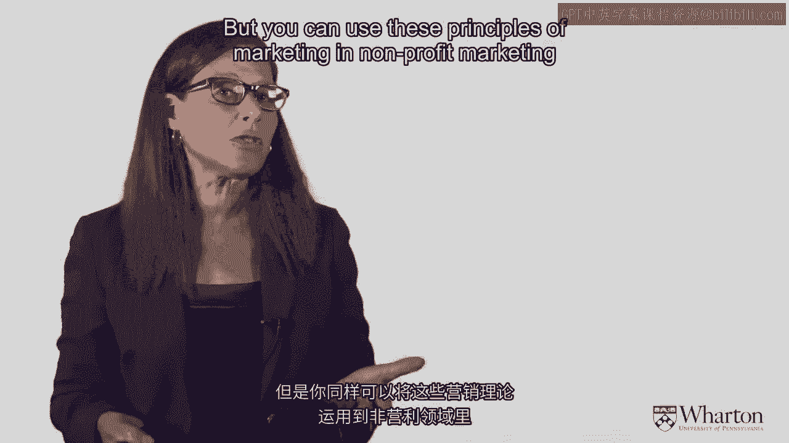
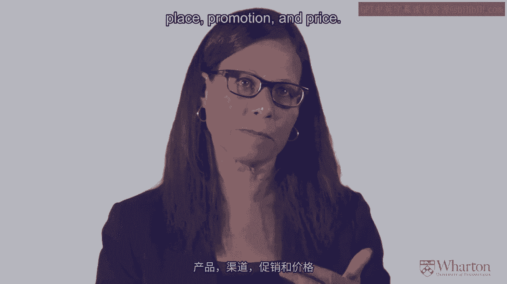
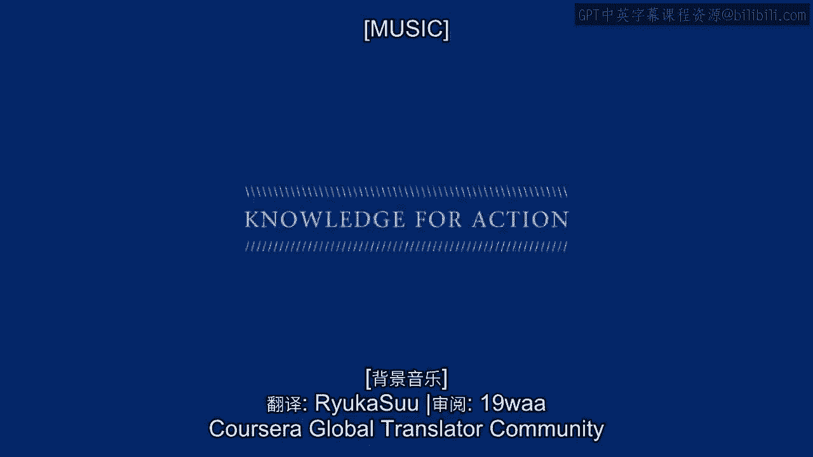

# 沃顿商学院《商务基础》｜Business Foundations Specialization｜（中英字幕） - P2：1_营销101建立强大品牌(二).zh_en - GPT中英字幕课程资源 - BV1R34y1c74c

 So， in summary for just this little section， let me say that there's three principles。

 of marketing that I've discussed。 And this is the essence of what marketing is。

 The first principle is if you want to provide something to a customer， to a buyer， and get。

 them to buy from you rather than the competition， you've got to give them real genuine customer。

 value。 That's the principle of customer value。 The second principle is the principle of differentiation。

 You have to provide customer value to that customer， what the customer wants， but you。

 have to do it better than the competition。 So， you have to differentiate your offering。

 And the third principle is the principle of segmentation， targeting， and positioning says。

 when you're in a customer-focused market， you cannot deliver value to everybody and make， money。

 It's just too difficult to do。 So what you do is segment the market into different segments。

 You target or choose a segment you want to focus on， and you position your brand to meet。

 the needs of that target segment。 And what are the tools that you use to deliver these three marketing principles？

 They're the four-piece of marketing。 The four-piece of marketing are product， place， promotion。

 and price。 Let's go back to that exchange。 And that exchange says you have a buyer and a seller。

 What the seller puts into the exchange is the product。

 What the buyer puts into the exchange is the price。

 The way the seller communicates the benefits about that product to the buyer is called。

 the promotion。 It could be advertising， sales， whatever。

 And the way the seller delivers the product to the customer is the place decision。

 It can be in a physical store， it can be online， it can be through downloading。

 Whatever the method of distribution is， that's the place decision。

 So those are the four-piece of marketing， product， place， promotion， and price。

 Typically when you talk about marketing， you talk about the business world。

 But you can use these principles of marketing and nonprofit marketing as well。

 Think about blood donation。 The American Red Cross used marketing principles to get increased in blood donations。

 Now let's think about what is the product for the American Red Cross when they want more， blood？

 It's not blood， is it？ Because that's not what they're putting into the exchange。

 Blood is actually the price。 It's what the customer puts into the exchange。 So what is the product？

 The American Red Cross did was try to figure out ways to get people to be more willing。

 to donate more blood。 So in one way they did， you don't feel good about yourself。

 you're going to help save， lives。 That worked for some people。 For some people， that wasn't enough。

 They needed a little sticker that said， "Yes， I saved blood today and I saved lives。"。

 For other people， the orange juice and the cookies were enough。

 And it turned out that some of the best blood donation successes they had were in high school。

 You can give blood donation if I think if you're over 16。

 And it turned out that one of the products that the American Red Cross could give to high。

 school kids to give blood was to allow them to miss class。 So that was the product there。

 The promotion again is the way they communicate the benefits of giving blood to the American。

 Red Cross。 And the place decision was how they got the product delivered to the exchange made。

 And in this case， the American Red Cross had the blood mobile and went to the customer。

 So that was a very innovative distribution decision。

 So you can play around with these four piece in very interesting ways。

 And some of the new businesses that we see now are doing some very clever things with。

 these four piece。

 But the basic concept should be clear。 Product， place， promotion and price。

 [MUSIC]。

