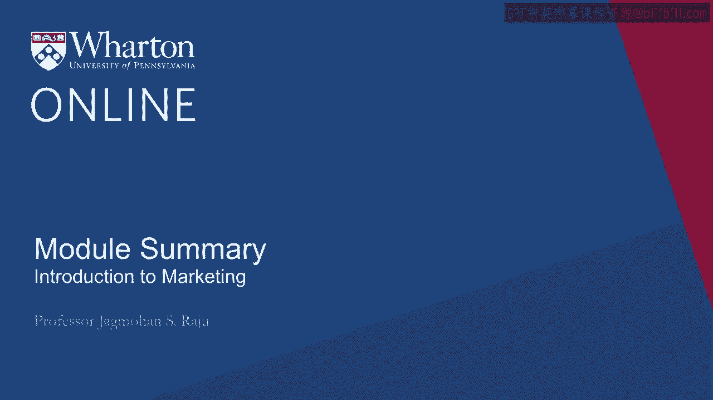
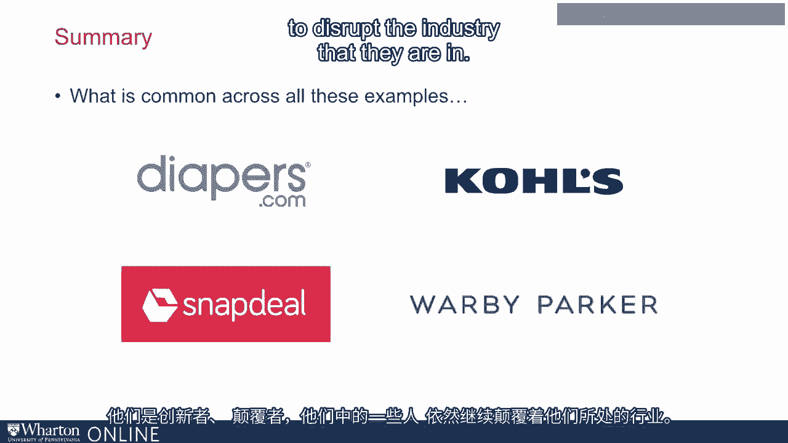

# 沃顿商学院《商务基础》｜Business Foundations Specialization｜（中英字幕） - P31：30_总结.zh_en - GPT中英字幕课程资源 - BV1R34y1c74c

 In summary， creating the right customer access for your product or services is extremely important。

 You may have a great product， you may have developed a great advertising campaign。

 have a great brand， priced at right， but if customers do not know where to buy it。

 when to buy it and as product is available in a convenient way， nothing will happen。

 It will just sit and there will be no positive results。

 So please make sure you do this appropriately， carefully based on what we have learned。

 It's also an area where companies have to spend quite a bit of money。

 30 to 40% of the price is often captured by the channel。

 whereas the company spends no more than 10% of their budget on advertising。

 It's also a more permanent decision。 We can change our advertising campaigns。

 but changing channels of distribution is not that easy。 It has to be thought through very carefully。

 It's also an opportunity for innovation and disruption。

 Many new ideas and businesses have been created by disrupting existing channels of distribution。

 So please do keep in mind， how will you reach your customer？

 Make sure they get the right information and the logistics they need。

 Allocate your functions thoughtfully。 What will you do？ What will your channel partner do？

 Who will get what is your compensation mechanism consistent with the activities that you assigned to yourself。

 and to your channel partner？ And also anticipate conflict。

 It's better to anticipate conflict and handle it in the design stage as opposed to having to manage it later。

 I always end this session by showing these four examples to my students。

 And I ask them what is common across all these four examples。 And I get different answers。

 But the right answer here is all these four businesses were started by Wartan students。

 And they were innovators and disruptors and some continue to disrupt the industry that they are in。

 It was a great way to make money for all these Wartan students。

 And I think innovations and disruptions in this area are a great way to make money for many entrepreneurs like yourself and business people。

 [BLANK_AUDIO]。

