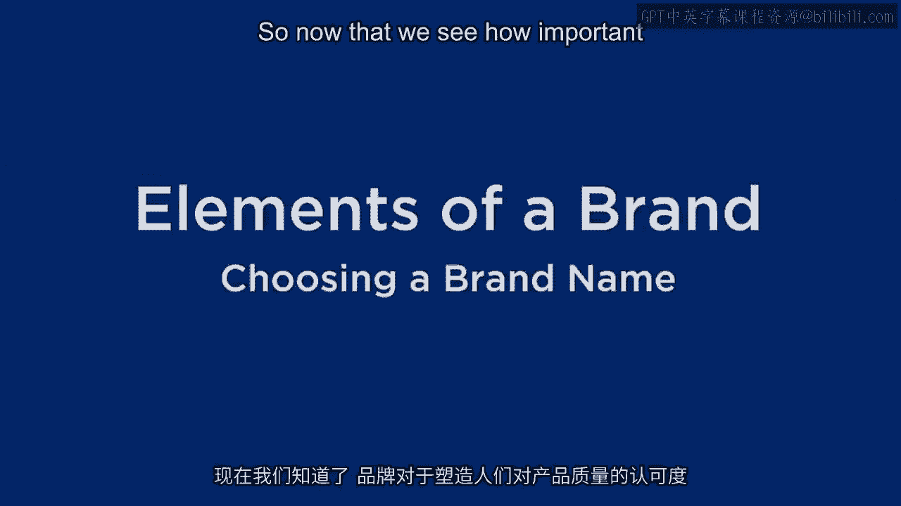
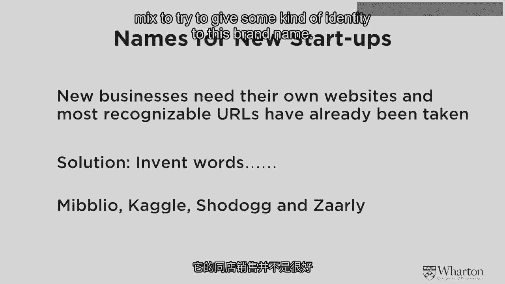
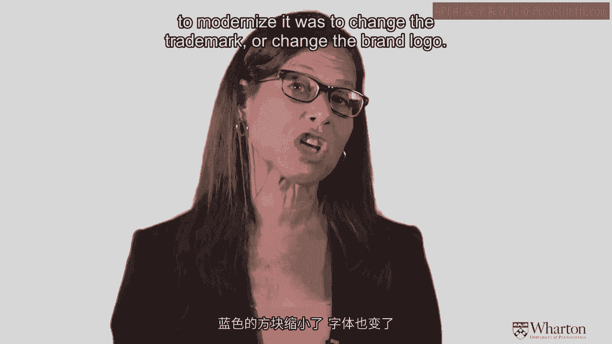
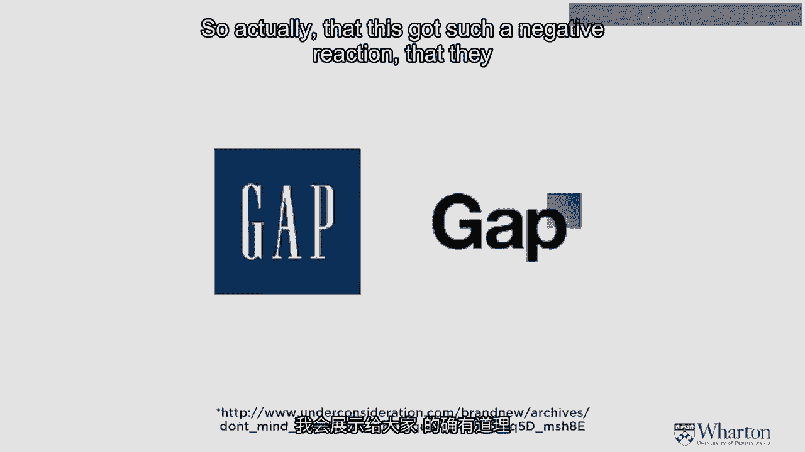
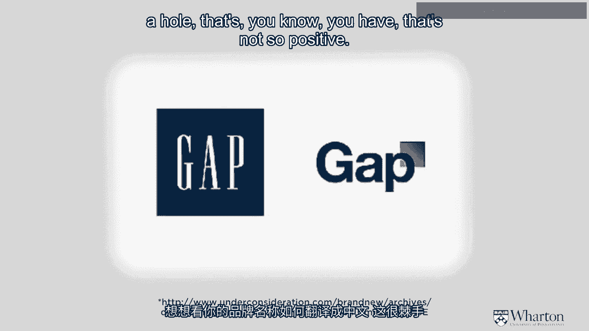
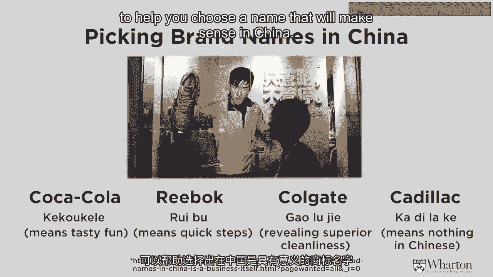

# 沃顿商学院《商务基础》｜Business Foundations Specialization｜（中英字幕） - P33：32_品牌要素-选择品牌名称.zh_en - GPT中英字幕课程资源 - BV1R34y1c74c

 [MUSIC]。

 So now that we see how important a brand is at creating perceptions of quality。

 let's get into some of the inner workings of a brand and。

 talk about the different elements of the brand。 And let's start with how do you choose a brand name？

 But first let me define what the different elements are。

 So there's a variety of brand elements that can be chosen。 You can use some， not use others。

 And they will totally identify or enhance the brand awareness。 And if you choose them right。

 they can help facilitate the formation of strong， favorable and unique brand associations。

 And so the things we'll talk about are the brand name， which is the first one， the anchor。

 different brand logos， symbols， brand characters， packaging， brand slogans and brand colors。

 When you're looking at all of these brand elements， you gotta ask a couple of questions。

 First of all， you have to make sure all the brand elements work together to。

 create a unique identity for the product and service。

 So make sure that everything you've chosen is of one thought。

 one belief and work together in unison。 And the second thing to think about is if people see a brand elements or。

 whatever you do create for that brand identity independent of the product。

 what would people think of just that brand label？ And so think about those kinds of things in general as we discuss some of。

 the more tactical issues of choosing these different brand elements。

 And when we consider each of the different ones and， I'll go over all of them in various detail。

 not some of them are more obvious or， more， you can figure them out for yourself more easily than others。

 But when you think about all of them， you should think about these criteria for。

 choosing a good one。 The first thing， when you think about choosing different brand elements。

 you really want them to be memorable。 You want people to be able to recognize it very easily， and。

 you want them to remember what they've seen。 The other thing you want to have happen when you choose these elements is that。

 they're meaningful。 And they can be meaningful in two different ways。 One in a descriptive way。

 which is how do they describe the attributes of the product， or the benefit of the product。

 or the customer segment。 And the other thing that we're looking at is remember this brand label is forming。

 a perception。 So you also want these brand elements to work together to persuade the customer。

 of something， usually of something positive。 The other thing you're thinking about is how they look。

 And you want them to be fun， interesting， aesthetic。 You want it to be rich visual imagery。

 And you also， if you have visual and verbal imagery， you have to think about。

 how those two things work together。 Again， you want to congruent unified vision here。

 Another good thing to think about， and this is very important， is can you protect， your identity？

 There's two ways to protect it。 One is legal it。 And so many times if you have a good brand name。

 you trademark it。 And then it's against the law for people to copy your brand name。

 But there's other things that are more subtle。 And remember I told you about that perception of similarity。

 People may not be copying exactly what you do， but。

 they may do something that looks similar and they can kind of steal your identity。

 by just looking similar。 And so you not only want to have legal protection。

 but you want to try to identify， a brand image and brand elements that work together that are hard to copy。

 So that you have some sustainable competitive advantage in addition to。

 the legal protection that you may have。 When you're thinking about this brand。

 remember it's very expensive to create， a strong brand name and it's an extremely valuable asset。

 And so the other thing you want to think about is how adaptable is this brand name。

 to go to stay modern。 Times change， consumers taste change， competition changes。

 And so you don't want a brand name that's so static that it can't adapt with。

 changing times and it's not flexible and it's not updateable。

 And along this line you also want a brand name if you can or。

 a brand image with all these elements that work together that you can use them to。

 go on different products if you introduce new products。

 So I mentioned Coke started out on a regular full calorie collard drink and。

 they stretched that brand name to go to a diet collard drink。

 So you want to think of brand images that can go not just on your initial product。

 but could perhaps go on other products in the future as the company grows。

 And similarly you want a product that can go across cultures。

 And that's a brand name I mean that can go across cultures so。

 you don't want something that won't be understood or。

 be interpreted differently or inappropriately in other cultures。

 So more and more as brands are becoming global。 Even if you start out very locally。

 when you choose your brand elements， you should choose brand elements that can go global should your business get big enough。

 And each element in thinking about this brand image are going to play a different。

 role in creating those overall perceptions。 They all have different strengths and weaknesses。

 But you really want to think about how you can use them strategically to。

 achieve some kind of balance and overall impact。 And again， as I mentioned before。

 they have to work together to form a unique， consistent image。

 So let's look at some of the different brand elements and。

 just think about on the face of it what some of the advantages and disadvantages are。

 We start out the name is obviously a crucial。 It's the anchor and it's very。

 very important that you can choose a good brand name。

 Sometimes there's legacy brand names and you have a great deal of awareness with。

 a particular brand name and maybe it wasn't the best one to choose， but。

 you have to use some of the other ones to build it up。 Like for example。

 the brand name Affleck or Geico。 Both of those were brand names that were acronyms。

 They actually weren't such great brand names because they don't have the advantage of。

 a good brand name of being quick， easy to process， easy to remember。 And in both of those cases。

 the marketers used other elements to help with the brand name。

 So Affleck came up with the duck image and Geico came up with the Gecko image。

 So that you can kind of remember those brand names better。

 But if you can choose it in the beginning， it's better to choose one that's easy to。

 process and recall。 Because the disadvantage of a brand name is once you bring up that there。

 or develop that brand awareness and people really understand what it is。

 it's pretty difficult and expensive to change。 It's not impossible。

 but a lot of the whole brand imagery is really anchored on the name。

 So the name and I'm going to spend some time thinking about that going forward。

 is extremely important to think about。 Once you have a brand name。

 then you can start thinking about logos and， symbols like the Nike swoosh or McDonald's arches。

 These are attention getting， they can be emotional， they can reinforce any of your brand identity。

 But again， symbols and logos can get out of date。 They can be ambiguous。

 they can be interpreted differently across cultures。

 So you again just have to think about how those work。 Not all brands have a character。

 but a character if you do have one can be very， quick， very attention getting。

 Think about what happens if you see Mickey Mouse on something。

 I mean that's a world famous character recognized everywhere and， people understand it's fun。

 it's kids， it's exciting。 And so characters can work very well， but they can get outdated or。

 they can be culturally bound。 And certainly not all brands have a character。 A slogan and a jingle。

 if it's done well， gives you a few more words and， can give you music to add to the brand element。

 So it can be used to convey meaning。 Nike's just do it is an extremely strong slogan that adds to the Nike brand name。

 But again， sometimes it's difficult to translate。 Sometimes if you do jingles。

 musical tastes are different and， not everybody likes it。

 Some people think some of these jingles are annoying。 So there's advantages and disadvantages。

 Packaging also is extremely advantageous。 And I'm going to show you some examples of brands that were built on。

 their package design。 And we go back to this notion of perceptions。

 There's a lot of research that shows， and I'm going to talk about that。

 That people form perceptions of the quality of the product， not by the product itself。

 but by the package it's in。 So this has a very， very strong effect on creating perceptions。

 The difficulty with packaging is many times you don't control how it。

 ultimately reaches the consumer。 So the manufacturer builds a product in a package。

 But then it's the channel or the retailer that delivers that package to the consumer。

 So for example， if you want the package oriented in a certain way like front on。

 it may not appear that way on the shelf。 Or if it's supposed to be refrigerated。

 it may not be at the right temperature， etc。 So the problem with packaging is that there's these channel issues。

 But all of these elements have advantages and disadvantages， is you choose them strategically。

 they can work very well to create a very strong brand image。

 Let's look specifically at this notion of brand names。

 Now the brand name is extremely important for many， many audiences。 Obviously。

 in what we've been focusing on here， it matters to consumers and， customers。 And it can。

 as I mentioned before， seriously affect the likelihood of purchase。

 It also affects people who work for you for employees。

 So that you really want to do branding externally to your market， but。

 internally to your employee base too。 People can be very proud of the company they've worked for。

 And the reputation and brand name of the brand may make it easier or， harder to hire people。

 to retain people， and may affect their morale and productivity。 It also。

 the brand name affects growth opportunities。 Like I mentioned。

 if the brand name is not adaptable and not transferable。

 it may be difficult for the firm to go into new markets or， to go into different products。

 And so it affects the growth potential of the firm and it affects investors。

 So just investors are people too and they can be very much affected without even。

 realizing it by the brand name and using the value of the brand name to infer。

 make inferences about the merits and strength of the firm as an investment opportunity。

 So the brand name matters a lot in lots of different ways。

 So what are the different types of brand names？ There's lots of examples and I'll just go through this kind of quickly。

 We can look at this chart here。 There's a descriptive brand name where it just basically describes the product or。

 service。 Lean cuisine is like that。 It's about non-fatening food。

 You know exactly what the product is by the brand name。

 There can be brand names that are metaphors that represent some kind of。

 symbolism like Nissan's Infinity。 A lot of the legacy brand names are based on people's names。

 So Ford or Ralph Lauren， those are real people and。

 the brand name was chosen because it's based on a particular person。

 Sometimes there's brand names where the word means something but。

 it's not really clear how it applies to the product。

 Apple's a great example of that kind of or camel。 What are those？ Those are brand names。

 you know what the words mean and， now certainly they're very famous brand names so you understand what they are。

 But they really don't have any direct connection with the product。

 Then there can be brand names that are altered。 They kind of sound like they're a real word but。

 actually they're not like loosened or Spotify。 You kind of have a sense what those brands mean and。

 you think you know what those words are but they're not real。

 Or you can have a new word that's created by blending together， to other words。

 Facebook is a great example of that。 That's not a real word but， you know what it is。

 a book of faces。 And then of course there can be invented words that are not at all real and。

 you have no idea what it means and you can't even guess like something like Exxon。

 Let me give you just three examples of some modern brand names that follow all。

 of these things and you can see these brand names were extremely strong choices。

 And they worked very， very well and they're all very different。

 So I'll start with Richard Branson's Virgin。 He explains that the origin of that brand name was when he was 15。

 He was sitting in a room with other 15 year olds and they were trying to think of a name。

 for a record company。 And a couple of the girls said， well we're all virgins here。

 And somehow or another that name just seemed to spark interest and。

 they said well if we started a record company we'd be virgins in that business so。

 let's use that name。 And apparently that's how that name was chosen。

 He mentioned that at the time it was considered pretty risky brand name and。

 it was hard to register for a while。 But now it's become an extraordinarily strong brand name and。

 it's a funness to it that actually works really well with a lot of his products and markets。

 Price lines a different type of brand name。 That's a brand name that's quite descriptive。

 If you know what that business is you know it's absolutely about establishing a line of prices。

 It's quite clear what it means and has been very useful in that way。 In a different way than Virgin。

 And finally Google which is now become a very people Google things。

 It's interesting that brand name was chosen by mistake。

 They meant it to be the word Google which is not spelled the way the brand is spelled。

 And that that's a very very large number。 It's one with 100 zeros after。 So this was a mistake。

 They meant to spell it right and they didn't。 Google is a very very interesting brand name from a marketing point of view。

 Because one of the things that we argue is extremely important in brand names is consistency。

 And Google has met because it is so well known and people identify and。

 just little pieces of the brand name。 They identify the colors， they identify the typeface。

 That Google plays around as I've shown you on this screen where they'll show you which。

 trademark differently every time you see it。 Whenever you go to the browser you'll see a different version of the brand name。

 That's a sign of an extraordinarily strong brand name that has very very high brand awareness。

 That you can see it even when it's not exactly the same every single time。

 But these are all fairly new brand names that have been very very successful。

 When you look at new startups now a lot of the trend in the new startups and。

 there was a recent Wall Street Journal article about this。

 The new startups are making up brand names and so a lot of the new businesses come up。

 with brand names that aren't just these invented words like Miblio or Kaggle or， Showdog or Zarly。

 You don't even know how to pronounce some of these words。 Why is that happening？

 Part of the part of the reason is in today's world when you have a brand new business you。

 need a website right away。 And most of the recognizable URLs have already been taken。

 And so one of the ways to get a URL that's uniquely identified with your business is。

 to invent a new word。 Then you're going to have to use the other elements of the brand mix to try to give some。

 kind of identity to this brand name。

 Let me talk about an interesting thing that happened with brand names。

 Not recently the gap brand name a few years ago now I'm not sure exactly when。

 But gap wasn't doing very well with their same store sales。 Revenues were down。

 They really needed to do something to turn the business around。

 And one of the things they were trying to do to modernize it was to change the trademark。

 or change the brand logo。 So the original brand logo as shown on the screen is a blue square with the word gap。

 in white on that blue square。 And you can see the new logo that they put out is very different。

 The blue square has shrunk。 The typeface has changed。 It's now on a white background。

 And they put that brand name out into their social media marketing and instantly a very。

 very negative reaction to that brand name。 The consumers hated it。

 Within that brand name was out there just tentatively as a test for one week。

 The reaction was so negative that the company pulled it back and that was the end of that。

 So it ended up actually being a pretty it was you know they got a lot of publicity at， the time。

 But it was a pretty inexpensive way。 A lot of times if you try to change your brand image it's extremely expensive to change。

 it especially for a retailer。 There's signage。 There's bags。

 You know the packaging and all sorts of things that would be very very expensive。

 So actually that this got such a negative reaction that they found out so quickly was。

 a benefit for the company。 But because this was somewhat of a famous incident some market research was done and。

 some FMRI studies and neural studies were done to figure out what was so bad about that， image。

 Why did people not like it？ And there's a couple things that they identified that when I show you you can see make sense。

 One of them is if you have visual and verbal things in conflict with each other people。

 read the visual first。 And so where that blue box is behind the P it actually kind of not blocks out the P。

 And you can see a hole in the P and the P is not as strong because you're attracted。

 first to the vision。 So that weakened the whole idea of the brand there because the P was kind of weakened because。

 of the visual block on it。 The other thing that that's different between the two logos is that instead of being all。

 caps which is in the original one now this is an initial cap and then smaller letters。

 and what that ended up doing was making people think of it as a word rather than a brand， name。

 And if you think about it the word gap that means a hole that's not so positive。

 So when we're looking at these things in hindsight you can kind of see why that wasn't a good。

 choice。 And people just didn't have a very strong emotional reaction to it also。

 There were negative emotions to it that were kind of more on a visceral level and what。

 I'm explaining here is more thoughtful。 And the last thing I want to mention in thinking about brand names is a lot of people now you've。

 got to think about global business and a lot of the business the future business is in。

 China。 And that's tricky to think about how your brand names might translate into Chinese。

 And there's a number of issues there and a number of different ways to do it。

 One way is to keep your brand name in the English or the French letters or the English。

 letters or the non-Chinese letters。 Some of the luxury brands do that so Chanel or LVM。

 Louis Vuitton will do those kinds， of things。 They keep them in their native language。

 But other brands try to change their brand name into Chinese。

 And this is tricky because you can do it Coca Cola for example。 What does Coca Cola mean？

 How do you translate that？ And if you just go and look for the Chinese characters that kind of sound like Coca Cola。

 well the characters themselves name means something。

 So when Coca Cola first did that and tried to pick Chinese characters that sounded like， Coca Cola。

 it had a very bad brand meaning and they had to take that one off the market。

 The one they currently have means tasty fun。 So it kind of sounds like Coca Cola and it means something that at least makes sense with。

 a drink。 Reebok did the same kind of thing。 The Chinese characters that they chose kind of sound like Reebok and it means quick steps。

 which again makes sense。 Colgate did something different。

 Colgate picked Chinese characters that they thought was consistent with their brand image。

 which meant superior cleanliness。 And then the Chinese characters if you said them didn't sound very much like the word Colgate。

 And Cadillac did it the opposite way。 They took Chinese characters that sounded like Cadillac but they didn't mean anything。

 in Chinese。 So when you're translating to a very very different language and an important language。

 like China because of the size of the market， there are some big issues and there are a。

 lot of agencies now that are developing to help you choose a name that will make sense。

 in China。 [Music]。

 [BLANK_AUDIO]。