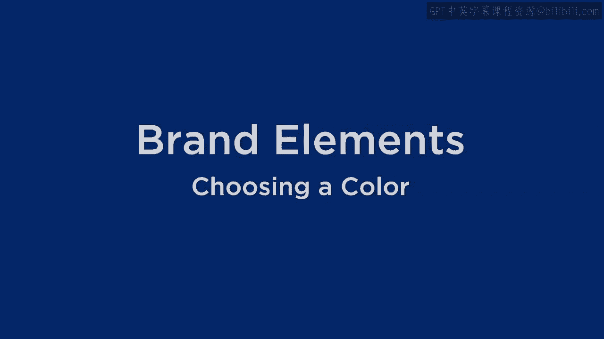
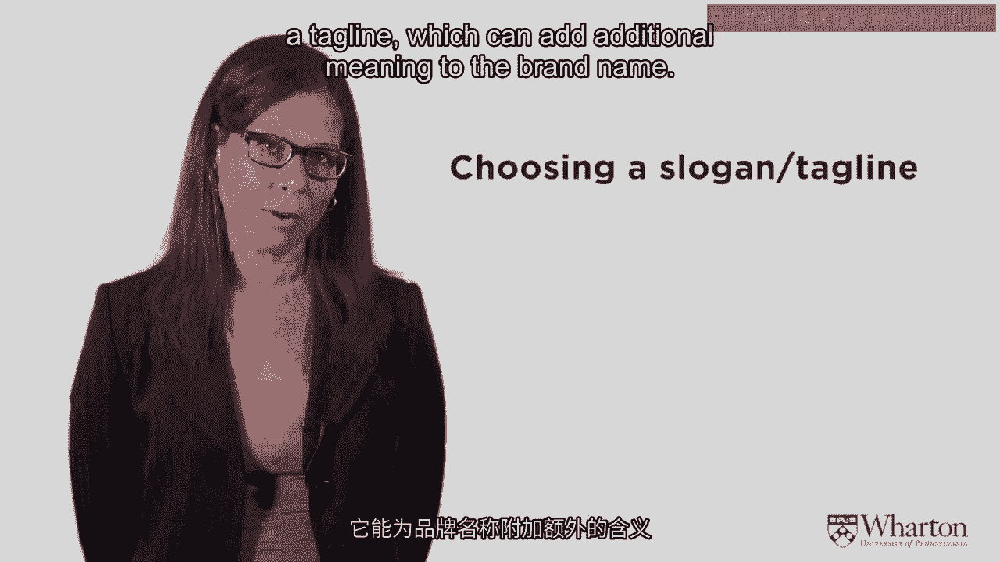
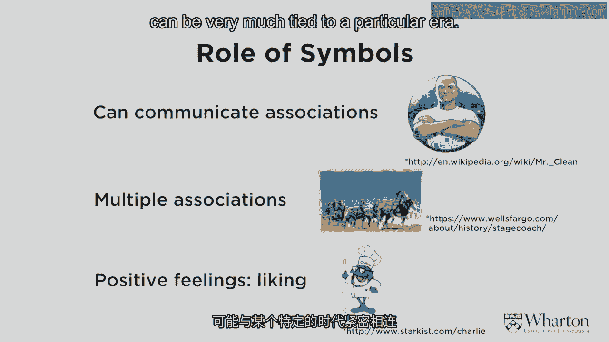
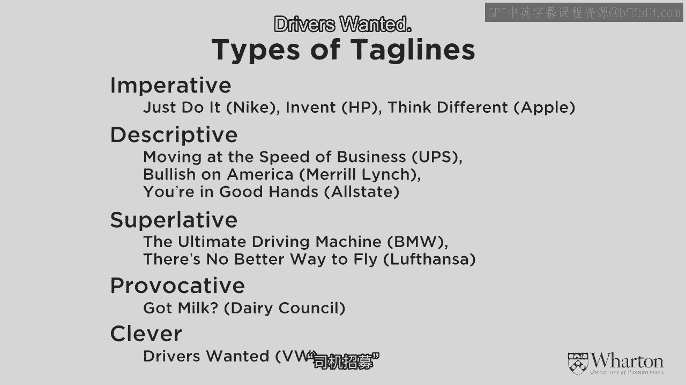
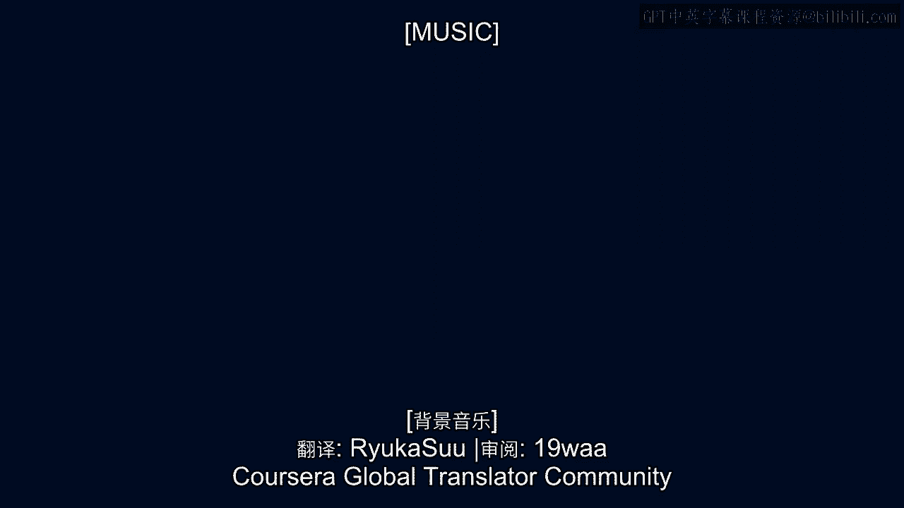

# 沃顿商学院《商务基础》｜Business Foundations Specialization｜（中英字幕） - P34：33_品牌要素-颜色标语.zh_en - GPT中英字幕课程资源 - BV1R34y1c74c

 [ Music ]。

 Now that we discuss brand name， let's think about some。

 of the other elements that could go around to brand name。

 And I'm going to talk about two that are extremely important。 One is choosing a color。

 And color has very， very strong perceptual cues。 We'll show you some of those things。

 but people associate a lot， with different colors。

 And the other is this notion of choosing a slogan or a tag line。

 which can add additional meaning to the brand name。

 So let's start with color first。 There's a few rules about color that you should think about。

 First of all， the best use of color， if you can possibly get it， is to own a color。

 And that's not very many brands can do it。 There aren't that many colors out there。

 and to really own a color， is pretty hard to do， but when you do it， it's extremely powerful。

 If you think about Tiffany's and they own the light blue color box， you know。

 this is a globally known， this light blue box， this is such an important cue that the Tiffany empty boxes are sold。

 on eBay and people will purchase those boxes and then put another product。

 maybe not a Tiffany piece in that product， but people getting a gift， in a Tiffany box。

 this just shows you how strong the perception is。 We'll think the product inside that box is higher quality。

 But Tiffany's light blue box is extremely valuable brand image for their， means very high quality。

 and many times with jewelry， unless you're an expert。

 it's kind of hard to necessarily judge quality， so people will use this light blue box as a cue for high quality product。

 Mary Kay owns the pink color。 It's a very feminine business， cosmetics。

 Mary Kay gives away pink catalax to their salespeople。

 and she has really used that bright pink to symbolize her business， and it's been very strong。

 Color can also be used within a brand to separate product lines。

 so different American Express has different colored cards， the green card， the black card。

 the silver card， all these different kinds of cards。

 And you infer different qualities to the card as a function of its color。

 and that's used in lots of different products as well。

 You have to be careful with color because color can be experienced differently。

 It can be experienced differently across different platforms。

 so a lot of times if you're going to test a color， you want to test it on a computer， on a phone。

 in real life， and the colors may vary a little bit。

 and when you want a color to really be identifiable， with a particular brand。

 you want to make sure you have that consistent color across。

 And colors also can create very strong perceptions。

 If you look at a product line and you see some of the products。

 or it's gold or silver or black and white， that cues luxury。

 and you just assume that that product is more expensive， than more basic colors like red and blue。

 so that those colors can just signal high quality just because it's gold and silver。 Similarly。

 you see something that's blue or pink， you think female or male。

 Just by the color can be the exact same product， but the color changes。

 and you think it's for girls versus boys。 So we know some theory about color。

 We know that there's two basic axes of color。 There's arousal access， you know。

 how stimulating it is versus how calming it is， and there's the affect access。

 which means how much people like it or don't like it。 The affect access is extremely important。

 but it does vary a little bit by cultures。 Some colors are better liked and some cultures than others。

 But what I'll show you here is kind of the way the U。S。 looks at it。

 and it may be different in different cultures。 It is true that higher arousal colors are like red and orange。

 Those create much more attention， much more excitement， and calming colors are more blue and green。

 That's pretty universal。 But then also if you think about on that affect or that liking dimension。

 the blues and greens tend to be better like colors in the U。S。

 where oranges and yellows are a little bit less liked in the U。S。

 And this may be different in other cultures， for example， orange is a very popular color in India。

 There's other rules about colors。 It's color's an interesting thing and there's been a lot of research on color。

 And so there's certain things that we know about the way people automatically react to these colors。

 going back to that perception。 So red， for example， as I mentioned， it's an exciting color。

 It gets attention。 It's part of the reason why fire engines are red， or sometimes they're yellow。

 Both of them are very attention-getting colors。 Red also means love， it means passion。

 But red also stimulates appetite。 And so you'll see a lot of food logos like McDonald's， Pizza Hut。

 KFC， Windows， Chipotle， Wendy's， Chipotle。 They all stimulate appetite and they all have a lot of red in their logo。

 Blue， on the other hand， is a calming color and it is not a good color for food。

 Blue actually is a color that curves appetite。 And some people have said that if you're on a diet and you want to try not to eat as much。

 having blue plates can curve your appetite a little。 Blue， as I mentioned。

 is also a color that's frequently preferred by men。 Green is a color that's tranquil， means health。

 it can mean money， it can mean nature。 A lot of environmental companies use the green color to give you that green notion。

 But green also means fertility， and if you've seen some of the recent M&M's ads and you know。

 Miss Green， she's a pretty sexy M&M。 And that's also that green color。 Brown is reliable。

 a little bit boring， practical earth。 White is an interesting color because white can mean purity。

 it can mean innocence。 People play around with white space， it can be high design。

 if there's a lot of white space。 The spacious issue， people。

 there's a lot of things that are done with white。 White's a very interesting color。 Black。

 on the other hand， sometimes it's seen as evil， you know。

 it can symbolize and some cultures death or mourning。 But you know。

 people wear a lot of black because they think it creates the perception that they're thinner。

 Yellow is a very bright color， creates a lot of energy。 It has been shown。

 and this is so much interesting， that yellow can sometimes make babies cry。

 So it's kind of maybe not the best color to paint for a newborn's room。 Orange is exciting， warm。

 it's an enthusiastic color。 Lavender， on the other hand， is calming， more relaxing。

 Purple is associated with royalty， with wealth， with wisdom。 And pink， as I mentioned。

 is more of a girl's color， it's warm， it's a calming color， very feminine。

 And so one of the things you can look at is look at some of these different colors and see which companies use these different colors。

 So， you know， the bright yellow color is used on Nike， on Shell Oil， on Best Buy， on McDonald's。

 to get on DHL to get a lot of attention。 The friendly， fun orange color is used on Hooters。

 on Nickelodeon， on Firefox。 The red color， as I already mentioned。

 is used on a lot of food companies like Kellogg's， Coca-Cola。 It's also used to get attention。

 CNN uses it， Netflix has used it， I showed you before， Virgin uses it。

 Purple is more of a creative color， so you see Yahoo using it， Barbie uses it， Hallmark， Taco Bell。

 Blue is this trust color， so companies like Oral B， Walmart， IBM， Pfizer。

 You don't American Express， GE。 A lot of really solid companies， not a lot of food companies。 Again。

 green is more of this natural color， Whole Foods uses it， Starbucks uses it。

 Some of the oil companies have used it to show that they have environmental leanings。

 BP has tried to use it。 And then the gray， black and white colors are more of a balanced color。 So。

 you see New York Times is a black logo。 Apple sometimes says that Silver Apple。

 Mercedes-Benz is a silver kind of color。 So， those colors。

 silver and things like that are more balanced。 But if you look at the logos and start thinking about them and thinking about how the colors are working。

 you can kind of get a sense of what's going on here。 So， let's look now at symbols。 And symbols。

 as I mentioned， Mickey Mouse is a very famous symbol。 Symbols can add a lot of fun。

 a lot of attention to a brand。 I have some symbols here on the slides。 Mr。

 Clean is a symbol that communicates certain kinds of associations。 Mr。

 Clean is a product for cleaning up and what they show is a strong muscular man。

 so it's assuming that you can have a lot of strength in this product。

 The next one I showed you here is Wells Fargo。 There's a lot of multiple associations with the Wells Fargo。

 that shows independence， the Wild West， adventure。 And so。

 there's other kinds of things that you can associate with it。 Charlie DeTuna is the last one。

 It evokes positive feelings， liking。 Pillsbury's "Dole Boy" is kind of like that。 And so。

 you can just have fun with these different symbols。 But， symbols can get out of date。

 and in the last section in this， we'll talk about how you can reposition。

 and re-change these symbols， because they can get dated and they can be very much tied to a particular error。

 So， you have to be careful with symbols。

 Slogans can be tailored to help the positioning strategy we talked about earlier。

 so that you have a brand name and you want to really communicate that brand mantra。

 One way you can do it is through your positioning strategy。

 And sometimes if you just have these brand elements。

 you may want a slogan or a tagline that can help remove。

 some of the ambiguity that's associated with the brand or the symbol。 And also。

 the taglines can create its own emotion， like "reach out and touch someone" or can create its own kind of warmth and emotion。

 And finally， the tagline can reinforce the name or the symbol。

 and can just， because if you have these redundancy in the tagline。

 is reinforcing the imagery or the brand name， you're seeing this multiple times that makes for a very strong message。

 Some of the basics about taglines， you want them short。 It's similar to a brand mantra。

 they have to be very short。 You really want them differentiated。 If they all sound the same。

 they don't do anything， so you have to make sure it's not the same or would be confused with the competition。

 Similarly， it should be unique。 It should be easy to say and easy to remember。

 You don't want it to have any negative interpretations， so you have to market test it。

 particularly when you go across cultures。 And again， if you have a really great tagline。

 like "just do it，" you want to trade market so that it's protected。 And as I mentioned。

 if you can evoke an emotion with your tagline， that will make it much stronger。

 So what are the different types of taglines？ Well， there's imperative， just do it。 Think， invent it。

 You know， those kinds of things。 So they're telling you what to do。 There's descriptive。

 which adds more information。 Moving at the speed of business， bullish on America。

 you're in good hands。 They can be superlative， so the ultimate driving machine。

 There's no better way to fly those kinds of things。 Or they can be provocative and kind of clever。

 Got milk was one of those。 And clever， another clever one is what VW Volkswagen has done with their slogan "Drivers Wanted。

"。

 [Music]。

 (buzzing)。

