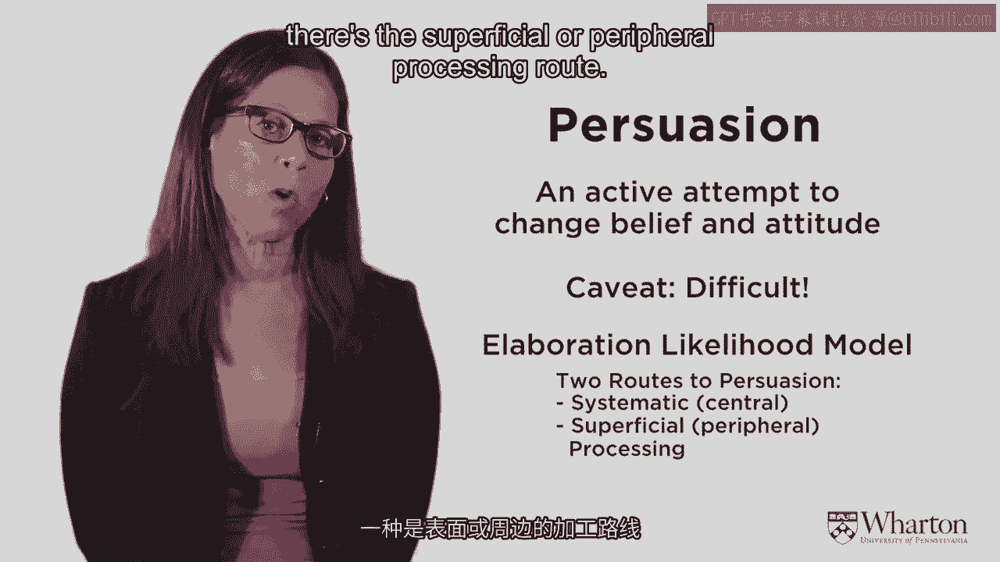
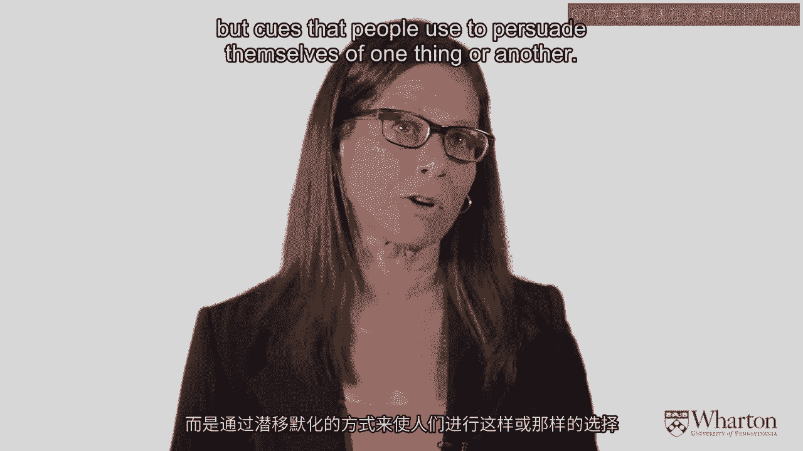
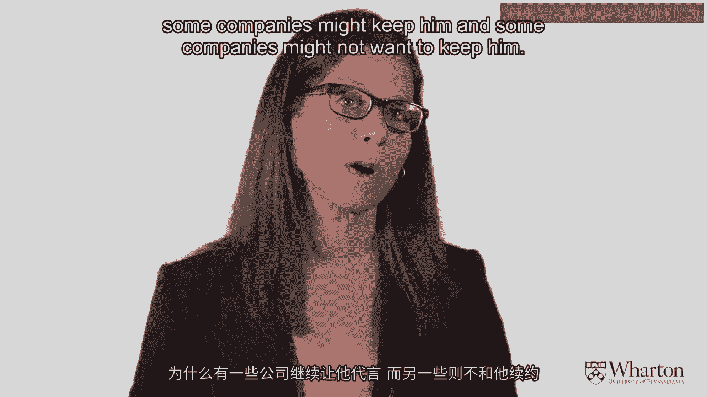

# 沃顿商学院《商务基础》｜Business Foundations Specialization｜（中英字幕） - P36：35_品牌要素-说服力.zh_en - GPT中英字幕课程资源 - BV1R34y1c74c

 [MUSIC]。

 So we talked about a bunch of brand images and we talked about creating brand perceptions and。

 how these brand elements work together。 But another part of this brand identity is to persuade consumers。

 So let's focus now on this process of persuasion or changing people's attitudes。

 And the dominant model that's used in this way of thinking or。

 the dominant theory is called the elaboration likelihood model。

 And so we'll talk a little bit about that。 And then let me focus in on the use of celebrity spokespeople because。

 they're used frequently to help persuade consumers to have positive beliefs towards a brand。

 So let's start off with persuasion。 What is persuasion？

 It's an active attempt to change belief and attitude。

 So marketers are trying to persuade you to feel favorably towards their， brands and their products。

 The caveat here is that it's difficult and why is it difficult？

 It's difficult for the reasons that I've mentioned all along。 People expose themselves。

 pay attention to and interpret data， consistent with what they already believe。

 And because they're not scientific about it and， evenly sampling and exposing themselves to all sorts of different things and。

 paying attention to things that both support their prior belief and。

 refute their prior belief because they're very biased in the way they take in that stimuli。

 it's hard to persuade them to think differently。 That's not to say it's not possible。

 but it is difficult。 So the dominant model in thinking about what's the best way to persuade consumers。

 is the elaboration likelihood model。 And this model posits that there's two different routes to persuasion。

 There's the systematic or central route and， there's the superficial or peripheral processing route。

 The central route says that if people are motivated and they're highly involved。

 and they have the opportunity and， the ability to process marketing messages。

 then the way to persuade them is through central cues in messages。 In other words， cognitive cues。

 things that people have to think about。 Try to make a strong argument。

 In order to make a strong argument， people have to be paying attention。

 they have to be motivated and they have to have the ability to process this information。

 That's one way。 Many times， and this is true a lot with marketing decisions。

 people just aren't motivated to think that much and。

 maybe they just don't want to think that much or maybe they just don't have the ability。

 they're too tired or whatever。 In that case， central processing or central route to persuasion will not work。

 Then you have to use the superficial way， which is to use these peripheral cues。

 And so when your opportunity， motivation， and， ability to elaborate， to cognitively process is low。

 then the way to persuade people is through these peripheral cues。

 Which are more automatic reactions。 People just make decisions based on these cues and。

 it's not because they thought it out carefully。 So what we're saying here is that the consumer is exposed to marketing cues。

 Now the first thing is you ask the question， is the consumer motivated to elaborate？

 Are they going to pay attention and think about your message？ If the answer is no， they're not。

 then that's low involvement。 And then don't give a message they have to think about。

 use peripheral cues。 On the other hand， if there's high involvement and。

 they are motivated to elaborate， then the next question you have to ask is。

 do they have the ability to elaborate？ It's a message。

 something that they can figure out if they think about。 And if the answer to that is yes。

 then you're going to use central route。 If the answer is no。

 you have to go back to the peripheral route。 Okay， so to get to central routing。

 the central route where it's systematic， argument。

 people have to be motivated and they have to have the ability。 If either one of them isn't true。

 you got to go to peripheral cues。 So what are peripheral cues？

 Peripheral cues are cues that people use in a， it's called heuristic way， that means a shortcut way。

 They don't really think through it。 They just kind of say， well， if this is true。

 then that must be true。 So for example， classical conditioning。

 Classical conditioning says that you persuade people just by putting things， together all the time。

 So the famous example is Pavlov's dogs。 The dog was conditioned to salivate whenever they heard a bell ring。

 And the way it was done is the bell rang before they gave dog food。

 And then every time the dog got dog food， they salivated。 After a while。

 because of classical conditioning， just the ringing of the bell caused the dog to salivate。

 So in the same way in marketing， if things are always together。

 you always have Coke with hamburgers or Coke with McDonald's。 After a while。

 you don't even think about it。 And you just say， well， I'm having a big Mac。 Let me have a Coke。

 That's a kind of notion of classical conditioning。 It's not well thought out。

 It's just persuaded to have a Coke because I always have had one。

 Reciprocity says that you gave me something IOU。 Now that may make sense and may not。

 But you're doing it just because IOU。 So a lot of times。

 direct markers will do things like put a little gift， in a charity appeal。 It'll give you stamps。

 or sometimes I give you a dollar。 And the idea is I gave you something。 Now you give it back to me。

 It's not a cognitive argument。 It's a peripheral cue。 Consistency is another peripheral cue。

 Why do you like the toothpaste you use？ A lot of times。

 the reason that you like the toothpaste you use， is because that's when you always use。

 That's when your mother gave you。 It's not like you did the systematic product comparison。

 and you decided this is your favorite toothpaste。 You use it just because you always liked it。

 That's consistency as a peripheral cue。 Social proof says， well。

 I like this because everybody else likes it。 So New York Times lately has had the most emailed articles。

 People read them。 Why did you read them？ Well， everybody else emailed them。 There must be good。

 Or my husband chooses restaurants by the one that has the longest line。

 If everybody's waiting online for this restaurant， that must be good。

 That's a social proof peripheral cue。 Liking says， if you like me， then you like my ideas。

 This is very important， and we'll see later for celebrity spokespeople。

 If you like the celebrity spokesperson， then you're going to like what they like。

 Not necessarily a rational process， but it makes sense in some ways。 Authority says。

 just because I say so， you should do it。 That's another peripheral cue。

 So because somebody in authority says you should do something， you should do it。

 It's not because you thought it out。 It's because it meets your preferences。

 It's just because someone told you to do it。 And the last peripheral cue that I'll just mention today is this peripheral cue of scarcity。

 Because there aren't very many of them， it must be good。

 So some marketers use this idea of scarcity to create product quality。

 A modern one that's recently been using that is Lulu Lemon。 And Lulu Lemon purposely does not have。

 you know， they go to stockouts easily。 If you don't get there quickly， it'll run out。

 the design you might want。 And people infer from that that it's high value， high quality product。

 So all of these are peripheral cues。 Not well thought out， central processing arguments。

 but cues that people use to persuade themselves， of one thing or another。

 So now let's think about celebrity endorsements in terms of these two roles of persuasion。

 So in one way that you can use a celebrity in a central processing way。 And in that way。

 the idea is going to be the celebrity is an expert。

 And the reason that the celebrity endorsement matters is because that person is an expert。

 and therefore there's information in that endorsement。

 Celebrity is a peripheral cue is going to be because the celebrity is attractive or because。

 I like the celebrity， then I want to use the products that they use。

 So celebrities can be used in both ways， either in a central or in a peripheral way。

 When you're thinking about different celebrities to use to help endorse your products， there's。

 certain things you want to think about。 First of all。

 who's the target segment and does that target segment like that celebrity？

 So that's going to be an important thing。 Then you want to think about what's the brand message and does the message of the brand。

 the brand mantra fit the brand message of the celebrity。

 And another thing you want to think about is how attractive is the celebrity。

 Is this a popular positive celebrity because you don't want to take a celebrity that nobody， likes。

 obviously。 Other considerations are how costly is it。 Celebrities can be very expensive。

 Is it worth it？ Some of them are cheaper。 Maybe that's a better value for your money。 And nowadays。

 very， very important is the social network。 So some of the celebrities that are chosen for endorsement is because they have a very。

 very strong social network and they have a lot of followers。

 And so the clout scores and those kinds of different scores are indicating the social。

 connectiveness of these different celebrities。 And all of those go into the decision of which celebrity to choose。

 There's another thing that's out there to rate these different celebrities。 It's called a Q rating。

 And the Q rating says how appealing is the celebrity among those who do not know him。

 It's the ratio of popularity and familiarity and it's conducted by a particular company。

 called Marketing Evaluations。 And you can get Q ratings for different celebrities to help you judge which is a good celebrity。

 and which is a celebrity that maybe isn't as strong and maybe you don't want to pay as。

 much money for or something like that。 So what's the。

 I think you're probably starting to get the idea of how these celebrities work。

 And formally we think of it as a notion of transfer of meaning and that's the model that's。

 used to indicate the effectiveness of celebrities。

 So the idea is that celebrities have very charged powerful meanings and what you want。

 to do is transfer the meaning of that celebrity to your product。 So advertising firms。

 marketing firms， branding firms try to choose a celebrity that best。

 represents the appropriate symbolic properties of the product so that that meaning from that。

 celebrity will then transfer to the meaning of the product。 And celebrities are quite powerful。

 There have been some FMRI studies that show that when you show an image of just a normal， person。

 certain areas of the brain light up but if you show an image of a celebrity。

 different areas of the brain light up。 So there's an automatic or visceral reaction to celebrities。

 They just get more attention and they can be very， very effective at creating an image。

 and at differentiating a brand。 If a celebrity is associated with one brand and not another。

 that can be a very effective， differentiation。 And going back to this elaboration likelihood model。

 when you think of the celebrity as， working in a central processing way。

 we talk about that as having a credible source。 And so in that way。

 the celebrity is an effective spokesperson because of your expertise and， their trustworthiness。

 So one of the very effective at the time spokespeople for Nike was Tiger Woods。

 Now obviously there's been some controversy around Tiger Woods in more recent time。

 But when Tiger Woods was the first spokesperson for Nike Golf， he worked in two ways。

 He was very credible as an endorser for golf products because he was such a successful。

 golfer and obviously you think there's some expertise in his golfing ability and he knows。

 what he's talking about with regard to product。 That's a central processing kind of use of Tiger Woods and that's source credibility。

 He's a credible source。 The other way of thinking about Tiger Woods is he's also an attractive source。

 People liked him at the time， they were very familiar with him and anything he did people。

 would like。 So he was used as a spokesperson not only for golfing for Nike but he's also used for。

 other products which were not necessarily based on his expertise but just based on his。

 attractiveness。 And when he got into some scandal and some issues where his attractiveness was not as。

 strong， some of those endorsements were dropped because he was no longer an attractive source。

 The ones that tended to stay with Tiger were based more on his credibility as a source。

 And you can see when you think about these different methods of persuasion why some companies。

 might keep him and some companies might not want to keep him。

 And the ways the celebrities and models are used in these advertisements and endorsements。

 is they can say there's an explicit mode。 They can say I endorse this product。

 I believe in this product。 There's an implicit mode that says well I use this product。

 There's an imperative mode that says well you should use this product。

 And then there just can be these co-presents that celebrities around this product。

 So a lot of product placement， a lot of fashion companies give their celebrities their clothes。

 to wear so that celebrity is just wearing those clothes and that is a kind of endorsement。

 as well。 [Music]。

 (guitar music)， [MUSIC]。