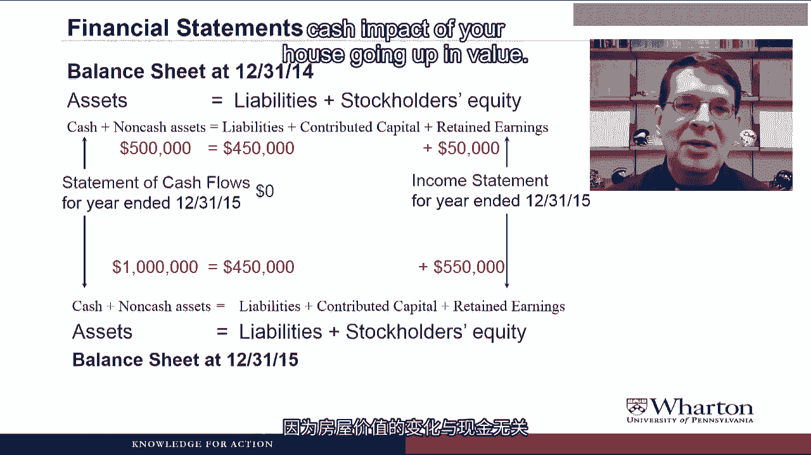

# 沃顿商学院《商务基础》｜Business Foundations Specialization｜（中英字幕） - P50：2_1 2 1 资产负债表方程.zh_en - GPT中英字幕课程资源 - BV1R34y1c74c

 Hello， I'm Professor Brian Boucher and welcome back。 In this video。

 we'll take a look at the one rule of grammar in the accounting language， the balance sheet equation。

 We'll see how the balance sheet equation makes all the financial statements fit together。

 We'll also use the balance sheet equation to solve some problems where we're missing。

 one piece of information， but we can fill in everything that we do know into the balance。

 sheet equation and solve for what we need。 Hope you enjoy the video。

 So if you've ever tried to learn a foreign language， you know that one of the most difficult。

 things is learning all the rules of grammar， all the cases and declensions and the changes。

 in verb endings and all that stuff。 Well， the good news about learning the language of accounting is that there's only one rule。

 of grammar， the balance sheet equation or the accounting identity。

 This is that assets equal liabilities plus stockholders' equity at all points in time。

 Another way to say this， as we've talked about， is that the resources of the company equal。

 the claims on those resources by the outsiders and by the owners。

 Can you give me an example of when this is used in the real world？

 A good example to think about how we use the balance sheet equation in real life is when。

 we buy something big like a house or a car。 So let's say we wanted to buy a $500。

000 house but we only had $50，000 of cash。 Well we would need to go out and borrow $450。

000 from the bank in a mortgage in order to buy， the house。 Then after we bought it， we'd have $500。

000 in assets， the house， which is equal to the， $450，000 of liabilities， the mortgage， plus $50。

000 in equity， which is how much cash we， put in and which represents our claim on that house。

 The most important feature of the balance sheet equation is that it must always balance。

 That's why we're going to talk about something called double-entry bookkeeping。

 If you increase something on one side of the equation， you have to increase or decrease。

 something else to stay in balance。 So there has to be at least two entries anytime you tinker with the balance sheet equation。

 And as we'll see， the changes between two balance sheets are going to be summarized in。

 the income statement， the statement of stockholder's equity， and the statement of cash flows。

 So let me show you this graphically。 So let's say we have a balance sheet at the end of December 31。

 2014。

 Assets equal liabilities for stockholder's equity。

 We'll split the assets into cash and non-cash assets。

 And we'll split stockholder's equity into contributed capital and retained earnings， which。

 our concepts will talk more about in later videos。

 Then we have a balance sheet at the end of the year。

 So we've got one at the beginning of 2015 at the end of 2015。

 The difference in the retained earnings is going to be explained in the income statement。

 for the year end of December 31， 2015。

 And the difference in cash is going to be explained in the statement of cash flows for。

 the year end of December 31， 2015。

 Here you go again with a difference between income and cash。 Remind me， why are they different？

 Okay， let's go back to the house example。 So let's say on your first balance sheet at the beginning of the year。

 you have a $500，000， house， which is your asset， $450，000 mortgage， which is your liability。

 and $50，000 of equity。

 Now let's say that during the year， the value of your house increases to a million dollars。

 Now you can't actually do this in practice， but for the sake of the example， let's assume。

 you could write up the value of the house from $500，000 to a million at the end of the year。

 So your balance sheet at the end of the year would have a million dollar asset， the house。

 $450，000 of liabilities because the mortgage doesn't change， but your equity would go up。

 from $50，000 to $550，000。

 Now if we look at the statements that explain the changes in two balance sheet， none of。

 this affects the cash flow statement because there's no cash impact of your house going。

 up in value。 In fact， your cash actually probably went down as you were paying the mortgage。

 but your。

 income statement would show a gain of $500，000 from the increase in your equity due to your。

 ownership claim of the house。 Housing prices going up， can you give us a more contemporary example？

 Okay， so let's talk about what happened during the financial crisis of 2007， 2008， and 2009。

 There were banks out there that had assets called mortgage-backed securities。

 These are assets because they're claims on collecting cash payments from people that。

 took out subprime mortgages。 So let's say a bank had $10 billion of these mortgage-backed securities as assets。

 And let's say they had $9。5 billion of liabilities and half a billion of equity。

 Financial crisis hits。 These homeowners no longer make their mortgage payments。

 which means these assets drop in。

 value。 So now they have to be written down in value from $10 billion to， let's say， $1 billion。

 Now the liabilities don't change。 In fact， that's why you need a government bailout because your liabilities don't change。

 But what does change is the equity。

 The equity drops by $9 billion as well。

 And so it's another example where there's no cash flow impact of the change in these。

 two balance sheets， but we end up showing a $9 billion loss on our income statement due。

 to the drop in our equity claims on those assets。

 Of course， we also have to mention the statement of stockholders' equity， which explains the。

 changes in stockholders' equity between two balance sheets， which we will talk about more。

 later in the course。

 What I want to do next is show you how everything that we're going to talk about fits into this。

 balance sheet equation。 So we talked about how stockholders' equity is two components。

 contributed capital， which。

 is the money that we raise from shareholders， and retained earnings， which is what we create。

 by operating the business。

 Retained earnings is going to equal whatever retained earnings were at the beginning of， the period。

 plus any net income earned during the period minus any dividends paid out to。

 shareholders。

 That's why it's called retained earnings because it's the earnings or net income less。

 any dividends paid out。

 And the net income， as we talked about in a prior video， is revenues minus expenses。

 So if we put all of this into the balance sheet equation， we get one big complete balance sheet。

 equation， which is assets equal liabilities plus contributed capital plus your prior。

 retained earnings plus revenues minus expenses minus dividends that you pay during the period。

 Is that all yours？

 Are you going to make us do some mathematics with this？ Why yes。

 I am going to ask you to do some math。 Now I'm going to give you some problems。

 give you a chance to try to answer the problems。

 and then we'll talk through the answers。 After I read the problem。

 you'll see a little pause icon on the screen。

 You want to try to answer the problem before I give you the answer， pause the video at this， point。

 try to come up with the answer， and then resume the video。

 But if you want to just roll through and hear the answer right away， then it's okay to keep。

 the video going。 This is going to be the procedure that we follow any time that I give you some questions。

 that I want you to try to answer during the video lecture。 Okay， here's the first one。

 Assets equal 100， liabilities equal 50， what is stockholder's equity？

 We can solve this one with the balance sheet equation。 We know that assets are 100。

 liabilities are 50， the only thing that's missing is stockholder's。

 equity， which has to be 50， so that we have 100 on the left-hand side and 100 on the right-hand。

 side。

 Next。 Equity is increased by 100 and stockholder's equity is unchanged。

 What is the change in assets？ Again， we can use the balance sheet equation to answer this。

 but now we're looking at changes。

 in the numbers。 So stockholder's equity is unchanged， liabilities go up by 100。

 The only way for the equation to stay in balance is for assets to also go up by 100。

 Next， all non-cash assets are 70， total liabilities are 60， total stockholder's equity is 30， what。

 is cash？

 We can use the balance sheet equation for this one if we separate assets into cash and non-cash。

 assets。 So we have liabilities of 60 and stockholder's equity of 30， that's 90 on the right-hand。

 side。 Non-cash assets are 70， the only thing missing is cash， which has to equal 20， so that we。

 have 90 on each side。

 Next， cash decreases by 10 and all non-cash assets increase by 15。

 What is the change in liabilities？

 We can use the same equation， but we have to be a little bit careful。 We have cash going down by 10。

 non-cash assets going up by 15。 We're looking for liabilities。

 but we don't know what happened with stockholder's equity。

 And because we don't know what happened with stockholder's equity， we actually don't have。

 enough information to solve this。 Now， if we knew that stockholder's equity had not changed。

 then liabilities would have， had to go up by 5 so that we have an increase in 5 on both sides of the equation。

 But without knowing what happened to stockholder's equity， we technically don't have enough。

 information to answer this one。 Come on。 A trick question。 Really？ Sorry about the trick question。

 but I promised that it won't be the last。 Next， we have retained earnings increasing by 100。

 Dividends are 50。

 What is net income？

 Earlier in the video， we looked at the equation for retained earnings， where retained earnings。

 is equal to prior retained earnings， what they were at the beginning of the year， plus。

 net income during the period， minus dividends。 So we know that the change in net income。

 or change in retained earnings， retained earnings。

 minus prior retained earnings is 100。

 We know that dividends is 50， so the only thing missing is net income， which has to。

 be 150 for this to balance。 Next， we have revenue increasing by 100。

 All other categories are unchanged except assets。

 What is the change in assets？ We have to use the complete balance sheet equation to solve this one。

 so that we break。

 stockholder's equity into contributed capital， prior retained earnings， revenues， expenses。

 and dividends。 So we know that revenues are going up by 100。

 Everything else is unchanged but assets， which means that assets also have to go up。

 by 100， so that both sides of the equation increase by 100。

 Finally， expenses increased by 60 and all other categories are unchanged except cash。

 What is the change in cash？ We will again use the complete balance sheet equation。

 but now we will split assets into。

 cash and non-cash assets。 So we know that expenses went up by 60。

 Everything else is unchanged except for cash。 Now notice on the right hand side of the equation。

 expenses going up by 60 means the right hand， side goes down by 60。

 which means that cash also has to go down by 60 for us to stay in， balance。 I think I can do this。

 Can we do more maths problems？ Finally， some positive feedback。

 The purpose of this exercise was to preview the type of problem that you are going to be。

 doing a lot in this course。 There is going to be a certain piece of information that you need that you are not given。

 but， you can take all the other information that you are given and a set of equations which。

 will usually be in the form of T-accounts or journal entries， feeling everything you， know。

 and then solve for that one piece of information that you need， but you can't find。

 in the financial statements。 Wow， has it been 12 minutes already？

 Time sure flies when you are doing the balance sheet equation。

 I am going to go ahead and wrap up this video and we will come back next time and talk in。

 more detail about assets， liabilities and shareholders' equity。 I will see you then。

 See you next video。 。 。 。 [ Silence ]。