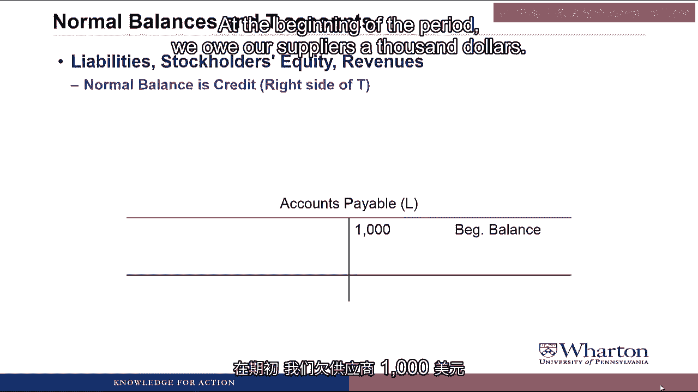
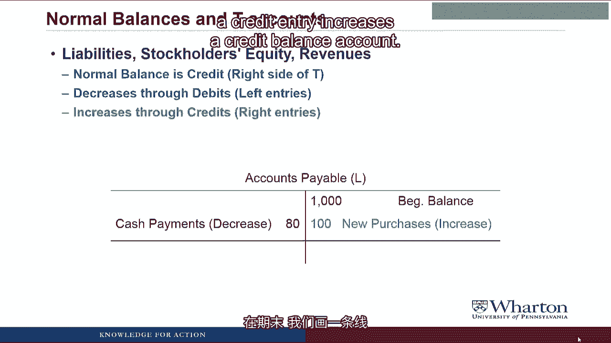

# 沃顿商学院《商务基础》｜Business Foundations Specialization｜（中英字幕） - P52：4_1 3 1 借贷记账法 I.zh_en - GPT中英字幕课程资源 - BV1R34y1c74c

 Hello， I'm Professor Brian Buchay。 Welcome back。 This is the video you've all been waiting for。

 We're going to talk about debits and credits。 Now I have to admit that there's somewhat of a disagreement in the accounting faculty。

 world about whether we should still be teaching debits and credits。

 I am firmly in the camp where I believe that debits and credits are a very useful and powerful。

 tool for learning and teaching accounting。 Plus， I still use them to this day。

 If I had to figure out some kind of complicated transaction in a financial statement， first。

 thing I would do would be break out the debits and credits to help me crack the problem that。

 I'm trying to solve。 So hopefully you'll find them useful too。 If nothing else。

 you're joining an exclusive fraternity of people around the world that。

 can speak in the language of debits and credits。 Let's get started。

 As a starting point， I have to say that the most interesting thing about bookkeeping is。

 that it's the only word in the English language with three consecutive sets of double letters。

 O-O-K-K-E-E。

 Beyond that， I'm not sure it's that interesting， but these three fundamental bookkeeping equations。

 I'm going to show you are incredibly powerful tools for both learning accounting and then。

 ultimately understanding the information that you're going to read in financial statements。

 The first equation we've seen before， assets equals liabilities plus stockholders' equity。

 the balance sheet equation。

 We're also going to introduce the equation that the sum of the debits has to equal the。

 sum of the credits and that the beginning balance of an account plus increases minus decreases。

 has to equal the ending balance of an account。 These three equations must balance at all times and this will come in handy because many。

 times we'll be missing one piece of information but we'll have everything else and then we。

 can use one of these equations to figure out the piece of information that we're missing。

 We're going to recognize that the balance sheet equation can be preserved through the use。

 of debits and credits。 So instead of having to constantly go back and recalculate the balance sheet equation。

 instead all we have to do is make sure our debits equal our credits and we know that the。

 balance sheet equation is preserved。

 So what are these magical things called debits and credits？

 A debit is defined as a left side entry and a credit is defined as a right side entry。

 Doesn't credit mean good？ But my account， credit card， credit to society， all sounds good to me。

 And doesn't debit mean bad？ Debit card， debit my account， debit to society。 I hate the word debit。

 Yes， debit and credit have gotten those connotations in the real world。 But in the accounting world。

 debit simply means left， credit simply means right。 Sometimes debits are good。

 sometimes they're bad， sometimes credits are good， sometimes， they're bad。

 All they mean is left and right。 And don't ask me why we abbreviate debit as DR。

 It's probably something the British came up with centuries ago and we've just always。

 done it that way， but that's the way we do it， so get used to it。

 Now let's take a look at how debits and credits can be used to preserve the balance sheet equation。

 So here's the balance sheet equation again。 And in prior videos。

 remember we did a more complete balance sheet equation where we split。

 the stockholders' equity into contributed capital， retained earnings。

 and then revenues and expenses。

 Where are dividends？ In a prior video， you had dividends in this complete balance sheet equation。

 I bet you think we aren't even watching the videos we don't participate in。 Nice catch。

 I did drop dividends from this equation。 One reason is that I was running out of space on the slide。

 as you can see。 But the more important reason is we're going to not treat dividends as a separate account。

 going forward。 We'll create separate accounts for revenues and expenses。

 but we're just going to treat， dividends as a reduction in retained earnings。

 The problem with this equation is that we have the negative expenses at the end。

 As we saw a couple of videos ago， it can get confusing when working with expenses in this。

 case because an increase in an expense would be an increase in a negative number on the。

 right-hand side of the equation， which would make it go down and it gets very confusing。

 So to solve this problem， we're going to move expenses to the other side。

 Now we have assets plus expenses， equals liabilities plus contributed capital plus retained earnings。

 plus revenue， and it's all positive numbers。

 Then we're going to call everything on the left， debits， and everything on the right credits。

 There are a number of rules of debits and credits that we have to keep in mind and follow。

 if we want the debits and credits to stand in for the balance sheet equation。

 First is that every transaction must have at least one debit and at least one credit。

 which makes sense because if we want debits to equal credits， we have to have at least。

 one on each side in a transaction。 Debits must equal credits for all transactions。

 and as long as that's the case， we'll know。

 that the balance sheet equation will stay in balance。

 No negative numbers are allowed。 So you're going to debit a positive number or credit a positive number。

 You're never going to debit a negative number or credit a negative number。

 And as you can see in the balance sheet equation above， now that it's rearranged， we don't。

 need to deal with negative numbers for debits and credits。

 Now we're going to talk about accounts and account balances。

 In a case you ever wondered， the reason why this is called accounting is because we put。

 everything in these accounts， which are areas where we keep track of similar types of transactions。

 Every account has a normal balance。

 That's the type of balance either debit or credit that the account carries under normal。

 circumstances。

 We're going to represent accounts in something called the T account， which is going to show。

 all of the changes in the account value。 We're going to put debits on the left side of the T and credits on the right side of the。

 T and we're going to do that because debit means left and credit means right。

 The difference between the sum of the debits and the sum of the credits at any point in。

 time will give us a balance for the account。

 And then the change in account balance equation is the one we saw before， beginning balance。

 in account plus increases minus decreases， has to equal the ending balance， where we're。

 going to use debits and credits to stand in for the increases and decreases。

 I was wondering why I wasn't getting any questions。 Wake up。 It's going to get more interesting。

 Let's take a look at how this works in more detail。

 Assets and expenses are going to have a normal balance that's a debit， which means it's going。

 to sit on the left side of the T account。 For example。

 let's look at an asset like accounts receivable。

 Remember， this is the money that's owed to us by customers based on sales we've made。

 in the past。 It's an asset because its money will collect in the future。

 Let's put a little A in parentheses to denote that this is an asset account。

 The beginning balance sits on the left side of the T account because it's a debit balance， account。

 Then let's say during the period we make new sales of 100。

 New sales on account， increase accounts receivable， increase the amount of cash that。

 our customers owe us， and we're going to increase the account through a debit entry。

 We increase a debit account with a debit entry。

 Even when we collect cash from customers， it reduces accounts receivable。

 The customers don't owe us the cash anymore because they paid us so the account has to。

 go down。 We reduce accounts receivable with a credit。

 We reduce a debit balance account with a credit entry。 Then at the end of the period we draw a line。

 add up the debit， subtract some of the credits。

 and we get an ending balance in this case of 10。20， which sits on the debit side because。

 again it's a debit balance account。

 So， does debit mean good？ I mean， new sales are good， right？ Or does credit mean good？

 Cash collections are good， right？ I am so confused。

 Don't think of debits and credits as good and bad。 Debit simply means left entry。

 credit simply means right entry。 Debit will sometimes increase account。

 debits will sometimes decrease in account， it all， depends on the type of account it is。

 So hang on for more examples， but just keep in mind， debit and credit is not good and， bad。

 it's just left and right。

 Now let's look at accounts that have a normal balance on the credit side。

 Liability， stockholders， equity and revenue have normal balances that are credits which。

 sit on the right side of the T account。

 If we look at an example of a liability like accounts payable， this is money that we owe。

 our suppliers based on raw materials that we've received in the past。

 Put a little L in parentheses to indicate it's a liability because we have an obligation。

 to pay those suppliers in the future。

 At the beginning of the period we owe our suppliers a thousand dollars。

 That beginning balance sits on the credit side because it's a credit balance account。

 During the year we pay $80 to our suppliers。 That reduces the liability， reduces the obligation。

 We reduce a liability with a debit。

 So a debit entry reduces a credit balance account。

 Also during the year we go out and purchase new inventory。

 We purchase it on account so we owe our suppliers $100。

 That's going to increase the liability accounts payable。 We increase the liability with a credit。

 A credit entry increases a credit balance account。

 The end of the period we draw a line， add up the credit， subtract the sum of the debits。

 We get an ending balance of $10。20 which sits on the credit side or right side because it。

 is a credit balance account。 I think I've got it。 Debit means increase for a debit account and decrease for a credit account。

 And credit means increase for a credit account and decrease for a debit account。

 Or is it the other way around？ You're exactly right。

 Debit's increase a debit balance account and decrease the credit balance account。

 It's increase a credit balance account and decrease a debit balance account。 Did I say that？ Yeah。

 I think so。 Anyway， let's just go on。 One way to represent this graphically is through something we call the super T account。

 If you think of the whole balance sheet as a big T account with assets on the left and。

 liabilities and stockholders equity on the right， then what you can see is all the individual。

 asset accounts are going to be increased by debits because they're on the left side of。

 this super T。

 All the individual liability contributed capital and retained earnings accounts are going to。

 be increased through credits because they sit on the right hand side of the super T。

 Then we're going to get to the trickiest revenues and expenses。

 Remember revenues and expenses live within retained earnings。

 Revenues increase net income which means they increase retained earnings。

 So revenues have a credit balance。

 They're increased with credits which then in turn increases retained earnings。

 Are reductions in net income and hence reductions in retained earnings？

 So expenses have a debit balance because a debit to an expense represents a reduction。

 in retained earnings。 I mean， there's not much intuition to this。

 This is just something you're going to want to memorize until it becomes second nature。 Dude。

 can I get a tattoo of this on my arm？

 Yeah， you could， but maybe a less drastic step would be to just print out the slide or。

 maybe write it on your hand with an eight-pen。 But I do think it is a good idea to keep it cheat sheet handy to help remind you which。

 accounts are debit balance accounts and which accounts are credit balance accounts until。

 you have it memorized。 We're going to follow a very systematic approach in analyzing transactions to figure out how。

 to represent them as journal entries。 Journal entries are what we're going to use to show a transaction in this debit and credit。

 format。 So there's three questions we have to think about。

 First， what specific asset liability， stockability。

 revenue or expense accounts does a given transaction。

 effect？ Does the transaction increase or decrease the affected accounts？

 And then should the accounts be debited or credited？

 And here we can look back to something like our super T account as a cheat sheet to figure。

 out whether we debit or credit to increase or decrease the accounts。

 Then we can put it in the journal entry format which is our shorthand for what happened in。

 the transaction。 We start with the debit account。

 We use the abbreviation DR for debit， the name of the account and the dollar amount。

 Then we list the credits after that。 We indent the credits， put a CR for the abbreviation。

 the names of the accounts credited and the。

 dollar amount。

 The key thing to remember is always list your debits first， then list your credits and then。

 always indent your credits。 Okay， this is really important。

 Place your right hand and repeat after me。 I do solemnly swear that I will always list my debits first。

 I do solemnly swear that I will always list debits first。 That I will always list credits second。

 That I will always list credits second。 And that I will always indent my credits。

 And that I will always indent my credits。 Did I just ask you to swear an oath about debits and credits？

 I think maybe I'm getting a little loopy here。 So why don't we go ahead and stop the video at this point。

 We'll pick it up in the next video with a series of four examples to help pull together。

 everything we've talked about so far and then we'll practice doing some journal entries。

 I'll see you then。 See you next video。 [BLANK_AUDIO]。

