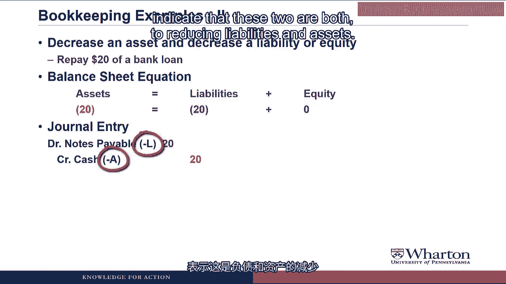
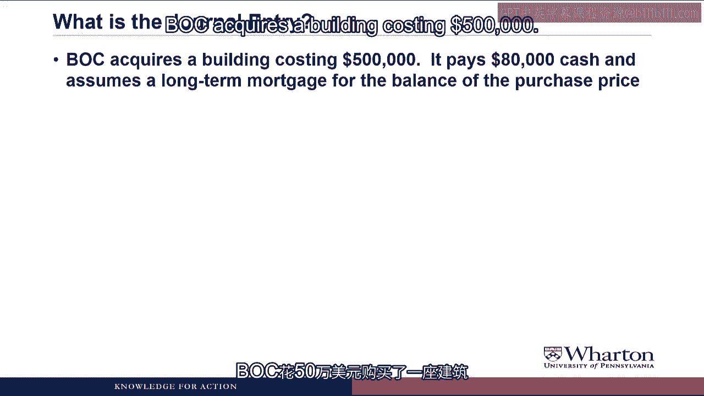
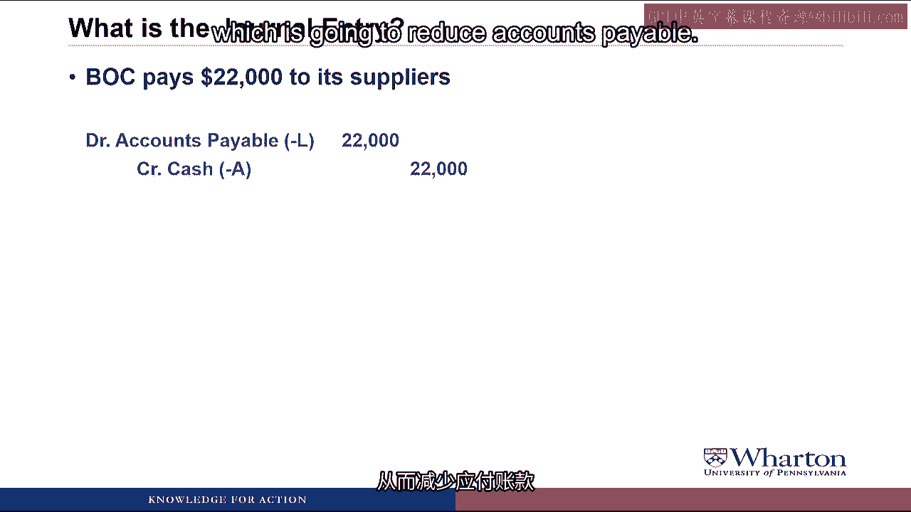
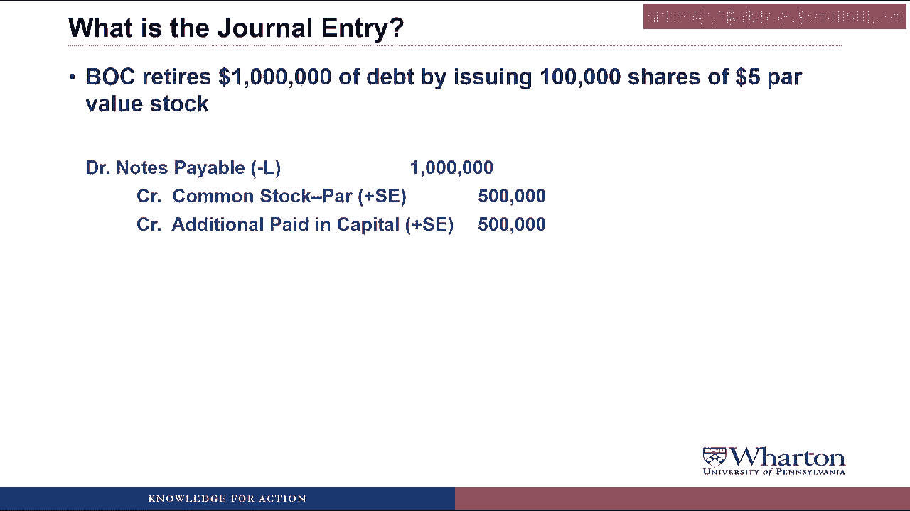

# 沃顿商学院《商务基础》｜Business Foundations Specialization｜（中英字幕） - P53：5_1 3 2 借贷记账法 II.zh_en - GPT中英字幕课程资源 - BV1R34y1c74c

 Hello and Professor Brian Boucher。 Welcome to the second part of our Debit and Credit Extravaganza。

 In the last video we introduced a lot of terminology and concepts and in this video we're going。

 to practice applying those。 I'm going to start with a series of examples to help review the key concepts from last。

 video and then we'll move on to practice doing journal entries so that we get used to writing。

 things using this Debit and Credit language。 Let's get started。 Okay。

 let's reinforce everything that we've learned with a series of four examples。

 In the first example we're going to increase an asset and then increase either a liability。

 or equity。 In this case we receive $100 cash from a bank loan。

 The accounts involved are cash and notes payable both of which increase by $100。

 On the balance sheet equation we would see that assets would go up by $100 that's the。

 cash。 Liabilities would go up by $100 that's the note payable or obligation to the bank and。

 equity is unchanged。 For the journal entry first we need cash to go up by $100。

 Cash is an asset。 Assets are Debit accounts so we would debit cash to get it to go up by $100。

 And what I'll do is I'll put in parentheses plus A to indicate that this debit is increasing。

 the cash account。 We're going to credit notes payable for $100。

 Notes payable is a liability。 These are credit accounts so we increase a credit account with a credit entry。

 If we looked at this with T accounts we would have a cash T account which would have an。

 entry on the debit side。 A notes payable T account which would have an entry on the credit side。

 If we did a balance sheet equation， sort of drew a line， added up the balance in each， account。

 Our balance sheet would balance。 We'd have cash of $100 on the asset side。

 Now let's look at decreasing an asset and decreasing a liability or owner's equity account。

 So here we're going to repay $20 of a bank loan。 So the accounts involved are cash and notes payable。

 Both are going down by $20。 On the balance sheet equation we would see assets go down by $20。

 That's the cash。 Liabilities going down by $20。

 That's the notes payable and there's no effect on equity。 For the journal entry。

 the cash is going down by $20。

 There's no effect on equity。 For the journal entry we're going to debit notes payable for $20。

 We need a liability to go down。

 Liabilities have credit balances。 We reduce a credit balance with a debit。 Debit notes payable $20。

 Then we're going to credit cash for $20。 Cash is an asset。

 Assets are debit balances。 We reduce a debit balance account with the credit so a credit to cash for $20。

 We'll reduce it。

 You notice I have minus L and minus A in parentheses to indicate that these two are both reducing。

 liabilities and assets。 For T accounts we would have a credit entry in the cash T account。

 a debit entry in the。

 notes payable T account。 If we drew a line for the balance in each。

 our balance in cash is 80 on the debit side。

 Balance in notes payable is 80 on the credit side。

 Our balance sheet equation would balance where we have 80 of cash， 80 of notes payable。

 and no stockholders equity。

 Okay okay I know we're not off to a rousing start but just two more examples and then。

 we'll do some journal entry practice。 Next example。

 let's look at increasing one asset and decreasing another asset。

 The example transaction is that we pay $10 in cash for inventory。

 The accounts involved here are cash and inventory and cash is going down by 10。

 Inventory is going up by 10。 Our balance sheet equation would look like this。

 All the actions on the left hand side where we have one asset going down and one asset。

 going up by the same amount so they cancel。 For the journal entry we need inventory to go up。

 Inventory is an asset so we debit inventory by 10 to make it go up by 10。

 We need cash to go down。

 Cash is an asset。 You make a debit balance。 Asset account go down with a credit so we credit cash for 10。

 In terms of the T accounts we would have another credit to cash of 10。

 We would put an inventory T account with a debit balance of 10。

 If we drew lines and added up the balances we've got 70 in cash and 10 in inventory on。

 the left hand side so that's 80 of assets。

 We have 80 of liabilities and the notes payable， no stockholders equity。

 Our balance sheets balance and our debits equal our credits。 Final example。

 we're going to increase the liability or equity and then decrease another。

 liability or equity。

 In this case we're going to issue $80 in common stock to pay off the bank loan。

 The two accounts are common stock and notes payable。

 Common stock is a stockholders equity account going up by 80。

 The bank loan is a liability going down by 80。 In the balance sheet equation we'd have nothing on the asset side。

 These would go down for paying off the bank loan， equity would go up for issuing the common。

 stock。 For the journal entry we want a debit notes payable for 80 because notes payable is a liability。

 that we want to reduce。

 Liabilities of credit balances， we reduce them with a debit so debit notes payable。

 We want common stock to increase。 Common stock is an equity account which has a credit balance。

 We increase a credit balance account with a credit。

 We credit common stock to increase stockholders' equity by 80。

 And then with our T accounts we would have a reduction of 80 to notes payable， the reduction。

 being a debit。

 And increase the common stock of 80 with the increase being a credit。

 If we drew lines and came up with the totals we'd have 70 in cash， 10 in inventory that's。

 80 on the asset side。 We have no notes payable。 It goes to zero because we've fully paid it off and a balance in common stock of 80。

 So our assets equal our liabilities plus stockholders' equity， balance sheet balances。

 debits equal credits。

 So let's practice some journal entries。 It would be the same procedure that we've used in other videos where I'll give you a。

 transaction。 Put up the pause sign so that you can pause if you want to give a shot。

 Then I'll give you the answer and we'll talk through how we got it。

 Here's the first one。 BOC issues， $10，000 shares of $5 Power Value stock for $15 of cash per share。

 In this transaction we're receiving cash。

 Cash is going to increase。 And we're going to increase common stock accounts。

 Cash is an asset。 We make cash go up with a debit。

 So we're going to debit cash。 The dollar amount is $150，000 which is $15 cash times $10，000 shares。

 We need the common stock accounts to also go up by $150，000 but we have to split it between。

 the par value and the additional paid in capital。

 So we're going to credit common stock at par for $50，000 which is $5 par value times。

 $10，000 shares。

 And then we'll credit additional paid in capital for the rest which is $100，000。

 So now we have $150，000 of debits， $150，000 of credits。

 We're in balance and we've done the journal entry correctly。 Whoa。

 you can have more that one credit in a journal entry。 Could you also have more than one debit？

 And what is this also shown in his power value？ Yes， you can have more than one credit。

 You can have more than one debit。 The only requirement is that your debits equal your credits within the journal entry。

 And yes， accounting professors are obsessed with par value。

 It's one of those difficult things that you can only come to a trained professional like。

 me to understand so you're going to see it a lot。

 BOC acquires a building costing $500，000。

 It pays $80，000 cash and assumes a long-term mortgage for the balance of the purchase price。

 The accounts involved in this transaction are buildings which are going up， cash which is。

 going down， and mortgage payable which is going up。

 It's a liability that's increasing as we take out the mortgage。

 So starting with buildings， they're going up。

 Buildings are an asset so we debit buildings by $500，000 to increase the asset。

 We want cash to go down。 Cash is an asset。

 Cash has a debit balance so to make it go down we need to credit it。 We need to credit cash for $80。

000 to reduce that asset。

 And then mortgage payable is a liability。

 Has a credit balance。 We want to increase it so we're going to credit mortgage payable to increase the liability。

 We're not given the amount but we know it has to be $420，000 because we know our debits。

 have to equal our credits。

 Once we credit mortgage payable for $420，000 we have $500，000 of debits， $500，000 of credits。

 and we're in balance。 BOC obtains a three year fire insurance policy and pays the $3。

000 premium in advance。

 In this transaction we're getting fire insurance coverage for three years。

 That's an asset that we're going to call prepaid insurance and it's going up。

 We're paying cash so cash is going down。

 So starting with a prepaid insurance it's an asset。

 We make an asset go up through a debit so we debit prepaid insurance for $3，000。

 Cash is an asset also but it's going down。 So to make cash go down we credit cash to reduce the asset by $3。

000。

 BOC acquires on account office supplies costing $20，000 and merchandise inventory costing $35，000。

 In this transaction we're acquiring office supplies and inventory。

 Both of those are assets so we're going to make them go up with debits so we debit office。

 supplies to increase that asset by $20，000。

 We debit inventory to increase that asset by $35，000。 Now we're not paying any cash。

 Instead we owe our supplier $55，000 because we got this stuff on account。

 When we owe money to our supplier it's a liability called accounts payable。

 It's increasing。 We make a liability increase through a credit so we credit accounts payable for $55。

000。

 So we have $55，000 of debits， $55，000 of credits and we're in balance。

 Next， BOC pays $22，000 to its suppliers。

 In this transaction we're paying our suppliers which reduces how much we owe them which is。

 going to reduce accounts payable。

 And since we're paying cash it's going to reduce cash as well。

 Accounts payable is a liability。 It has a credit balance。

 If we want to reduce it we need a debit so we debit accounts payable $22，000。

 Cash of course has a debit balance。

 If we want to reduce it we credit cash for $22，000。

 And this by the way is the journal entry you're going to do anytime that you pay cash to reduce。

 a liability。

 Debit the liability to reduce it， credit cash to reduce it。

 BOC exchanges a building valued on the books at $200，000 for piece of undeveloped land。

 In this transaction we're trading one asset for another asset。

 We're getting land land is going to go up。

 So to make land go up we debit land $200，000。 We're getting rid of a building。

 Building is going down。 Building is an asset。 We make an asset go down with the credit so we credit building $200。

000。

 How do you know that the land is worth $200，000？ Given the information we have we have to assume the land is worth $200。

000 so our debits equal， our credits。 And the assumption makes sense because if we're giving up a $200。

000 building and just， getting land the two values should be equal。

 Now later on in the course we'll look at situations where they're not equal and we end。

 up having a gain or a loss in the transaction but that's for another day。

 BOC retires 1 million of debt by issuing 100，000 shares of $5 power value stock。

 In this transaction we're reducing a liability。

 Anytime we reduce the liability we need to debit the liability to make it go down so we。

 debit notes payable for a million dollars to reduce it by a million。

 Now we need to increase stockholders equity by a million but we have to split it into。

 the common stock and the additional paid in capital。

 So common stock at par goes up by the par value so we credit common stock to make the。

 stockholders equity go up for $500，000 which is 100，000 shares times $5 par value。

 Then we credit additional paid in capital to make that stockholders equity account increase。

 and we know the amount has to be $500，000 because we know our debits have to equal our， credits。

 Sorry， I'm going to make you do par value a lot。 Get over it。

 BOC receives an order for $6，000 of merchandise to be shipped next month。

 The customer pays $600 at the time of placing the order。

 In this transaction we're receiving $600 cash。 Anytime we receive cash we debit cash to increase the asset so we debit cash $600。

 We're also getting an obligation here because now we either owe the customer $600 back or。

 we have to deliver the merchandise。 So we're going to create a liability called advances from customers so we credit advances。

 from customers to increase the liability for $600。

 What about the $6，000 of merchandise we ordered？ Don't we have to account for that？ No。

 we only account for the $600 because that's the only part where there's been a transaction。

 exchange because we received $600 cash。 For the other $5，400 that's all future stuff。

 That's all promises。 We don't have a liability yet because there's no obligation that's based on benefits or。

 services that we've received。 Not until we exchange cash goods or services equal to $5。

400 in the future where we have， to record that part of the transaction。 Finally。

 BOC declares and pays $8，000 of cash dividends。

 Let's start with cash in this transaction。 So cash is going down by $8，000。

 Anytime cash goes down， we credit cash to reduce the assets。 So we credit cash for $8，000。

 So now we know we're looking for a debit。

 The other part of the transaction is dividends。 We're paying dividends。 Now remember。

 dividends are a reduction in retained earnings。

 Retained earnings are a stockholder's equity account。

 Stockholder's equity accounts have credit balances so we reduce them with a debit。

 So we reflect the dividend by debiting retained earnings for $8，000。

 That was a lot of good practice at taking transactions and trying to represent them as。

 journal entries using debits and credits。 You're going to get a lot more practice。

 Starting next video， we're going to do an extended case that follows a startup company。

 all the way through its first transactions to its first set of financial statements。

 And along the way， you're going to get a lot of practice doing journal entries and see a。

 lot more debits and credits。 I'll see you then。 See you next video。 [BLANK_AUDIO]。

