# 沃顿商学院《商务基础》｜Business Foundations Specialization｜（中英字幕） - P56：8_1 5 3M公司年度报告之旅.zh_en - GPT中英字幕课程资源 - BV1R34y1c74c

 Hi， I'm Professor Brian Bouscher。 Welcome back。 Wow。

 what a long week of watching videos on the accounting basics。 So。

 what I want to do in the last video each week is look at a real financial statement。

 so that we can take the things that we've learned in the lectures and see how they play。

 out in a real world financial statement。 And to do this。

 I want to use the same financial statement throughout the course。

 The statement I chose is the 3M Company。 In case you had noticed， I'm from Minnesota。

 There's a Vikings helmet over here and some hockey helmets and a gopher helmet over here。

 My dad worked for 3M。 My grandmother worked for 3M for 40 years。

 It's a company I have some affinity for。 Hopefully， I won't find anything bad in the report。

 What we'll do in this video though is take a quick tour of everything that's in the。

 annual report so that you have an overview of where we're going to find things。

 And at the end of every week， we'll dive in in more detail and try to find that week's。

 topics in the 3M annual report。 I hope you enjoy the video。

 So we pull up the 3M annual report and there's a nice glossy cover， some smiling kids， some。

 benign looking chemicals。 There are people writing on forms and then kids drawing pictures。 Oh wait。

 I think I get the theme。 There's first the science of 3M and then there's the impact they have on smiling happy children。

 Anyway， we go to the next page and you get a letter from the chairman and CEO。

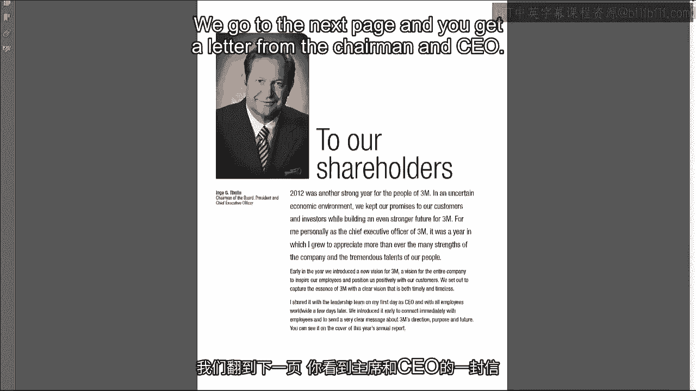

 So this is his explanation of how the company did during the past year。

 We get some graphs showing that everything's going up。 Looks like everything is going well with 3M。

 Then we get a financial summary。 By the end of the course。

 you will not only know what all of these terms mean， but you。

 will realize that this is not enough information to know what's going on at 3M。

 We have to read through the entire annual report。 If we go to the next page。

 we get this very ominous looking black and white page。

 Starts with United States Securities and Exchange Commission at the top form 10K。

 On this point forward， we're looking at the filing to the SEC and so everything that 3M。

 says or reports here is subject to all the laws in the Securities and Exchange Acts of。

 1934 and full SEC enforcement。 This is the point where things start to get serious。

 If we go to the next page， it gives us the table of content。

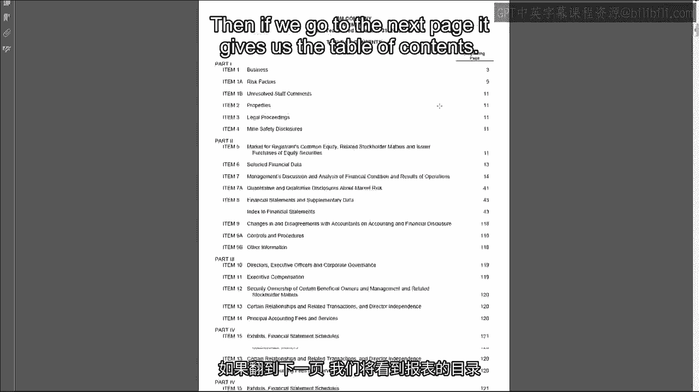

 So it's a quick overview。 In part 1 of the report， we're going to learn a lot about the business。

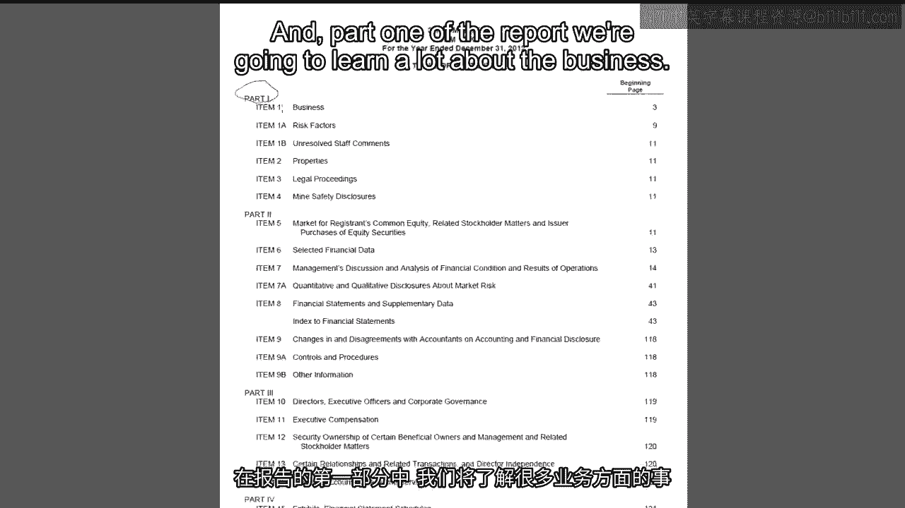

 What I'm going to do in a second is just flip through a lot of these quickly。

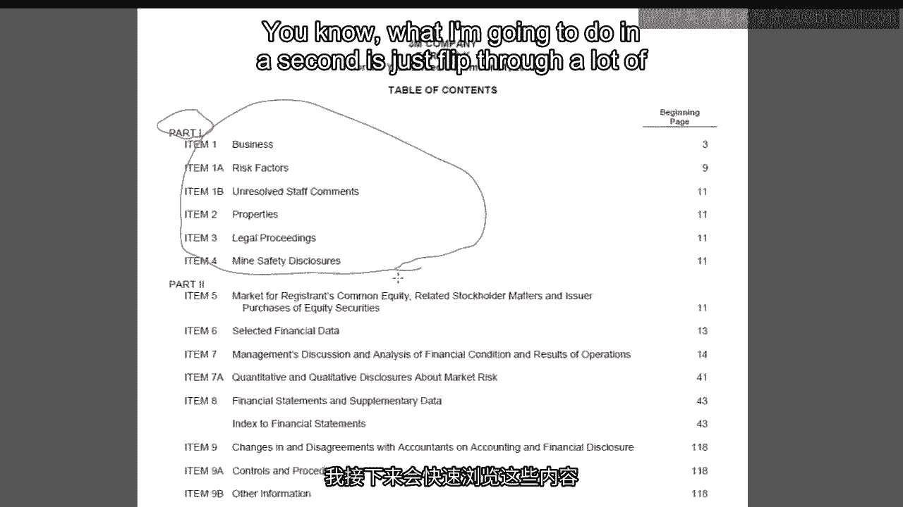

 You'll look at these more carefully as we go on later in the course。

 Part 2 is going to give us the financial information。

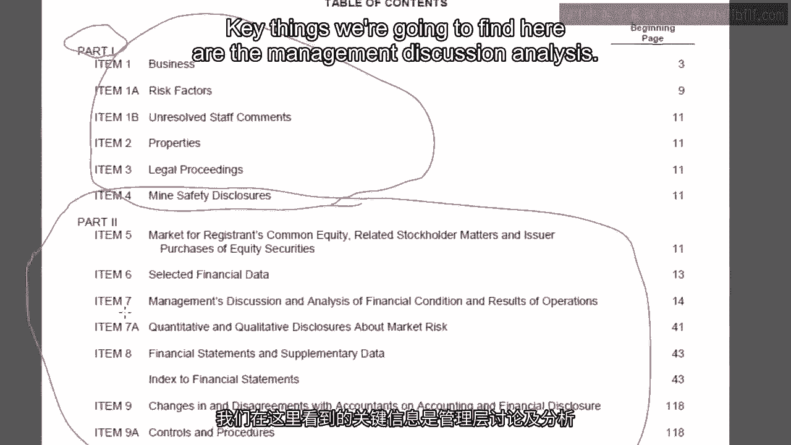

 Key things we're going to find here are the management discussion analysis and of course。

 the financial statements which are the star of the show。

 Then part 3 gives us proxy related information， the directors， officers， how much they're， paid。

 and then there's any supplemental exhibits in part 4。

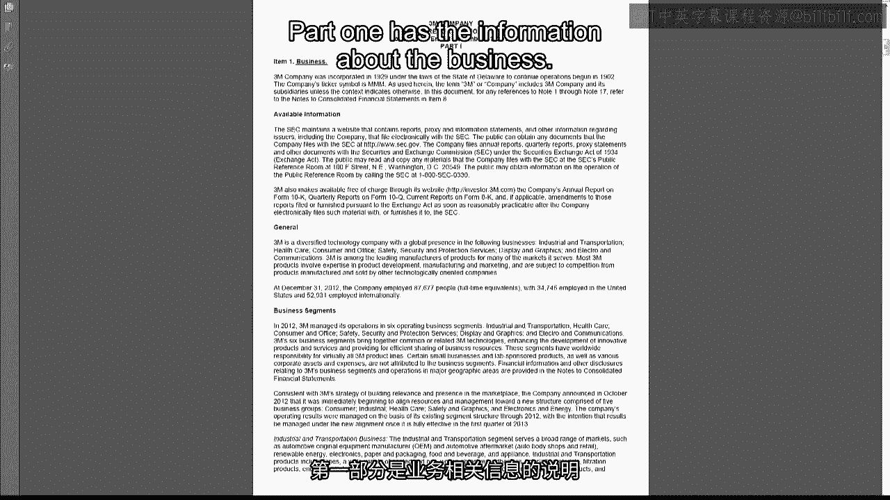

 Part 1 has the information about the business。 Again。

 I'm just going to flip through this very quickly。

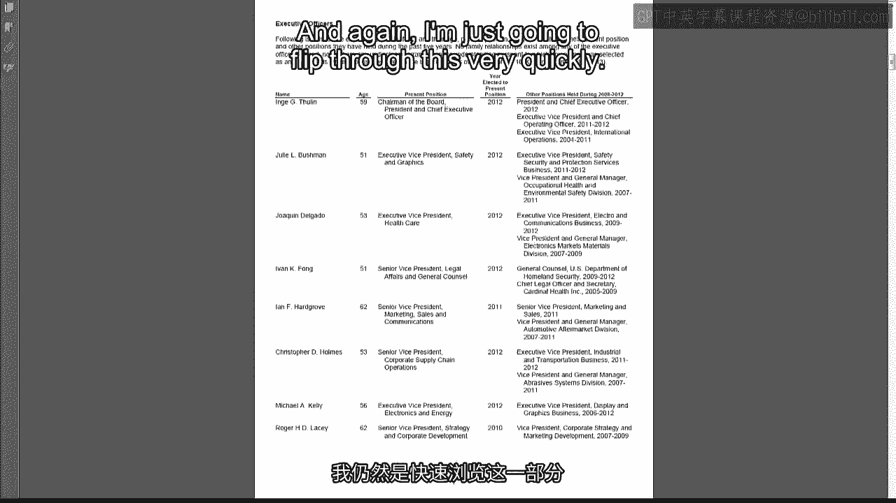

 If you want to go and read it in more detail， see what kind of things are there， it'll be。

 available on the course platform。 As you can see， it's not that long。

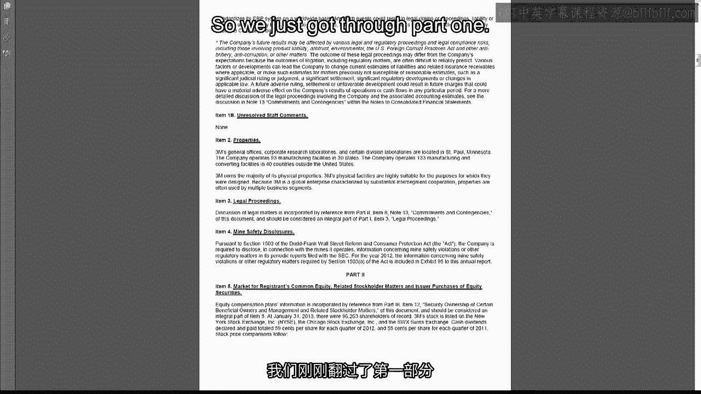

 We just got through part 1。 Then part 2 starts some information on stock price。

 selected financial data。

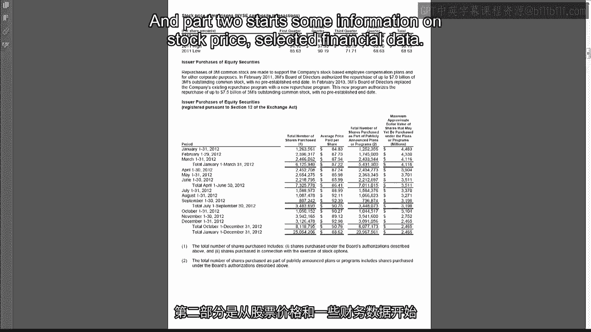

 Now here's the big thing， management discussion analysis。

 This is where management tries to explain to the users of the financial statements what。

 happened during the year。 So all the numbers that changed went up， went down， or didn't change。

 tries to provide。

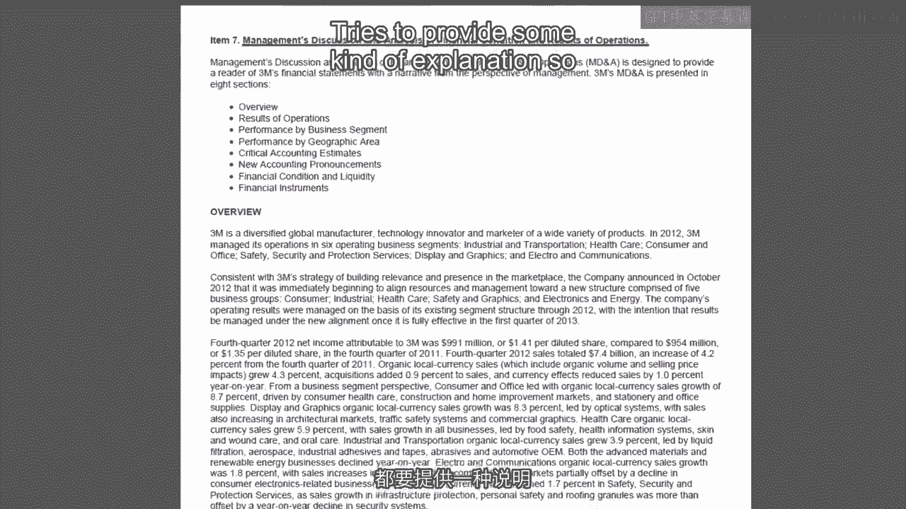

 some kind of explanation so that users can understand the financial statements。

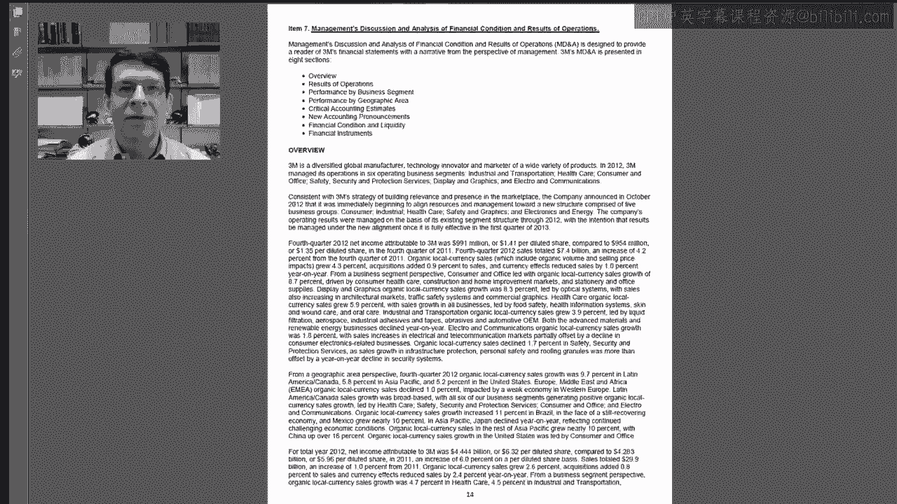

 Although management is being very helpful by giving us all this detailed explanation on。

 what they think happened during the prior year， we still want to be a little skeptical。 After all。

 there have been some companies which have had some big frauds where they've。

 written about things that have happened in the section that didn't really happen。

 So I like to look at the financial statements and the footnotes first， come up with my own。

 theories for what happened， and then come and see what management's saying about it just。

 as a reality check of whether I can believe what they're saying。

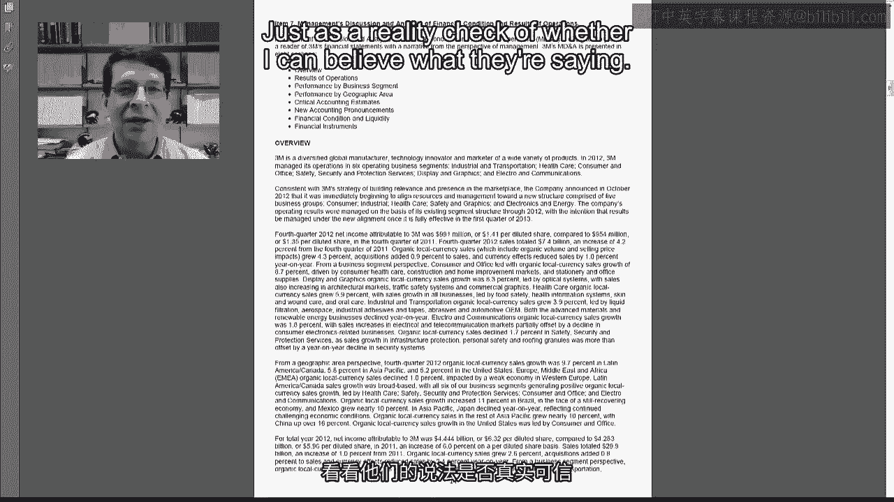

 So flipping through here， you can see it's going to be pretty extensive in detail。

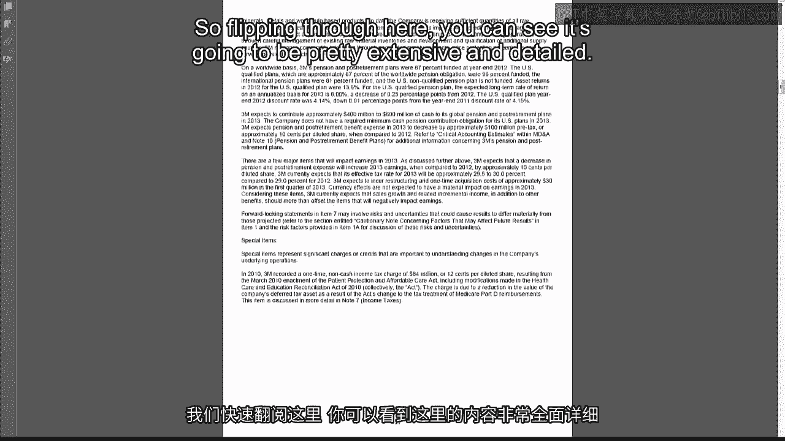

 There's talking about the income statements， business segments， geographic segments， financial。

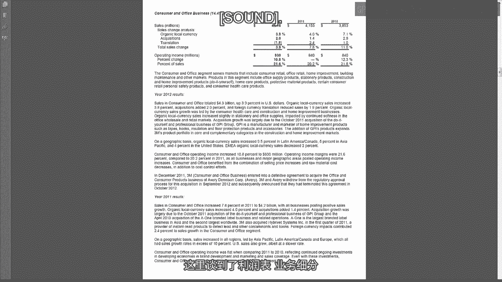

 condition and liquidity。 So we're starting to get some cash flow information。

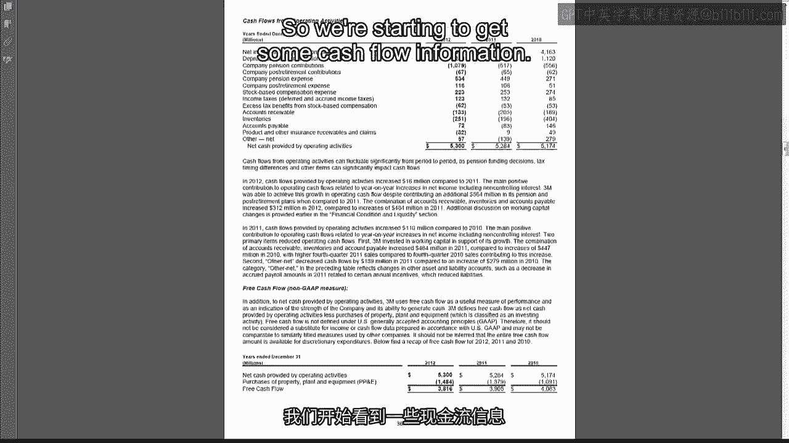

 And we're going to come back and look at these once we learn about all of these topics later。

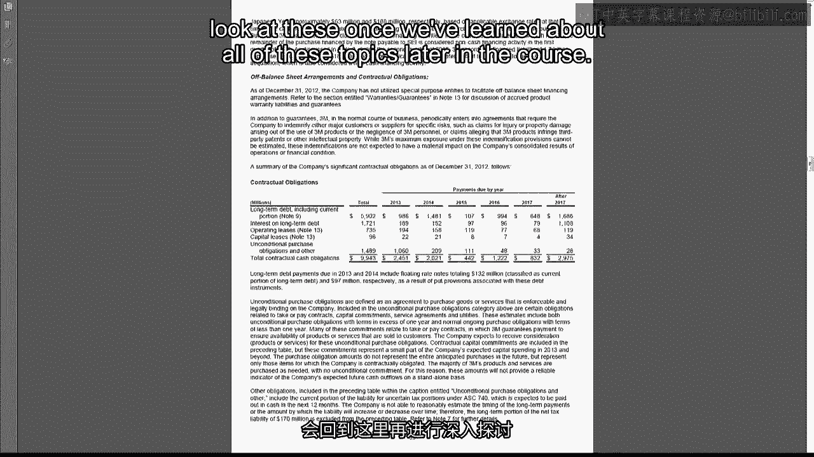

 in the course。 There's disclosures about market risk。

 And then we finally get to the financial statements which， as I said， I think are the。

 stars of the show。 Notice here that there's two pages of reports。

 six pages for the actual financial statements， and then 66 pages of footnotes。

 which right away tells you that the financial statements。

 are probably not going to have all the information we need。

 We're going to have to dive into these footnotes to really learn what we need to learn about。

 the company。 And so we're going to be doing a lot as we go through the course is looking at the details。

 in the footnotes because that's where all the action is。

 On the next page， we see two of the reports， management's responsibility for financial reporting。

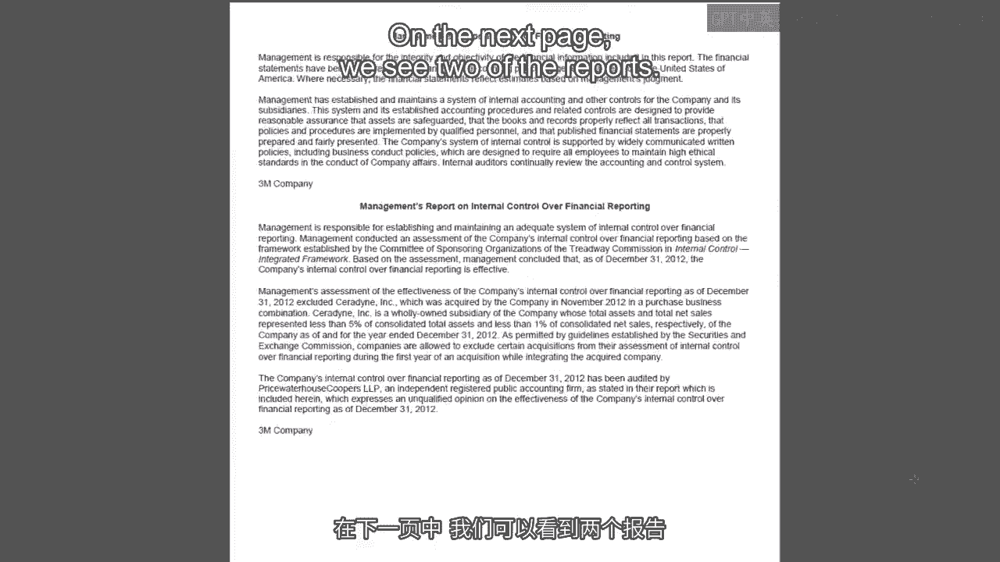

 and internal controls。 So as we talked about in earlier lectures。

 management is responsible for putting together， the financial statements。 Now， of course。

 we hire an auditing firm， public accounting firm， to provide， as they。

 say， an opinion。 So the auditing firm says， in our opinion。

 the consolidated financial statements listed， in the accompanying index present fairly in all material respects。

 the financial position， of 3M Company， an subsidiary， it's at December 31， 2012 and 2011。

 and results of operations， and cash flows for the three years ended， December 31， 2012。

 in conformity with accounting principles， generally accepted in the United States of America。

 I want to jump in here to point out what the auditor is actually saying here。

 They're not saying we are giving you an ironclad guarantee that 100% of the things in this。

 statement are completely accurate and true and you can bet your life on them。 Instead。

 they're saying in our opinion， these financial statements present fairly in all， material respects。

 the financial position， results of operations， in conformity with， US GAAP。 In other words。

 we've gone and looked at some of the big things that they're doing。

 They seem to be following the rules， at least in our opinion。

 So as we've talked about in earlier videos， the auditors give us a little bit of insurance。

 but we still need our own healthy dose of skepticism when reading these statements because。

 we cannot fully rely on what the auditors have done in terms of guaranteeing the accuracy。

 of everything in these statements。 The rest of the report talks about internal controls。

 Thanks to Enron and the Sarbanes-Oxley Act， there's a lot of focus now on internal controls。

 that have companies have。 have to audit the internal controls。 It's a big part of the job。 It's not。

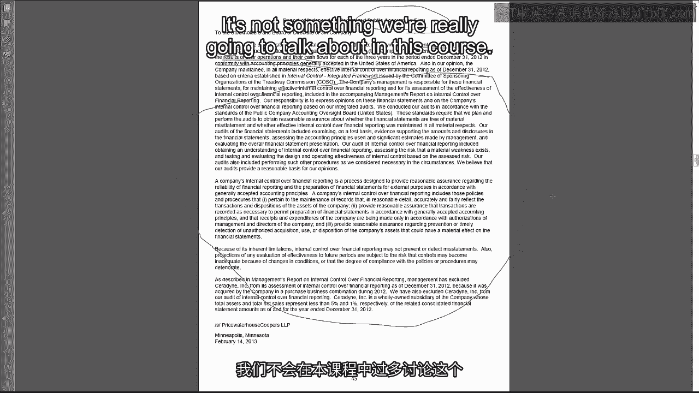

 something we're really going to talk about in this course。 Then we see the。

 income statement， balance sheet， statement of stockholders' equity， statement of。

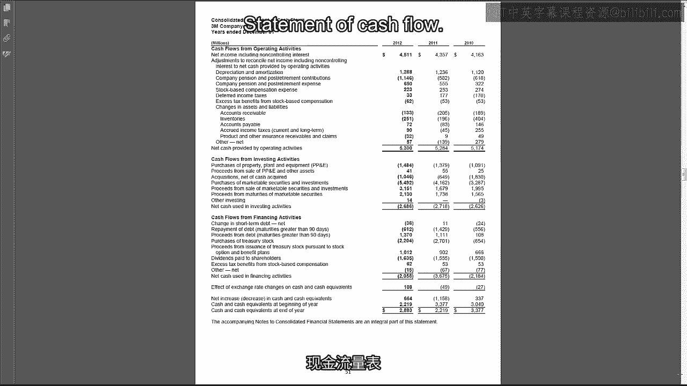

 cash flows。 We'll come back and look at these as we learn more material and then。

 the footnotes start and go on and on and on and on。 Wow， still not through the。

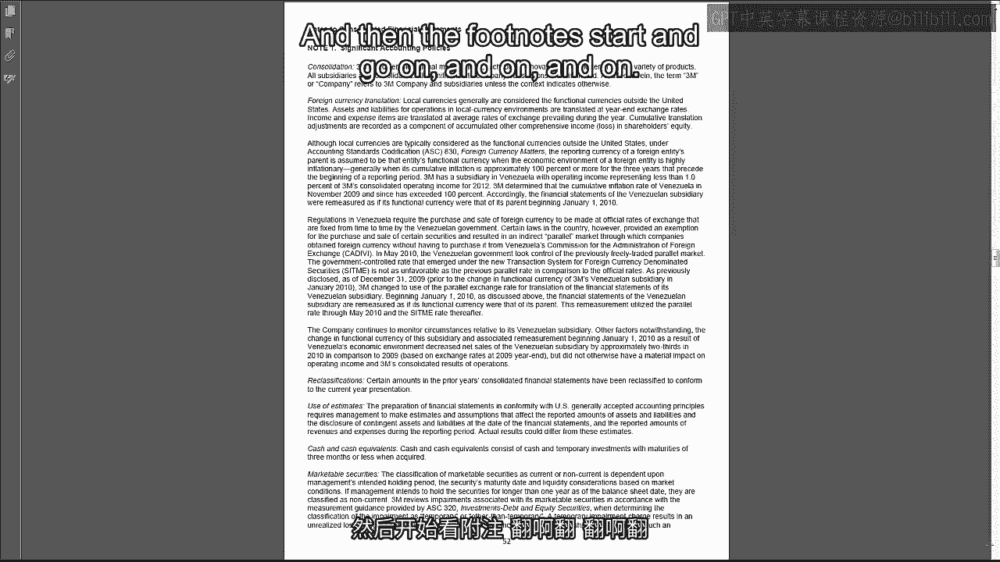

 footnotes yet。 Still not up。 Okay， went too fast。 There we go。 So the footnotes。

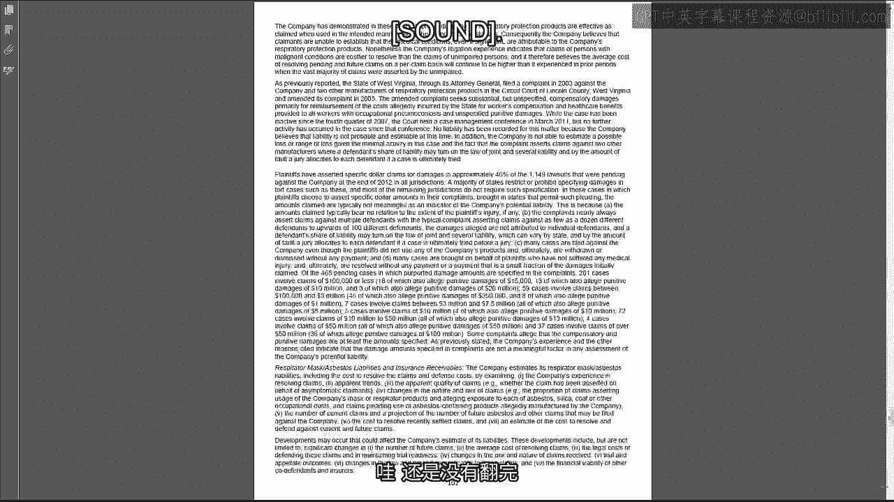

 66 pages， seems very intimidating and very daunting now， but don't worry by the， end of the course。

 you'll be able to work your way through a lot of these and。

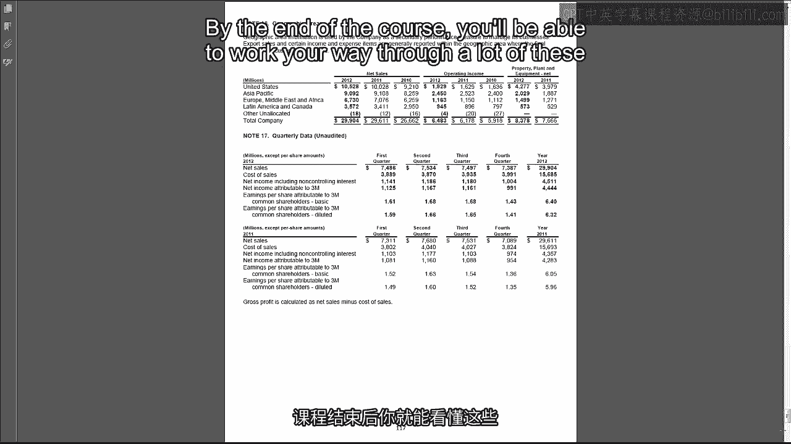

 understand what's going on。 The last parts of the report are part three， which。

 gives us the proxy information， directors， officers， comp。 We're not going to talk， about these。

 You can look through them if you're interested。 Last part is any。

 exhibits or financial statement schedules。 Most of those were incorporated。

 within the financial statements and we finally wrap up on page 124， which makes。

 this a fairly short annual report these days。 I recently used Sony's annual report。

 in my elective class and that one came in at 279 pages and I made my students。

 responsible for knowing everything in those 279 pages。 So you're getting off a。

 little bit easy here。 So that was a quick overview of the 3M and a report。 As I， mentioned。

 every week we will come back to it to try to find what we've talked。

 about during that week's video lectures in the 3M financial statements and then。

 during the last week of the course we're going to pick a different financial。

 statement and do a deep dive through that statement and try to find all the。

 things that we've learned about during the course。 So thanks for sticking with me。 I。

 realized it was probably a tough week of videos trying to get these basics down。

 of debits and credits and all the vocabulary and the counting language but。

 hopefully you stick with it。 We've got a couple more tough weeks ahead of us but I。

 think you'll find by the end of the course it'll be worth it if you stick with us。

 Hope to see you next week。