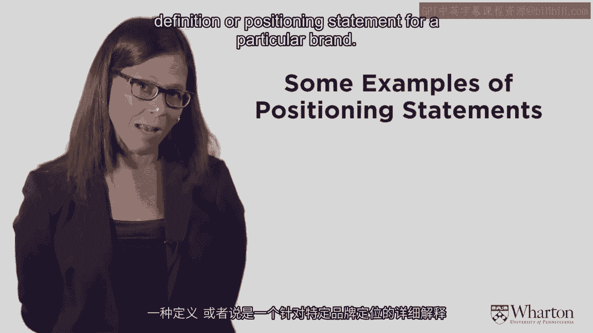
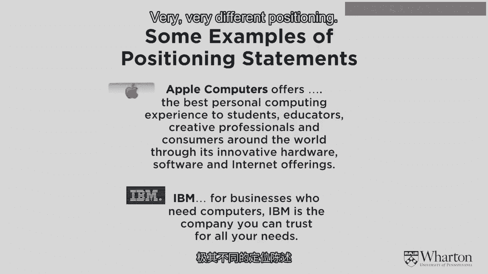
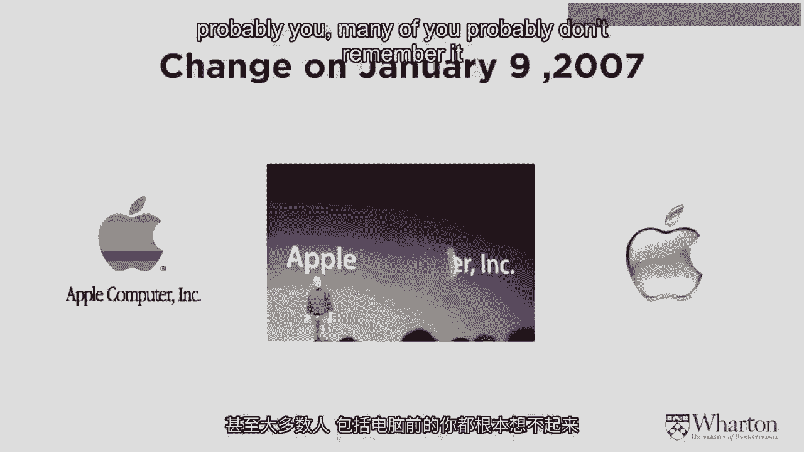
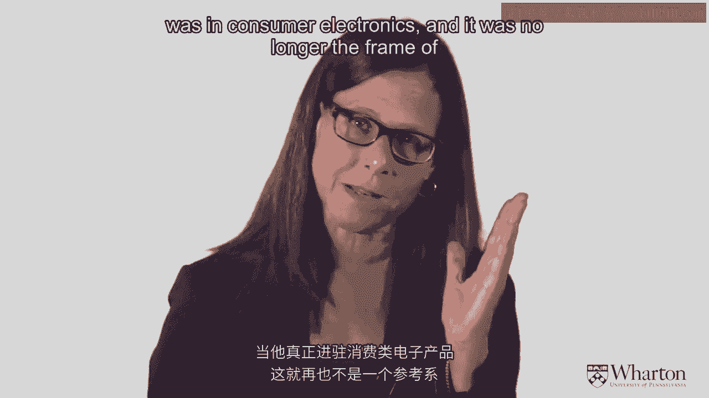
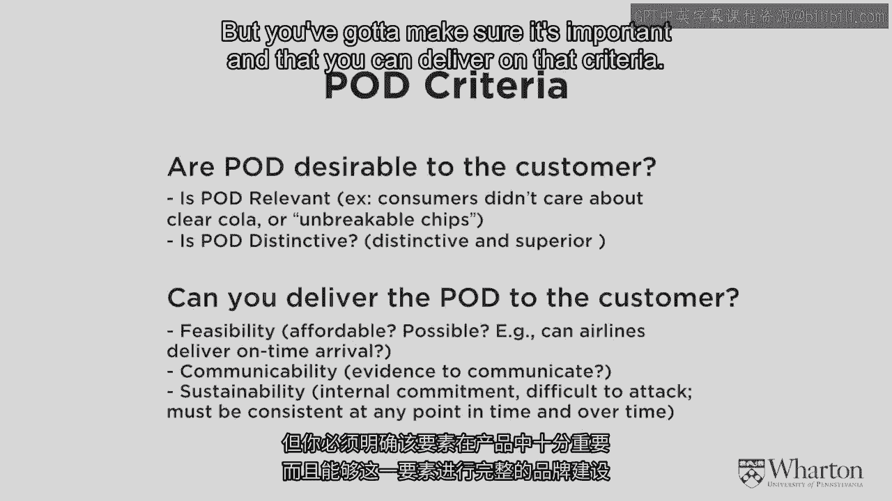

# 沃顿商学院《商务基础》｜Business Foundations Specialization｜（中英字幕） - P5：4_品牌定位.zh_en - GPT中英字幕课程资源 - BV1R34y1c74c

 [ Music ]。

 So in this section I want to finish with that， we talked about STP， we talked about segmentation。

 we talked about targeting， and now I want to talk， about positioning， that's the P。 But in thinking。

 about positioning， I really want you to think， about what is a brand。

 because one of the most important， aspects of a brand is brand positioning。

 it's also the positioning in the STP framework， but it's really the essence of the brand。

 the brand positioning。 So let's start with what is a brand。

 and then we'll get into this notion of positioning。 But just to anticipate where I'm going。

 positioning is positioning your product， to meet the needs of the target segment。

 that's the basic definition。 But one of the ways I'm going to focus on is a way。

 to do that is to brand that positioning。 And so I really want to get to this notion。

 of what is a brand。 Formally a brand is just a trademark。

 If you have a brand you want to legally protect， your brand and trademark it。

 and that's if you talk， to lawyers about a brand， they'll talk about it， as a trademark。

 But we as marketers know that a brand is way more， than just a trademark。

 People have in the past talked about brand， as a relationship or a contract。

 a promise of the company， of certain specific benefits to the customer。

 So some kind of brand relationship or branded relationship。

 And so it's much more than just the trademark。 It's a promise。 It's consistency。 It's benefits。

 It's what you come to expect from a brand。 And that's been the traditional definition。

 of what a brand is。 In today's world， a brand is a little bit bigger than that。

 Because we mentioned before， this， is a connected community， and customers。

 are talking to other customers。 Really what a brand is in the real definition of a brand。

 is whatever the customer thinks it is。 That's what the brand is。 What sits in your customers' heads。

 regardless of what you， try to put there， is what your brand actually is。

 So if you have a very strong branded message， and something like Disney。

 which is a very strong brand name， and a very clear positioning， then hopefully what。

 Disney thinks their brand is， is what the customers think it is。

 But if your message is not so clear， and you want your brand to mean something。

 but what the customers think is something different， guess who wins？ It's the customers。

 That's what your brand is， what sits in the customer's head。

 And so a lot of what marketing is and understanding。

 about brands is to do market research to understand， how customers do think about your brand。 Now。

 what we're talking about the notion of positioning。 And so a positioning statement is a definition。

 or a positioning statement for a particular brand。

 I have here two examples of positioning statements， for two brands of personal computers。

 These are a little bit old。 It's when Apple and IBM were really focusing， on personal computers。

 But I want to use these examples because they're， very clear， crisp positioning statements。

 And I think we can learn a lot by understanding， these positioning statements。

 So let's look first at Apple Computer's Positioning Statement。 And if we read that。

 it says Apple Computer offers， the best personal computing experience， to students， educators。

 creative professionals， and consumers around the world through its innovative hardware， software。

 and internet offerings。 That's one positioning statement。 Compare that to IBM， which was very。

 very different at the time。 IBM is for businesses who need computers。

 IBM is the company you can trust for all of your needs。

 Very， very different positioning。 That is a really good positioning statement。

 when one company can be so differentiated， from the other company。

 they're going after different target， segments， and it should be quite clear。

 by the positioning statement。 Let's break that positioning statement into its parts。

 so that we can understand what a good positioning statement has。

 And let's focus here on the Apple Computer。 There's three pieces to the positioning statement。

 There's who is the target segment？ What is the point of difference that they're offering。

 to that target segment？ And then there's what is the frame of reference？

 And the frame of reference is who are the other competitors， that they are comparing themselves to？

 The target segment here， and if you think about Apple， the target segment is students， educators。

 creative professionals。 A brand should have a crisp target segment。

 even if that's not the only people who use the product。 So nowadays。

 Apple's so popular that everybody has an Apple。 Your grandmother has an Apple。

 Somebody who's not a student has an Apple， not just creative people anymore。 Yet。

 even though Apple's are ubiquitous， and lots and lots of people have Apple products。

 still its position to creative people。 It's a very design-y brand。

 So it still has a very clear target segment， even if that doesn't limit who might use the product。

 It has a point of difference。 What's the point of difference for Apple？ It's innovative。

 Apple offers state-of-the-art products。 We look for design and innovation from Apple。

 So that's its point of difference。 And in this case， what's the frame of reference？

 In this particular positioning statement， it's other personal computers。

 personal computing experience。 So you have these three pieces to a strong positioning， statement。

 the target segment， the point of difference， and the frame of reference。

 And positioning is defining the value proposition， in these three terms， the target market。

 the point of difference， and the point of parity。 Now you can play around with this。

 And if you think about this and get into it a little bit。

 you may realize that your point of difference， is going to be relative to the frame of reference。

 So for example， let me give you an example of--， this product isn't on the market anymore。

 but it's-- crest made this chewing gum。 If the crest chewing gum was referred to。

 the frame of reference was other toothpaste products， then crest chewing gum's point of difference。

 is it's a toothpaste product that's in gum form。 On the other hand， if you take crest chewing gum。

 and compare it as a frame of reference to other chewing， gums。

 the point of difference is this is a chewing， gum that has toothpaste in it。

 So these two things go together， and part of the art of coming up with a good positioning。

 is figuring out who's the right target market to go after， and also what's the frame of reference。

 and what's going to be your point of difference。 And playing around with those two pieces。

 is a lot of the art of positioning。 Very important concept， but you really。

 need to understand these three ideas--， target marketing， point of difference。

 and frame of reference， or point of parity。 And what you're going to do is， once you。

 decide on your positioning statement， you use all of the elements of the marketing mix。

 that we've already talked about-- product， price， promotion。

 and place-- to position your product to meet， the needs of the target segment。

 And positioning should be clear and simple， and focus on a few key benefits。

 Sometimes people talk about this as a unique selling proposition。 The position must be defensible。

 so you want to take a positioning that you own， and that other people can't copy very easily。

 And the really important thing is you cannot be everything， to everyone。 If you do that。

 you have no position。 You must make choices。 You must focus。 You must choose a target segment。

 You must choose a point of difference。 You must choose a frame of reference。

 to have a clear positioning。 Because if you try to be everything。

 you're going to end up being lukewarm tea。 And that is not a good brand positioning。 Positioning。

 once you have the good brand positioning， that should determine what products you develop。

 And positioning is a strategic idea。 So you really want to think about this。

 in terms of what your target segment， what a customer's want， what your competition。

 what is your position relative， to the competition。 All of that is a big picture strategic vision。

 That is distinct from messaging。 Messaging is tactical。 Once you have your brand positioning。

 you can decide things like what color should the brand be， or what should the symbol be。

 or what should the logo be。 And we're going to talk about those in the third section。

 of my part here。 But that's very much tactical and messaging。

 Positioning at the level-- I'm talking about it right here--， this is very much a strategic idea。

 And a very important piece of this， is this point of parity or frame of reference。

 These are-- so I want to spend a little bit more time。

 thinking about this just so that you understand。 It's a part of the positioning statement。

 but it's associations that are not unique to the brand。 They are these frame of reference。

 They are associations that are shared with other brands。

 And you want to think about these points of parity， as things that are necessary for the category。

 So something a brand must have to be considered， in this frame of reference。 So for example。

 if your frame of reference， is a grocery store， then people， think in order to be a grocery store。

 it has to have produce or it has to have fresh product。 That's what a grocery store is。

 And if it doesn't have that， it's not a grocery store。 So one of the things you think about。

 in terms of these points of parity， are what are the conditions that your brand must have。

 that they share with the competition to be part of that set。

 And then you want to think about points of parity。

 sometimes as ways to negate a competitor's point of difference。 So for example， in toothpaste。

 when one of the brands--， and I can't remember which one--。

 first came out with fluoride and as a cavity preventer， and that was a differentiator。

 All of the other brands copied and put fluoride in their toothpaste。

 Suddenly it's a frame of reference。 It's a point of parity。 All toothpaste now has fluoride。

 So what I've done is negated the point， of difference of the first innovator who came out。

 with fluoride toothpaste。 I have a slide up here on January 9， 2007， a few years ago。

 When Steve Jobs is still here， he used to go out on January。

 and come up with some big innovation every year， and announcement about Apple。 On January 9， 2007。

 one of the big announcements at the time， was that he changed the name from Apple Computer to just Apple。

 And now it's been a while。 And so people are very used to thinking about it as Apple。

 And probably many of you don't even remember it used， to be Apple Computer。

 But the point I'm making here is when， he changed the name of the company， think about。

 just for a second to see if you get this idea， which one of the three aspects of the brand positioning。

 did he change？ Did he change the target segment？ Did he change his point of difference？

 Or did he change his frame of reference？ It should be clear， he changed his frame of reference。

 Target segments still create of young people， point of difference still innovation。

 But now the frame of reference is not computers， but it's consumer electronics。

 And I believe when he made this change， was the same time he introduced the iPhone。

 And he really was in consumer electronics。

 And it was no longer the frame of reference， comparing to other personal computers。

 The point of difference， I think， is more clear to people， what that is。 It's strong， favorable。

 unique brand associations。 Some people talk about this as a unique selling proposition。

 It's a similar concept。 And what you wanted to do is to have it be sustainable。

 You want a competitive advantage， a point of difference， that you can hold。

 and that is difficult for competition， to copy。 And it can be a lot of different things。

 It can be product attributes， performance attributes。 It can be imagery。 It can be benefits。

 It can be design。 It can be anything that you can own， and that really differentiates your brand。

 When you're choosing a point of difference， you want to make sure that it's desirable to the customer。

 Is it relevant？ Is it distinctive？ You also want to make sure that you can deliver these things。

 Don't over promise。 Don't say something that's not feasible。 That's not sustainable。

 So in choosing a point of difference， it's very， very critical。

 It's probably going to be the reason people choose your brand。

 But you've got to make sure it's important， and that you can deliver on that criteria。

 [MUSIC PLAYING]， [MUSIC PLAYING]。

 [MUSIC]。

