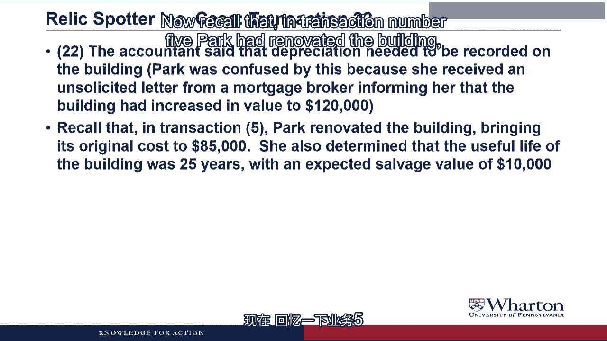

# 沃顿商学院《商务基础》｜Business Foundations Specialization｜（中英字幕） - P61：13_2 4 1 文物寻宝案例部分 4a.zh_en - GPT中英字幕课程资源 - BV1R34y1c74c

 Hello， I'm Professor Brian Buchay。 Welcome back。 In this video。

 we're going to take what we learned about adjusting entries and apply。

 them to the Relic Spotter case。 Let's get started。

 In prior videos， we did all 20 transactions that occurred during Relic Spotter's first。

 six months of operations。

 Now it's 5 p。m。 on the last day of the fiscal year， December 31。

 We're not going to record any more transactions without CIDERS。

 But before we put together the financial statements， we have to record the internal。

 transactions or adjusting entries。

 As in prior videos， I want to try to record the journal entry and post a T account for。

 each required adjusting entry。 I will again put up the pause sign so that you can try the journal entry yourself before。

 I reveal the answer。

 Transaction 21。 When Park called her account on December 31， 2012。

 she was pleased to tell them that。

 the company had 78，800 in cash。 By the way， before I go on， if we pull up the cash T account。

 add it up the debits， add it。

 up all the credits， you could see that the balance is 78，800。

 That's not going to change because all of these adjusting entries will not involve cash。

 We'll be back to the transaction。 Park wanted to go out and celebrate。

 but the account reminded her that she needed to stay。

 in to do adjusting entries。 For example， even though it wasn't paid in cash。

 a crude interest on the mortgage was。

 $4，900。

 The adjusting entry here is that we have to recognize interest expense that we've incurred。

 by having the mortgage outstanding during the year。

 To create an expense， we're going to debit interest expense for 4900， which is the number。

 provided in the transaction。

 And we're going to have to recognize a liability because we have an obligation to pay the bank。

 cash for this interest sometime in the next period。 So we create the liability with a credit。

 Credit interest payable for 4900。

 What does the word accrued mean？ And why is this an expense if the bank hasn't made us pay the interest yet？

 Let me check my dictionary。 Accrued means to accumulate， grow or increase as interest on money。

 And that's exactly what happened here。 The loan was outstanding for eight months。

 And so the interest accumulated or grew or accrued for eight months。

 Even though we haven't paid that interest in cash， we have to expense it because the money。

 was outstanding during this period。 So that interest cost is a cost of doing business this period and we need to match that cost。

 to the revenue we generated。 So we need an expense which we create through the adjusting entry。

 Then we need to post this to T-accounts so we create an interest payable liability。

 This will go on the balance sheet to show that we have this obligation to pay interest。

 in the future on the end of the year。

 And we create an interest expense to recognize that one of the costs of doing business this。

 period was that we've incurred interest costs。

 Transaction 22。 The accountant said that depreciation needed to be recorded on the building。

 Park was confused by this because she received an unsolicited letter from a mortgage broker。

 informing her that the building had increased in value to $120，000。

 Now recall that in transaction number five Park had renovated the building bringing its。

 original cost to $85，000。

 She also determined that the useful life of the building was 25 years with an expected。

 salvage value of $10，000。

 So for the adjusting entry， remember the format that we use for depreciation expense。

 We debit building depreciation expense for $1，500。

 We debit the expense to create it。 And then we credit accumulated depreciation。

 It's the contra asset where we're going to store up the depreciation over time。

 Now where we get the $1，500 is we take the difference between the original cost of $85，000。

 and the salvage value of $10，000。 So that $75，000 we're going to depreciate over time divided by 25 years of life would。

 be 3，000 of depreciation per year。 It hasn't been a year yet。

 The business has only been open six months。 So we take half a year to get the $1，500。

 The building was purchased in April and during the day。

 Why are we recording only six months of depreciation？

 You are correct since we finished the building seven months ago we could have recorded seven。

 months of depreciation。 But I chose to do six months because relic spotters only been open for six months and。

 I'm trying to match the cost of the building with the revenue we generated。

 Plus the math was a lot easier with six months rather than seven months。

 And what about the letter from the mortgage broker？ If his building is worth $120，000。

 why are we depreciating it？ For non-financial assets like buildings。

 we use an accounting method called historical， cost or amortized cost。

 What this means is that if the value of the building goes above what is listed on the。

 balance sheet， we never write it up。 But if the value of the building drops below what it is on the balance sheet。

 we write it， down。 This is an example of the conservative。

 I mean the non-aggressive nature of accounting where。

 we tend to err on the side of objectivity or reliability。

 Because if we allowed managers to write up something that's hard to value like a building。

 there'd be too much opportunity for manipulation so we only allow them to write it down in value。

 And I don't know what the specific principle is called in accounting， but we never rely。

 on values from unsolicited letters or mortgage brokers， which is probably a life lesson that。

 you should carry out beyond this course。 We post this journal entry to T-accounts。

 We create a T-account for cumulative depreciation as a contra asset。

 It is a credit balance and then a T-account for building depreciation expense。

 Transaction 23。

 The accountant also noted that Park needed to record depreciation on the metal detectors。

 Recall that in transaction number six， Park purchased $120，000 of metal detectors。

 She determined that they would only last for two years at which time they'd have no remaining。

 value。

 The metal entry has the same format as the last transaction。

 We debit metal detector depreciation expense to create the expense。

 And we credit accumulated depreciation to increase the contra asset where we store up depreciation。

 over time。 Where do we get 30，000 from？ The metal detectors originally cost 120，000。

 They have no salvage value， so we're taking that entire 120，000， spreading it over two。

 years to get 60，000 per year。 But it's only been half a year。

 so the amount that we depreciate is 30，000。

 So why do you have separate accounts for building and metal detector depreciation expense？

 But you only have one account for accumulated depreciation？

 You'll see why when we get to the video on financial statements。 But as a little preview。

 what you'll see is when we do the income statement， building。

 depreciation expense and metal detector depreciation expense are going to go into different parts。

 of the income statement， so we need to keep track of them and separate accounts。

 But when we do the balance sheet， there's just going to be one line for all of the accumulated。

 depreciation so we can throw it all into one account。

 We post this to T-accounts by putting another credit entry and accumulated depreciation and。

 creating a T-account for metal detector depreciation expense。

 Transaction 24， the accountant-， Thank you for reminding me about the land。

 There's a long-standing tradition in accounting where we don't depreciate land。

 We don't assume that land is systematically used up to generate revenue。

 So as long as the value of the land is at or above what it's carried on the balance sheet。

 we just leave it at its original cost。 But if the value of the land dropped below what it was on the balance sheet。

 we would， write it down to that value， but we wouldn't systematically depreciate it over time。

 That's why when we originally bought the land and building together， we had to separate how。

 much of the value was from the land and how much was from the building。

 The amount of value from the building is hitting the income statement over 25 years as it's。

 depreciated， whereas the value that's put in the land account will never hit the income。

 statement as long as the value of the land stays at or above that level。 Let's try this again。

 Transaction 24， the accountant continued。 What about adjusting the software amortization account？

 Recall that in Transaction Number 8， Park paid the $2，100 three-year software license fee on。

 June 30th。

 When the software is an intangible asset， we're going to use the term amortization instead。

 of depreciation。

 So we're going to debit software amortization expense for $350。

 And then because it's amortization， I'm going to credit the software account directly。

 to recognize the amortization。 Where does the $350 come from？

 Well we paid $2，100 for a three-year license， so that $700 per year of amortization。

 It hasn't been a full year， so we take half a year of that to get $350。

 Wait， why do you reduce the software account directly instead of creating an accumulated。

 data acquisition account？ Yeah， as I mentioned in a prior video。

 the historical tradition is that for amortization。

 we just reduce the intangible asset account directly instead of creating a separate accumulated。

 amortization account。 And I think historically we've done that because intangible assets have not been that。

 big of a deal on the balance sheet。 But nowadays， more and more companies are starting to have larger and larger intangibles。

 And you will see more and more accumulated amortization accounts。

 But I wanted to show you the old-fashioned way because you still will see this practice。

 quite a bit of just directly reducing the intangible asset account instead of creating。

 an accumulated amortization。 But you can see it either way。 We post this one of T-accounts。

 We directly reduce the software account with a credit and then we debit a software amortization。

 expense account。 Wow， we've only done four of the eight adjusting journal entries for a relic spotter and we've。

 already recorded 12 minutes of video。 I guess the virtual students have a lot to say today。

 So I'm going to end the video here and then we'll pick up in the next video with the last。

 four adjusting journal entries for a relic spotter。 I'll see you then。 See you next video。

 [ Silence ]。