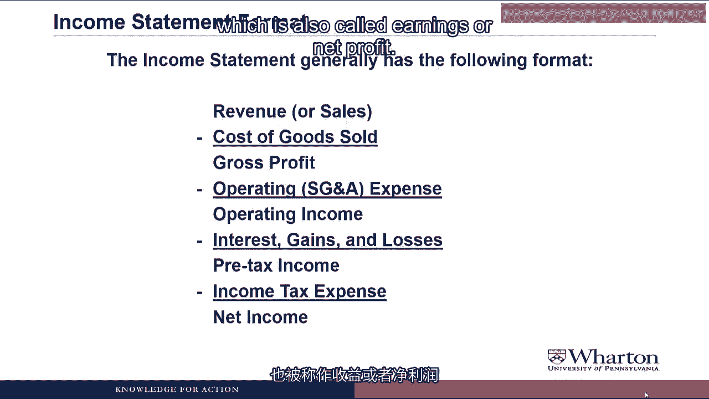
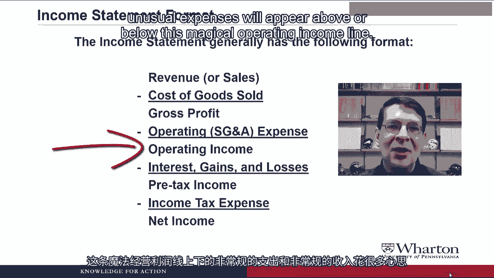
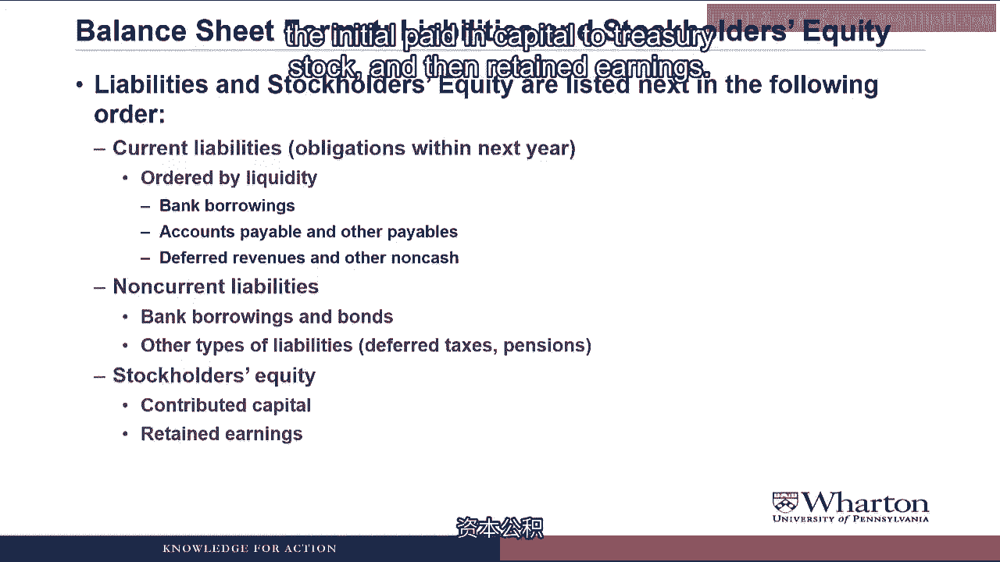
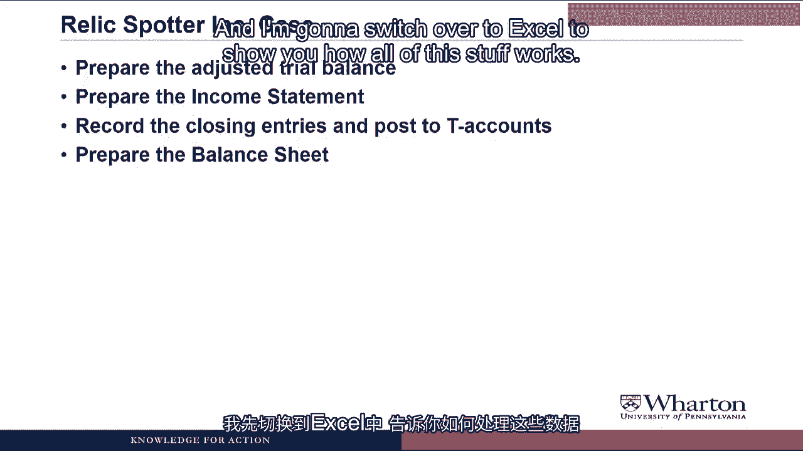
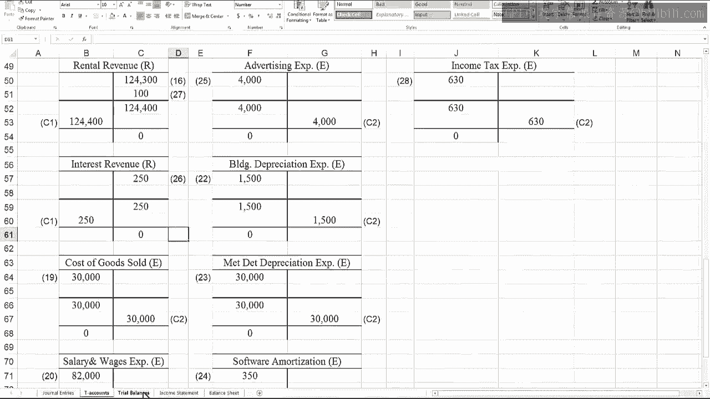
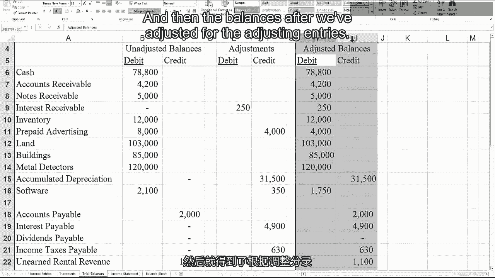
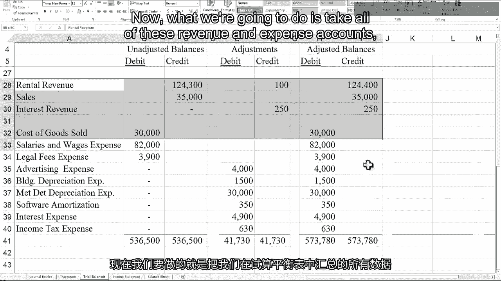
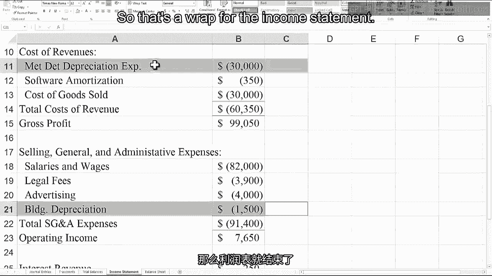
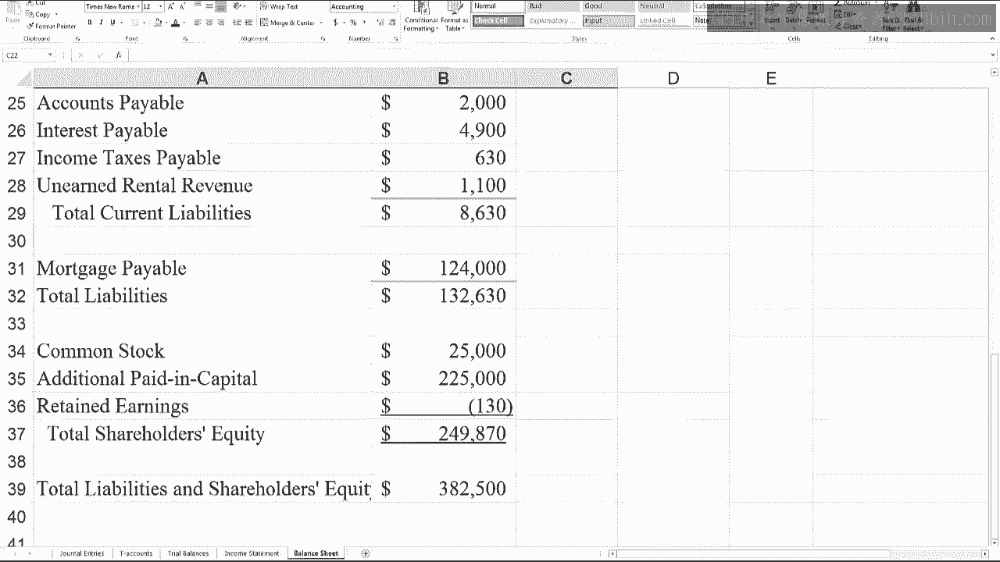

# 沃顿商学院《商务基础》｜Business Foundations Specialization｜（中英字幕） - P63：15_2 5 财务报表和期末分录.zh_en - GPT中英字幕课程资源 - BV1R34y1c74c

 Hello， I'm Professor Brian Boucher。 Welcome back。 In this video。

 we're going to go to the last two stops on the accounting cycle， financial。

 statements and closing entries。 Then we'll go right into the relic spotter case and do the balance sheet and income。

 statement and closing entries for relic spotter。 Let's get started。 Last video。

 we completed the adjusting entries for relic spotter。

 Now we can move on to the next two steps in the accounting cycle， putting together an。

 adjusted trial balance and preparing financial statements。

 The adjusted trial balance is we just add everything up after doing adjusting entries。

 and make sure our debits equal our credits。 Then we're going to use those balances to put together financial statements。

 We're going to do the income statement first。 Then we can use that income to update retained earnings and prepare the balance sheet。

 And then finally， we'll complete the statement of cash flows and the statement of stockholder。

 equity。 Are you ever going to cover the statement of stockholder's equity？ You keep putting it off。

 Yes， I will eventually cover the statement of stockholder's equity， but I'm not going。

 to tell you when。 You need to keep watching the videos because you never know when it's going to finally。

 appear。 The income statement generally has the following format。

 And I say generally because there's no hard and fast rules on how the income statement has， to look。

 but what you're going to see is the most common format used by companies。 On the top line。

 we have revenues or sales。 And this is going to be revenues or sales from whatever you define as your core business。

 So when we get to relic spotter， it will be rental revenue for metal detectors and the。

 sales of sundries。 Then we subtract cost of goods sold to get gross profit。

 Cost of goods sold is the product costs or the direct costs of producing this revenue。

 And then gross profit then would be interpreted as the markup over the product costs。

 Then we subtract operating or SG&A expense to get operating income。

 SG&A stands for selling general and administrative。 These are all the period costs。

 all the other costs of running the business。 Operating income would be a picture of the profitability of the core business。

 It helps answer the question of whether the company price their product or services high。

 enough to cover all the product and period costs of delivering those goods or services。

 After operating income， we subtract any interest expense or interest income and then we adjust。

 for gains or losses。 Gains or losses we haven't talked about yet。

 but they're like revenues or expenses except， they don't come from your core business。 For example。

 if relic spotter sold their building and had a gain， we would put that gain。

 here because they're not in the business of selling buildings。 After you make those adjustments。

 you get pre-tax income。 Then you subtract income tax expense to give you bottom line net income。

 which is also called， earnings or net profit。

 You know， I always hear my boss talking about things being above the line or below the line。

 Is that magical line on this income statement？ Yes， that magical line is operating income。

 Most investors and analysts use operating income as a key measure of the performance of the。

 core business。 So if the company has some kind of unusual expense。

 managers will see is there any way， that they can move it below the operating income line so that the performance of the。

 core business looks better。 So， yeah， managers spend a lot of time worrying about whether unusual gains or unusual expenses。

 will appear above or below this magical operating income line。

 For the balance sheet format， assets are listed first and they're listed in the following order。

 First we see current assets。 These are assets that are going to provide benefits within the next year。

 And they're ordered by liquidity， which is how readily they can be converted to cash。

 So we always see cash come first， then accounts receivable， inventory， and then any prepaid。

 assets which actually never convert to cash。 They're just deferred expenses。

 Then we have non-current assets， including the tangible assets， the property plant equipment。

 and then the intangible assets which would be things like software， trademarks， or this。

 thing called Goodwill which we get from an acquisition。 And we'll talk about later in the course。

 Then come liabilities and stockholders' equity。 Starting with current liabilities which are obligations within the next year。

 Again， ordered by liquidity， so we'll see bank borrowings， accounts payables and other， payables。

 and then deferred revenues and other non-cash current liabilities last in， the section。

 Then we'll have non-current liabilities。 These are liabilities that are due beyond a year。

 So longer term bank borrowings and bonds。 And then other types of liabilities like deferred taxes which we'll talk about later。

 And pensions。 Then we have stockholders' equity where we start with the contributed capital， so the。

 common stock， the additional paid in capital， the treasury stock， and then retained earnings。

 Hmm。

 I guess the virtual students went out for virtual coffee。 Oh well， let's continue。

 When we finish the financial statements we're ready for the last stop on the accounting。

 cycle which is closing entries。 This allows us to get ready to start a new period so that we can do the cycle over and。

 over and over and over and over and over again for the whole life of the company。

 Closing entries involve closing temporary accounts。 What's a temporary account？

 It's an account that accumulates the effects of transactions only for a certain period of。

 time so either fiscal quarter or fiscal year。 These would be the revenue and expense accounts which then get closed out to retained earnings。

 at the end of the period。 Permanent accounts are the accounts that accumulate the effects of transactions over the life。

 of the business。 These would be the balance sheet accounts like assets， liabilities。

 contributed capital， and retained earnings。 The actual closing entries are internal transactions that zero out temporary accounts at the end。

 of the accounting period。 Again， by internal transactions we mean this is the accountant sitting at his or her desk。

 These are not transactions with outsiders。 And the goal is to transfer the balances in the revenue and expense accounts and retained。

 earnings。 So the way the entries look is for revenues we want to zero out the revenue account。

 Revenue accounts have credit balances so if we debit them we're going to zero them out。

 And then we credit retained earnings which moves the balance from revenue into retained， earnings。

 For expenses expenses have debit balances。 To zero them out we want to credit them so we credit expense accounts and debit retained。

 earnings。 And notice in both cases we're not creating any new stockholders equity we're just transferring。

 it from one type of account to another from the temporary accounts to the permanent account。

 retained earnings。 Then my grandpa tried to teach me accounting when I was five。

 He said something about an income summary account as part of closing entries。 Where is it？

 Hey that happened to me also。 Yeah， there are still some textbooks that use income summary accounts。

 This is a very temporary account and what happens is you close the revenue and expense。

 accounts in the income summary and then you close income summary into retained earnings。

 With the net effect being that there's only one entry that goes into retained earnings。

 instead of the two that we used in our approach。 But you get to the same place so it really doesn't matter which approach you use。

 I like not using the income summary approach because it's just more straightforward and。

 not create a new account。 After the closing entries we do a post closing trial balance so we add everything up to make。

 sure our debits equal our credits。 At this point only the permanent account should have balances。

 all the revenue and expense， accounts should have a zero balance and now we're ready to start the next period。

 We're going to do to finish up the relic spotter case is we're going to prepare the adjusted。

 trial balance， put together an income statement， record the closing entries and post them to。

 the T accounts and then prepare the balance sheet。

 I'm going to switch over to Excel to show you how all this stuff works。

 We go back to a page of T accounts and we have more things filled in so accumulated depreciation。

 is now filled in after the adjusting entries。 We can see the adjustment to the software account that we made and then for expenses and revenues。

 we have more than filled in so again like building depreciation expense， interest revenue filled。

 in through the adjusting entries。

 Then we go to our trial balance spreadsheet and we put in the debits and credits for all。

 the adjusting entries and then the balances after we've adjusted for the adjusting entries。

 As we put everything in move of the balances over， we want to make sure that for just the。

 adjustments alone our debits equal our credits which they do and the balances after doing。

 adjusting entries are debits equal our credits。 We haven't made any mistakes we're fine at this point。

 Now what we're going to do is take all of these revenue and expense accounts which are。

 summarized right here on the trial balance worksheet and put them in the income statement。

 format。 So we start out with relic spotters income statement for the year ended December 31 2012。

 and it's important to note that it's for an entire year because income statements are。

 always for a period of time。 We have to let people know what the period is。

 For revenues I've split the revenues into two categories rental revenue and sales of。

 sundries that's because relic spotters has two lines of business and so we want to highlight。

 the revenues from the two different lines。 Then we need the cost of revenue so these are like the product costs。

 Cost of goods sold of course matches up with the sundry sales but what was tricky is to。

 figure out what's the cost of goods sold for rental revenue which is essentially a service。

 What I decided was the direct cost of providing that service was the metal detector depreciation。

 expense and the software。 So included those in cost of revenue to get gross profit which is the markup over cost。

 that we got in our revenue。 Then we take off selling general and administrative expenses so these are the period costs salaries。

 and wages legal fees advertising and building depreciation gives us total SGA and then our。

 operating income and operating income is the profitability of our core business was the。

 pricing of our product and service high enough to cover all the product costs for our core。

 business and all the period costs and in this case it was。

 Then below the operating income line we have interest revenue and interest expense。

 We don't put interest revenue on the top line because our core business is not making loans。

 we're not a bank so we put it below operating income and then interest expense typically。

 goes below operating income as well。 That gives us pre-tax income we subtract income tax expense and we have a net income of 2370。

 One more thing I want to point out before we leave the income statement is I separated。

 depreciation expense into two buckets the metal detector depreciation expense is part。

 of the direct cost of providing the rental service whereas the building depreciation is。

 part of the selling and administrative function and so you'll see this a lot where depreciation。

 may need to be put in two different categories because it's going to show up in two different。

 places on the income statement。 So that's a wrap for the income statement。

 I guess I should have let the virtual students know that they're allowed to drink virtual。

 coffee in the virtual classroom so that they could have come back in time to see the closing。

 entries in balance sheet for relics Potter。 Oh well at least you get to see it。

 To see how the closing entries work let's go back to our T accounts。

 So if we look at something like rental revenue after we did our adjusting entries and of course。

 the entry during the period there was a credit balance of a hundred and twenty four thousand。

 four hundred。 What the closing entries going to do is debit rental revenue so that the balance is zero。

 If we look at advertising expense after doing the adjusting entry the balance was four thousand。

 that went on the income statement。 The closing entry is going to credit advertising expense for four thousand which will zero it。

 out。 So we do that for all the T accounts and we get these two big whopping journal entries。

 So for the closing entries for revenues we debit all the revenue accounts which is going。

 to zero them out and then we add them up and credit the balance to retained earnings。

 For expense accounts we credit all the expense accounts to zero them out total them up and。

 then that's the debits retained earnings。 So if we go back over to our retained earnings T account here's the closing entry that transfers。

 all the revenues into retained earnings。 Here's the closing entry that transfers all the expenses into retained earnings。

 Now those expenses and revenues are going to live in retained earnings forever。

 We can come up with a final balance for tain earnings which is a debit balance of one thirty。

 So even though we had positive net income we had more revenues than expenses we paid。

 that big dividend and the dividend was bigger than our net income so we have a debit balance。

 We have negative retained earnings。 That's okay remember retained earnings is one of the few accounts that can have it either。

 a debit or credit balance。 After posting everything to T accounts we can go back to our trial balance worksheet where。

 we add a couple columns for the closing entries and the post closing trial balances。

 Notice for the permanent accounts you have the post closing balance is the same as the。

 adjusted balance because we didn't do anything。 The only permanent account that's affected of course is retained earnings and then the。

 closing entries also operated on revenues and expenses。

 And if you look at the post closing trial balance you see that now all the revenue and。

 expense accounts are at zero and it was retained earnings was the only balance that was affected。

 by this process。 Now we're going to take all the balances of the permanent accounts and put together a。

 balance sheet。 So we have the relic spotter incorporated balance sheet。

 Notice a balance sheet is a point in time so we have December 31， 2012。

 We start with assets and list all of our current assets in order of liquidity。

 Then we follow up with tangible assets and this is the typical treatment where land building。

 and metal detectors are listed at their original cost and then in one line item we subtract。

 the accumulated depreciation to report something called net property plant equipment。

 I've always found this a little misleading because we're really not depreciating land。

 but it looks like we are but hey we've done this way for 4th century so who am I to complain。

 Anyway then we have the intangible assets like software and that will give us total assets。

 For liabilities and stockholders equity we have the current liabilities so the obligations。

 in the next year ordered by liquidity。 Non-current liabilities so liabilities beyond a year。

 For stockholders equity we have common stock and additional paid in capital and then retained。

 earnings which I don't know we may want to call accumulated deficit since it's negative。

 but I guess it's okay to call it retained earnings as well。

 Gives us total stockholders equity and then our total liabilities in stockholders equity。

 equals our total assets and we're done with the balance sheet。

 In future videos later in the course we will continue with relic spotter to put together。

 a statement of cash flows and then eventually we'll talk about a statement of stockholders， equity。

 And with that we wrap up the basic building blocks section of the course。

 All of the things that we've learned so far we're going to use over and over and over and。

 over again on more advanced accounting topics。 The next step is to put together a statement of cash flows for relic spotter but that's。

 going to take about a week of videos to learn how to do。

 So why don't we stop here and I will see you next week。 See you next video。 [BLANK_AUDIO]。

