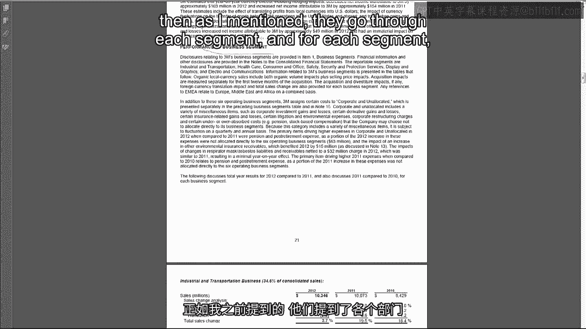
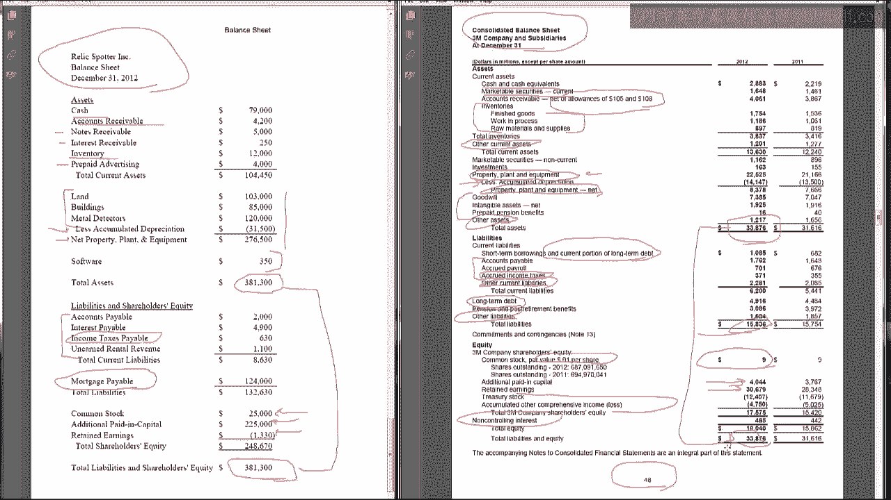
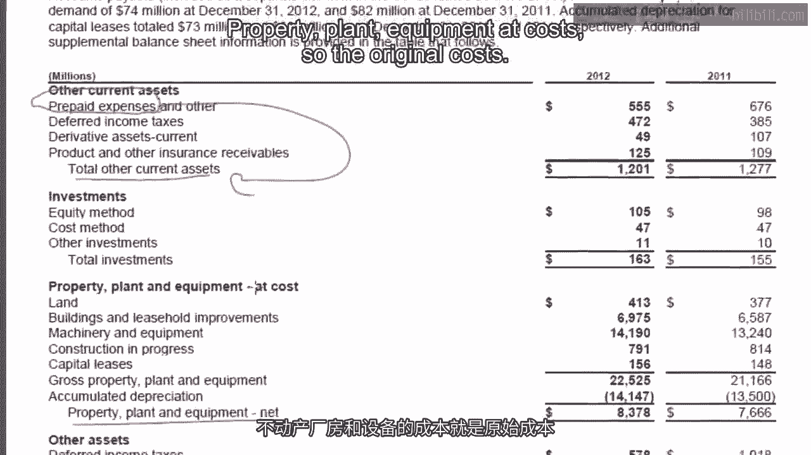

# 沃顿商学院《商务基础》｜Business Foundations Specialization｜（中英字幕） - P64：16_2 6 3M公司利润表和资产负债表.zh_en - GPT中英字幕课程资源 - BV1R34y1c74c

 Hello， I'm Professor Brian Buchay。 Welcome back。 Our trip around the accounting cycle has culminated in the preparation of the first。

 two financial statements， the income statement and the balance sheet。 As is our custom。

 we'll end the week by taking a look at the 3M company and report to see。

 what their income statement and balance sheet look like。 So without further ado。

 let's look at 3M's annual report。 Let's start with 3M's income statement。

 which is on page 46 of their annual report。 And it'll make this interesting。

 Why don't we just compare this directly to what we did for Relics Potter？

 So over here is the Relics Potter income statement that we prepared and we'll just compare it。

 directly to the 3M company。 So we started out with， Net Revenue was the top line。

 broken into the two segments。 3M just gives us one line for net sales。

 Then we had the cost of revenues or cost of goods sold。 Again 3M just has one line item。

 We had selling general and administrative expenses。 3M has that as their next item。 Again。

 only one line item。 They also have R&D， which we didn't have as Relics Potter。

 Just let me delete that so that goes away。 They also had R&D。

 which we did not have in Relics Potter。 That gives operating income and we see the same thing on the 3M financial statements。

 So far we're seeing the same items in the same order。

 There's just a lot more detail in Relics Potter。 Below the operating income line。

 we get two interest revenue and interest expense。 Same thing for 3M。 Then we have pre-tax income。

 income tax expense， net income。 You see the same order for 3M。

 The only thing is they have this non-controlling interest， which we'll talk about later in the。

 term。 Now， you may be wondering， how can a big multinational company like 3M。

 producer of Post-It notes， and scotch tape and all sorts of other cool stuff。

 get away with providing less information， in their income statement than Relics Potter？

 Once it turns out， 3M is going to provide more information。

 It's just not shown on the face of the income statement。

 If we go back to that MD&A section， Management Discussion Analysis， so this is back on page。

 18 of the report， we'll find that here is where 3M gives us a lot more detail about。

 their income statement。 So here's net sales。 They give us US versus international。

 They tell us how much of it is， price versus volume growth， how much of it is organic versus。

 acquisitions。 They give you some geographic and product segment information。

 and they'll give you more of that。 I'll show you in a second。

 For operating expenses like cost of sales， they give you a whole paragraph explaining。

 what happened。 So it includes manufacturing， engineering， and freight costs。

 One of the effect of the changes year on year was the impact of selling price raw material。

 cost changes。 Same thing with SG&A。 They don't quite give you the same detail breakdown of the components。

 but they do talk， about how different light items change like pension expense。

 restructuring expenses， cost， control， and productivity efforts。

 So you're getting more detail on the line items here that you didn't see on the income。

 statement。 Same thing with interest income and interest expense， income taxes。

 And then as I mentioned， they go through each segment。

 And for each segment like industrial and transportation business， healthcare business。

 consumer and office business。 So this is the Post-it-Note segment， safety， security。

 and protection services。 Maybe this is Post-it-Notes。 But in each case。

 they're giving you the sales by the segment， operating income by segment。

 and some details about what happened。 So we do actually get more of the information than we see in the income statement。

 but you， have to dig into a different part of the report to find it。

 Now let's take a look at the balance sheet， which is on page 48 of the 3M10K。

 And again， we will compare it to our relic spotter balance sheet。 So this is as of December 31st。

 the point in time。 Always start with cash。 That's the most liquid asset。

 3M also has marketable securities， which are very liquid。 So things like securities that deposit。

 Council receivable comes next on both statements。 3M talks about allowances。 In a couple weeks。

 we'll talk about what these allowances for Council receivable mean。 Then we had inventory。

 We also see inventories for 3M。 As a manufacturing company。

 they have different categories of inventory。 We'll talk about that in about three weeks。

 We had things like prepaid interest receivable， notes receivable。

 3M just lumps those into other current assets。 Then for non-current assets。

 we had land building metal detectors， accumulated depreciation PPE。 We look at 3M。

 They have their PPE at cost in one line， less accumulated depreciation to get the net。

 So it's the same treatment of original cost minus total depreciation gives you net that。

 we saw with relic spotter。 Just with relic spotter。

 we got a little bit more detail on the makeup of the PPE。 And then for intangible assets。

 we just had software。 3M has a lot more goodwill， intangible assets nets， prepaid pensions。

 and the always popular， other assets。 In terms of liabilities， we had accounts payable。

 interest payable， income taxes payable， under， earned revenue， for relic spotter。

 We can find similar things for 3M。 Counts payable， accrued payroll， accrued income taxes。

 Accrued income taxes is another way of saying income tax is payable。

 So a crude means the same thing has payable。 They have other current liabilities。

 which presumably will have some of these other liabilities， in there。 We had one long-term debt。

 mortgage payable。 Here 3M has their long-term debt。 As I talked about in the prior video。

 you can also put the current portion of that in current， liabilities as 3M does。

 Gets us down to total liabilities for 3M after there's a couple other liabilities that we。

 didn't have for relic spotter。 And then finally， for shareholders' equity， we had common stock。

 APIC， and retained earnings。 So 3M common stock， notice it's a really small balance because their par value is really small。

 basically only one cent per share。 So almost all of their contributed capital goes into APIC。

 Then they have retained earnings。 And I think I said last video that retained earnings always comes last。

 Well， it didn't take long to find an exception to that。

 3M lists treasury stock and accumulated other comprehensive income after retained earnings。

 We'll talk about what these two items are。 Oops。 We'll talk about these two items much。

 much later in the course。 There's also this non-controlling interest stuff which we'll talk about later。

 But then bottom line， total liabilities and stockholders' equity。 And in relic spotter。

 our assets equaled our liabilities plus equity and the same thing， for 3M。

 No matter how big the company is， the two have to be equal。

 Wow。 What a mess。 So now you may be wondering， let's say I really need to know about prepaid assets for。

 3M。 Is there anywhere I can find them because I can't just go with this other current assets。

 because it's not going to tell me what I need to know about prepaids。 In footnote 4 of the 10K。

 which is on page 66， 3M provides us some more detail on the， balance sheet。

 So basically they break down some of those line items like other current assets， other。

 assets and property plant equipment。 So that we can see our prepaid expenses。

 which we didn't see on 3M's balance sheet， was。

 included in this total for other current assets。

 Property plant equipment at cost， so the original cost， here 3M provides us the breakdown。

 of land， buildings， machinery， construction leases to get the gross property plant equipment。

 That's PPEany at cost。

 Same thing with other current liabilities。 We get a breakdown into other kinds of payables。

 So there's other kind of trade payables， derivative liabilities， restructuring， employee benefits。

 and so forth。 So what 3M decided to do was instead of making their balance sheet two or three pages。

 they。

 put as few lines as they could get away with on their balance sheet and then provided a。

 footnote which gave us a breakdown of some of the other line items。

 Now there's not a section in the MDNA talking about these assets and liabilities in more。

 detail because basically the footnotes tend to be oriented around a lot of these accounts。

 and so we see more detail in the footnotes。 So for example， here's note three。

 Goodwill and intangible assets。 This will tell us everything we need to know， hopefully。

 about Goodwill and intangible assets。 So the additional balance sheet information we get。

 we can usually go through the footnotes， and dig it out。

 And so that's what we see for the balance sheet and the income statement for the 3M。

 company。 So that's a wrap for week two。 I hope to see you again next week where we'll talk about preparing the statement of cash flows。

 the third of the four major financial statements。 I'll see you then。 [no audio]。

