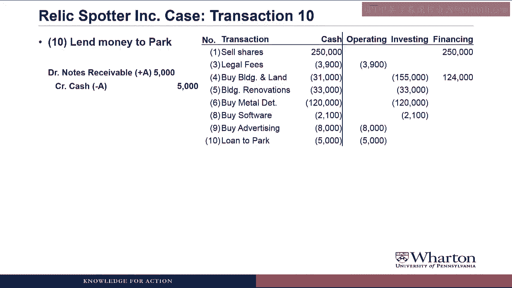
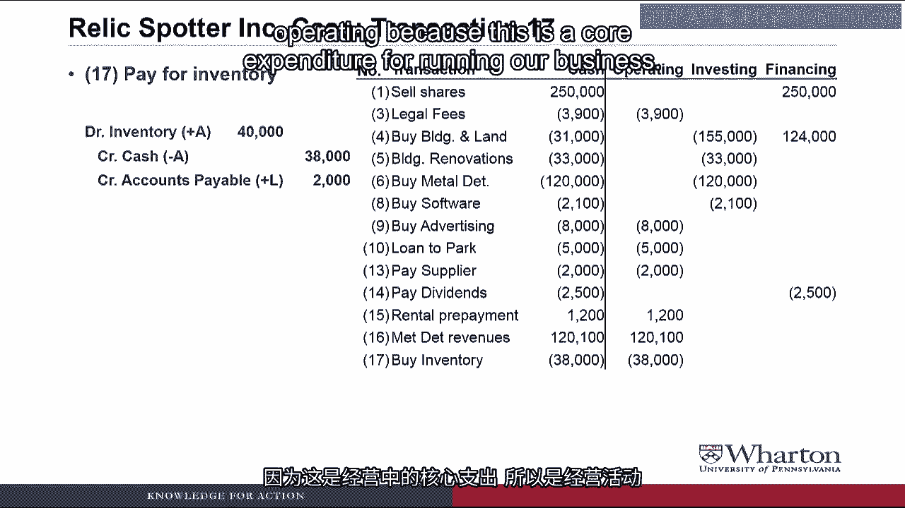

# 沃顿商学院《商务基础》｜Business Foundations Specialization｜（中英字幕） - P66：18_3 1 2 文物寻宝案例部分 5.zh_en - GPT中英字幕课程资源 - BV1R34y1c74c

 Hello and Professor Brian Buchay， welcome back。 In this video we're going to dig out the relic spotter case that we worked on during the。

 first two weeks and go through its cash flow transactions to classify them into operating。

 investing and financing buckets which is the first step towards putting together relic。

 spotter statement of cash flows。 Let's get started。

 Let's start with transaction number one for the relic spotter case。

 In this transaction relic spotter sold shares to investors。

 In the journal entry we debited cash for $250，000 because the company received cash and then。

 credited common stock and APEC。

 So over here on the right hand side of the screen we'll keep track of all the cash flows。

 and I'll have you try to guess whether the cash flow is operating， investing or financing。

 So let me put up the pause sign and guess which bucket it would go into。

 The answer here is financing。 One of the definitions of a financing activity is cash flows with our owners so if we're issuing。

 stock we're getting stock from the owners of the company which would make it a financing。

 cash flow。

 Next transaction number three。 Come， excuse me。 Where is transaction number two？

 Does the cash flow statement only include that number transactions or did you make a。

 mistake as you often do？ Hey， wait a minute。 I haven't made that many mistakes。 Well。

 at least not yet。 There's no transaction two in this case because there was no cash involved for transaction。

 two in the relic spotter case。 It was the transaction where park was borrowing money on our own account and we didn't even。

 record it。 If you go back and look at the relic spotter journal entries the only ones that we have。

 to deal with are the ones that have either debits or credits to cash。

 So anyway in transaction number three， relic spotter paid $3，900 cash in legal fees to incorporate。

 the business。 How to classify that as operating investing or financing？

 The answer here is operating cash flow because this is one of the costs or expenses that。

 relic spotter needs to incur to run the business。

 Could we not call this an investing activity？ After all。

 incorporating the business is a long term cash flow， at least we hope。

 You raised a really good point because we do hope that this cash flow will have a long。

 lasting benefit。 But if you remember we decided to expense this cash flow on the income statement so to provide。

 comparability we're going to treat it as an operating activity on the cash flow statement。

 If we had created a long term asset then we probably would have treated it as an investing。

 activity。 As you'll see a lot of these are going to be really tricky to classify because there's。

 a lot more art than science in trying to figure out what bucket to put these in。

 Next in transaction number four， relic spotter bought land and building with a mortgage and。

 $31，000 of cash。

 So go ahead and try to classify this cash flow as operating investing or financing。

 The answer here is obviously 155，000 cash outflow for investing and 124，000 cash inflow for。

 financing。 Well now， I see a credit to cash for $31，000。 We bought land and building。

 Why is this not $31，000 of cash flow for investing activities？ Okay。

 I said obviously when I provided the answer but this one's far from obvious。

 The issue here is that we did one journal entry but there were really two separate transactions。

 First we borrowed $124，000 cash from a bank under a mortgage。

 That's a financing activity。

 The second is that we use that cash plus $31，000 of our own cash to buy $155，000 of land and。

 building。 That's an investing activity。

 To provide our investors and analysts a clear picture of what we're doing， we need to split。

 this into the two transactions。 We really borrowed $124。

000 from the bank under a financing cash flow and we really paid。

 $155，000 cash for land and building as an investing cash flow and that's what we need。

 to show on the statement of cash flows。

 Question number five， relic spotter paid $33，000 cash for renovation work to the building。

 Try to classify that as operating， investing or financing。

 The answer here is investing。 It should be an investing cash outflow of $33，000。

 I could make a case for operating here。 This seems a lot like routine maintenance to me which would be an operating activity。

 We talked about this briefly when we did the original transaction but the key question here。

 is does this expenditure represent a capital improvement or routine maintenance？

 A capital improvement would be anything that increases the value of the building or its。

 useful life。 We would add that to the building account and depreciate it over time and we'd consider。

 the cash flow and invest the activity。 The main maintenance is something you have to do no matter what。

 It's already built into the assumptions about the value of the building and its life。

 It gets expensed immediately and then it would be considered an operating cash flow。

 So that's the distinction and we're going to talk about it more later in the course。

 Transaction number six， relic spotter paid $120，000 cash to buy metal detectors。

 Is that transaction operating， investing or financing？

 And the answer is $120，000 investing cash outflow。

 I could make a strong case for operating here。 Our core business is renting metal detectors。

 Why would the purchase of said metal detectors not be an operating activity？

 You are correct that our business is renting metal detectors。

 But we're going to rent these metal detectors over and over and over for up to two years。

 which makes them more like equipment， a long term asset and makes the treatment of an。

 investing cash flow more appropriate。 If we are buying these metal detectors and immediately reselling them like inventory。

 then we would call it operating。 Or if we bought them and we were going to rent them for less than a year。

 then we might consider， them operating。 But the fact that we're going to have them for more than a year up to two years makes。

 this feel more like an investing activity。 Okay， next we're going to skip transaction seven because that was a non-cash transaction。

 Relic spotter had purchased inventory on account and moved to transaction eight where。

 relic spotter had paid $2，100 cash for a three year software site license。

 Why don't you try to guess whether that's operating investing or financing？

 The answer here is an investing cash outflow of $2，100。

 And before the virtual students jump in， I'll just tell you this is like the prior two where。

 we're investing in a long term asset。 So that's going to make it an investing activity because we're investing for more than a year。

 Transaction number nine。 Relic spotter paid $8，000 cash for advertising over the next year。

 Is that operating investing or financing？

 The answer here would be operating。 The advertising that we're prepaying is not more than a year。

 So by our general rule of thumb， we would call this an operating activity rather than。

 an investing activity。 These last two actually make sense。 What am I missing？

 You're not missing anything here。 This one year rule of thumb tends to work pretty well。

 If you have an expenditure that's going to benefit you for more than a year， we tend。

 to call it investing。 If it's going to benefit you for less than a year。

 we tend to call it operating。 And there are not many exceptions to that。 So one exception would。

 well， let's not overcomplicate this now。 I'll just say good job and let's move on。

 Moving on to transaction number 10。

 Relic spotter lent $5，000 cash to Rebecca Park as a loan， which then she has a year to。

 repay。

 Is that operating investing or financing？

 And the answer is a $5，000 operating cash outflow。

 So much for things making sense。 I thought transactions with creditors were financing。

 This is a loan。 Why isn't this financing？ Actually in this case。

 relic spotter is the creditor because Rebecca Park is borrowing， money from the company。

 If the company were borrowing money from Rebecca Park， then yes， it would be a financing activity。

 So the question now is if relic spotter is lending money to Rebecca Park， is that an。

 operating or an investing activity？ I decided to make it an operating activity because the loan was only one year。

 If the loan was longer than a year， say two years or three years or five years， then I。

 probably would have made it an investing activity。

 But it's not a financing activity because the company is the creditor here and if the。

 company is the creditor， then it's not a financing activity。

 Next we skip another couple non-cash transactions to go to transaction number 13。

 Here relic spotter paid $2，000 cash to its supplier。

 This was for the inventory that it bought out account in transaction seven。

 So is this $2，000 cash paid to the supplier operating investing or financing？

 The answer here is a $2，000 operating cash outflow。

 Go on。 You are making sense again。 Yeah， a payment to a supplier is one of the examples we use to define an operating activity。

 By the way， do you know where the smartest people in America work？

 At the US Mint because all they do all day is make sense。 In transaction number 14。

 relic spotter paid $2，500 cash to its shareholders for its dividend。

 This was the dividend that they declared in transaction 12。

 That's actually paid in cash in transaction 14。 So is this $2。

500 cash paid for dividends operating investing or financing？

 The answer here is financing a $2，500 financing cash outflow。

 Makes sense。 Go on。 Yes， paying dividends is one of the examples we use to define a financing activity。

 By the way， do you know where you can also find smart， reasonable people？

 A perfume factory because all they do all day is make sense。

 Next in transaction 15， relic spotter received $1，200 cash from the Penn Antiquities Club for。

 future unlimited rentals。

 So how do we consider this cash received for future rentals operating investing or financing？

 The answer here is operating。

 This is a operating cash inflow of $1，200 which makes sense because we're receiving cash。

 from customers which is one of the definitions of an operating cash flow。

 In transaction 16， relic spotter receives cash rental revenue on the metal detectors。

 Total amount of cash is 120，100。

 Is that operating investing or financing？

 The answer here again is operating。

 It's an operating cash inflow of $120，100 because again we're receiving cash from customers。

 Either these have gotten easier or we have gotten smarter。 These all make sense。

 You have clearly gotten smarter。 Probably because I'm such a great teacher。

 Although I have run out of puns on the word sense。 So let's move on。

 In transaction 17， relic spotter paid $38，000 cash for inventory。

 Is this operating investing or financing？

 The answer here is operating cash outflow of $38，000 operating because this is a core。

 expenditure for running our business。

 In 18， relic spotter received $35，000 cash from sales of sundries。

 Is this operating investing or financing？

 The answer here is operating。

 Again， this is a cash collection from customer which is one of the things we use to define。

 an operating activity。 Finally， transaction 20。

 Cash spotter paid $82，000 cash to its employees for salaries and wages。

 Is this operating investing or financing？

 Again this is operating。 It's an operating cash outflow of $82，000。

 Paying our employees is one of our key business activities so this would be an operating activity。

 That was the last cash transaction for relic spotter because the rest of the transactions。

 in the case were adjusting entries and adjusting entries never involved cash。

 So we can go ahead and total everything up。

 We see that the bottom line cash balance here is $78，800 which if you go back and look。

 is what we end up having at the end of the year for relic spotter and we've divided that。

 into a operating cash inflow of $17，400。

 Then cash outflow of $310，100 and a financing cash inflow of $371，500。

 So we're done。 Now all we have to do is just list these cash transactions on the cash flow statement in。

 operating， investing and financing order。 Correct。

 I wish that was the case because then we would be done with the week on cash flow statements。

 But if you've looked at the website you can see that we have a lot of videos left to go。

 And we'll pick this up next video with the discussion of the two different methods there。

 are for putting together a statement of cash flows。 There's an easy method and a difficult method。

 Unfortunately all companies use the difficult method so it's going to take us a lot of videos。

 to understand that method which we need to know to understand real companies' financial， statements。

 I'll see you next video。 See you next video。 [BLANK_AUDIO]。

