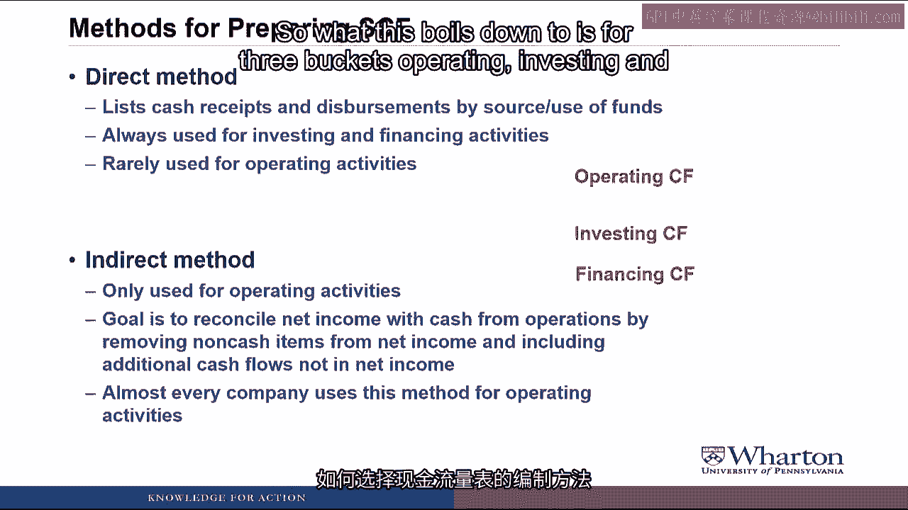
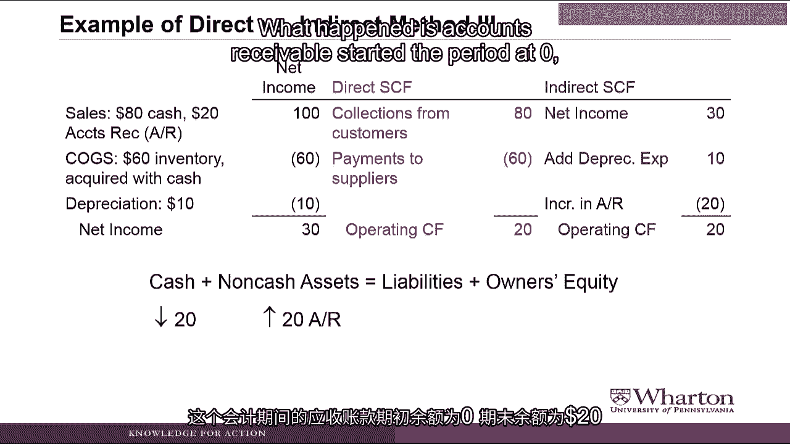
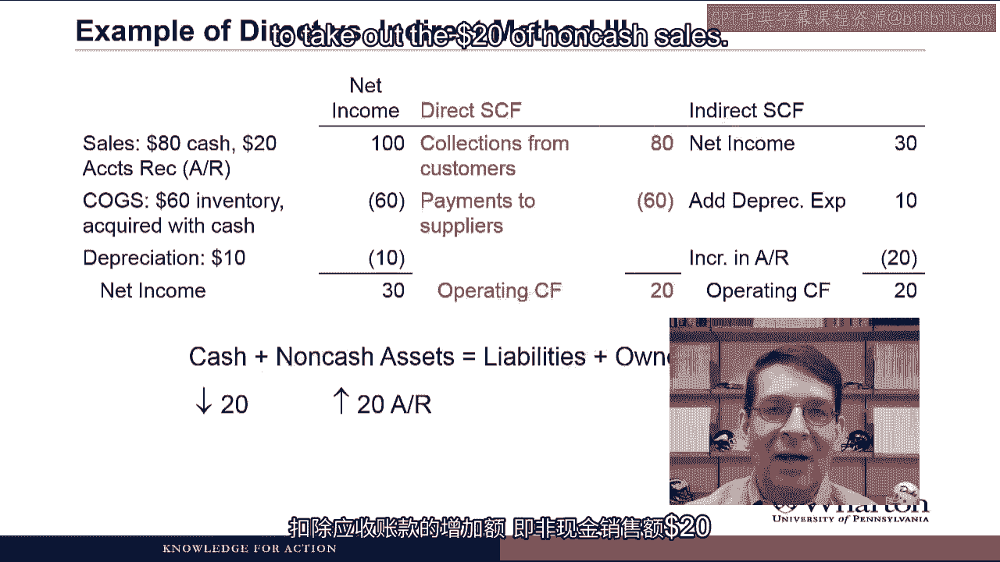
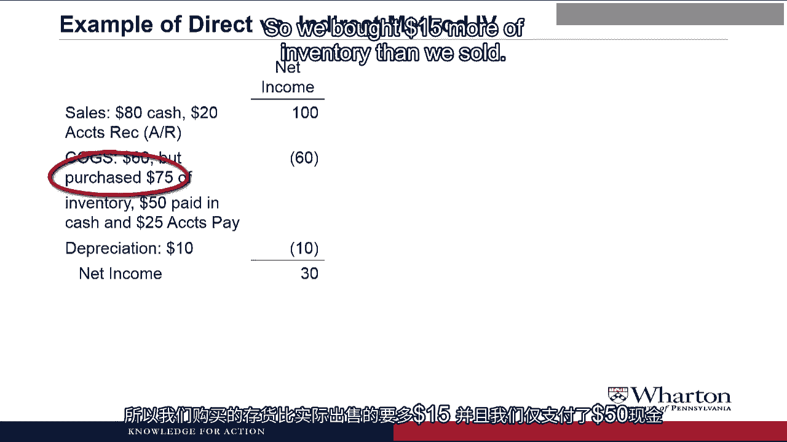

# 沃顿商学院《商务基础》｜Business Foundations Specialization｜（中英字幕） - P67：19_3 2 1 现金流量表.zh_en - GPT中英字幕课程资源 - BV1R34y1c74c

 Hello， I'm Professor Brian Muschay。 Welcome back。 In this video。

 we're going to talk about the two different methods that you need to。

 know to put together a cash flow statement。 Let's get started。

 There are two methods for preparing the statement of cash flows which are rather creatively。

 titled the direct and indirect methods。

 In the direct method， you just list the cash receipts and disbursements by the source。

 or use of funds。 So where are all the places that the cash came from？

 Where are all the places that you paid cash out to？

 This method is always used for investing in financing activities， but is rarely used。

 for operating activities。 Instead， for operating activities。

 companies tend to use the indirect method。

 This can only be used for operating activities and the goal is to reconcile net income with。

 cash from operations by removing any non-cash items from net income and including any additional。

 cash flows that were not in net income。

 So we're going to see a statement that starts with net income and with cash from operations。

 and shows all the differences between the two。 Almost every company uses this method for their operating activities and in fact。

 if。

 you use the direct method， companies also have to provide the indirect method as well。

 So what this boils down to is for three buckets operating， investing and financing。

 Operating can be either direct or indirect whereas investing and financing are always。

 the direct method。 Why does there have to be two methods？

 What's good for the goose is good for the gander？ This is just more stupid over complication。

 You know， I am going to agree with you that this probably is a stupid over complication。

 because really every company uses the same approach for their cash flow statement。

 They do the investing and financing activities using the direct method and then they use the。

 indirect method for their operating section。 Because even if they did the operating activities under the direct method。

 you still have to， provide the indirect method anyway。 The direct method is a piece of cake。

 You just list the cash flows based on where they're coming from or where they're going， to。

 Really the one thing that you have to learn that's difficult is this indirect method for。

 operating and we're going to spend much of the rest of the video and much of the rest。

 of the week trying to get a handle on this indirect method for the operating section。

 Let's talk about the indirect method in more detail。

 The indirect method section will start with net income。

 Then it's going to adjust for components of net income that are tied to non-cash items。

 or to invest the activities。

 What we need to do is either add back the expenses or subtract the revenues to remove。

 them from net income to get the cash flow。

 So for example， net income includes depreciation expense and amortization expense which are。

 both non-cash expenses。 To remove those non-cash expenses so that we can get from net income to cash from operations。

 we have to add them back because adding back expenses removes them。

 We can also have gains or losses on sale of property plant equipment or investments。

 Now there are cash flows associated with those but we want to count those cash flows in the。

 investing section。 So we need to remove these gains and losses from the income statement so we're going to。

 add back losses or subtract gains to remove them from net income on our way to cash from。

 operations。

 Then we need to adjust for components of net income tied to assets or liabilities created。

 through operating activities。

 These are the working capital accounts like accounts receivable， inventory， all of the， payables。

 What we need to do here is add or subtract the change in the asset or liability account。

 balance and we're going to use the balance sheet equation to determine whether we should。

 add or subtract。

 For example， accounts receivable is a non-cash asset。 If accounts receivable went up。

 we would need to subtract it on the cash flow statement。

 to stay in balance。 Inventory is a non-cash asset。

 If it went down， we would need to add it on the cash flow statement to stay in balance。

 On the other side of the equation， accounts payable is a liability。

 If accounts payable went up， we would need to add it on the cash flow statement to stay。

 in balance。 And if something like interest payable or way just payable went down。

 we'd have a liability。

 going down and we would have to subtract it on the cash flow statement。

 What？ What？ Really？ What？ Really？ Can we make it crystal clear on how to do the indirect method？

 Okay， okay。 We'll do an example or maybe two or maybe four or five。

 Let's look at some examples of how to put together an indirect method cash flow statement。

 and how it gives you the same answer as the direct method。

 We're going to do this for various types of income statements with adding a little bit。

 more complexity each example。

 In the simplest case， we have a company that had $100 of sales which are all in cash。

 Their cost of goods sold were $60， again， all in cash so that they bought $60 of inventory。

 with cash and sold that all during the period。 And so they end up with net income of 40。

 Under the direct method， we would have cash collections from customers of 100。

 Cash payments of suppliers of 60 gives us an operating cash flow of 40。

 And in this case， the operating cash flow is exactly the same as net income because everything。

 the company did was in cash。 If we go to the indirect method， under the algorithm。

 we always start with net income。

 then we adjust for any non-cash expenses or anything related to investing activities。

 which we don't have in this case。

 Then we adjust for changes in working capital， but again， we don't have any in this case。

 because we didn't create accounts receivable， all of our sales were cash。

 We didn't end or begin the year with inventory。

 And so there's no adjustments and we end up with an indirect method that gives us a cash。

 flow of 40， which is the same answer as the direct method。

 Now let's make this a little more complicated and bring in depreciation expense。

 So we start with cash sales and cash cogs like in the prior example， but now the company。

 has a $10 non-cash expense depreciation， which gives the company a net income of 30。

 Under the direct method， we have cash collections from customers， cash payments to suppliers。

 of course， there's no cash flow involved in the depreciation。

 So we end up with the same operating cash flow of 40。

 Now we need to make sure we get the same answer under the indirect method。

 So for the indirect method， we start with net income， which is 30 now。

 We add back the depreciation expense of 10。

 It's a non-cash expense， so to remove it from net income， we add it back。

 There are no changes in working capital because again， we didn't begin or end the year with。

 receivables or inventory。

 So there's no other adjustments and we end up with operating cash flow of 40 under the。

 indirect method， which of course is the same answer under the direct method， which always。

 has to be the case。

 So let me get this straight。 If a company had say $10 more and depreciation expense。

 it would increase cash flow by $10。 If a company had cash flow problems。

 all it would have to do is take more depreciation。 That's cool。 Ah， yes。

 the depreciation cash machine。 Just crank up the depreciation expense and watch that cash flow through the door。

 Well， obviously it can't work like that。 And in fact。

 I've heard stories about employers asking students this very question to see if。

 they know anything about accounting。 So let me jump back out to the slide to show you how this works。

 Okay， let's say we have another $10 of depreciation。

 That means we would have $20 of depreciation expense total and we would add back 20。

 But our net income would be lower because more expense means less than income。

 Now I'm going to ignore taxes for now and just assume that our net income would drop。

 from 30 down to 20 with the extra $10 of depreciation expense。

 So we have 20 plus 20 equals 40 instead of 30 plus 10 equals 40。

 It gets us to the same place。 It has to get us to the same place because depreciation is a non-cash expense。

 It can't create more cash flow。

 Now one thing I should note is that you can use different depreciation for tax purposes。

 than you see here in the financial statements。 And changes in depreciation for tax purposes actually can save on taxes and can affect cash。

 flow。 But that's a topic that we're going to deal with much later in the course。

 In the next example， we're going to still have a $100 of sales。

 But this time， let's assume that only $80 is received in cash。

 The other $20 of sales remained on account so that we end the period with accounts receivable。

 We still have $60 of COGS which is on in cash and our $10 of depreciation。

 It gives us to the same net income as we saw in the last example of 30。

 When we look at the direct method operating section cash flow statement， we collected。

 $80 of cash from customers。 We paid $60 to our suppliers which gives us an operating cash flow of $20。

 So we have less cash flow here because we collected less cash from our customers。

 Now let's see if we need the same answer under the indirect method。

 We start with net income and then as we saw in the prior example， add back depreciation。

 expense because it's a non-cash expense。

 But now we have a change in accounts receivable that we have to adjust for under that third。

 step in the algorithm。

 What happened is accounts receivable started the period at 0 and the period at 20 so that's。

 a $20 increase in a non-cash asset which means that we have to subtract it on the cash flow。

 statement。 And if we look that makes it work because we've got 30 of net income plus 10 of depreciation。

 expenses 40 minus 20 for the increase in accounts receivable gets us to an operating cash flow。

 of 20 which is the same answer that we got under the direct method。

 And that by me again we sell $20 of goods and yet that reduces our cash flow。

 Isn't that like cutting off a nose despite the face？

 Actually I think throwing the baby out with the bath water would be a better analogy here。

 But anyway let's think through the intuition behind the indirect method。

 We want to start with net income， make adjustments to get to cash from operations。

 Net income includes $100 of sales。

 All of those sales are legitimate， they meet the revenue recognition criteria。

 But $20 of those sales were never collected in cash。

 What we need to do is start with net income which includes the $100 of sales and remove。

 the non-cash sales。 Fortunately the increase in accounts receivable keeps track of the non-cash sales because anytime。

 we make a sale on credit we have to increase accounts receivable。

 So if we start with net income which includes the $100 of sales， subtract the increase。

 in accounts receivable to take out the $20 of non-cash sales。

 We're left with $80 of cash sales in cash from operations making the nose， the face。

 the baby and the bath water all safe in this case。

 One more example。 We're going to start with sales of $100 again with $80 in cash。

 $20 on account just。

 like before。

 Now we're going to make the inventory part a lot more complicated。

 So we'll keep $60 of cost it gets sold but in this case we actually bought $75 of inventory。

 So we bought $15 more of inventory than we sold and we only paid $50 in cash which means。

 that $25 of that inventory was acquired on account so you have accounts payable of $25。

 Then we subtract off the depreciation and we end up with a net income of $30。

 Under the direct method we collect $80 of cash from customers， we only paid $50 cash。

 to our suppliers so we don't use the cogs amount or how much inventory we bought， we。

 use the actual cash we paid which was $50 and we end up with an operating cash flow under。

 the direct method of $30。

 Under the indirect method we start with net income， we add back depreciation expense so。

 we've seen those two steps before。 We've also seen the subtraction of the increase in accounts receivable to take into account。

 that not all the sales were made in cash。

 Now we have to account for that mess with inventory。

 So what happened was our inventory started the year at zero and ended the year at 15。

 It went up by 15 because we purchased 75 inventory but only sold 60。

 If a non-cash asset goes up we subtract it on the cash flow statement so we subtract the。

 increase in inventory。 For accounts payable they started the year at zero and of the year at 25 so this liability。

 accounts payable goes up by 25 that's on the other side of the equal sign so cash has to。

 go up by 25 to make this balance so we can see on the indirect method cash flow statement。

 we have increase in accounts payable of 25 gets added back。

 When we add everything up we get the same operating cash flows under the direct method。

 So quick word on the intuition here for inventory in accounts payable。

 If your inventory goes up during the year it means that you're buying more inventory。

 than you needed for your level of sales which means you're spending extra cash on inventory。

 which is why it's a subtraction on the cash flow statement。

 For accounts payable if your accounts payable went up that means that you got stuff without。

 paying your supplier not paying your supplier is a source of cash that's an extra $25 of。

 cash that you would not have had if you had paid off your suppliers amount and so we add。

 that to recognize that it's a source of cash。 We're going to go through a lot more examples of like this in remaining videos to help you。

 get down this intuition。 Okay this is quite complicated。

 Well I showed you a slide earlier in the video with a simple algorithm for doing the indirect。

 method and you all went what really sorry to be a little pea-bish there I guess that's。

 what the cash flow statement will do to us。 I understand that it is hard to get your head around how this indirect method works。

 when you see it for the first time。 So we're going to do in the next video is go back to the relic spotter case and step by。

 step work through how to put together an indirect method cash flow statement for relic spotter。

 and then you see many more examples later in the week and hopefully as you get the mechanics。

 down we'll be able to talk more about the intuition for what this indirect method statement。

 is telling us which is the real thing that we want to get out of this effort of learning。

 how to put together the indirect method cash flow statement。 Anyway I'll see you next video。

 See you next video。 [BLANK_AUDIO]。