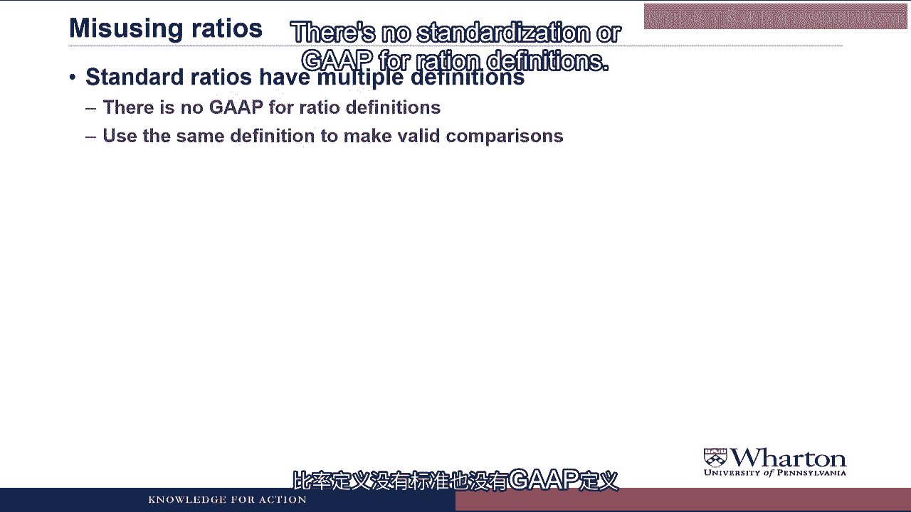
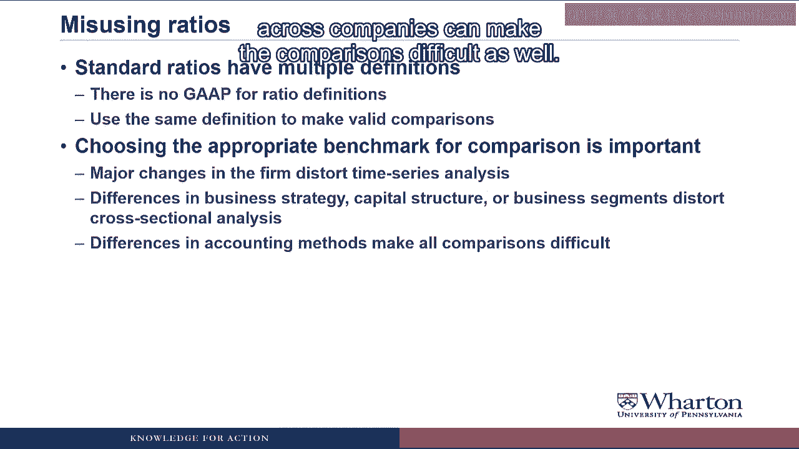
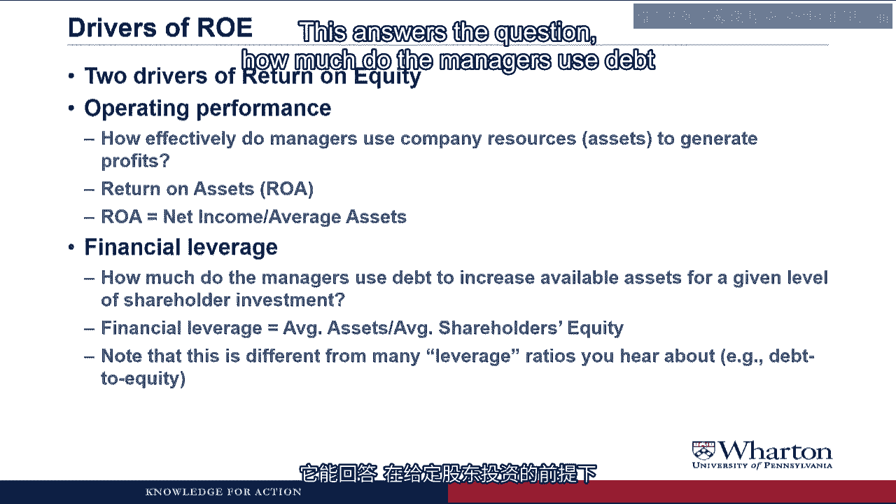
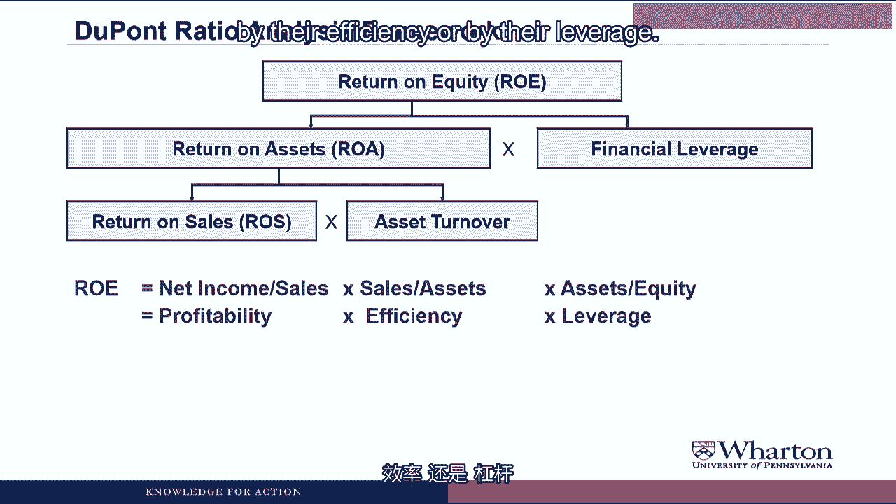

# 沃顿商学院《商务基础》｜Business Foundations Specialization｜（中英字幕） - P72：24_4 1 比率分析概述.zh_en - GPT中英字幕课程资源 - BV1R34y1c74c

 Hello and Professor Brian Boucher， welcome back。 In this video we're going to start our look at ratio analysis。

 And it's a good point in the course to talk about ratio analysis because it'll help us。

 review some of the material that we've covered so far。 After all。

 there's not a lot to computing ratios。 It's just dividing one number by another。

 The real challenge is to try to understand what the ratios are telling us。 And to do so。

 we need to reverse engineer the financial statements。

 We need to think about what underlying transactions must have happened to make the financial statements。

 and the ratios change in the way that they changed。 In other words。

 the ratios help us identify parts of the business that are changing where。

 we need to go in and understand better what's going on with the company。

 In this video we'll talk about some tips for using and misusing ratios。

 And we'll also talk about something called the DuPont analysis， which is a common ratio。

 analysis technique for understanding changes in one of the most common ratios people look。

 at return on equity。 Let's get started。

 Let's start by talking about how to use ratios。

 So ratios are going to be useful in assessing profitability， liquidity and risk。

 They're going to highlight sources of competitive advantage for the company so where the company。

 is doing really well。 And then red flag any potential trouble spots so where the company is struggling。

 But to do this we have to compare the ratios to a benchmark。

 There's no absolute benchmark。 There's nothing like return on equity greater than 16% is great。

 below 16% is bad。

 Instead， you have to compare the company to the same company across time。

 We call this a time series analysis and it helps us highlight trends for the firm。

 And we also have to compare the firm to other firms in the industry doing what we call a。

 cross-sectional analysis。 This is important because sometimes firm trends could really be driven by trends in the economy。

 or the industry。 So to figure out whether it's the company that's doing something well or it's just an。

 industry-wide phenomenon， we have to look at the firm compared to its industry or its。

 competitors。 Ratios are contextual。

 There's no such thing as a ratio being good news or bad news on its own。

 The key is to try to figure out what activity drove the ratio to change and then decide whether。

 that activity is good news or bad news for the company。

 And we'll talk about a number of examples of this as we go through the videos。

 And finally， the key is that ratio analysis does not provide answers， but instead it's。

 going to help you ask much better questions。

 My sister once told me that ratios provide all of the answers。

 She is a long short hedge fund guru in Hong Kong。 What are your qualifications？ Well。

 I'm not a long short hedge fund guru。 And I guess there's the old saying that those that can't do teach but have looked at a lot。

 of financial statements in my time。 And I'm pretty confident in my claim that ratios provide an excellent diagnostic tool。

 to help you figure out what areas of the financial statements you need to look into further， but。

 they're rarely going to provide you all the answers。 Now let's talk about how to misuse ratios。

 Not that I recommend that， I just recommend avoiding this problem。

 So one of the ways that people often misuse ratios is they don't realize that standard。

 ratios actually can have multiple definitions。

 There's no standardization or gap for ratio definitions。

 Different sources will use different definitions。 You want to always make sure you're using the same definition across time and across。

 companies to make valid comparisons。

 Also choosing the appropriate benchmark for comparison is important。

 Many major changes in the firm can distort a time series analysis。

 Differences in business strategy， capital structure or business segments can make it。

 hard to do a cross sectional analysis。 And then any differences in accounting methods。

 either across time or across companies， can。

 make the comparisons difficult as well。

 That preceding passage was a fair bid to abstract for me。

 Can you elucidate this farther with some relevant concrete examples？ Yes， yes I can。

 So for major changes in the firm， imagine a software company goes out and acquires a。

 hardware company so that they can integrate their software into the hardware。

 The problem is that this would make it a fundamentally different company which changed。

 the amount of manufacturing capacity and the amount of inventory and the ratios wouldn't。

 make sense anymore。 All they would tell you is that the company is a different firm if you look over time。

 I'll talk about differences in business strategy and example later in the video。

 As far as differences in accounting method， one of the ones we talked about earlier in。

 the course was some companies have brand names on their balance sheet if they acquired them。

 externally in acquisitions whereas other companies don't have them。

 That's a difference that would affect almost all the ratios that we look at and you'd have。

 to probably pull the brand name asset out of the one company in order to make meaningful。

 cross sectional comparisons between the two。

 The final thing to keep in mind is that ratios can be manipulated by managerial action。

 So if a company's managers think that investors and analysts are all focused on the same one。

 ratio like let's say an interest coverage ratio， then those managers have incentives。

 to manipulate their accounting numbers to make that ratio look good。

 So always keep in mind that manipulation is a possibility and more importantly don't just。

 focus on one ratio but look at the whole body of ratios because it's hard and in fact。

 impossible to manipulate every single ratio to make it look good。

 Let's talk now about specific ratios starting with return on equity。

 So is a net income of 10 million dollars good or bad？

 I could live with 10 million sounds like a great net income to me。 Yeah。

 if you were running a lemonade stand where your only assets were a table， a pitcher， some glasses。

 a bunch of lemonade and maybe a cool letterman's jacket， then 10 million。

 in net income would be pretty sweet。 But if you were running a company with billions and billions and billions of dollars of assets。

 10 million dollars would be pretty meager for net income。

 So to assess whether 10 million dollars of net income is good or bad， we need to know。

 how much investment was required to get that level of net income。

 So to assess whether a level of net income is good or bad， it depends on the level of。

 investment required to get that net income。

 And that's what return on equity is going to tell us。

 Return on equity is defined as net income divided by average shareholders' equity。

 The numerator represents how much return the company generated for its shareholders during。

 the year based on a cruel accounting。

 So that's the net income number that we've generated through the course。

 The denominator represents the shareholders' investment in the company。

 Now one of the problems we run into is net income happens over a period of time， whereas。

 stockholder's equity is at a point in time。

 So we have to take an average of the beginning and ending balance of shareholder equity to。

 approximate its level during the period we were generating in the net income。

 This RWE measure measures a return on investment。 And it's something that should increase with the risk of the company。

 For example， I could take a dollar and put it in a savings account with a bank and I'd。

 get roughly one cent of interest。 So my return on investment would be one cent。

 If I'm going to take that same dollar and invest it in a company， I'm taking much more。

 risk and so I should get much higher return。 I should get an RWE much higher than 1%。

 So RWE is a great starting point because you compare across all of your investments and。

 hopefully the RWE is high enough to compensate you for the risk that you're taking investing。

 in the company。 Now we're going to divide RWE into two drivers to figure out whether a company is getting。

 high or low RWE due to operating performance or due to leverage。

 So the first driver of RWE is operating performance， which answers the question of how effectively。

 do managers use the company's resources， in other words their assets， to generate profits。

 The ratio that we look at here is return on assets or ROA。

 RWE is defined as net income divided by average assets。

 So what it tells you is for each dollar of assets the manager has to play with， how much。

 net income do they generate？

 The second driver is financial leverage。 This answers the question。

 how much do the managers use debt to increase available assets。

 for a given level of shareholder investment？

 Financial leverage is defined as average total assets divided by average stockholders'。

 equity。 So for each dollar of stockholders' equity， how much assets does the company have？

 Now the only way that this can be greater than one is if the company also borrows money。

 takes on liabilities。 So this is a measure of leverage in terms of it measures how much debt the company is。

 taking on to buy more assets than it has in terms of dollars of equity。

 One note is that this leverage ratio is very different from the other leverage ratios that。

 we're going to be talking about this week。

 It's going to work for what we're doing with RWE， but we're going to use other ratios when。

 we want to measure other kinds of risk due to leverage。 Pardon me。

 my sister just texted me back that you need to delete the net income in RWE。 Moreover。

 she said debt to equity is a better leverage ratio than your financial leverage。 You know。

 I agree with your sister on this one。 We do need to de-lever in that income for RWE。

 but we'll get to that later。 For now， I want to keep it simple so that you can see the two drivers of RWE。

 And yes， there are better measures of leverage for assessing things like bankruptcy risk。

 and long-term liquidity， and we'll also get to those later。

 But the financial leverage measure that we're looking at here is the right measure if we。

 want to see how much of RWE or return on equity is driven by the company going out and borrowing。

 money， company going out and levering up。 Let me show you a picture to tie this together。

 So we start with return on equity， and that can be split up into components， operating。

 performance which is return on assets， and the financial leverage component。

 And so you see in the equation we have RWE equals net income over assets times assets。

 over equity。 The assets cancel and we get RWE equals net income over equity。

 Let me do a quick example。 The company raises $100 from shareholders。

 borrows $100 from a bank to buy $200 of assets。

 Those assets are then used to generate $10 of net income。

 So RWE in this case would be 10%， $10 of net income divided by $100 from shareholders。

 RWE would be 5%， $10 of net income divided by 200 of assets， and leverage would be 2。

 $200 of assets divided by $100 of shareholders equity。

 Multiplying it together， 5% RWE times a leverage of 2 gives you an RWE of 10%。

 And this highlights how these two components drive RWE。

 So let's say instead of buying $200 of assets with $100 of shareholders equity， we bought。

 $400 of assets。 We borrowed 300 from the bank， combined that with a 100 from shareholders to buy 400 of。

 assets。 Now our leverage is 4。

 If we can maintain the same RWE of 5%， our RWE would go up to 20%。

 Or let's say that we keep leverage at 2， but we find a way to operate the business more。

 efficiently to get the performance or the RWE up to 10%。

 Then we'd have 10% RWE times a leverage of 2 would give us RWE of 20%。

 So either operating performance or leverage can get you to a high RWE。

 I am completely and utterly flambousal to buy your example。

 Did you not inform us mere seconds ago that one must utilize average balances？

 Really sorry to flambousal you， but I was trying to keep it simple。

 I was trying to do an example which clearly shows how these two factors， RWE and financial。

 leverage， combine to drive RWE。 And yes， if I was doing these ratios in practice。

 I would take the average of the beginning and， the ending balance for both assets and for equity。

 Next， we're going to look more carefully at the return on assets component， which also。

 can be separated into two drivers。

 The first driver is profitability。 How much profit does the company earn on each dollar of sales？

 The ratio we're going to use here is return on sales or ROS， which is defined as net income。

 divided by sales。

 So what it's telling you is for each dollar of sales， how much net income do you generate？

 The other driver of return on assets is efficiency。 This answers to the question。

 how much sales does the company generate based on its available。

 resources？

 The ratio here is called asset turnover， which is defined as sales divided by average total。

 assets。 So for each dollar of assets， how much in sales does the company generate？

 Now I'm going to go through an example of how to do this in a little bit， but first I。

 have to deal with that complication that came up in the question earlier。

 So ideally， return on assets would measure operating performance independent of the company's。

 financing decisions。 We want to measure RWE。 That's not at all affected by financial leverage。

 The problem is the numerator of ROA， net income， includes interest expense。

 If you have more leverage， means you have more debt， more debt means higher interest。

 expense， higher interest expense means lower net income， and so now your leverage is affecting。

 your net income。 So to remove the financing effects from ROA， we have to delever net income。

 So we're going to define ROA as delever net income divided by average assets， where delever。

 net income is net income plus one minus t times the interest expense， where t is the tax rate。

 So what we're doing is taking after tax interest expense and adding it back to net income， then。

 when we use this delever net income as the numerator in ROA， we get a measure of operating。

 performance that's not contaminated by the company's financing decisions。

 Ideally， you could explain this one minus t stuff， and it would not have to explain what。

 delever means and why we have interest expense to delever。 Yeah。

 I know the formulas are a little bit abstract， so let's go through an example and。

 see how this works。

 Here's a quick example to show why we need to delever net income to remove the effects。

 of financing decisions。 Let's say we have two companies。

 one that has no debt and one that has some debt。

 Both companies have the same pre-tax， pre-interest income， so their performance seems identical。

 in an operating sense。

 Then the no-debt company obviously has no interest expense， so their pre-tax income， is 300。

 We take off taxes at 35% and their net income is 195。

 For the company that has some debt， they have interest expense， so if they had 50 of interest。

 expense， their pre-tax income would only be 250。 We take off taxes and their net income is only 162。

5。

 So if we use net income in the numerator for ROA， then ROA is going to be affected by the。

 fact that the some debt firm has some borrowing。

 Now if you look in the last row， we're going to calculate delivered net income。

 We don't have to do anything for the no-debt firm because it has no interest expense。

 For the some debt firm， we take net income plus interest expense times 1 minus the tax。

 rate and we end up with delivered net income of 195， which is identical to the delivered。

 net income for the no-debt firm。 So using delivered net income in ROA gives us a measure of ROA that only measures operating。

 performance。

 Now when we use ROE， we do want the interest expense in there because ROE does want to reflect。

 the effective financing。 So we take the financing out of ROA， but we leave the financing in for ROE。

 Now I'm going to try to tie all of this together with something called the DuPont Racial Analysis。

 Framework。 Hey， is this the same the point that makes the model airplane blue？

 It is pronounced DuPont， it is named after a Leo Saria Irena DuPont。

 Thanks for the correct pronunciation there Renee。 But yes。

 this formula was developed by people that worked for the DuPont chemical company。

 back in the 19th century。 In 1914， DuPont bought a big stake in this startup company called General Motors。

 which， eventually became the largest car company in the world。

 And when the DuPont management team started working with General Motors， they would use。

 this formula a lot so much so that the GM people would say， "Hey， give me the DuPont。

 formula analysis。"， And that's where the formula got the name and we've continued to use it since then。

 So anyway， we've seen that return on equity has two drivers， return on assets and financial。

 leverage。 And return on assets has two drivers， return on sales and asset turnover。

 So the DuPont formula is that ROE equals net income over sales， which is profitability。

 times sales over assets， which is efficiency， times assets over equity， which is leverage。

 And what this allows us to do is identify whether a company's advantage or disadvantage。

 in their ROE is driven by their profitability， by their efficiency， or by their leverage。

 Will you elucidate this farther with a relevant concrete example of how one might utilize。

 this DuPont formula？ Yes， now I'm going to do an extended example of how to use the DuPont formula。

 which will， also allow me to show you the importance of choosing firms that are using the same business。

 strategy when you want to do a ratio analysis comparison。

 So I'm going to talk about the retail industry。 There's a couple big segments within the retail industry。

 One segment would be discount retailers。 So those are the stores that have MART in their name and try to compete on low prices。

 And another segment are the high-end retailers， the ones that are located in the really expensive。

 shopping districts。 Let's start by talking about the discount end of the market， the MART stores。

 So their strategy is very low profitability。

 They have a small markup over cost and their strategy is to get you into the store with。

 their low prices。 So how do they get high ROE？

 By very high asset turnover。 In other words， they generate a huge amount of sales for their investment in assets。

 How do they do that？ Whether assets are things like fairly simple stores that are not constructed from fancy。

 materials， they're located in world districts where the land is pretty inexpensive。

 And then when you go into the store， you don't see a lot of fancy schmancy displays。

 The merchandise is just sort of crammed in there。

 And they're really set up to try to maximize the volume of sales for their level of investment。

 in assets。 So if you were looking at a discount type store， you'd want to compare it to another。

 company doing a discount strategy to see if the company is able to get a little bit extra。

 profitability even though it's low in absolute terms。

 Or if they're able to get much higher asset turnover， either one of those would give them。

 an ROE advantage over their competitor。

 In the opposite end of the spectrum， you have the high end retailers。

 Now what I've heard that these stores are like， and I don't think I've actually ever。

 been in one because I order all my clothes over to the internet， but what I've heard。

 is that they're really nice stores。 They're constructed of expensive materials， marbles， woods。

 They're located in very expensive real estate areas。

 The merchandise is not crammed in there。

 Very nice， elegant displays。 Their asset turnover。

 the amount of sales they generate for their investment in assets。

 is fairly low。 But when they make a sale， it's hugely profitable。

 They have very high markup over cost。

 So if you were looking at a high end retailer， you'd want to compare it to another high end。

 retailer to see it if they're able to squeeze out even higher markups or if they're able。

 to squeeze out a little bit more asset turnover even though it's lower in absolute terms。

 So the DuPont formula allows you to look at these different drivers of ROE and as long。

 as you're comparing companies that are doing the same strategy， find out where companies。

 competitive advantages or disadvantages lie in trying to execute their business model。

 Now that we have the basic framework down， what we're going to do in the next couple。

 of videos is look at a case study of a company that had some real troubles in their business。

 but then they changed their strategy， had a nice turnaround and now they're performing， very well。

 So we'll use the DuPont analysis to figure out exactly what parts of their strategy really。

 help to kickstart their turnaround。 I'll see you next time。 See you next video。 Bye。

