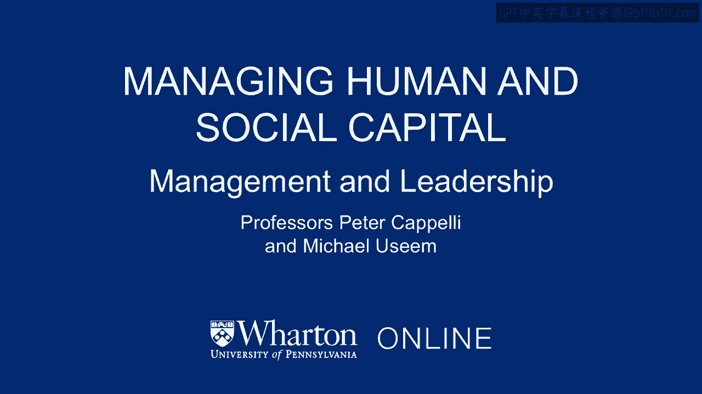

# 沃顿商学院《商务基础》｜Business Foundations Specialization｜（中英字幕） - P78：1_课程概述.zh_en - GPT中英字幕课程资源 - BV1R34y1c74c

 So， welcome to Managing Human and Social Capital。

 This is part of the Management and Leadership course。 Welcome to this program。

 My name is Mike Usaim。 I'm on the faculty here at the Wharton School and I'm with my colleague Peter Capelli。

 Mike and I have both been here forever for a very long time teaching this course in particular。

 to MBA students。 And there's a long history of this topic at the Wharton School which isn't particularly。

 well known。 Begins back in about 1915 with the rise of scientific management in Frederick Taylor。

 who was a lecturer here at Wharton School。 Elton Mayo was actually on the faculty here and created the human relations movement which。

 recognized that kind of people mattered。 And in the 1980s the Tabestock Institute was here which was an institution that was。

 devoted to the idea that how you structured work and the relationships between people。

 at work affected the performance as well。 And here's why we've got this in this topic of human and social capital in the broader。

 context of a course on management and leadership。 Got to know where we're going。

 Let's call that strategy。 We got to get there and to get there we need a whole bunch of factors falling into place。

 including the right people who are incentivized to get the job done， understand where we're， going。

 And of course part of this course as well is thinking about doing that across boundaries。

 And to put another sort of theme in front of us here in Peter's view and my view， he really。

 got to get this people factor right。 And to get it right it means how we manage people， how we hire。

 how we promote， how we， reward。 All that has to be aligned with the other functions that any manager has to be concerned。

 about from finance and accounting to marketing and operations。

 On top of that we've got to get all these pieces together and aligned in the same direction。

 So another reason to think about this as being important is this is where all the money is。

 So if you look in a typical business two thirds of the costs I'll go to labor。

 It's also where all the discretion is particularly discretionary effort。

 So employees who are really bad will completely sink an organization。 It's not just fraud。

 Sometimes it's actually internal vandalism。 And employees who are really committed and will work hard make organizations succeed。

 even when a lot of other things are going wrong。 So it is the key factor for differentiating what makes organizations succeed and fail。

 In fact Peter， a colleague of ours at another institution wrote a book a couple years ago。

 with the great title of people as the ultimate competitive advantage。 Gotta have a strategy。

 gotta make a sustainable advantage with that。 But people separately manage for better or for worse do make a difference。

 Peter I think to reference how we're gonna approach these topics。

 Let's take a brief dive into Walmart and my personal guess is most listeners and most。

 viewers have walked into at least one Walmart store and just to review a couple facts about。

 Walmart， it's an amazing organization， it goes back to 1962， today it's got over 11，000 stores。

 The market value， today's stock price times the number of shares out there is over $200， billion。

 The sales now this past year， very close to $500 billion。

 And in particular for our purposes what's notable is that Walmart with over 2 million。

 employees is unequivocally the world's largest employer。

 You know also one of the most important companies in the United States， something like one。

 in five pieces of clothing are sold through Walmart。

 They have a huge impact on the supply chain and have pioneered a lot of work in supply， chains。

 So one of the reasons for thinking about them is they have as we say a big footprint， right？

 I mean no matter what they do it has a lot of effect on a lot of people and a lot of。

 other businesses。 And since we know a lot about it。

 since most of us have walked into at least one store and， many people more than that。

 let's take a look at actually two companies here。 We have Walmart in the center column and Costco on the right hand side。

 And my guess is again many people have been into a Costco warehouse along the way。

 And as we look at some numbers there， for example the annual turnover， the quit rate。

 a close to 50% in Walmart below one in five at Costco， both are very successful。

 Costco of course much smaller than Walmart。 But Peter at the point I like to make right here is that when it comes to managing people。

 there are many ways to skin a cat。 There are good practices。

 In many areas though there's not a single best practice。 And this course。

 this piece of this course is going to be looking for some of the better。

 practices on people management。 So I think the other reason for thinking about these two is something we didn't mention yet。

 And that is managing people matters a lot because it affects the lives of the people。

 So it's not just about whether organizations are going to make more money， it's what happens。

 to the people who work there。 And this particular comparison of Costco and Walmart。

 if you're outside the US you may， not have seen a Costco。

 they're a big warehouse type retailer but they sell the same sort。

 of stuff generally as Walmart sells。 The fact is that they choose different directions matters a lot。

 maybe to the way the companies， compete but also to the employees。

 So Walmart has received a fair amount of criticism， partly because it is so big for not paying。

 their employees more and high turnover， etc。 And Costco is often thought to be the kind of opposite model。

 You can see here the differences in the rates of pay that employees at Costco stay longer。

 pay a whole lot more money， get employee benefits， more benefits， all those sorts of things。

 So the point here is partly there are things that we know that absolutely work。

 There are some best practices but there are also choices among best practices based in。

 part on what you want your business to do， how do you want it to compete in the product， market。

 And that is， as Mike was saying before， the fact that these things have to line up。 Peter。

 why don't we break our itinerary that we are going to get in there to pursue more。

 generally not just with Walmart and Costco but with a number of enterprises。

 Let's divide it around four issues and we see those on a slide here in front of us。

 The first being how do we motivate people to come to work and get the job done？ How do we pay them？

 How do we promote them？ And let me just throw that as actually a question to you。

 Do you see the Walmart or Costco for that matter or any company really？

 What does it take just in general to get people to perform individually when it comes to a。

 reward system， a pay for performance kind of deal？

 You know I think this is a really important issue around the topic of managing people。

 because it reflects some fundamental underpinnings that are important。

 Most people understand the idea of incentives。 In the back of their mind as John Maynard Keynes said a lot of people are actually the slaves。

 of who think they are being practical， the slaves of dead philosophers， dead thinkers。

 They got in the back of their mind a model of human behavior which is a pretty simple， model。

 People are completely rational， they are incentivized by money。

 We know from the field of psychology that a lot of that is not true and a lot of other。

 things matter besides simply money and if you want to be good at managing people you have。

 to understand that。 So this is a point where it is often hard for some people to get their hands around if you。

 haven't had a lot of psychology classes before。 A lot of people interested in business know a lot about finance and accounting。

 They think that way but to get good at managing the people's part and thinking particularly。

 about these issues of how we motivate people we have to understand how people actually behave。

 They are not widgets， they are not pieces of machinery and they respond in slightly quirky。

 ways and to design the right reward and incentive systems and to motivate people you have to。

 have some pretty good understanding of the you might think of it as the quirkiness or。

 the fundamental attributes of humans。 And Peter have often heard a phrase applied to reward systems and that is for any organization。

 it's a bit of a long march。 We put out their assistance to pay for people for getting the job done。

 It turns out because people are not completely predictable。

 We incentivize here and something untoward happens over here so we revise。

 And I think it's one way to think about reward systems is to think about we got to have something。

 out there but what we have may not be fully effective completely aligning people in the。

 right direction and of course people change over time as well。

 And very nice analogy to China there Mike with the long march and the Chairman Mao's， long march。

 Mike and I have been working on a book about China and addressing some of these questions。

 in China as well。 And by the way just a brief reference on that the world's largest employer unequivocally。

 is Walmart the second largest employer is a company whose popular name is Foxconn which。

 is technically based in Taiwan but it has over a million employees。 Walmart is a 2。

2 million but Foxconn has a million 1。1 million people working for it in。

 China today making our iPhones for example。 So anyway these are big enterprises they've thought a lot about how to get the reward system。

 Right so Peter let me go on to number two briefly here once we've got it kind of figured。

 out at least for the moment how to hire people how to reward them for their individual job， done。

 I think it's also true that the nature of the work can again add additional motivating。

 force or rather discouraging unforce if it's not done right。

 So I think you know this is one of these topics where many people believe you just do it。

 I mean jobs just sort of somehow fall out in terms of what it is that people do。

 There is actually a lot of choices involved in this a lot of decisions and some of them。

 are objectively better than others in terms of how they motivate people right。

 The way you design a job what you actually have people do down at the level of the particular。

 task whether they have to make decisions themselves or example or whether there's a supervisor。

 standing over them。 These are choices and they affect human behavior。

 There are some best practices here but there again are also some choices that might fit into。

 different kinds of organizations depending what you want them to do。

 You don't want somebody running a nuclear power plant for example to have an awful lot。

 of discretion as to how they run things but somebody who's out in the field dealing with。

 a customer you probably do。 Peter let's just take some of those ideas and think for a moment about how you would apply。

 them if you are the manager of a Walmart store。 We've got a lot of people coming into work at 9 o'clock in the morning。

 He wants them to serve customers to restock shelves to do an efficient checkout and just。

 thinking very briefly since the compensation the wages of Walmart employees not terribly， high。

 What are some of the job let's call a job design factors that might help people really。

 want to do a better job on the work say on the floor of a Walmart。

 And for those of you who are wondering what it's like to be in business school this is。

 what's known as a cold call in business school and that means you're asking a question you。

 weren't expecting to answer but I think there's a pretty clear answer to that right and if。

 you are an employee and you're not doing it for the money so much because at a place like。

 Walmart you're paid by the hour you're going to get paid whether you do the job or not。

 Do you feel accountable for this do you feel that you are the person who are responsible。

 for this particular part of the store if for example people have a bad experience there。

 there's nothing on the shelves are you the person who gets pointed to for not doing a。

 good job with that do you have control over it。 So there are decisions you can make that make people feel independent of the money independent。

 of a boss coming around telling them to do it that they want to do these things。

 Now there's some other size of that too right they may do it in their own way which isn't。

 perfectly the same as what somebody in another department might do and that's something you。

 got to worry about as well。 So that's where we're going with the topic number one and then topic number two number。

 one being motivating individual performance number two working through job and work designs。

 that lead to high performance。 Our third topic going to come back to in a little bit is helping people at Walmart at。

 a store maybe nationally or anywhere make good and timely decisions and we stress the。

 and between good and timely we can make a snap decision we can shoot from the hip that's。

 timely but not very good or we can wait a long time to get it to be perfect but as we。

 know the phrase goes perfect is the enemy of timeliness so we want good and timely decisions。

 and to think about that in the context of Walmart an amazing statistic at least for。

 me is that some 70% of Walmart Walmart store items are up at the cash register with money。

 coming in from a customer before the company the headquarters is actually even paid the。

 supplier of them and of course that means they they they're seeing a lot of money coming。

 in without having to put a lot of money out long in advance of a sale and I guess I'll。

 turn the cold call on myself in this case and that is if I'm a Walmart and then add to。

 it Peter if I'm a Walmart store manager what do I want around me or maybe below me to be。

 able to make good and timely decisions and just to anticipate where we're going to go。

 with that I would say two factors are pretty important one is I as a store manager I have。

 to unequivocally understand what the metrics of the performance are going to be what the。

 intent of Walmart the parent is sending in my direction and then I don't want to be told。

 how to do it it's got to be within the law by within the ethical principles of the firm。

 but you've got to give me coming from headquarters now a lot of discretion to get that job done。

 if I've got that I can make good and timely decisions you know what are the things that。

 we've learned at stores like Walmart is that one of the key issues which really can only。

 be solved by the employees right up there at front is do they keep the shelves stocked。

 yeah right because we know when customers go by and they don't see what they want they。

 just leave they don't buy it right and figuring out how to keep those shelves stocked is something。

 that you can't really do by computer and algorithm at least not yet somebody's got to。

 walk by and see we're out of this if they have to go file a report which then goes to。

 somebody else by the time they get around to doing it it's too late the customers are。

 all gone so figuring out how to get employees incentivized to make those kinds of decisions。

 on their own is part of that story as well right so Peter good illustration thus of our。

 third topic and that is bringing that issue of good and how many decisions down to the。

 floor of the place we work there are a number of very specific ideas that we're actually。

 going to be going through as part of this course so stay tuned on that as well a fourth。

 and final topic very important equally important is to then put all the people all the functions。

 all the floors based together in a broader we tend to call it an architecture or organizational。

 design to get more academic on that and we also have to be good at changing that organizational。

 scheme as customers change as products change that are coming into the store so our fourth。

 and final topic here is designing and changing an organization's architecture and just by。

 way of brief illustration here again thinking about it safe from the standpoint of a store。

 and the store manager a local location I think while the people who are in the financial。

 side of the operation here at the store let's say outside of Philadelphia were relocated。

 they report up to the chief financial officer for the headquarters down in Arkansas yes。

 that's true but I also want as part of the architecture I want a direct line that goes。

 from me to them so when it comes to hiring to promoting them evaluating their work as part。

 of the architecture I want that person not only to report to the chief financial officer。

 for the firm as a whole but also to come by my office and let's have a very tangible。

 discussion which I can influence as Mike's describing a matrix system of management if。

 you've heard about that we're going to talk about those sorts of systems as well how do。

 you organize the chart some people might say it's also important on these to recognize that。

 organizing the chart the formal structures are also not the only thing that matters so。

 you probably if you've worked for a while in an organization know that they have come。

 in and changed reporting arrangements and yet you notice things still work the same way。

 they've always worked and one of the reasons for that is because organization culture which。

 is something we'll talk about I think organization culture which are the norms and values that。

 tell people how to behave have a lot of force in some cases even independent of what the。

 official and formal rules are and the reporting arrangements so organization architecture the。

 structure really matters pretty easy for people at the top to change it as well but we。

 also don't want to overplay it there's a bunch of other things that affect how organizations。

 behave so a quick recap as we go forward this is on managing people at work human and social。

 capital got these four topics motivating individual performance designing jobs that people actually。

 want to perform when they come to work how do we help people make good decisions that。

 are timely and finally how do we put all this together with a kind of a cultural mindset。

 and an architecture to bring more than a few people together to get the job done on behalf。

 of whatever it may be whether it's an organization a hospital a company you're running or maybe。

 even a country so we're going to be doing a deep dive into these four topics we've got。

 a lot of research a lot of examples so stay tuned stay with us and one more just final。

 thought on this if you think about how this material fits into other topics you might know。

 there are best practices here but it's not like accounting it's not like here are the。

 ten things you have to do in this order it is a bit more like strategy in that sense and。

 that their judgment calls there are best practices there are also also judgment calls。

 that have to be made what you want your business to do determines in part how you're going to。

 manage your employees what choices you're going to make about design about motivation。

 all those sorts of things fit together so partly best practices but we're trying to。

 teach I think also judgment about what to do where and why that makes sense and here's。

 what's going to be the kind of vital summing up we're going to walk into companies like。

 Walmart we're going to draw upon research I'm going to offer up examples ultimately though。

 at the end of the day we want to put in your hands some ideas on what some of the again。

 as Peter put it some of the judgment calls that are probably going to be better for the。

 human and social capital that you want to draw most from so at the end of each of our。

 sessions we're going to provide a call of a template five or maybe a few more ideas to。

 hang on to not completely detailed and specific we want them to be guiding your judgment on。

 how to take human and social capital forward。 Thank you。 [BLANK_AUDIO]。

